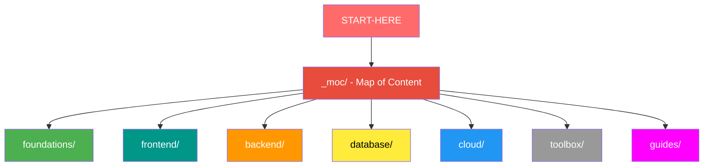

# Üdvözlünk a bildr.hub // learn tudásbázisban!

> [!tldr] 111+ magyar nyelvű fejlesztési jegyzet, közösség által karbantartva. Obsidian vault-ként a legjobb élmény - kattintható backlinkek, színkódolt gráf, auto-szinkron.

## Mi ez?

Ez a [bildr.hub](https://bildr.hu) közösség nyílt tudásbázisa. Modern full-stack fejlesztés témakörben gyűjtünk jegyzeteket - az alapoktól a cloud deploymentig.

- **111+ jegyzet** 8 tematikus mappában
- **6 Map of Content** (MOC) - témakörönkénti térképátlag
- **Közösség által karbantartott** - rendszeresen frissül, bárki hozzájárulhat
- **Magyar nyelvű** - tegezős, közvetlenül, gyakorlatias

---

## Hogyan használd Obsidianban

### 1. Telepítsd az Obsidiant

Töltsd le és telepítsd: [obsidian.md](https://obsidian.md)

### 2. Klónozd a vault-ot

**A) Ha használod a Git-et:**

```bash
git clone https://github.com/BILDR-HUB/bildr-learn.git
```

Ezután Obsidianban: **Open folder as vault** → válaszd ki a `bildr-learn` mappát.

**B) Ha NEM használod a Git-et:**

1. Obsidianban telepítsd az **Obsidian Git** plugint (Settings → Community plugins → Browse → "Obsidian Git")
2. Használd a **Clone existing remote repo** parancsot (Ctrl+P → "Obsidian Git: Clone")
3. URL: `https://github.com/BILDR-HUB/bildr-learn.git`

### 3. Obsidian Git beállítás

A plugin beállításaiban (Settings → Obsidian Git):

- **Auto pull on startup** = ON
- **Pull interval** = 10 perc
- Kontribútorok számára: a push is engedélyezve marad

> [!tip] Így mindig a legfrissebb tartalmat látod anélkül, hogy kézzel kellene pullolnod.

---

## Hogyan kontribúálj

### Olvasó (csak pull)

Csak használd a vault-ot - az Obsidian Git automatikusan pullol. Semmi mást nem kell csinálnod.

### Kontribútor (push és PR)

1. **Forkold** a repot GitHubon: [BILDR-HUB/bildr-learn](https://github.com/BILDR-HUB/bildr-learn)
2. **Klónozd a SAJÁT forkodat** lokális gépre
3. **Szerkessz** Obsidianban → commit → push a forkodra
4. **Nyiss PR-t** a `BILDR-HUB/bildr-learn` repóban

> [!tip] Ha van write access a repóhoz, branch-ből is dolgozhatsz közvetlenül: branch → push → PR.

A részletes kontribúció szabályokat lásd: [[CONTRIBUTING|CONTRIBUTING.md]]

---

## Vault navigáció

### Struktúra



### Hogyan navigálj?

| Eszköz | Billentyűparancs | Leírás |
|--------|-----------------|---------|
| **MOC** | — | Térkép jegyzetek, `_moc/` mappában. Témakörönként összefoglalják a jegyzeteket |
| **Backlink** | kattints a `[[link]]`-re | Így kapcsolódnak össze a jegyzetek |
| **Graph View** | `Ctrl+G` | Vizuális térkép - színkódolva mappánk szerint |
| **Keresés** | `Ctrl+Shift+F` | Keress bármire a teljes vaultban |
| **Quick Open** | `Ctrl+O` | Jegyzet megnyitása név alapján |

### Szintek

A jegyzetek három szintre vannak bontva:

| Emoji | Szint | Kinek |
|-------|-------|-------|
| 🌱 | Newcomer | Most kezded, alapfogalmak |
| 🧱 | Brick | Van tapasztalatod, építesz |
| 🏗️ | Builder | Architektúra, összetett rendszerek |

---

## Tanulási útvonalak

### 🌱 Newcomer - Kezdő útvonal

Ha most kezded, kövesd a strukturált tanulási utat:

**[[guides/kezdo-tanulasi-utvonal|Kezdő tanulási útvonal]]** — 18 jegyzet, 5 fázisban, logikus sorrendben.

### 🧱 Brick - Válassz témát

Ha már vannak alapjaid, válassz a MOC-ok közül:

- **[[_moc/moc-environment-setup|Environment Setup]]** — fejlesztői környezet felépítése
- **[[_moc/moc-docker|Docker]]** — konténerizáció alapjaitól az orchestration-ig
- **[[_moc/moc-database|Database]]** — SQL alapoktól az ORM-ekig
- **[[_moc/moc-auth|Auth]]** — JWT-től a managed auth-ig
- **[[_moc/moc-deployment|Deployment]]** — frontend hostingtól a Kubernetes-ig
- **[[_moc/moc-kubernetes|Kubernetes]]** — orkesztráció és klaszterek

### 🏗️ Builder - Haladó témák

Ha architektúrális döntéseket hozol:

- [[cloud/12-faktoros-alkalmazas-epites|12-faktoros alkalmazás építés]]
- [[cloud/kubernetes-production-deployment|Kubernetes production deployment]]
- [[cloud/saas-mvp-deployment|SaaS MVP deployment]]
- [[database/saas-adatbazis-tervezes|SaaS adatbázis tervezés]]
- [[database/database-design-patterns|Database design patterns]]
- [[backend/rbac-patterns|RBAC patterns]]

---

*bildr.hub — Build. Learn. Grow.*
