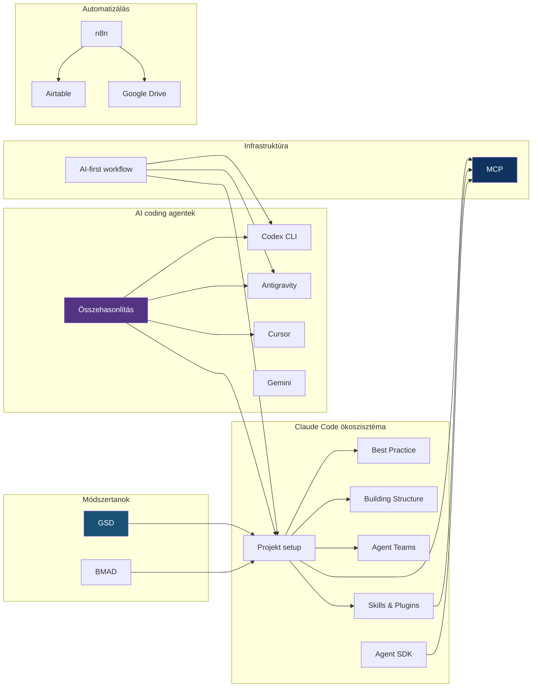

# MOC - AI Tooling

> [!tldr]
> Térkép az összes AI-eszköz jegyzethez — coding agentek, protokollok, workflow-k, automatizálás és alkalmazások.

---

## Claude Code ökoszisztéma

| Note | Leírás |
|------|--------|
| [[toolbox/claude-code\|Claude Code]] | Átfogó bevezető az Anthropic CLI-alapú AI coding tool-jába — funkciók, telepítés, használat |
| [[toolbox/claude-code-projekt-setup\|Claude Code projekt setup]] | CLAUDE.md, settings, hooks, MCP konfiguráció |
| [[toolbox/claude-code-best-practice\|Claude Code best practice]] | Hatékony Claude Code használat — kontextus kezelés, prompt minták, tipikus hibák |
| [[toolbox/claude-code-building-structure\|Claude Code Building Structure]] | Nagyobb projektek építésének struktúrája — top-down pipeline, fázisos építés |
| [[toolbox/claude-code-rejtett-beallitasok\|Claude Code rejtett beállítások]] | Haladó konfiguráció — settings.json, hook-ok, model override, environment variable-ök |
| [[toolbox/claude-mappa-anatomiaja\|A .claude mappa anatómiája]] | A `.claude/` könyvtár felépítése — settings, commands, mcp, permissions fájlok |
| [[toolbox/everything-claude-code\|Everything Claude Code]] | Teljes referencia — minden Claude Code feature egy helyen, gyors áttekintés |
| [[toolbox/claude-code-agent-teams\|Claude Code Agent Teams]] | Párhuzamos agent munka, team orchestrálás |
| [[toolbox/claude-agent-sdk\|Claude Agent SDK]] | Saját agent-ek építése TypeScript SDK-val |
| [[toolbox/claude-code-skills-es-plugins\|Claude Code Skills és Plugins]] | Skill rendszer, plugin-ek, testreszabás |

## AI coding agentek

| Note | Leírás |
|------|--------|
| [[toolbox/openai-codex-cli\|OpenAI Codex CLI]] | OpenAI aszinkron coding agent — CLI és web app |
| [[toolbox/google-antigravity\|Google Antigravity]] | Google agent-first IDE — Manager view, multi-agent |
| [[toolbox/cursor-es-claude-konfiguracio\|Cursor és Claude konfiguráció]] | Cursor IDE beállítása Claude-dal |
| [[toolbox/gemini\|Gemini]] | Google AI asszisztens — hosszú kontextus, research, multimodális képességek |
| [[toolbox/collaborator\|Collaborator]] | AI pair programming eszköz — IDE integráció, agent orchestrálás |
| [[toolbox/coderabbit\|CodeRabbit]] | AI-alapú code review — automatikus PR elemzés, GitHub integrációval |
| [[toolbox/screenshot-to-code\|Screenshot to Code]] | Képernyőkép → kód generálás — design-to-code pipeline AI-val |
| [[toolbox/ai-coding-agentek-osszehasonlitasa\|AI coding agentek összehasonlítása]] | Claude Code vs Codex vs Antigravity vs Cursor |

## Módszertanok és workflow-k

| Note | Leírás |
|------|--------|
| [[toolbox/get-shit-done\|Get Shit Done (GSD)]] | AI-natív fejlesztési workflow — strukturált fázisok, gyors iteráció, Claude Code-ra optimalizált |
| [[toolbox/bmad-method\|BMAD-METHOD]] | Business Model Aligned Development — üzleti célokból kiinduló fejlesztési módszertan AI-val |

## Infrastruktúra

| Note | Leírás |
|------|--------|
| [[toolbox/mcp-model-context-protocol\|MCP — Model Context Protocol]] | Szabványos interfész LLM-ek és eszközök között |
| [[toolbox/ai-first-fejlesztoi-workflow\|AI-first fejlesztői workflow]] | AI-központú fejlesztési munkafolyamat |

## Automatizálás és no-code

| Note | Leírás |
|------|--------|
| [[toolbox/n8n\|n8n]] | Open-source workflow automatizálás — vizuális flow builder, self-hosted, 400+ integráció |
| [[toolbox/airtable\|Airtable]] | No-code adatbázis és projekt management — spreadsheet + database hibrid, API-val bővíthető |
| [[toolbox/google-drive\|Google Drive]] | Felhő-alapú fájlkezelés — API integráció, n8n automatizálás, dokumentum pipeline-ok |

## Alkalmazás

| Note | Leírás |
|------|--------|
| [[cloud/ai-assisted-deployment\|AI-assisted deployment]] | AI-segített deployment folyamatok |
| [[database/ai-generalt-sql\|AI-generált SQL]] | SQL generálás AI-val |
| [[backend/ai-agent-authentication\|AI agent authentication]] | AI agent-ek hitelesítése |
| [[cloud/ai-workload-orchestration\|AI workload orchestration]] | AI workload-ok orchestrálása |
| [[database/vector-adatbazisok\|Vector adatbázisok]] | Embedding-ek tárolása és keresése |

---

## Kapcsolatok

---

## Tanulási útvonal

1. **Alapok:** [[toolbox/ai-first-fejlesztoi-workflow|AI-first fejlesztői workflow]] — gondolkodásmód váltás
2. **Bevezető:** [[toolbox/claude-code|Claude Code]] — mi ez, mire képes, hogyan indulj el
3. **Setup:** [[toolbox/claude-code-projekt-setup|Claude Code projekt setup]] — projekt beállítás
4. **Best practice:** [[toolbox/claude-code-best-practice|Claude Code best practice]] — hatékony használat, prompt minták
5. **Mélyítés:** [[toolbox/claude-code-skills-es-plugins|Skills és Plugins]] + [[toolbox/mcp-model-context-protocol|MCP]]
6. **Struktúra:** [[toolbox/claude-code-building-structure|Building Structure]] — nagyobb projektek építése
7. **Haladó:** [[toolbox/claude-code-agent-teams|Agent Teams]] + [[toolbox/claude-agent-sdk|Agent SDK]]
8. **Workflow:** [[toolbox/get-shit-done|GSD]] vagy [[toolbox/bmad-method|BMAD]] — válassz módszertant
9. **Tájékozódás:** [[toolbox/ai-coding-agentek-osszehasonlitasa|Összehasonlítás]] — alternatívák ismerete

> [!tip] Hol kezdd?
> Ha most ismerkedsz az AI coding tool-okkal, az [[toolbox/ai-first-fejlesztoi-workflow|AI-first workflow]] jegyzettel kezdj. Ha már használsz Claude Code-ot, ugorj a [[toolbox/claude-code-best-practice|Best practice]] vagy a [[toolbox/get-shit-done|GSD]] workflow-ra.

---

## Hézagok

- [x] MCP dedikált jegyzet
- [x] Claude Code Skills és Plugins
- [x] Codex CLI
- [x] Antigravity
- [x] Összehasonlító jegyzet
- [x] Claude Code bevezető → [[toolbox/claude-code|Claude Code]]
- [x] Claude Code best practice → [[toolbox/claude-code-best-practice|Claude Code best practice]]
- [x] GSD workflow → [[toolbox/get-shit-done|Get Shit Done]]
- [x] n8n automatizálás → [[toolbox/n8n|n8n]]
- [ ] Prompt engineering best practices
- [ ] AI-assisted testing workflow
- [ ] LLM API közvetlen használata (nem agent, hanem API hívások)
