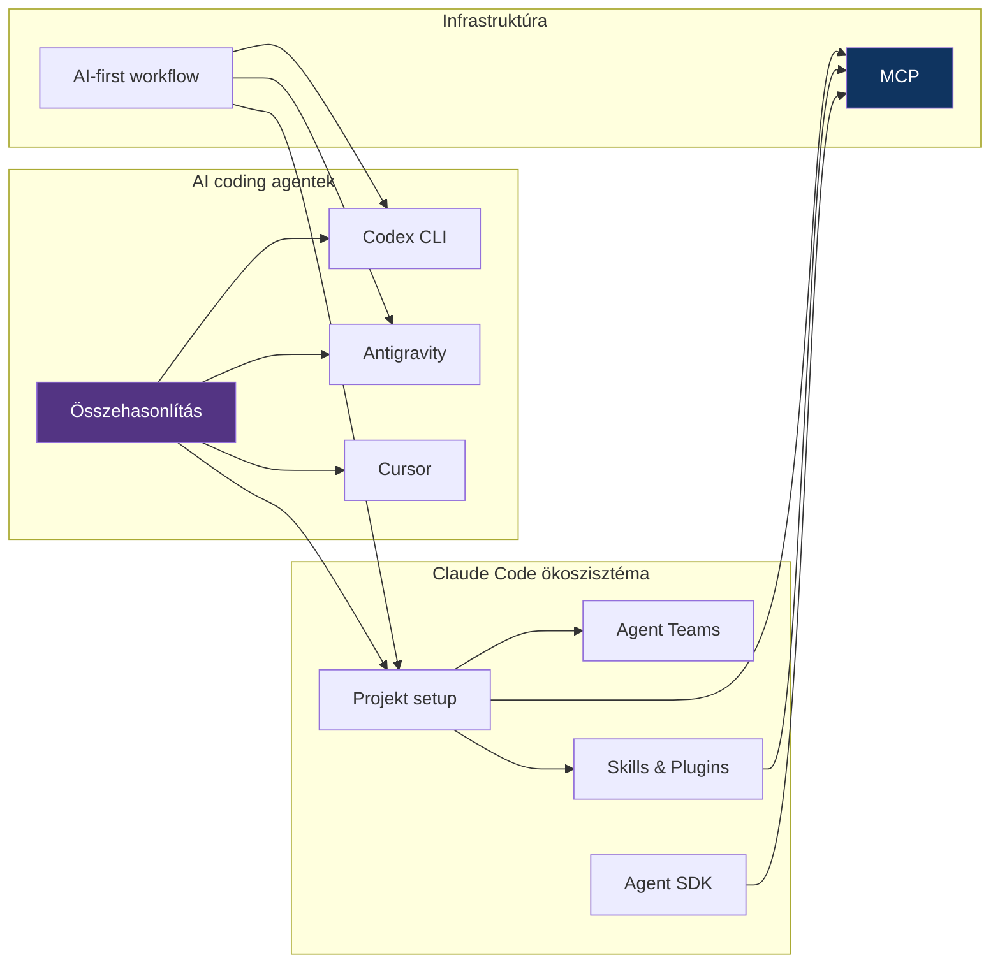

# MOC - AI Tooling

> [!tldr]
> Térkép az összes AI-eszköz jegyzethez — coding agentek, protokollok, workflow-k és alkalmazások.

---

## Claude Code ökoszisztéma

| Note | Leírás |
|------|--------|
| [[toolbox/claude-code-projekt-setup\|Claude Code projekt setup]] | CLAUDE.md, settings, hooks, MCP konfiguráció |
| [[toolbox/claude-code-agent-teams\|Claude Code Agent Teams]] | Párhuzamos agent munka, team orchestrálás |
| [[toolbox/claude-agent-sdk\|Claude Agent SDK]] | Saját agent-ek építése TypeScript SDK-val |
| [[toolbox/claude-code-skills-es-plugins\|Claude Code Skills és Plugins]] | Skill rendszer, plugin-ek, testreszabás |

## AI coding agentek

| Note | Leírás |
|------|--------|
| [[toolbox/openai-codex-cli\|OpenAI Codex CLI]] | OpenAI aszinkron coding agent — CLI és web app |
| [[toolbox/google-antigravity\|Google Antigravity]] | Google agent-first IDE — Manager view, multi-agent |
| [[toolbox/cursor-es-claude-konfiguracio\|Cursor és Claude konfiguráció]] | Cursor IDE beállítása Claude-dal |
| [[toolbox/ai-coding-agentek-osszehasonlitasa\|AI coding agentek összehasonlítása]] | Claude Code vs Codex vs Antigravity vs Cursor |

## Infrastruktúra

| Note | Leírás |
|------|--------|
| [[toolbox/mcp-model-context-protocol\|MCP — Model Context Protocol]] | Szabványos interfész LLM-ek és eszközök között |
| [[toolbox/ai-first-fejlesztoi-workflow\|AI-first fejlesztői workflow]] | AI-központú fejlesztési munkafolyamat |

## Alkalmazás

| Note | Leírás |
|------|--------|
| [[cloud/ai-assisted-deployment\|AI-assisted deployment]] | AI-segített deployment folyamatok |
| [[database/ai-generalt-sql\|AI-generált SQL]] | SQL generálás AI-val |
| [[backend/ai-agent-authentication\|AI agent authentication]] | AI agent-ek hitelesítése |
| [[cloud/ai-workload-orchestration\|AI workload orchestration]] | AI workload-ok orchestrálása |
| [[database/vector-adatbazisok\|Vector adatbázisok]] | Embedding-ek tárolása és keresése |

---

## Kapcsolatok

---

## Tanulási útvonal

1. **Alapok:** [[toolbox/ai-first-fejlesztoi-workflow|AI-first fejlesztői workflow]] — gondolkodásmód váltás
2. **Fő eszköz:** [[toolbox/claude-code-projekt-setup|Claude Code projekt setup]] — projekt beállítás
3. **Mélyítés:** [[toolbox/claude-code-skills-es-plugins|Skills és Plugins]] + [[toolbox/mcp-model-context-protocol|MCP]]
4. **Haladó:** [[toolbox/claude-code-agent-teams|Agent Teams]] + [[toolbox/claude-agent-sdk|Agent SDK]]
5. **Tájékozódás:** [[toolbox/ai-coding-agentek-osszehasonlitasa|Összehasonlítás]] — alternatívák ismerete

> [!tip] Hol kezdd?
> Ha most ismerkedsz az AI coding tool-okkal, az [[toolbox/ai-first-fejlesztoi-workflow|AI-first workflow]] jegyzettel kezdj. Ha már használsz Claude Code-ot, ugorj a [[toolbox/claude-code-skills-es-plugins|Skills és Plugins]] vagy az [[toolbox/mcp-model-context-protocol|MCP]] jegyzetre.

---

## Hézagok

- [x] MCP dedikált jegyzet
- [x] Claude Code Skills és Plugins
- [x] Codex CLI
- [x] Antigravity
- [x] Összehasonlító jegyzet
- [ ] Prompt engineering best practices
- [ ] AI-assisted testing workflow
- [ ] LLM API közvetlen használata (nem agent, hanem API hívások)
