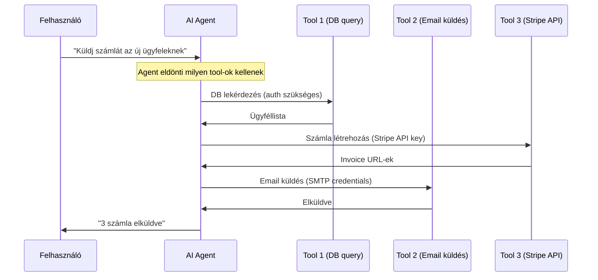

---
tags:
  - auth
  - security
  - ai
  - backend
datum: 2026-03-06
szint: "🏗️ Builder"
kapcsolodo:
  - "[[backend/jwt|JWT]]"
  - "[[backend/oauth-2-0|OAuth 2.0]]"
  - "[[backend/api-key-management|API Key Management]]"
  - "[[toolbox/claude-agent-sdk|Claude Agent SDK]]"
  - "[[backend/clerk|Clerk]]"
  - "[[_moc/moc-auth|MOC - Auth]]"
---

# AI Agent Authentication

## Összefoglaló

Ahogy az AI agent-ek (Claude, GPT, egyedi agent-ek) egyre több tool-t és API-t hívnak, a kérdés nem az hogy "hogyan auth-olj egy usert", hanem: **hogyan auth-olj egy agent-et, aki a user nevében cselekszik?** Ez más kihívásokat vet fel mint a hagyományos auth — az agent nem ember, nem tud jelszót beírni, és potenciálisan több szolgáltatáshoz fér hozzá egyszerre.

## Az agent auth probléma



A kérdés: **hogyan kapja meg az agent a szükséges credentials-t anélkül, hogy biztonsági kockázat legyen?**

## Auth modellek agent-ekhez

### 1. Service account API key — a legegyszerűbb

Az agent egy dedikált [[backend/api-key-management|API key]]-t kap, limitált scope-okkal.

```typescript
// Agent tool implementáció — API key-vel hív
async function queryDatabase(query: string): Promise<QueryResult> {
  const res = await fetch(process.env.INTERNAL_API_URL + '/query', {
    method: 'POST',
    headers: {
      'Authorization': `Bearer ${process.env.AGENT_API_KEY}`,
      'Content-Type': 'application/json',
    },
    body: JSON.stringify({ query }),
  })
  return res.json()
}
```

**Előnyök:** egyszerű, gyorsan implementálható.
**Hátrány:** az agent mindig ugyanazzal a jogosultsággal fut, függetlenül attól ki kérte a műveletet.

### 2. User-delegated token — OAuth-szerű

Az agent a **felhasználó nevében** kap egy limitált tokent. Ugyanaz az elv mint az [[backend/oauth-2-0|OAuth 2.0]] delegation.

```typescript
// Agent indítás előtt: user-scoped token generálás
async function createAgentToken(userId: string, scopes: string[]) {
  const token = jwt.sign(
    {
      sub: userId,
      agent: true,              // jelöljük hogy agent token
      scopes,                   // limitált scope-ok
      exp: Math.floor(Date.now() / 1000) + 300, // 5 perc lejárat
    },
    process.env.JWT_SECRET!,
  )
  return token
}

// A user dashboard-járól indítja az agent-et
export async function POST(req: Request) {
  const { userId } = await auth() // Clerk / session
  if (!userId) return new Response('Unauthorized', { status: 401 })

  const agentToken = await createAgentToken(userId, [
    'invoices:read',
    'invoices:create',
    'emails:send',
  ])

  // Agent indítás a user-scoped token-nel
  await startAgent({
    task: 'send-invoices',
    token: agentToken,
  })

  return new Response('Agent started')
}
```

**Előnyök:** az agent pontosan azt teheti amit a user megengedett, és az audit log a user-hez köthető.
**Hátrány:** komplexebb implementáció, token lejárat kezelés.

### 3. MCP server auth — tool-szintű hozzáférés

Az MCP (Model Context Protocol) server-eknél a [[toolbox/claude-agent-sdk|Claude Agent SDK]] a tool-okat hívja, és az auth a tool szintjén történik.

```typescript
// MCP server — tool definíció auth-tal
import { Server } from '@modelcontextprotocol/sdk/server/index.js'

const server = new Server({
  name: 'billing-tools',
  version: '1.0.0',
})

// A tool implementáció belsejében történik az auth
server.setRequestHandler('tools/call', async (request) => {
  const { name, arguments: args } = request.params

  if (name === 'create_invoice') {
    // Az MCP server maga kezeli az auth-t a külső API felé
    const stripe = new Stripe(process.env.STRIPE_SECRET_KEY!)
    const invoice = await stripe.invoices.create({
      customer: args.customerId,
      collection_method: 'send_invoice',
      days_until_due: 30,
    })

    return {
      content: [{ type: 'text', text: `Invoice created: ${invoice.id}` }],
    }
  }
})
```

> [!info] MCP és auth: a szerver felelőssége
> Az MCP protokollban az **MCP server kezeli az auth-t** a külső szolgáltatások felé — az agent (Claude) nem látja a credentials-t. Ez a "separation of concerns" elve: Claude eldönti *mit* kell csinálni, az MCP server tudja *hogyan* és *milyen jogosultsággal*.

## OAuth 2.0 agent-eknek: Device Authorization Grant

Ha az agent-nek user consent kell egy külső OAuth provider-hez (pl. Google Calendar), a **Device Authorization Grant** a megfelelő flow, mert az agent nem tud böngészőt nyitni:

```typescript
// 1. Agent kér egy device code-ot
const deviceRes = await fetch('https://oauth2.googleapis.com/device/code', {
  method: 'POST',
  body: new URLSearchParams({
    client_id: process.env.GOOGLE_CLIENT_ID!,
    scope: 'https://www.googleapis.com/auth/calendar',
  }),
})
const { device_code, user_code, verification_uri } = await deviceRes.json()

// 2. Agent megmutatja a user-nek: "Menj ide: verification_uri, írd be: user_code"
console.log(`Kérlek, nyisd meg: ${verification_uri}`)
console.log(`Írd be ezt a kódot: ${user_code}`)

// 3. Agent poll-olja a token endpoint-ot amíg a user jóváhagyja
let token = null
while (!token) {
  await new Promise(r => setTimeout(r, 5000)) // 5 sec polling
  const tokenRes = await fetch('https://oauth2.googleapis.com/token', {
    method: 'POST',
    body: new URLSearchParams({
      client_id: process.env.GOOGLE_CLIENT_ID!,
      device_code,
      grant_type: 'urn:ietf:params:oauth:grant-type:device_code',
    }),
  })
  const data = await tokenRes.json()
  if (data.access_token) token = data.access_token
}
```

## Biztonsági elvek agent auth-hoz

### Least privilege

```typescript
// ROSSZ: agent mindent elér
const agentKey = process.env.ADMIN_API_KEY // full access

// JÓ: agent csak azt éri el amire szüksége van
const agentToken = createAgentToken(userId, [
  'invoices:read',    // csak olvashat
  'invoices:create',  // létrehozhat, de nem törölhet
])
```

### Audit trail

Minden agent műveletet logolni kell — ki indította, milyen token-nel, mit csinált:

```typescript
async function auditLog(entry: {
  agentId: string
  userId: string       // ki indította az agent-et
  action: string       // milyen tool-t hívott
  resource: string     // milyen erőforrást ért el
  timestamp: Date
}) {
  await db.insert(auditLogs).values(entry)
}
```

### Time-boxing

Agent token-ek legfeljebb percekig éljenek, ne órákig:

```typescript
// Agent token: 5-15 perc lejárat
const token = jwt.sign(payload, secret, { expiresIn: '5m' })

// Ha az agent task hosszabb, újat kér (a user session alapján)
```

> [!warning] Ne adj long-lived token-t agent-nek
> Ha az agent "elszabadul" (hibás loop, prompt injection), egy rövid lejáratú token limitálja a kárt. 5-15 perces token-ek a best practice.

## Mikor használd / Mikor NE

**Használd:**
- AI agent tool-okat hív a user nevében (MCP server-ek)
- Automatizált workflow-k ahol az agent több API-t koordinál
- [[toolbox/claude-agent-sdk|Claude Agent SDK]] alapú alkalmazások production-ben

**NE használd:**
- Egyszerű chatbot ami nem hív tool-okat — nincs szükség agent auth-ra
- Ha a user maga csinálja a műveletet a böngészőben — hagyományos session/[[backend/jwt|JWT]] elég
- PoC/prototípus fázisban — az API key modell elég a teszteléshez

## Buktatók

- **Prompt injection + auth** — ha az agent rossz prompt-ot kap ("töröld az összes usert"), a szűk scope-ok védenek. Soha ne adj delete/admin scope-ot agent token-nek hacsak nem explicit szükséges
- **Credential leaking a context-ben** — ne tedd az API key-eket a system prompt-ba. Az MCP server pattern pont ezt oldja meg: a credentials a server oldalon maradnak
- **Token refresh agent loop-ban** — ha az agent task közben lejár a token, legyen graceful refresh mechanizmus, ne crash-eljen
- **Audit nélküli agent műveletek** — ha nem logolod mit csinált az agent, egy incidens után nem tudod visszakövetni mi történt

## Kapcsolódó

- [[backend/jwt|JWT]] — agent token-ek általában JWT formátumúak
- [[backend/oauth-2-0|OAuth 2.0]] — Device Authorization Grant agent-eknek
- [[backend/api-key-management|API Key Management]] — service account key-ek agent-ekhez
- [[toolbox/claude-agent-sdk|Claude Agent SDK]] — MCP tool-ok és agent orchestráció
- [[backend/clerk|Clerk]] — user auth a dashboard oldalon, ahonnan az agent indul
