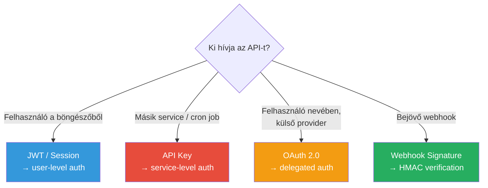

---
tags:
  - auth
  - security
  - backend
  - api
datum: 2026-03-06
szint: "🧱 Scout"
kapcsolodo:
  - "[[backend/jwt|JWT]]"
  - "[[backend/oauth-2-0|OAuth 2.0]]"
  - "[[backend/webhook-verification|Webhook Verification]]"
  - "[[backend/hono|Hono]]"
  - "[[frontend/env-valtozok-nextjs-ben|Env változók Next.js-ben]]"
  - "[[database/redis|Redis]]"
  - "[[_moc/moc-auth|MOC - Auth]]"
---

# API Key Management

## Összefoglaló

Az **API key** a legegyszerűbb autentikációs módszer service-to-service kommunikációhoz. Nincs user login, nincs OAuth flow — egy hosszú, random string-et küldesz minden kérésben, és a szerver ez alapján azonosítja a hívót. Egyszerű, de ha rosszul kezeled, súlyos biztonsági kockázat.

## Mikor API key, mikor valami más?

| Megoldás | Mikor használd |
|----------|---------------|
| **API key** | Service-to-service, cron job, webhook, belső tool |
| **[[backend/oauth-2-0|OAuth 2.0]]** | Felhasználó nevében hozzáférés külső API-hoz |
| **[[backend/jwt|JWT]]** | Felhasználó autentikáció stateless API-hoz |
| **mTLS** | Nagyon biztonságos service-to-service (fintech, healthcare) |



## API key generálás

Egy jó API key: **elég hosszú**, **random**, és **prefix-szel rendelkezik** a gyors azonosításhoz.

```typescript
// lib/api-keys.ts
import crypto from 'crypto'

interface ApiKey {
  id: string
  prefix: string        // pk_live_ — gyors azonosítás
  hashedKey: string     // SHA-256 hash — ezt tároljuk DB-ben
  plainKey: string      // Csak egyszer mutatjuk meg a felhasználónak
  name: string
  scopes: string[]      // 'projects:read', 'projects:write'
  createdAt: Date
  expiresAt: Date | null
  lastUsedAt: Date | null
}

export function generateApiKey(prefix: string = 'sk_live'): {
  plainKey: string
  hashedKey: string
} {
  const rawKey = crypto.randomBytes(32).toString('base64url')
  const plainKey = `${prefix}_${rawKey}`
  const hashedKey = crypto
    .createHash('sha256')
    .update(plainKey)
    .digest('hex')

  return { plainKey, hashedKey }
}
```

> [!warning] Az API key-t SOHA ne tárold plaintext-ben
> Az adatbázisban mindig a **SHA-256 hash-t** tárold. Ha az adatbázis kiszivárog, a hash-ekből nem lehet visszafejteni az eredeti key-eket. Ugyanaz az elv mint a jelszavaknál — de API key-nél elég a hash (nem kell bcrypt, mert az API key elég hosszú a brute force ellen).

## API key validáció

```typescript
// middleware/api-auth.ts
import crypto from 'crypto'
import { db } from '@/lib/db'

export async function validateApiKey(req: Request): Promise<{
  valid: boolean
  keyData?: ApiKeyRecord
}> {
  const authHeader = req.headers.get('authorization')
  if (!authHeader?.startsWith('Bearer ')) {
    return { valid: false }
  }

  const plainKey = authHeader.slice(7)

  // Hash-t keresünk a DB-ben, nem a plain key-t
  const hashedKey = crypto
    .createHash('sha256')
    .update(plainKey)
    .digest('hex')

  const keyRecord = await db.query.apiKeys.findFirst({
    where: eq(apiKeys.hashedKey, hashedKey),
  })

  if (!keyRecord) return { valid: false }

  // Lejárat ellenőrzés
  if (keyRecord.expiresAt && keyRecord.expiresAt < new Date()) {
    return { valid: false }
  }

  // Last used frissítés (async, ne blokkolja a kérést)
  db.update(apiKeys)
    .set({ lastUsedAt: new Date() })
    .where(eq(apiKeys.id, keyRecord.id))
    .execute()

  return { valid: true, keyData: keyRecord }
}
```

```typescript
// app/api/projects/route.ts — használat
export async function GET(req: Request) {
  const { valid, keyData } = await validateApiKey(req)
  if (!valid) {
    return new Response('Invalid API key', { status: 401 })
  }

  // Scope ellenőrzés
  if (!keyData!.scopes.includes('projects:read')) {
    return new Response('Insufficient permissions', { status: 403 })
  }

  // Projektek lekérése...
}
```

## API key rotation

A key rotation kritikus: ha egy key kiszivárog, minimalizálni kell a kárt. A legjobb minta az **overlap rotation**: az új key-t kiadod mielőtt a régit visszavonod.

```typescript
// Rotation flow
async function rotateApiKey(oldKeyId: string) {
  // 1. Új key generálás
  const { plainKey, hashedKey } = generateApiKey('sk_live')
  const newKey = await db.insert(apiKeys).values({
    hashedKey,
    name: `Rotated from ${oldKeyId}`,
    scopes: oldKeyScopes,
    expiresAt: null,
  }).returning()

  // 2. Régi key lejáratának beállítása (grace period)
  await db.update(apiKeys)
    .set({
      expiresAt: new Date(Date.now() + 7 * 24 * 60 * 60 * 1000), // 7 nap
    })
    .where(eq(apiKeys.id, oldKeyId))

  // 3. Felhasználó megkapja az új key-t
  return { newPlainKey: plainKey, deprecatedKeyId: oldKeyId }
}
```

```
Rotation timeline:
────────────────────────────────────────────────
Nap 0: Új key generálás, régi key grace period indul
Nap 1-7: Mindkét key működik (overlap)
  → A fejlesztő átállítja a service-eket az új key-re
Nap 7: Régi key automatikusan lejár
────────────────────────────────────────────────
```

## Rate limiting API key-enként

A rate limiting megvéd a túlhasználattól és a brute force próbálkozásoktól. [[database/redis|Redis]] tökéletes erre:

```typescript
// middleware/rate-limit.ts
import { Redis } from '@upstash/redis'

const redis = new Redis({
  url: process.env.UPSTASH_REDIS_REST_URL!,
  token: process.env.UPSTASH_REDIS_REST_TOKEN!,
})

export async function rateLimit(keyId: string, limit = 100, windowSec = 60) {
  const key = `ratelimit:${keyId}:${Math.floor(Date.now() / (windowSec * 1000))}`
  const count = await redis.incr(key)

  if (count === 1) {
    await redis.expire(key, windowSec)
  }

  return {
    allowed: count <= limit,
    remaining: Math.max(0, limit - count),
    reset: windowSec - (Math.floor(Date.now() / 1000) % windowSec),
  }
}
```

## Scope-ok tervezése

Ugyanaz a **resource:action** pattern mint az RBAC-nál:

```typescript
// Scope definíciók
const SCOPES = {
  'projects:read':  'Projektek listázása és megtekintése',
  'projects:write': 'Projektek létrehozása és szerkesztése',
  'webhooks:manage': 'Webhook endpoint-ok kezelése',
  'analytics:read': 'Analitika adatok olvasása',
} as const

type Scope = keyof typeof SCOPES
```

> [!tip] Least privilege elv
> Mindig a **legkevesebb szükséges scope-ot** add az API key-nek. Ha egy cron job csak olvas, ne adj neki write jogot. Ha kiszivárog, a kár limitált.

## Key prefix konvenció

A prefix segít gyorsan azonosítani milyen key-ről van szó:

```
sk_live_abc123...   → Secret key, production
sk_test_abc123...   → Secret key, teszt környezet
pk_live_abc123...   → Public key (kliens-oldalra is OK)
pk_test_abc123...   → Public key, teszt
whsec_abc123...     → Webhook signing secret
```

A [[backend/clerk|Clerk]] és a Stripe is ezt a mintát követi — érdemes te is.

## Mikor használd / Mikor NE

**Használd:**
- Backend service hívja a te API-dat (cron job, worker, másik microservice)
- Third-party integráció (partner API hozzáférés)
- CLI tool autentikáció
- Webhook signing secret (lásd: [[backend/webhook-verification|Webhook Verification]])

**NE használd:**
- Felhasználó-szintű auth a böngészőben — API key a frontenden = kiszivárgás
- Ha a felhasználó nevében kell hozzáférni más API-hoz — [[backend/oauth-2-0|OAuth 2.0]] kell
- Ha azonnali visszavonás kell millisecundumon belül — cache-elt API key validáció erre nem jó
- Érzékeny env változók helyett — lásd: [[frontend/env-valtozok-nextjs-ben|Env változók Next.js-ben]]

## Buktatók

- **Key a kódban / git-ben** — `.env.local`-ba tedd, és ellenőrizd hogy `.gitignore`-ban van. Használj secret scanning-et (GitHub, Aikido)
- **Nincs lejárat** — minden API key-nek legyen lejárata (max 1 év), és legyen rotation policy
- **Nincs audit log** — logold melyik key-t mikor használták, honnan (IP), milyen scope-pal. Ha gyanús aktivitás van, tudd melyik key-t kell visszavonni
- **Plaintext tárolás DB-ben** — mindig hash-eld (SHA-256). A plain key-t csak a generálásnál mutatod meg egyszer
- **Egyetlen key minden célra** — külön key minden service-nek, külön scope-okkal. Ha az egyetlen key kiszivárog, mindent kompromittál

## Kapcsolódó

- [[backend/jwt|JWT]] — user-level auth, API key helyett böngészős klienseknek
- [[backend/oauth-2-0|OAuth 2.0]] — delegált hozzáférés, user nevében
- [[backend/webhook-verification|Webhook Verification]] — webhook signing secret is egyfajta API key
- [[backend/hono|Hono]] — bearerAuth middleware beépített API key validáláshoz
- [[frontend/env-valtozok-nextjs-ben|Env változók Next.js-ben]] — API key-ek biztonságos tárolása env-ben
- [[database/redis|Redis]] — rate limiting és key validáció cache
