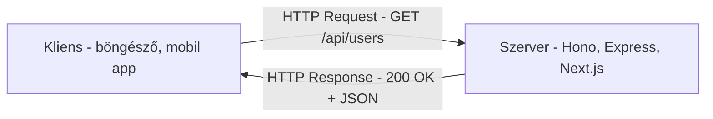

# API rétegek szintaxis

**Kategória:** `koncepció` (kód olvasási útmutató)

---

## Miről szól ez a note?

Ez a note arról szól, hogyan olvass **API-val kapcsolatos kódot** - route definíciók, request/response kezelés, middleware, kliens oldali hívások. Nem az eszközöket tárgyaljuk, hanem a **kód szintaxist** tanulod meg felismerni.

> [!tldr]
> Ha API kódot látsz: keress **route definíciót** (milyen URL-en, milyen HTTP metódussal), **request feldolgozást** (mi jön be), **response küldést** (mi megy ki), és **[[backend/middleware|Middleware]]-t** (mi történik közben). Ez a minta MINDEN API framework-ben ugyanaz.

---

## HTTP alapok - amit az API kód mögé kell érteni

Mielőtt a kódot nézed, értsd meg mit csinál egy API:



### HTTP metódusok - "mit akarok csinálni?"

| Metódus | Jelentés | Analógia | Tipikus használat |
|---------|---------|---------|------------------|
| `GET` | "Adj nekem adatot" | Könyvet kérsz a könyvtárból | Lista, részletek lekérése |
| `POST` | "Hozz létre valamit" | Új könyvet adsz le | Regisztráció, új adat |
| `PUT` / `PATCH` | "Módosítsd ezt" | Javítod a könyv adatait | Profil frissítés, szerkesztés |
| `DELETE` | "Töröld ezt" | Könyvet kivonsz a forgalomból | Fiók törlés, elem eltávolítás |

### HTTP státusz kódok - "mi történt?"

| Kód | Jelentés | Mikor látod a kódban |
|-----|---------|---------------------|
| `200` | OK - sikeres | `return c.json(data)` (alapértelmezett) |
| `201` | Created - létrehozva | `return c.json(data, 201)` (POST után) |
| `400` | Bad Request - rossz kérés | `return c.json({ error: "..." }, 400)` |
| `401` | Unauthorized - nincs jogod | Auth middleware blokkol |
| `403` | Forbidden - tiltott | Van jogod, de nem ehhez |
| `404` | Not Found - nem létezik | A keresett adat nem található |
| `500` | Server Error - szerver hiba | Valami elromlott a kódban |

### URL felépítése

```text
https://example.com/api/users/123?sort=name&limit=10
  ^ protokoll    ^ domain  ^ path      ^ query paraméterek
                           ^ /api = API prefix
                           ^ /users = erőforrás
                           ^ /123 = dinamikus paraméter (user ID)
```

---

## Route definíció - "melyik URL-en mi történjen"

A route = egy URL + HTTP metódus + kezelő függvény. Ez a minta **minden framework-ben** hasonló:

### A közös minta

```text
[framework].[metódus]('[útvonal]', [kezelő függvény])
```

### Hono

```typescript
import { Hono } from 'hono'

const app = new Hono()

app.get('/api/users', async (c) => {           // <- GET kérés a /api/users-re
//                           ^ c = context (request + response helperek)
  const users = await db.select().from(userTable)
  return c.json(users)                          // <- JSON response küldés
})

app.post('/api/users', async (c) => {          // <- POST kérés (létrehozás)
  const body = await c.req.json()               // <- request body beolvasás
  const user = await db.insert(userTable).values(body)
  return c.json(user, 201)                      // <- 201 Created státuszkód
})

app.get('/api/users/:id', async (c) => {       // <- :id = dinamikus paraméter
  const id = c.req.param('id')                  // <- az URL-ből kiszedi az id-t
  const user = await db.select().from(userTable).where(eq(userTable.id, id))
  return c.json(user)
})
```

### Express

```typescript
import express from 'express'

const app = express()

app.get('/api/users', async (req, res) => {    // <- req = request, res = response
  const users = await db.select().from(userTable)
  res.json(users)                               // <- res.json() - nincs return!
})

app.post('/api/users', async (req, res) => {
  const body = req.body                          // <- body közvetlenül elérhető
  const user = await db.insert(userTable).values(body)
  res.status(201).json(user)                     // <- .status().json() láncolás
})

app.get('/api/users/:id', async (req, res) => {
  const id = req.params.id                       // <- req.params az URL paraméterek
  // ...
})
```

### Next.js App Router (API Routes)

[[frontend/nextjs|Next.js]]-ben az API route-ok **fájl alapúak** - a fájl neve és helye határozza meg az URL-t:

```text
app/
├── api/
│   ├── users/
│   │   ├── route.ts           <- /api/users
│   │   └── [id]/
│   │       └── route.ts       <- /api/users/:id (dinamikus)
│   └── health/
│       └── route.ts           <- /api/health
```

```typescript
// app/api/users/route.ts
import { NextRequest, NextResponse } from 'next/server'

// A függvény NEVE határozza meg a HTTP metódust!
export async function GET(request: NextRequest) {
//                    ^ GET = ez a GET /api/users handler
  const users = await db.select().from(userTable)
  return NextResponse.json(users)
//       ^ NextResponse helper-ek
}

export async function POST(request: NextRequest) {
//                    ^ POST = ez a POST /api/users handler
  const body = await request.json()
  const user = await db.insert(userTable).values(body)
  return NextResponse.json(user, { status: 201 })
}
```

```typescript
// app/api/users/[id]/route.ts
// A [id] mappa neve = dinamikus paraméter
export async function GET(
  request: NextRequest,
  { params }: { params: { id: string } }    // <- a params-ból jön az id
) {
  const user = await db.select()
    .from(userTable)
    .where(eq(userTable.id, params.id))
  return NextResponse.json(user)
}

export async function DELETE(
  request: NextRequest,
  { params }: { params: { id: string } }
) {
  await db.delete(userTable).where(eq(userTable.id, params.id))
  return NextResponse.json({ success: true })
}
```

### Next.js Server Actions

A Next.js-ben van egy másik minta is - **Server Actions**. Ez nem klasszikus API endpoint, hanem egy szerver oldali függvény amit a React komponens közvetlenül hív:

```typescript
// app/actions/user.ts
"use server"                    // <- EZ jelöli hogy szerver oldali kód!

export async function createUser(formData: FormData) {
  const nev = formData.get("nev") as string
  const email = formData.get("email") as string

  await db.insert(userTable).values({ nev, email })
  revalidatePath("/users")      // <- frissítsd az /users oldalt
}
```

```tsx
// app/users/page.tsx - komponensből közvetlenül hívod
import { createUser } from "../actions/user"

export default function NewUserPage() {
  return (
    <form action={createUser}>
{/*        ^ a form a szerver action-t hívja - nincs fetch, nincs API endpoint! */}
      <input name="nev" />
      <input name="email" />
      <button type="submit">Mentés</button>
    </form>
  )
}
```

> [!tip] Server Action felismerés
> Ha `"use server"` van a fájl elején - az egy Server Action fájl. A függvényei közvetlenül hívhatók React komponensekből, a háttérben a Next.js automatikusan HTTP kérést csinál belőle.

---

## Framework összehasonlítás - ugyanaz a minta, más szintaxis

| Funkció | [[backend/hono|Hono]] | [[backend/express|Express]] | Next.js App Router |
|---------|------|---------|-------------------|
| **Route** | `app.get('/path', fn)` | `app.get('/path', fn)` | Fájl: `app/path/route.ts` + `export async function GET` |
| **Request body** | `c.req.json()` | `req.body` | `request.json()` |
| **URL param** | `c.req.param('id')` | `req.params.id` | `params.id` (2. arg) |
| **Query param** | `c.req.query('sort')` | `req.query.sort` | `request.nextUrl.searchParams.get('sort')` |
| **JSON küldés** | `c.json(data)` | `res.json(data)` | `NextResponse.json(data)` |
| **Státusz kód** | `c.json(data, 201)` | `res.status(201).json(data)` | `NextResponse.json(data, { status: 201 })` |
| **Middleware** | `app.use('/api/*', fn)` | `app.use('/api/*', fn)` | `middleware.ts` fájl |
| **Handler** | `(c) => { }` | `(req, res) => { }` | `(request, { params }) => { }` |

> [!info] Felismerés
> Ha `app.get()` / `app.post()` látsz - Hono vagy Express (explicit route definiálás).
> Ha `route.ts` fájlban `export async function GET/POST` - Next.js App Router.
> Ha `"use server"` + sima függvény export - Next.js Server Action.

---

## Middleware - "köztes réteg"

A middleware a request és a válasz **között** fut. Részletesen: [[backend/middleware|Middleware]].

```typescript
// Hono middleware
app.use('/api/*', async (c, next) => {       // <- minden /api/ route előtt fut
  console.log(`${c.req.method} ${c.req.path}`)
  await next()                                // <- továbbengedi a következő handler-nek
//      ^ FONTOS: next() nélkül a request "elakad"
})

// Express middleware - ugyanaz, más szintaxis
app.use('/api/*', (req, res, next) => {
  console.log(`${req.method} ${req.path}`)
  next()                                      // <- req, res, next a három paraméter
})

// Next.js middleware - egy fájl az egész projekthez
// middleware.ts (projekt gyökerében)
export function middleware(request: NextRequest) {
  // Nincs next() - return-nel döntöd el mi történjen
  if (!isAuthed(request)) {
    return NextResponse.redirect(new URL('/login', request.url))
  }
  return NextResponse.next()                  // <- továbbengedi
}
export const config = { matcher: ['/dashboard/:path*'] }
//                      ^ milyen URL-ekre fusson
```

---

## tRPC - típusbiztos API hívás

A [[backend/trpc|tRPC]] más mint a REST: nem URL-eket hívsz, hanem **függvényeket**.

```typescript
// SZERVER - procedure (mint egy route, de típusbiztos)
export const appRouter = t.router({
  user: t.router({
    list: t.procedure.query(({ ctx }) => {              // <- query = GET-szerű
      return ctx.db.select().from(users)
    }),
    create: t.procedure
      .input(z.object({ nev: z.string() }))             // <- Zod validálja a bemenetet
      .mutation(({ ctx, input }) => {                    // <- mutation = POST-szerű
        return ctx.db.insert(users).values(input)
      }),
  }),
})

// KLIENS - hívás (teljes autocomplete + típusbiztonság)
const users = await trpc.user.list.query()
//                  ^ router ^ procedure ^ típus
await trpc.user.create.mutate({ nev: "User" })
//                             ^ TS hiba ha rossz típust adsz!
```

> [!tip] tRPC felismerés
> Ha `t.router()`, `t.procedure`, `.query()`, `.mutation()` - tRPC szerver kód. Ha `trpc.valami.query()` / `.mutate()` - tRPC kliens hívás. Nincs URL, nincs fetch - típusbiztos függvényhívás.

---

## Kliens oldali API hívás - a másik oldal

A fenti kódok mind **szerver oldaliak** (fogadják a kérést). A kliens oldal (React) pedig **küldi** a kérést:

### fetch - a legegyszerűbb

```typescript
// GET kérés
const response = await fetch('/api/users')
//                           ^ az URL amit hív
const users = await response.json()
//                          ^ a JSON-t parse-olja

// POST kérés
const response = await fetch('/api/users', {
  method: 'POST',                    // <- HTTP metódus
  headers: {
    'Content-Type': 'application/json',
    'Authorization': `Bearer ${token}`  // <- auth token
  },
  body: JSON.stringify({             // <- az adat amit küldünk
    nev: "User",
    email: "user@example.com"
  })
})
const ujUser = await response.json()
```

### React Query (TanStack Query)

A fetch-et "felokosítja": cache-elés, loading state, error handling, automatikus újratöltés:

```tsx
import { useQuery, useMutation } from '@tanstack/react-query'

function UserList() {
  // useQuery = adat lekérés (GET)
  const { data, isLoading, error } = useQuery({
    queryKey: ['users'],                    // <- cache kulcs (egyedi azonosító)
    queryFn: () => fetch('/api/users').then(r => r.json())
//           ^ a tényleges fetch hívás
  })

  if (isLoading) return <p>Betöltés...</p>  // <- automatikus loading state
  if (error) return <p>Hiba!</p>             // <- automatikus error state

  return <ul>{data.map(u => <li key={u.id}>{u.nev}</li>)}</ul>
}

// useMutation = adat módosítás (POST/PUT/DELETE)
const createUser = useMutation({
  mutationFn: (newUser) =>
    fetch('/api/users', {
      method: 'POST',
      body: JSON.stringify(newUser)
    }),
  onSuccess: () => {
    queryClient.invalidateQueries({ queryKey: ['users'] })
//  ^ sikeres POST után frissítsd a users listát (refetch)
  }
})

// Használat
createUser.mutate({ nev: "Új User" })
```

> [!info] React Query felismerés
> `useQuery()` - adat olvasás (GET), automatikus cache + loading + error.
> `useMutation()` - adat módosítás (POST/PUT/DELETE).
> `queryKey` - cache azonosító, `queryFn` - a tényleges hívás, `invalidateQueries` - cache frissítés.

---

## Request / Response anatómia

```text
REQUEST (kliens -> szerver):
┌─────────────────────────────────┐
│ POST /api/users HTTP/1.1        │ <- metódus + URL
│ Host: example.com               │
│ Content-Type: application/json  │ <- headerek (metaadatok)
│ Authorization: Bearer eyJhb...  │ <- auth token
│                                 │
│ { "nev": "User", "kor": 28 }   │ <- body (adat)
└─────────────────────────────────┘

RESPONSE (szerver -> kliens):
┌─────────────────────────────────┐
│ HTTP/1.1 201 Created            │ <- státusz kód
│ Content-Type: application/json  │ <- headerek
│                                 │
│ { "id": "abc123",               │ <- body (válasz adat)
│   "nev": "User",                │
│   "kor": 28 }                   │
└─────────────────────────────────┘
```

---

## Összefoglaló - API kód olvasási minta

Ha API kódra nézel, keresd ezeket sorrendben:

```text
1. ROUTE DEFINÍCIÓ -> melyik URL-en, milyen metódussal?
   app.get('/api/users', ...)          <- Hono/Express
   export async function GET(...)      <- Next.js

2. INPUT -> mit kap a handler?
   c.req.json()          <- request body (Hono)
   c.req.param('id')     <- URL paraméter
   c.req.query('sort')   <- query string (?sort=name)

3. LOGIKA -> mit csinál az adattal?
   db.select()...        <- adatbázis lekérés
   db.insert()...        <- adatbázis írás

4. OUTPUT -> mit küld vissza?
   c.json(data)          <- JSON response
   c.json(data, 201)     <- státusz kóddal

5. MIDDLEWARE -> mi fut előtte?
   app.use('/api/*', authMiddleware)
   ^ ez minden /api/ hívás ELŐTT lefut
```

---

## AI-natív fejlesztés

Az API rétegek megértése az egyik legfontosabb alap, ha AI-val fejlesztesz. Claude Code és Cursor pontosan tudják generálni a route handler-eket, ha megadod a framework-öt és a kívánt viselkedést - de neked kell felismerned a mintát a generált kódban.

> [!tip] Hogyan használd AI-val
> - *"Generálj egy Hono route-ot ami GET /api/users/:id-re visszaadja a user-t a DB-ből, 404-et ha nincs"*
> - *"Írj át ezt az Express route-ot Next.js App Router API route-ra"*
> - *"Adj hozzá React Query wrapper-t ehhez a fetch híváshoz - useQuery + loading + error state"*
