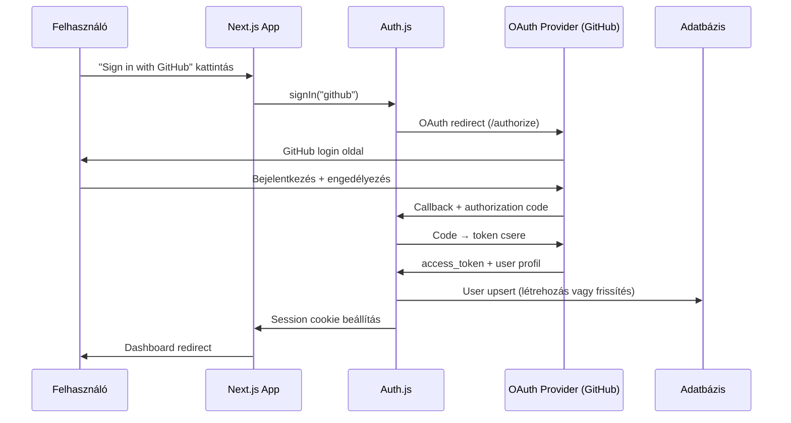

---
tags:
  - auth
  - backend
  - nextjs
  - open-source
datum: 2026-03-06
szint: "🧱 Scout"
kapcsolodo:
  - "[[backend/clerk|Clerk]]"
  - "[[backend/jwt|JWT]]"
  - "[[backend/oauth-2-0|OAuth 2.0]]"
  - "[[backend/session-management|Session Management]]"
  - "[[database/supabase|Supabase]]"
  - "[[database/drizzle|Drizzle]]"
  - "[[frontend/nextjs|Next.js]]"
  - "[[_moc/moc-auth|MOC - Auth]]"
---

# Auth.js (NextAuth)

## Összefoglaló

Az **Auth.js** (korábbi nevén NextAuth.js) egy open source authentication library, ami [[frontend/nextjs|Next.js]], SvelteKit, és más keretrendszerekben ad teljes auth megoldást. A [[backend/clerk|Clerk]]-kel ellentétben nincs vendor lock-in: te hosztolod, te tárolod a user adatokat, és teljes kontrollod van az auth flow felett.

## Auth.js vs Clerk — mikor melyik?

| Szempont | Auth.js | [[backend/clerk|Clerk]] |
|----------|---------|-------|
| **Ár** | Ingyenes (open source) | Free tier / $25+/hó |
| **Hosting** | Te hosztolod | Managed (Clerk szerverei) |
| **User adatok** | A te adatbázisodban | Clerk-nél (szinkronizálhatsz) |
| **Vendor lock-in** | Nincs | Van (Clerk API-ra épül) |
| **Setup idő** | 30-60 perc | 10-15 perc |
| **UI komponensek** | Nincs (te írod) | Pre-built (SignIn, UserButton) |
| **Multi-tenant** | Magad kell megoldani | Beépített Organizations |
| **OAuth provider-ek** | 80+ beépített | 20+ beépített |
| **Session stratégia** | JWT vagy database session | JWT (Clerk managed) |

> [!tip] Döntési szabály
> **Clerk:** ha gyorsan kell production-ready auth, SaaS-t építesz, és nem baj a vendor lock-in.
> **Auth.js:** ha open source kell, teljes kontroll, saját DB-ben akarod a user adatokat, vagy a Clerk ára nem fér bele.

## Auth flow



## Setup lépésről lépésre

### 1. Telepítés

```bash
npm install next-auth@beta
```

> [!info] Auth.js v5 (beta)
> A v5 az App Router-re optimalizált verzió. A v4 (`next-auth`) a Pages Router-hez való. Új projektben mindig v5-öt használj.

### 2. Környezeti változók

```env
# .env.local
AUTH_SECRET=openssl-rand-base64-32-eredmenye  # npx auth secret
AUTH_GITHUB_ID=Ov23li...
AUTH_GITHUB_SECRET=abc123...
AUTH_URL=http://localhost:3000
```

### 3. Auth konfiguráció

```typescript
// auth.ts (projekt gyökérben)
import NextAuth from 'next-auth'
import GitHub from 'next-auth/providers/github'
import Google from 'next-auth/providers/google'
import { DrizzleAdapter } from '@auth/drizzle-adapter'
import { db } from '@/lib/db'

export const { handlers, signIn, signOut, auth } = NextAuth({
  adapter: DrizzleAdapter(db),  // user adatok a saját DB-dben
  providers: [
    GitHub,
    Google,
  ],
  callbacks: {
    // Session-be extra adatokat tehetsz
    async session({ session, user }) {
      session.user.id = user.id
      return session
    },
    // Hozzáférés-vezérlés
    async authorized({ auth, request }) {
      const isLoggedIn = !!auth?.user
      const isProtected = request.nextUrl.pathname.startsWith('/dashboard')
      if (isProtected && !isLoggedIn) return false
      return true
    },
  },
})
```

### 4. API route

```typescript
// app/api/auth/[...nextauth]/route.ts
import { handlers } from '@/auth'

export const { GET, POST } = handlers
```

### 5. Middleware

```typescript
// middleware.ts
export { auth as middleware } from '@/auth'

export const config = {
  matcher: ['/dashboard/:path*', '/api/protected/:path*'],
}
```

### 6. Használat komponensekben

```tsx
// Server Component — session lekérés
import { auth } from '@/auth'

export default async function DashboardPage() {
  const session = await auth()

  if (!session?.user) {
    return <p>Nem vagy bejelentkezve</p>
  }

  return (
    <div>
      <h1>Szia, {session.user.name}!</h1>
      <p>Email: {session.user.email}</p>
    </div>
  )
}
```

```tsx
// Client Component — bejelentkezés/kijelentkezés
'use client'
import { signIn, signOut } from 'next-auth/react'

export function AuthButtons() {
  return (
    <div>
      <button onClick={() => signIn('github')}>Sign in with GitHub</button>
      <button onClick={() => signOut()}>Sign out</button>
    </div>
  )
}
```

## Database adapter (Drizzle)

Az Auth.js adapterekkel bármilyen adatbázisba mentheted a user adatokat. A [[database/drizzle|Drizzle]] adapter a legmodernebb választás:

```typescript
// lib/db/schema.ts — Auth.js táblák Drizzle sémában
import { pgTable, text, timestamp, primaryKey } from 'drizzle-orm/pg-core'

export const users = pgTable('users', {
  id: text('id').primaryKey().$defaultFn(() => crypto.randomUUID()),
  name: text('name'),
  email: text('email').notNull().unique(),
  emailVerified: timestamp('email_verified'),
  image: text('image'),
})

export const accounts = pgTable('accounts', {
  userId: text('user_id').notNull().references(() => users.id, { onDelete: 'cascade' }),
  type: text('type').notNull(),
  provider: text('provider').notNull(),
  providerAccountId: text('provider_account_id').notNull(),
  refresh_token: text('refresh_token'),
  access_token: text('access_token'),
  expires_at: timestamp('expires_at'),
}, (account) => ({
  pk: primaryKey({ columns: [account.provider, account.providerAccountId] }),
}))

export const sessions = pgTable('sessions', {
  sessionToken: text('session_token').primaryKey(),
  userId: text('user_id').notNull().references(() => users.id, { onDelete: 'cascade' }),
  expires: timestamp('expires').notNull(),
})
```

## Session stratégiák

| Stratégia | Hogyan működik | Mikor használd |
|-----------|---------------|----------------|
| **database** | Session a DB-ben, session ID a cookie-ban | Ha azonnali session visszavonás kell |
| **jwt** | [[backend/jwt|JWT]] a cookie-ban, nincs DB lookup | Ha nincs DB adapter, vagy gyorsaság kell |

```typescript
// auth.ts — session stratégia választás
export const { handlers, auth } = NextAuth({
  session: {
    strategy: 'database', // vagy 'jwt'
    maxAge: 30 * 24 * 60 * 60, // 30 nap
  },
  // ...
})
```

## Mikor használd / Mikor NE

**Használd:**
- Open source auth kell, nincs vendor lock-in
- A user adatokat a saját adatbázisodban akarod (GDPR, adatszuverenitás)
- 80+ [[backend/oauth-2-0|OAuth 2.0]] provider kell (GitHub, Google, Discord, stb.)
- Költségérzékeny projekt ahol a Clerk ára nem fér bele

**NE használd:**
- Ha a [[backend/clerk|Clerk]] pre-built UI és gyors setup fontosabb mint a kontroll
- Ha multi-tenant SaaS-t építesz — a Clerk Organizations sokkal egyszerűbb
- Ha nem [[frontend/nextjs|Next.js]]-t használsz és nincs Auth.js adapter a framework-ödhöz
- Ha nincs saját adatbázisod és nem is akarsz kezelni

## Buktatók

- **v4 vs v5 keverés** — a v5 (App Router) API teljesen más mint a v4 (Pages Router). Ne keverd a dokumentációkat
- **`AUTH_SECRET` hiánya production-ben** — nélküle a session cookie nem lesz titkosítva. `npx auth secret` generál egyet
- **Adapter nélküli JWT session** — ha nincs DB adapter, a user adatok csak a JWT-ben élnek. User törlés/módosítás nem fog működni amíg a token le nem jár
- **OAuth callback URL** — a provider dashboard-on be kell állítani: `https://yourdomain.com/api/auth/callback/github` — ha ez nem stimmel, a login nem működik
- **Email provider spam** — ha magic link-et használsz, a verification email-ek spam-be mehetnek. Saját SMTP kell (Resend, SendGrid)

## Kapcsolódó

- [[backend/clerk|Clerk]] — a managed alternatíva, pre-built UI-val
- [[backend/jwt|JWT]] — Auth.js JWT session stratégiája erre épül
- [[backend/oauth-2-0|OAuth 2.0]] — az OAuth flow amit Auth.js implementál
- [[backend/session-management|Session Management]] — database session stratégia részletei
- [[database/supabase|Supabase]] — Supabase adapter is létezik Auth.js-hez
- [[database/drizzle|Drizzle]] — a javasolt ORM az Auth.js adapterhez
- [[frontend/nextjs|Next.js]] — a fő támogatott framework
