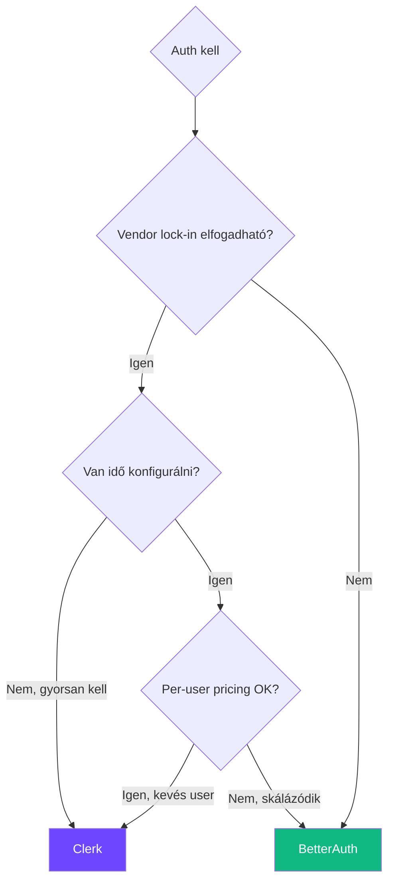

# BetterAuth

**Kategória:** `auth` (open-source, self-hosted)
**URL:** https://www.better-auth.com

---

## Mi ez és mire jó?

A **BetterAuth** egy open-source, self-hosted autentikációs framework TypeScript-hez. A [[backend/clerk|Clerk]]-kel ellentétben nem managed szolgáltatás - a te adatbázisodban tárolódik minden, nincs per-user díjazás. A [[backend/jwt|JWT]]-t és session-öket is kezeli beépítve.

> [!tldr]
> **Clerk alternatíva, ha nem akarsz vendor lock-in-t.** Open-source, self-hosted, plugin-alapú, framework-agnosztikus. A te DB-d, a te adataid, a te szabályaid.

---

## Mikor használd / Mikor NE

**Mikor jó a BetterAuth:**
- **Self-hosted auth kell** - nem akarsz third-party-tól függni (Clerk, Auth0)
- **Per-user pricing fáj** - skálázásnál a Clerk drága lesz, BetterAuth-nál csak infra költség van
- **Teljes kontroll kell** az auth flow felett - custom login, saját UI, saját logika
- **Multi-framework projekt** - nem csak [[frontend/nextjs|Next.js]], hanem Svelte, Astro, Hono, Express is
- **Plugin rendszert akarsz** - 2FA, organization, passkey, API key mind plugin-ként jön
- **[[database/drizzle|Drizzle]] vagy [[database/prisma|Prisma]] ORM-et használsz** - natív adapterek vannak hozzájuk

**Mikor NE használd:**
- **Gyorsan kell production-ready auth** és nem akarod konfigurálni - [[backend/clerk|Clerk]] egyszerűbb
- **Pre-built UI komponensek kellenek** (login form, user button) - Clerk adja, BetterAuth-nál magadnak kell (bár van shadcn plugin)
- **Nem akarod karbantartani** az auth infrastruktúrát - managed service-nél ez nem a te gondod
- **Enterprise SSO/SAML most kell** és nem akarsz vele kísérletezni - Clerk vagy Auth0 stabilabb erre

---

## Összehasonlítás

| Szempont | BetterAuth | [[backend/clerk|Clerk]] | NextAuth/Auth.js |
|---|---|---|---|
| **Típus** | Open-source, self-hosted | Managed service | Open-source |
| **Adattárolás** | A te DB-dben | Clerk szerverei | A te DB-dben |
| **Árazás** | Ingyenes (infra költség) | Per-user, drágul | Ingyenes (infra költség) |
| **UI komponensek** | Nincs beépítve (shadcn plugin van) | Pre-built, testreszabható | Nincs beépítve |
| **Framework** | Agnosztikus (Next, Svelte, Astro, Hono...) | React/Next.js fókusz | React/Next.js fókusz |
| **Plugin rendszer** | Igen, gazdag ökoszisztéma | Nem (webhook-ok) | Callback-alapú |
| **2FA, passkey** | Plugin-ként | Beépítve | Külön kell implementálni |
| **Organization/multi-tenant** | Plugin-ként | Beépítve | Nincs |
| **DB schema** | Auto-generált (CLI) | Managed | Manuális adapter |
| **TypeScript** | First-class, type-safe | Jó TS support | Jó TS support |

> [!tip] Ökölszabály
> **Prototípus / gyors MVP = [[backend/clerk|Clerk]]** (percek alatt kész, nem kell DB-t kezelni)
> **Production SaaS ahol kontroll kell = BetterAuth** (self-hosted, plugin-ek, nincs vendor lock-in)
> **Legacy projekt / egyszerű OAuth = NextAuth** (de BetterAuth modernebb alternatíva)

---

## Setup - lépésről lépésre

### 1-2. Telepítés és környezeti változók

| Lépés | Parancs / beállítás |
|---|---|
| Telepítés | `bun add better-auth` |
| `BETTER_AUTH_SECRET` | Random secret key (min. 32 karakter) |
| `BETTER_AUTH_URL` | `http://localhost:3000` (dev) / production URL |

### 3. Auth konfiguráció

```typescript
// lib/auth.ts
import { betterAuth } from "better-auth"
import { drizzleAdapter } from "better-auth/adapters/drizzle"
import { db } from "@/db"

export const auth = betterAuth({
  database: drizzleAdapter(db, {
    provider: "pg", // vagy "sqlite", "mysql"
  }),
  emailAndPassword: { enabled: true },
  socialProviders: {
    github: {
      clientId: process.env.GITHUB_CLIENT_ID!,
      clientSecret: process.env.GITHUB_CLIENT_SECRET!,
    },
    google: {
      clientId: process.env.GOOGLE_CLIENT_ID!,
      clientSecret: process.env.GOOGLE_CLIENT_SECRET!,
    },
  },
})
```

### 4. DB schema generálás

| Lépés | Parancs |
|---|---|
| Schema generálás az ORM-edhez | `npx @better-auth/cli generate` |
| Migráció futtatás | `npx @better-auth/cli migrate` |

> [!info] Automatikus schema
> A BetterAuth CLI automatikusan generálja a `user`, `session`, `account` táblákat a [[database/drizzle|Drizzle]] vagy [[database/prisma|Prisma]] schema-dba. Nem kell kézzel megírnod - ez nagy előny a NextAuth-tal szemben.

### 5. Next.js API route

```typescript
// app/api/auth/[...all]/route.ts
import { auth } from "@/lib/auth"
import { toNextJsHandler } from "better-auth/next-js"

export const { POST, GET } = toNextJsHandler(auth)
```

### 6. Kliens oldali auth

```typescript
// lib/auth-client.ts
import { createAuthClient } from "better-auth/react"

export const {
  signIn,
  signUp,
  signOut,
  useSession,
} = createAuthClient({
  baseURL: process.env.NEXT_PUBLIC_APP_URL!,
})
```

### 7. Használat komponensben

```tsx
'use client'

import { useSession, signIn, signOut } from "@/lib/auth-client"

export function AuthStatus() {
  const { data: session } = useSession()

  if (!session) {
    return (
      <button onClick={() => signIn.social({ provider: "github" })}>
        Bejelentkezés GitHub-bal
      </button>
    )
  }

  return (
    <div>
      <p>Bejelentkezve: {session.user.email}</p>
      <button onClick={() => signOut()}>Kijelentkezés</button>
    </div>
  )
}
```

---

## Plugin rendszer

A BetterAuth ereje a plugin architektúrában van. A `plugins` tömbben adod hozzá a `betterAuth()` konfighoz - nem mindent kell bekapcsolni, csak amit használsz:

| Plugin | Mire való |
|---|---|
| `twoFactor()` | TOTP és SMS alapú kétfaktoros |
| `organization()` | Csapatok, role-ok, meghívó rendszer (multi-tenant) |
| `passkey()` | WebAuthn / passkey bejelentkezés |
| `magicLink()` | Jelszó nélküli email link |
| `apiKey()` | Service-to-service API kulcsok |
| `anonymous()` | Anoním felhasználók (majd regisztrálhatnak) |
| `admin()` | Admin panel és user management |

---

## BetterAuth vs Clerk - melyiket válaszd?



---

## Buktatók

- **`BETTER_AUTH_SECRET` hiányzik** - production-ben erős, random secret kell (min. 32 karakter)
- **DB migráció elfelejtve** - ha nem futtatod a `generate` + `migrate`-ot, a session tábla hiányzik és 500-as hibát kapsz
- **Social provider callback URL** - GitHub/Google OAuth settings-ben a redirect URI legyen `https://yourdomain.com/api/auth/callback/github`
- **Kliens és szerver auth keverése** - `useSession()` kliens oldali, szerver oldalon a `auth.api.getSession()` kell
- **Plugin sorrend** - egyes plugin-ek egymásra épülnek, a docs-ban megnézni a függőségeket

---

## AI-natív fejlesztés

A BetterAuth setup és plugin konfiguráció ideális feladat AI-nak - a boilerplate kód jól dokumentált, a pattern-ek ismétlődnek. Claude Code-dal különösen hatékonyan generálhatsz BetterAuth konfigot, plugin setup-ot és auth middleware-t.

> [!tip] Hogyan használd AI-val
> - *"Állíts be BetterAuth-ot Drizzle adapterrel, GitHub és Google social login-nal, email+password-del"*
> - *"Adj hozzá organization plugin-t a BetterAuth konfighoz, és protectedProcedure-t a tRPC router-hez ami ellenőrzi a jogosultságot"*
> - *"Generálj egy BetterAuth middleware-t a Next.js-hez ami a /dashboard/* route-okat védi"*
