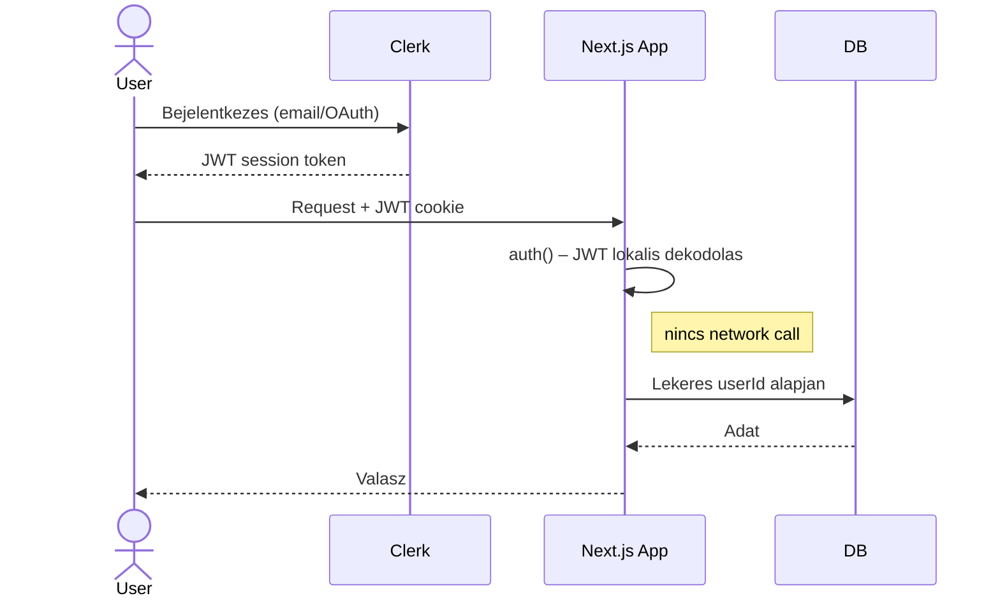

# Clerk

**Kategoria:** `auth`
**URL:** https://clerk.com/

---

## Mi ez es mire jo?

A **Clerk** egy autentikacios es felhasznalokezelo szolgaltatas (Authentication-as-a-Service).

**Mikor hasznald**
- **[[frontend/nextjs|Next.js]] / React alapu SaaS-t epitesz** es nem akarsz auth-ot kezzel implementalni.
- **Multi-tenant app** kell (organizations, roles, permissions).
- **Gyorsan kell production-ready auth** – nem akarod a NextAuth/Auth.js konfiguralasaval tolteni az idot.
- **Klienseknek** csinalsz appot, ahol fontos a megbizhato auth, de nem akarod magad karbantartani.

**Mikor NE hasznald:**
- **Nem JS/TS stack** – ha pl. pure Python backend van, nehezkes az integracio.
- **Teljes kontroll kell** az auth flow felett – Clerk opinionated, ha nagyon custom flow kell, korlatozo lehet.
- **Vendor lock-in kerulese** – ha fontos, hogy ne fuggj third-party-tol, inkabb Auth.js vagy Lucia Auth.

---

## Auth flow



---

## Setup — lepesrol lepesre

### 1. Regisztracio / Telepites

- Menj a [clerk.com](https://clerk.com)-ra, hozz letre fiokot.
- Hozz letre egy **Application**-t a dashboardon.
- Valaszd ki milyen login modszereket akarsz (Google, email, stb.) – ezt kesobb is modosithatod.
- Masold ki a **Publishable Key**-t es **Secret Key**-t.

### 2. Alap konfiguracio

```bash
npm install @clerk/nextjs
```

`.env.local`:

```env
NEXT_PUBLIC_CLERK_PUBLISHABLE_KEY=pk_test_xxxxx
CLERK_SECRET_KEY=sk_test_xxxxx
```

### 3. Projekt beallitas

`middleware.ts` (root-ban):

```ts
import { clerkMiddleware } from '@clerk/nextjs/server'

export default clerkMiddleware()

export const config = {
  matcher: ['/((?!.*\\..*|_next).*)', '/', '/(api|trpc)(.*)'],
}
```

`app/layout.tsx`-ben wrappeld be:

```tsx
import { ClerkProvider } from '@clerk/nextjs'

export default function RootLayout({ children }) {
  return (
    <ClerkProvider>
      <html><body>{children}</body></html>
    </ClerkProvider>
  )
}
```

Ezutan mar hasznalhatod a kesz komponenseket:

```tsx
import { SignIn, SignUp, UserButton } from '@clerk/nextjs'

// Bejelentkezes oldal
<SignIn />

// User avatar + menu
<UserButton />
```

Vedett route-ok server side-on:

```ts
import { auth } from '@clerk/nextjs/server'

export async function GET() {
  const { userId } = await auth()
  if (!userId) return new Response('Unauthorized', { status: 401 })
  // ...
}
```

### 4. Osszekotes mas eszkozokkel

**[[database/supabase|Supabase]] / Postgres-szel:**

- Webhook-on keresztul szinkronizalod a user adatokat a sajat DB-dbe.
- Vagy hasznald a Clerk Backend API-t server side-on: `clerkClient.users.getUser(userId)`.

**[[cloud/docker-compose|Docker Compose]] deploy-hoz:**

- A ket env valtozo (`PUBLISHABLE_KEY`, `SECRET_KEY`) kell a containerbe.
- Clerk maga hosted szolgaltatas, nem kell semmit self-hostolni – csak az API kulcsok kellenek.

---

## Best Practices

### Architektura / Struktura

- **Auth logikat kozpontositsd** – ne szord szet a `auth()` hivasokat mindenhova. Csinalj egy `lib/auth.ts` helper-t:

```ts
import { auth } from '@clerk/nextjs/server'

export async function requireAuth() {
  const { userId } = await auth()
  if (!userId) throw new Error('Unauthorized')
  return userId
}
```

- **Middleware-ben csak route protection legyen**, uzleti logika ne. A middleware minden requestnel fut, tartsd konnyunek.
- **User adatokat szinkronizald a sajat DB-dbe** webhook-on keresztul – ne hivogasd a Clerk API-t minden requestnel. A Clerk a source of truth az auth-ra, a te DB-d a source of truth az uzleti adatokra.
- **`publicMetadata`** vs **`privateMetadata`** vs **`unsafeMetadata`**:
    - `publicMetadata` – kliens is latja, csak backend allithatja (role, plan, stb.)
    - `privateMetadata` – csak backend latja (internal flags, Stripe customer ID)
    - `unsafeMetadata` – kliens is irhatja (user preferences, theme) – ne bizz meg benne auth donteseknel

### Biztonsag

- **Secret Key soha ne keruljon kliensre** – csak `NEXT_PUBLIC_CLERK_PUBLISHABLE_KEY` megy a frontra.
- **Role-based access-t `publicMetadata`-ban tarold**, ne `unsafeMetadata`-ban (azt a user modosithatja).
- **Webhook-okat SVIX signature-rel validald** – a Clerk kuld egy `svix-signature` headert, ellenorizd:

```ts
import { Webhook } from 'svix'

const wh = new Webhook(process.env.CLERK_WEBHOOK_SECRET!)
wh.verify(body, headers) // dob ha invalid
```

- **CORS es domain beallitasok** – Clerk dashboardon allitsd be a production domain-t, ne hagyd wildcardon.

### Teljesitmeny

- **Session token-t hasznalj, ne API hivast** – `auth()` a [[backend/jwt|JWT]]-t lokalisan dekodolja, nulla network overhead.
- **`<ClerkLoaded>`** wrapper – ha nem akarod, hogy auth betoltese elott renderelodjön valami:

```tsx
import { ClerkLoaded } from '@clerk/nextjs'
<ClerkLoaded><ProtectedComponent /></ClerkLoaded>
```

- **Ne hivd a `clerkClient.users.getUser()`-t minden requestnel** – cache-eld vagy szinkronizald DB-be.

---

## Gyakori mintak / Hasznalati esetek

### 1. Role-based access (RBAC)

```ts
// Webhook-ban beallitod
await clerkClient.users.updateUserMetadata(userId, {
  publicMetadata: { role: 'admin' }
})

// Ellenorzes server side
const { userId, sessionClaims } = await auth()
if (sessionClaims?.metadata?.role !== 'admin') {
  return new Response('Forbidden', { status: 403 })
}
```

`clerk.d.ts` a tipusokhoz:

```ts
declare global {
  interface ClerkAuthorization {
    permission: ''
    role: 'admin' | 'member'
  }
}
```

### 2. Multi-tenant SaaS (Organizations)

```tsx
import { OrganizationSwitcher } from '@clerk/nextjs'

// Org valto UI
<OrganizationSwitcher />

// Server side – melyik org-ban van a user
const { orgId, orgRole } = await auth()
```

Clerk Organizations adja: meghivok, role-ok org-on belul, org-level billing.

### 3. Webhook → n8n → onboarding flow

Clerk webhook (`user.created`) → n8n Webhook trigger → lanc:

1. Welcome email kuldes (SendGrid/Resend node)
2. User sor letrehozasa a Supabase-ben (Supabase node)
3. Slack notification az admin csatornara

---

## Buktatók es hibak amiket elkerulj

- **`middleware.ts` nem a gyokerben van** – Next.js csak a project root-bol vagy `src/`-bol olvassa, mashonnan nem fut le, es minden route nyitva marad.
- **Webhook secret hianyzik** – ha nem validalsz, barki kuldhet fake eventeket az endpointra.
- **`unsafeMetadata`-ra epitesz auth dontest** – a user kliens oldalrol felulirhatja, soha ne bizz benne jogosultsag-ellenorzesnel.
- **Elfelejtett environment valtas** – production-ben `pk_live_` es `sk_live_` kell, ne maradjon `pk_test_`. Clerk dashboardon kulon van dev es prod instance.
- **Webhook retry-ok nem idempotensek** – Clerk ujrakuldi a failed webhookokat. Hasznalj `event.id`-t dedup-ra, kulonben duplikalt userek lesznek a DB-dben.
- **`<SignIn />` route conflict** – ha a sign-in oldalad `/sign-in`-en van, add meg a env-ben:

```env
NEXT_PUBLIC_CLERK_SIGN_IN_URL=/sign-in
NEXT_PUBLIC_CLERK_SIGN_UP_URL=/sign-up
```

---

## Hasznos parancsok / kodreszletek

```bash
# Clerk user listazas CLI-bol (API-val, debug-ra)
curl -H "Authorization: Bearer sk_test_xxxxx" \
  https://api.clerk.com/v1/users?limit=10

# Webhookot lokalisan tesztelni (ngrok-kal)
ngrok http 3000
# A kapott URL-t add meg a Clerk dashboardon webhook endpointnak

# User torles API-bol
curl -X DELETE -H "Authorization: Bearer sk_test_xxxxx" \
  https://api.clerk.com/v1/users/{user_id}
```

Server-side user sync helper:

```ts
import { clerkClient } from '@clerk/nextjs/server'

export async function syncUserToDb(clerkUserId: string) {
  const user = await clerkClient.users.getUser(clerkUserId)
  await db.user.upsert({
    where: { clerkId: user.id },
    update: { email: user.emailAddresses[0]?.emailAddress },
    create: {
      clerkId: user.id,
      email: user.emailAddresses[0]?.emailAddress,
      name: `${user.firstName} ${user.lastName}`,
    },
  })
}
```

---

## Hasznos linkek

- **Docs:** [clerk.com/docs](https://clerk.com/docs)
- **Dashboard:** [dashboard.clerk.com](https://dashboard.clerk.com)
- **Discord:** [clerk.com/discord](https://clerk.com/discord)
- **Statusz oldal:** [status.clerk.com](https://status.clerk.com)
- **Changelog:** [clerk.com/changelog](https://clerk.com/changelog)
- **GitHub:** [github.com/clerk/javascript](https://github.com/clerk/javascript)

---

## Kapcsolodo

- [[frontend/nextjs|Next.js]]
- [[database/supabase|Supabase]]
- [[cloud/docker-compose|Docker Compose]]
- [[backend/jwt|JWT]]
- [[database/drizzle|Drizzle]]
