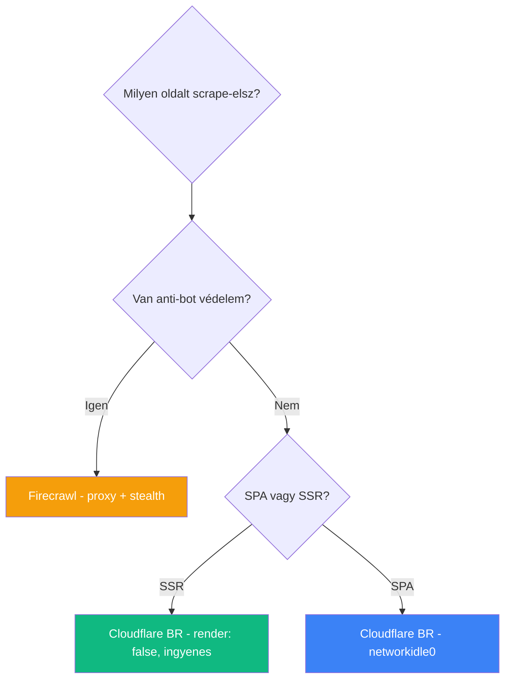

# Cloudflare Browser Rendering vs Firecrawl

**Kategória:** `scraping` (technológia összehasonlítás)

---

## Mikor melyiket válaszd scraping-hez?

Mindkettő **headless Chrome-ot** futtat a felhőben és weboldalak tartalmát adja vissza (markdown, HTML, linkek). A különbség az **absztrakciós szintben** és az **anti-bot képességekben**.

> [!tldr]
> **Firecrawl** = magasabb szintű, beépített proxy rotation + anti-bot bypass, drágább.
> **[[cloud/cloudflare|Cloudflare]] BR** = alacsonyabb szintű, olcsóbb, de nincs proxy és az anti-bot védett oldalak blokkolják.

---

## Összehasonlítás

| Szempont | Firecrawl | Cloudflare BR |
|----------|-----------|---------------|
| **Típus** | Scraping SaaS (magasabb szintű) | Headless Chrome as a Service (alacsonyabb szintű) |
| **Anti-bot bypass** | Beépített (proxy rotation, stealth mode) | Nincs - saját Cloudflare IP-ről megy |
| **IP rotation** | Igen (residential + datacenter proxy) | Nem |
| **JS renderezés** | Automatikus | Igen (`render: true` alapértelmezett) |
| **Click / interactions** | `actions` paraméter (click, wait, scroll) | Nincs REST API-ban (Workers Binding + Puppeteer kell) |
| **Batch scrape** | `batchScrape()` - több URL egyszerre | Nincs batch, egyenként kell (párhuzamosítható) |
| **Output formátumok** | Markdown, HTML, links, screenshot | Markdown, HTML, links, screenshot, PDF, JSON (AI) |
| **AI extraction** | Nem (külön kell, pl. Gemini) | Beépített `/json` endpoint (Workers AI) |
| **Crawl (link-követés)** | `crawl()` endpoint | `/crawl` endpoint (beta) |
| **SDK** | `@mendable/firecrawl-js` npm | Nincs dedikált SDK, natív `fetch` |
| **Rate limit (paid)** | Magas concurrency | 600 req/perc |
| **Árazás** | Credit-alapú (subscription) | $0.09/óra böngészőidő + $5/hó Workers Paid |

---

## Ár összehasonlítás

### Firecrawl

- Credit rendszer - subscription-based
- ~1 credit/page (markdown formátum)
- `batchScrape` credit-hatékony (nem külön-külön hívás)

### Cloudflare BR

- **Free:** 10 perc/nap böngészőidő, 6 req/perc
- **Paid ($5/hó):** 10 óra/hó ingyenes, utána $0.09/óra, 600 req/perc
- `render: false` a beta alatt **ingyenes** (SSR oldalakhoz ideális)

> [!tip] Költségpélda
> Ha naponta 200 oldalt scrape-elsz, és oldalanként ~5 másodperc a renderelési idő:
> - 200 x 5 sec = ~17 perc/nap = ~8.5 óra/hó
> - Cloudflare Paid: a 10 órás ingyenes keret épp lefedi - **$5/hó összesen**
> - Firecrawl: 200 credit/nap = 6000 credit/hó (terv-függő)

---

## Képességek részletesen

### Anti-bot védelem kezelése

Ez a **legnagyobb különbség** és a legfontosabb döntési szempont.



### Interaktív oldalak (click, scroll)

A Firecrawl `actions` paramétere lehetővé teszi, hogy JavaScript interakciókat futtass scrape közben:

```json
{
  "actions": [
    { "type": "click", "selector": ".load-more-btn" },
    { "type": "wait", "milliseconds": 2000 }
  ]
}
```

A Cloudflare REST API-ban **nincs ilyen**. Ha interakció kell, Workers Binding + Puppeteer szükséges (saját Worker kód).

### AI extraction

A Cloudflare `/json` endpointja beépített AI-val (Workers AI) strukturált adatot nyerhet ki:

```json
{
  "url": "https://shop.example.com",
  "prompt": "Extract product name, price, description",
  "response_format": { "type": "json_schema", "json_schema": {} }
}
```

A Firecrawl-nak nincs ilyen - külső AI kell (pl. Gemini, [[toolbox/claude-code-projekt-setup|Claude Code]]).

---

## Mikor melyiket válaszd?

### Firecrawl-t válaszd ha:

- **Anti-bot védett** oldalakat scrape-elsz (CAPTCHA, bot detection)
- **Interakció** kell (click, scroll, form fill) a REST API-n keresztül
- **Batch scrape** kell (sok URL egyszerre, hatékonyan)
- **Megbízhatóság** a prioritás (proxy rotation = kevesebb blokkolás)
- Nem akarod magad kezelni a rate limit / retry logikát

### Cloudflare BR-t válaszd ha:

- **SSR oldalakat** scrape-elsz anti-bot nélkül
- **Költségoptimalizálás** a cél ($5/hó vs. Firecrawl subscription)
- Már a **Cloudflare ökoszisztémában** dolgozol (Workers, R2, D1)
- **AI extraction** kell beépítve (`/json` endpoint)
- **Screenshot / PDF** generálás kell API-ból
- Dokumentáció / publikus oldal crawl-olás

### Hibrid megközelítés (ajánlott)

A legjobb megoldás a **forrás-szintű választás**:

- **Védett oldalak** - Firecrawl (proxy + anti-bot)
- **SSR / nyitott oldalak** - Cloudflare BR (olcsóbb)

Egy **SourceAdapter pattern** ezt lehetővé teszi - a runner nem tudja melyik backend-et használja, csak az adapter interfészt hívja.

---

## AI-natív fejlesztés

A scraping pipeline tervezése ideális AI-feladat - Claude Code-dal gyorsan felépíthetsz egy adapter pattern-t ami Firecrawl és Cloudflare BR között válogat a forrás típusa alapján. A prompt-ban mindig jelezd az oldal jellegét (SSR/SPA, anti-bot védelem).

> [!tip] Hogyan használd AI-val
> - *"Építs egy SourceAdapter-t ami SSR oldalakhoz Cloudflare BR-t, védett oldalakhoz Firecrawl-t használ - közös markdown output"*
> - *"Cloudflare BR markdown endpoint hívás TypeScript-ben, networkidle0 wait-tel és image/font szűréssel"*
