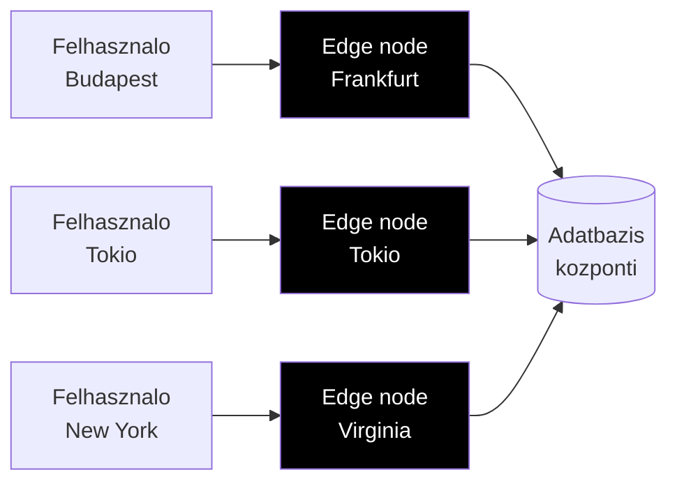

## Mi ez?

Az **Edge Function** egy szerver-oldali fuggveny, ami nem egy kozponti szerveren fut, hanem a **felhasználóhoz legkozelebbi CDN edge node-on**. Globálisan elosztva, minimalis latency-vel — tehát ha valaki Tokiobol keri le az oldalt, a Tokio melletti edge node-on fut a kod, nem New Yorkban.



---

## Edge vs Serverless vs Tradicionalis szerver

| Szempont | Tradicionalis szerver | Serverless (Lambda) | Edge Function |
|---|---|---|---|
| **Hol fut** | Fix szerveren (pl. EU) | Cloud regioban (1-2 helyen) | CDN edge-en (globálisan) |
| **Cold start** | Nincs (mindig fut) | 100-500ms | ~0ms (instant) |
| **Latency** | Regiofuggo | Regiofuggo | Minimalis (közel a userhez) |
| **Runtime** | Node.js, Python, bármi | Node.js, Python, etc. | V8 Isolate (limitalt) |
| **Futasido limit** | Nincs | 15 perc (AWS Lambda) | 30mp ([[cloud/vercel|Vercel]]) |
| **Memoria** | GB-ok | 128MB-10GB | 128MB (limitalt) |
| **Adatbázis hozzáférés** | Kozvetlen | Kozvetlen | Limitalt (connection pooling kell) |
| **Ar** | Fix havi | Per request | Per request (olcso) |

> [!warning] Edge function limitaciok
> Az edge function **V8 Isolate**-ben fut, ami azt jelenti, hogy **nem minden Node.js API erheto el**. Nincs `fs`, nincs nativ modulok, nincs hosszu futásu process. Ha ezek kellenek → serverless function vagy normal szerver kell.

---

## Mikor használd?

**Edge function ideális:**
- **Auth middleware** — token ellenőrzes minden request elott ([[frontend/nextjs|Next.js]] middleware)
- **Geo-routing** — orszag alapján mas tartalmat mutat
- **A/B tesztelés** — keres szintén dönt melyik verziót mutatja
- **Header manipulacio** — security headers, CORS, redirect
- **Rate limiting** — keresek szűrese a szerverre jutas elott
- **Personalizacio** — felhasználó alapján módosított response

**Edge function NEM ideális:**
- Nehez szamitasok (ML inference, kepfeldolgozas)
- Hosszu futásu feladatok (email küldés, PDF generalas)
- Kozvetlen adatbázis műveletek (bar egyre jobb — [[database/supabase|Supabase]] Edge Functions ezt kezeli)
- Node.js-specifikus könyvtárak használata

---

## Vercel Edge Functions

A [[cloud/vercel|Vercel]] platformon az Edge Functions a [[frontend/nextjs|Next.js]] middleware-en és az Edge API Route-okon keresztul erheto el.

### Next.js Middleware (edge-en fut)

```typescript
// middleware.ts (projekt gyokerben)
import { NextResponse } from 'next/server'
import type { NextRequest } from 'next/server'

export function middleware(request: NextRequest) {
  // Geo-routing: magyar user → /hu, nemet → /de
  const country = request.geo?.country || 'US'

  if (country === 'HU' && !request.nextUrl.pathname.startsWith('/hu')) {
    return NextResponse.redirect(new URL('/hu', request.url))
  }

  // Auth check
  const token = request.cookies.get('session')
  if (!token && request.nextUrl.pathname.startsWith('/dashboard')) {
    return NextResponse.redirect(new URL('/login', request.url))
  }

  return NextResponse.next()
}

export const config = {
  matcher: ['/((?!api|_next/static|_next/image|favicon.ico).*)']
}
```

### Edge API Route

```typescript
// app/api/hello/route.ts
export const runtime = 'edge' // Ez teszi edge function-ne

export async function GET(request: Request) {
  return new Response(JSON.stringify({ hello: 'world' }), {
    headers: { 'content-type': 'application/json' },
  })
}
```

---

## Supabase Edge Functions

A [[database/supabase|Supabase]] saját Edge Functions rendszert kinal **Deno** runtime-mal:

```typescript
// supabase/functions/hello-world/index.ts
import { serve } from 'https://deno.land/std@0.168.0/http/server.ts'

serve(async (req) => {
  const { name } = await req.json()

  return new Response(
    JSON.stringify({ message: `Hello ${name}!` }),
    { headers: { 'Content-Type': 'application/json' } },
  )
})
```

```bash
# Lokalis fejlesztes
supabase functions serve hello-world

# Deploy
supabase functions deploy hello-world
```

> [!info] Deno vs V8 Isolate
> A Supabase Edge Functions **Deno**-t használ (nem V8 Isolate-et mint a Vercel). Ez azt jelenti, hogy több Node.js-kompatibilis API erheto el, de a latency kicsit magasabb mert nem CDN edge-en fut, hanem a Supabase regioban.

---

## Kapcsolodo

- [[backend/hono|Hono]] — edge-nativ API framework (Cloudflare Workers-re)
- [[cloud/cloudflare|Cloudflare]] — edge computing platform (Workers, D1, R2)
- [[backend/express|Express]] — klasszikus Node.js framework (NEM fut edge-en)
- [[frontend/nextjs|Next.js]] — middleware és API routes edge runtime-mal
- [[cloud/vercel|Vercel]] — Edge Functions hosting
- [[database/supabase|Supabase]] — Edge Functions Deno-val
