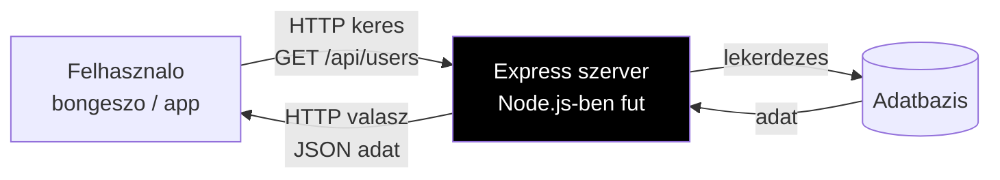
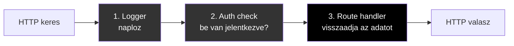

# Express

**Kategoria:** `framework` (backend API)
**URL:** https://expressjs.com
**Ar/Terv:** Ingyenes, open source

---

## Mi ez és mire jó?

Az **Express** (vagy Express.js) a **Node.js világ legregebbi és legelterjedtebb web framework-je**. Ha a JavaScript/TypeScript-ben akarsz backend-et irni (API-t, webszervert), akkor ez volt evekig az egyetlen komoly választas.

**Milyen problémat old még:**

Képzeld el, hogy van egy boltod. A vevok (felhasználók) bejonnek és kernek dolgokat (HTTP keresek). Valakinek kell fogadni a kereseket, megnezni mit akarnak, és odaadni amit kernek — ez a webszerver. Az Express egy **keret (framework)**, ami megkonnyiti ennek a webszervernek a megirasat.



**Express nelkul** a Node.js-ben így nez ki egy szerver:

```javascript
// Nyers Node.js — bonyolult, alacsony szintu
const http = require('http')
const server = http.createServer((req, res) => {
  if (req.method === 'GET' && req.url === '/api/users') {
    res.writeHead(200, { 'Content-Type': 'application/json' })
    res.end(JSON.stringify([{ name: 'User' }]))
  } else {
    res.writeHead(404)
    res.end('Not Found')
  }
})
server.listen(3000)
```

**Express-szel** ugyanez:

```javascript
// Express — egyszeru, olvashato, kevesebb kod
const express = require('express')
const app = express()

app.get('/api/users', (req, res) => {
  res.json([{ name: 'User' }])
})

app.listen(3000)
```

> [!tldr] Egy mondatban
> Az Express egy Node.js library ami megkonnyiti HTTP keresek fogadasat és válaszolasát — azaz API-k és webszerverek építeset.

**Mikor használd:**

- Ha saját Node.js backend API-t irsz (pl. [[cloud/railway|Railway]]-re deployolva)
- Ha tanulni akarsz backend fejlesztest — ez a klasszikus kiindulopont
- Regi projektek karbantartasa — rengeteg letezo projekt Express-re epul

**Mikor NE használd:**

- Ha [[frontend/nextjs|Next.js]]-t használsz — abban már van beepitett API Routes, nem kell Express melle
- Ha Cloudflare Workers-re vagy edge-re deployolsz — ott az Express NEM fut (lásd: [[backend/hono|Hono]])
- Új projekteknel ahol fontos a teljesítmény és a meret — modernebb alternativak jobbak

**Alternativak:**

[[backend/hono|Hono]] (edge-nativ, modernebb), Fastify (gyorsabb Express), Koa (Express készítok ujragondolt verziója), [[frontend/nextjs|Next.js]] API Routes (ha már Next.js-t használsz)

---

## A "middleware" koncepcio

Az Express legnagyobb innovacioja a **middleware pattern**. Ez az az otlet, amire az összes többi framework (Hono, Next.js middleware, stb.) is epul.

**Mi a middleware?**

Egy middleware egy fuggveny, ami **a keres és a valasz kozott ul** — mint egy szűro vagy ellenőrzopont. Több middleware egymas utan fut, mint egy futoszalagon:



```javascript
// Middleware pelda
const express = require('express')
const app = express()

// 1. middleware: minden kerest logol
app.use((req, res, next) => {
  console.log(`${req.method} ${req.url}`)
  next() // "next()" = menjen tovabb a kovetkezo middleware-re
})

// 2. middleware: auth ellenorzes
app.use('/api', (req, res, next) => {
  const token = req.headers.authorization
  if (!token) return res.status(401).json({ error: 'Nincs token' })
  next()
})

// 3. route handler (vegso middleware)
app.get('/api/users', (req, res) => {
  res.json([{ name: 'User' }])
})
```

> [!tip] Miért fontos ezt erteni?
> A middleware pattern **mindenhol visszakoszon**: [[frontend/nextjs|Next.js]] middleware, [[backend/hono|Hono]] middleware, Cloudflare Workers — mind ugyanezt a gondolkodast használja. Ha Express-ben megerted, mindenhol tudod alkalmazni.

---

## Miért nem az elsődleges választas új projekteknel?

Az Express 2010-ben jelent még, és azota a világ sokat változótt:

| Probléma | Miért gond |
|----------|-----------|
| **Nem fut edge-en** | Az Express Node.js-re epul — Cloudflare Workers, Deno, Bun nem mind tamogatja nativan |
| **Nagy meret** | ~2MB + függőségek — edge function-okhoz tul nagy |
| **Nincs TypeScript support** | Tipusok utólag lettek hozzáadva, nem TypeScript-first |
| **Lassu** | Modern alternativak (Hono, Fastify) 2-5x gyorsabbak |
| **Elavult async kezeles** | Callback-alapu, a modern async/await nem nativ benne |

**Ezert jott letre a [[backend/hono|Hono]]** — ugyanazt csinálja mint az Express, de modern, gyors, és mindenhol fut (Cloudflare, Deno, Bun, Node.js).

---

## Kapcsolodo

- [[backend/hono|Hono]] — a modern, edge-nativ Express alternativa
- [[frontend/nextjs|Next.js]] — fullstack framework beepitett API route-okkal
- [[backend/edge-function|Edge function]] — mi az edge és miért fontos
- [[cloud/railway|Railway]] — ha megis Express-t deployolsz
