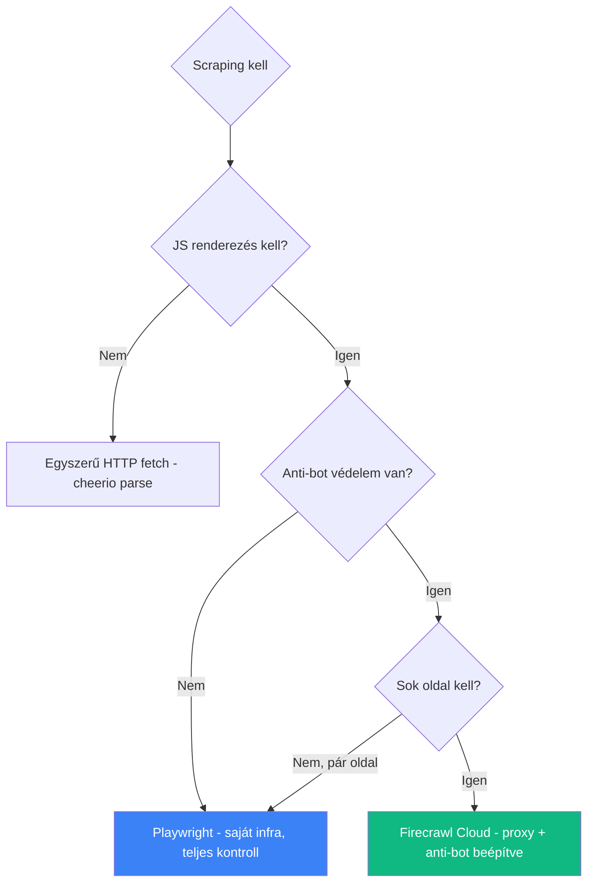

# Headless Chrome

**Kategória:** `scraping` / `testing` (böngésző automatizálás)

---

## Mi az a Headless Chrome?

A **Headless Chrome** a Chrome böngésző grafikus felület nélküli módja - programozottan vezérelhető böngésző, ami HTML-t renderel, JavaScript-et futtat, és interakciókat szimulál, de nincs ablak.

> [!tldr]
> **Headless Chrome = böngésző UI nélkül.** Scraping, tesztelés, PDF generálás, screenshot készítés - minden ami böngészőt igényel, de fejjel nem kell.

---

## Mire jó?

| Felhasználás | Leírás |
|-------------|--------|
| **Web scraping** | JavaScript-tel renderelt oldalak scrape-elése (SPA-k, React oldalak) |
| **E2E tesztelés** | Valós böngészőben futó automatizált tesztek |
| **Screenshot / PDF** | Oldalak képernyőképe vagy PDF exportja |
| **Prerendering** | SSR helyettesítő: SPA-k server-side renderelése SEO-hoz |
| **Monitoring** | Oldal teljesítmény mérés, visual regression tesztelés |

---

## Playwright - a modern megközelítés

A **Playwright** a Microsoft cross-browser automatizálási framework-je - Chromium, Firefox, WebKit egységesen. Ez a Headless Chrome "okosabb változata":

```bash
# Telepítés
npm install -D @playwright/test
npx playwright install

# Teszt futtatás
npx playwright test

# UI módban (debug)
npx playwright test --ui
```

### Playwright vs. Puppeteer vs. Selenium

| Szempont | Playwright | Puppeteer | Selenium |
|----------|-----------|-----------|----------|
| **Böngészők** | Chromium, Firefox, WebKit | Csak Chromium | Chrome, Firefox, Safari, Edge |
| **Nyelv** | JS/TS, Python, Java, C# | JS/TS | Sok nyelv |
| **Auto-wait** | Beépített (nem kell `sleep`) | Manuális | Manuális |
| **Párhuzamos** | Natív (browser context izoláció) | Korlátozott | Korlátozott |
| **Sebesség** | Gyors | Gyors | Lassabb |
| **API** | Modern, tiszta | Jó | Verbose |

---

## Claude Code + Playwright MCP

A [[toolbox/claude-code-projekt-setup|Claude Code]]-ban a **Playwright [[toolbox/mcp-model-context-protocol|MCP]] szerver** közvetlenül használható - böngésző automatizálás a terminálból.

**Tipikus workflow:**

```text
Claude Code session:
> "Navigate to localhost:3000/dashboard and take a screenshot"
  -> Playwright MCP: browser_navigate -> browser_take_screenshot

> "Fill in the login form with test credentials"
  -> Playwright MCP: browser_fill_form -> browser_click

> "Check if the table shows 10 rows"
  -> Playwright MCP: browser_snapshot -> elemzés
```

**Elérhető MCP tool-ok:**

| Tool | Mit csinál |
|------|-----------|
| `browser_navigate` | URL megnyitása |
| `browser_take_screenshot` | Képernyőkép |
| `browser_snapshot` | DOM snapshot (accessibility tree) |
| `browser_click` | Elem kattintás |
| `browser_fill_form` | Form kitöltése |
| `browser_evaluate` | JavaScript futtatás a böngészőben |
| `browser_press_key` | Billentyű lenyomás |
| `browser_wait_for` | Elem vagy állapot megvárása |
| `browser_console_messages` | Console log-ok olvasása |
| `browser_network_requests` | Hálózati kérések figyelése |

---

## Scraping: Headless Chrome vs. Firecrawl

| Szempont | Headless Chrome / Playwright | Firecrawl |
|----------|------------------------------|-----------|
| **Infra** | Saját szerver kell (vagy Docker) | Cloud API - zero infra |
| **Anti-bot** | Manuális kezelés (proxy, delay, fingerprint) | Beépített bypass |
| **Output** | Raw HTML / DOM | Clean markdown (LLM-ready) |
| **JS renderezés** | Natív | Beépített |
| **Load-more / click** | Saját kód | `actions` paraméterrel (click, wait) |
| **Költség** | Infrastruktúra + fejlesztés | ~1 credit/page |
| **Párhuzamosság** | Korlátozott (memória) | batchScrape |

### Mikor melyiket válaszd?



---

## Mikor használd?

- **E2E tesztelés** - Playwright MCP-vel közvetlenül tesztelheted a futó appot
- **Visual debugging** - screenshot + snapshot a UI állapotáról
- **Form interakció** - automatizált form kitöltés és submit tesztelés
- **Network monitoring** - API hívások ellenőrzése a böngészőből
- **Scraping prototípus** - gyors scrape kipróbálás mielőtt Firecrawl-ra váltanál

---

## AI-natív fejlesztés

A Playwright MCP szerver az egyik legerősebb AI-natív eszköz - Claude Code közvetlenül vezérelheti a böngészőt, screenshotot készít, form-okat tölt ki és E2E teszteket futtat. Ez a visual debugging jövője: megkéred az AI-t, nézze meg az oldalt és mondja meg mi a baj.

> [!tip] Hogyan használd AI-val
> - *"Navigálj a localhost:3000/dashboard-ra, készíts screenshotot és mondd meg, van-e vizuális hiba a táblázatban"*
> - *"Írj Playwright E2E tesztet a login flow-ra: email + jelszó kitöltés, submit, ellenőrizd hogy a dashboard betölt"*
> - *"Használd a Playwright MCP-t és ellenőrizd, hogy a /api/users endpoint-ra a fetch kérés 200-at ad-e vissza"*
