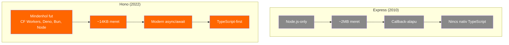

# Hono

**Kategoria:** `framework` (backend API — edge-nativ)
**URL:** https://hono.dev
**Ar/Terv:** Ingyenes, open source

---

## Mi ez es mire jo?

A **Hono** (japanul: 炎 = "lang") egy **ultragyors, minimalista web framework** — ugyanazt csinalja, mint az [[backend/express|Express]] (API-kat es webszervereket epitesz vele), de modernebb, gyorsabb, es **barhol fut**: Cloudflare Workers, Deno, Bun, Node.js, AWS Lambda.

> [!tldr] Egy mondatban
> A Hono a "modern Express" — API-t epitesz vele TypeScript-ben, de az Express-sel ellentetben nem csak Node.js-en, hanem edge-en (pl. [[cloud/cloudflare|Cloudflare]] Workers-on) is fut.

### Az analogia

Ha az [[backend/express|Express]]-t egy regi, megbizhato teherautohoz hasonlitjuk (nagy, bevalt, mindent elvisz, de lassu es nehez), akkor a Hono egy elektromos furgon: ugyanazt a munkat vegzi, de **konnyebb, gyorsabb, es modernebb**.



### Miert letezik a Hono?

Az [[backend/express|Express]] **nem tud futni edge-en** (pl. [[cloud/cloudflare|Cloudflare]] Workers-on), mert Node.js API-kra epul (`fs`, `http`, `stream`), amik edge-en nem elerhetoek (lasd: [[backend/edge-function|Edge function]]). A Hono a **Web Standard API-kra** epul (`Request`, `Response`, `fetch`) — ezek mindenhol elerhetoek.

---

## Hono vs Express vs Next.js

| Szempont | [[backend/express|Express]] | **Hono** | [[frontend/nextjs|Next.js]] |
|----------|---------|------|---------|
| **Mire valo** | Backend API | Backend API | Fullstack (frontend + API) |
| **Hol fut** | Csak Node.js | Mindenhol (edge, Node, Deno, Bun) | Node.js + Vercel edge |
| **Meret** | ~2MB | ~14KB | ~500KB+ |
| **TypeScript** | Utolag hozzaadott | Nativ, first-class | Nativ |
| **Routing** | `app.get('/path', handler)` | `app.get('/path', handler)` | File-based (`app/api/`) |
| **Frontend** | Nincs | Nincs (kulon kell, pl. React) | Beepitett React |
| **Edge support** | Nem | Nativ | Korlatozott |
| **Sebesseg** | Alap | 2-5x gyorsabb | N/A (mas kategoria) |
| **Tanulasi gorbe** | Alacsony | Alacsony (Express-hez hasonlo) | Kozepes-magas |

> [!tip] Mikor melyiket?
> - **Csak API kell (edge-en / Cloudflare-en):** → Hono
> - **Fullstack app (frontend + backend egyben):** → [[frontend/nextjs|Next.js]]
> - **Regi projekt / legacy:** → [[backend/express|Express]]
> - **Hono + React SPA = belso tool:** → Hono az API-hoz, React a frontend-hez, [[cloud/cloudflare|Cloudflare]]-re deploy

---

## Hogy nez ki a kod?

Ha ismered az [[backend/express|Express]]-t (vagy legalabb a koncepciot), a Hono szinte ugyanugy mukodik:

### Alapveto API

```typescript
import { Hono } from 'hono'

const app = new Hono()

// GET endpoint
app.get('/api/users', (c) => {
  return c.json([
    { name: 'User', role: 'dev' },
    { name: 'Henrik', role: 'client' }
  ])
})

// POST endpoint
app.post('/api/users', async (c) => {
  const body = await c.req.json()
  // ... mentes adatbazisba
  return c.json({ success: true }, 201)
})

export default app
```

> [!info] Express vs Hono szintaxis
> Express: `(req, res) => { res.json(data) }`
> Hono: `(c) => { return c.json(data) }`
> A `c` a "context" — tartalmazza a request-et, response helper-eket, es mindent ami kell.

### Middleware — ugyanaz az otlet mint Express-ben

```typescript
import { Hono } from 'hono'
import { cors } from 'hono/cors'
import { logger } from 'hono/logger'
import { bearerAuth } from 'hono/bearer-auth'

const app = new Hono()

// Beepitett middleware-ek (nem kell kulon telepiteni!)
app.use('*', logger())             // minden kerest logol
app.use('*', cors())               // CORS kezeles
app.use('/api/*', bearerAuth({     // auth a /api/ alatt
  token: 'my-secret-token'
}))

app.get('/api/invoices', (c) => {
  return c.json({ invoices: [] })
})
```

**Express-ben** ehhez 3 kulon npm csomagot kene telepiteni (`cors`, `morgan`, stb.). **Hono-ban** minden beepitve van.

### Adatbázis pelda Drizzle-lel

```typescript
import { Hono } from 'hono'
import { drizzle } from 'drizzle-orm/d1'  // Cloudflare D1 driver
import * as schema from './db/schema'

// Cloudflare Workers binding
type Bindings = { DB: D1Database }

const app = new Hono<{ Bindings: Bindings }>()

app.get('/api/invoices', async (c) => {
  const db = drizzle(c.env.DB, { schema })
  const invoices = await db.query.invoices.findMany({
    where: eq(schema.invoices.status, 'unpaid'),
    orderBy: desc(schema.invoices.dueDate)
  })
  return c.json(invoices)
})
```

---

## Setup — lepesrol lepesre

### 1. Telepites (Cloudflare Workers)

```bash
# Uj Hono projekt Cloudflare Workers-re
npm create hono@latest my-api

# Kerdezi a runtime-ot — valaszd: "cloudflare-workers"
# TypeScript? → Yes
```

Vagy meglevo projektbe:

```bash
npm install hono
```

### 2. Alap struktura

```
my-api/
├── src/
│   ├── index.ts          # fo app (Hono routing)
│   ├── routes/
│   │   ├── invoices.ts   # /api/invoices routes
│   │   ├── projects.ts   # /api/projects routes
│   │   └── payments.ts   # /api/payments routes
│   ├── db/
│   │   ├── schema.ts     # Drizzle sema
│   │   └── index.ts      # DB kapcsolat
│   └── middleware/
│       └── auth.ts       # egyedi auth middleware
├── wrangler.toml         # Cloudflare Workers konfig
├── package.json
└── tsconfig.json
```

### 3. wrangler.toml konfig

```toml
name = "my-api"
main = "src/index.ts"
compatibility_date = "2024-01-01"

# D1 adatbazis binding
[[d1_databases]]
binding = "DB"
database_name = "my-db"
database_id = "xxxxxxxx-xxxx-xxxx-xxxx-xxxxxxxxxxxx"

# R2 storage binding (PDF-ekhez)
[[r2_buckets]]
binding = "STORAGE"
bucket_name = "my-files"

# Cron trigger
[triggers]
crons = ["0 */4 * * *"]  # 4 orankent
```

### 4. Deploy

```bash
# Lokalis fejlesztes
npx wrangler dev

# Deploy Cloudflare-re
npx wrangler deploy

# D1 migration
npx wrangler d1 migrations apply my-db
```

---

## Best Practices

### Architektura / Struktura

Route-okat bontsd kulon fajlokba:

```typescript
// src/routes/invoices.ts
import { Hono } from 'hono'

const invoices = new Hono()

invoices.get('/', async (c) => { /* lista */ })
invoices.get('/:id', async (c) => { /* egyedi */ })
invoices.post('/', async (c) => { /* letrehozas */ })
invoices.put('/:id', async (c) => { /* modositas */ })

export default invoices

// src/index.ts — osszeallitas
import { Hono } from 'hono'
import invoices from './routes/invoices'
import projects from './routes/projects'

const app = new Hono()
app.route('/api/invoices', invoices)
app.route('/api/projects', projects)

export default app
```

### Teljesitmeny

- Hono a **leggyorsabb** JavaScript web framework a benchmarkokban
- A ~14KB meret azt jelenti, hogy a cold start szinte nulla (< 5ms)
- [[cloud/cloudflare|Cloudflare]] Workers-on a kod a felhasznalohoz legkozelebbi edge node-on fut → minimalis latency

### Koltsegoptimalizalas

- Hono maga **ingyenes** — a koltseg = a hosting (Cloudflare $5/ho)
- Kisebb bundle = kevesebb CPU ido = kevesebb koltseg Cloudflare-en
- Nincs szerver karbantartas, nincs Docker, nincs frissites

---

## Gyakori mintak / Hasznalati esetek

### 1. Hono API + React SPA (belso tool)

```
                    ┌─────────────────┐
Felhasznalo ───────▶│ Cloudflare Pages │ (React frontend)
                    │  (statikus SPA)  │
                    └────────┬────────┘
                             │ API hivasok
                    ┌────────▼────────┐
                    │ Cloudflare Worker│ (Hono API)
                    │  /api/invoices   │
                    │  /api/projects   │
                    └────────┬────────┘
                             │
                    ┌────────▼────────┐
                    │   Cloudflare D1  │ (SQLite DB)
                    │   Cloudflare R2  │ (PDF storage)
                    └─────────────────┘
```

### 2. Cron Job (hatter szinkronizacio)

```typescript
// Scheduled event handler
export default {
  async scheduled(event: ScheduledEvent, env: Bindings) {
    const db = drizzle(env.DB, { schema })
    // API hivas → uj adatok mentese D1-be
    const newInvoices = await fetchFromExternalAPI(env.API_KEY)
    await db.insert(schema.invoices).values(newInvoices)
  },

  // Normal HTTP keresek
  async fetch(request: Request, env: Bindings) {
    return app.fetch(request, env)
  }
}
```

### 3. Input validacio (Zod-dal)

```typescript
import { zValidator } from '@hono/zod-validator'
import { z } from 'zod'

const createInvoiceSchema = z.object({
  invoiceNumber: z.string(),
  vendorName: z.string(),
  amount: z.number().positive(),
  dueDate: z.string().datetime()
})

app.post('/api/invoices',
  zValidator('json', createInvoiceSchema),
  async (c) => {
    const data = c.req.valid('json') // tipusbiztos!
    // ... mentes
    return c.json({ success: true }, 201)
  }
)
```

---

## Buktatók es hibak amiket elkerulj

- **Ne hasznalj Node.js-only csomagokat** (pl. `fs`, `path`, `crypto` regi API-k) — Cloudflare Workers-on ezek nem elerhetoek. Web Standard API-kat hasznalj
- **Ne felejtsd el a CORS-t** — ha a React SPA mas domain-rol hivja az API-t, kell a `cors()` middleware
- **D1 tranzakciok** — D1 nem tamogat hagyomanyos tranzakciokat, de `.batch()` metodussal tobb query-t egyszerre futtathatsz
- **Hono nem ad frontend-et** — a React SPA-t kulon kell deployolni (Cloudflare Pages)

---

## Hasznos parancsok / kodreszletek

```bash
# Uj Hono projekt (Cloudflare Workers)
npm create hono@latest my-api

# Lokalis dev
npx wrangler dev

# Deploy
npx wrangler deploy

# D1 adatbazis letrehozas
npx wrangler d1 create my-db

# D1 migration futtatas
npx wrangler d1 migrations apply my-db

# D1 SQL futtatas (debug)
npx wrangler d1 execute my-db --command "SELECT * FROM invoices LIMIT 10"
```

---

## Hasznos linkek

- **Docs:** https://hono.dev/docs
- **GitHub:** https://github.com/honojs/hono
- **Cloudflare Workers + Hono guide:** https://hono.dev/docs/getting-started/cloudflare-workers
- **Drizzle + D1 integracio:** https://orm.drizzle.team/docs/get-started/d1-new
- **Kozosseg:** https://discord.gg/honojs

---

## Kapcsolodo

- [[backend/express|Express]] — a klasszikus Node.js framework, amihez Hono hasonlit
- [[cloud/cloudflare|Cloudflare]] — a hosting platform ahol Hono nativan fut
- [[frontend/vinext|ViNext]] — kíserleti Next.js alternativa Vite-on, CF Workers-re
- [[backend/edge-function|Edge function]] — miert fontos az edge computing
- [[frontend/nextjs|Next.js]] — fullstack alternativa (ha frontend is kell egy codebase-ben)
- [[database/drizzle|Drizzle]] — TypeScript ORM, Hono + D1-gyel tokeletes mukodik
- [[cloud/vercel|Vercel]] — alternativ hosting (de ott Next.js jobb valasztas)
