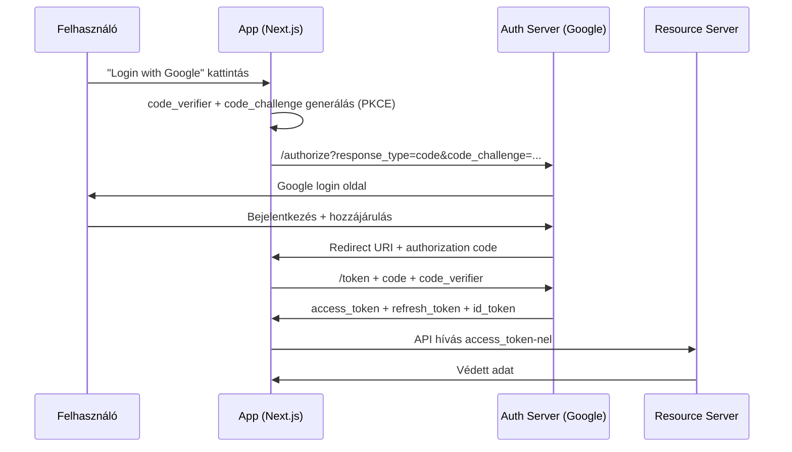

---
tags:
  - auth
  - security
  - backend
datum: 2026-03-06
szint: "🏗️ Builder"
kapcsolodo:
  - "[[backend/jwt|JWT]]"
  - "[[backend/clerk|Clerk]]"
  - "[[database/supabase|Supabase]]"
  - "[[backend/webhook-verification|Webhook Verification]]"
  - "[[frontend/nextjs|Next.js]]"
  - "[[_moc/moc-auth|MOC - Auth]]"
---

# OAuth 2.0 Deep Dive

## Összefoglaló

Az **OAuth 2.0** egy authorization framework, ami lehetővé teszi, hogy egy alkalmazás a felhasználó nevében hozzáférjen más szolgáltatások erőforrásaihoz — anélkül, hogy a jelszavát megosztaná. A legtöbb "Login with Google/GitHub" gomb mögött OAuth 2.0 van.

## Miért fontos?

Ha [[backend/clerk|Clerk]]-et vagy [[database/supabase|Supabase]] Auth-ot használsz, ők kezelik az OAuth-ot helyetted. De ha saját auth rendszert építesz, vagy megérted akarod a háttérben zajló folyamatokat, ismerni kell az OAuth flow-kat.

## Az OAuth 2.0 szerepek

| Szerepkör | Ki ez | Példa |
|-----------|-------|-------|
| **Resource Owner** | A felhasználó | Te, aki bejelentkezik |
| **Client** | Az alkalmazás | A Next.js appod |
| **Authorization Server** | Az OAuth provider | Google, GitHub |
| **Resource Server** | Az API ami az adatot tartja | Google Calendar API |

## Authorization Code Flow (+ PKCE)

Ez a **legbiztonságosabb** flow web alkalmazásokhoz. A PKCE (Proof Key for Code Exchange) kiegészítés véd a code interception támadás ellen.



### A flow lépésről lépésre

1. **Redirect az Auth Server-re** — Az app átirányítja a felhasználót a provider login oldalára, hozzáadva a `code_challenge`-et (PKCE)
2. **Felhasználó bejelentkezik** — A provider saját login felületén (nem a te appodon)
3. **Authorization code visszajön** — A provider visszairányít a te `redirect_uri`-dra, egy rövid élettartamú kóddal
4. **Code → Token csere** — A backend a kódot + `code_verifier`-t elküldi a provider-nek, és kap egy `access_token`-t
5. **API hívás** — Az `access_token`-nel hozzáférsz a felhasználó adataihoz

### Implementáció [[frontend/nextjs|Next.js]]-ben

```typescript
// app/api/auth/google/route.ts — Step 1: Redirect
import { redirect } from 'next/navigation'
import crypto from 'crypto'

export async function GET() {
  const codeVerifier = crypto.randomBytes(32).toString('base64url')
  const codeChallenge = crypto
    .createHash('sha256')
    .update(codeVerifier)
    .digest('base64url')

  // Mentsd el a code_verifier-t (cookie vagy session)
  cookies().set('code_verifier', codeVerifier, { httpOnly: true })

  const params = new URLSearchParams({
    client_id: process.env.GOOGLE_CLIENT_ID!,
    redirect_uri: process.env.GOOGLE_REDIRECT_URI!,
    response_type: 'code',
    scope: 'openid email profile',
    code_challenge: codeChallenge,
    code_challenge_method: 'S256',
  })

  redirect(`https://accounts.google.com/o/oauth2/v2/auth?${params}`)
}
```

## Refresh Token-ek

Az `access_token` rövid élettartamú (általában 1 óra). A `refresh_token` hosszabb élettartamú, és új access_token-t kérhetsz vele:

```typescript
async function refreshAccessToken(refreshToken: string) {
  const res = await fetch('https://oauth2.googleapis.com/token', {
    method: 'POST',
    headers: { 'Content-Type': 'application/x-www-form-urlencoded' },
    body: new URLSearchParams({
      grant_type: 'refresh_token',
      client_id: process.env.GOOGLE_CLIENT_ID!,
      client_secret: process.env.GOOGLE_CLIENT_SECRET!,
      refresh_token: refreshToken,
    }),
  })
  return res.json() // { access_token, expires_in }
}
```

> [!warning] Refresh token biztonság
> A refresh token-t **biztonságosan kell tárolni** (httpOnly cookie, vagy encrypted DB-ben). Ha kiszivárog, a támadó korlátlan hozzáférést kap a felhasználó nevében.

## Mikor használd / Mikor NE

**Használd:**
- Social login (Google, GitHub, Discord)
- API integráció más szolgáltatásokkal
- Ha a felhasználó nevében kell hozzáférni külső API-khoz

**NE használd (van jobb megoldás):**
- Ha csak saját app auth kell → [[backend/clerk|Clerk]] vagy [[database/supabase|Supabase]] Auth
- Machine-to-machine auth → API key vagy Client Credentials flow
- Egyszerű jelszó-alapú login → Session + bcrypt

## Kapcsolódó

- [[backend/jwt|JWT]] — az access_token általában JWT formátumú
- [[backend/clerk|Clerk]] — OAuth provider-eket kezel helyetted
- [[database/supabase|Supabase]] — beépített OAuth social login
- [[backend/webhook-verification|Webhook Verification]] — bejövő webhook-ok hitelesítése az OAuth provider-ektől
- [[frontend/nextjs|Next.js]] — App Router API route-ok az OAuth callback implementálásához
