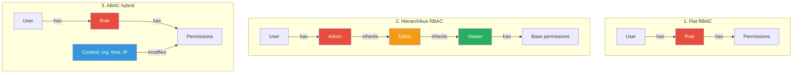

---
tags:
  - auth
  - security
  - backend
  - architecture
datum: 2026-03-06
szint: "🏗️ Builder"
kapcsolodo:
  - "[[backend/jwt|JWT]]"
  - "[[backend/clerk|Clerk]]"
  - "[[database/supabase|Supabase]]"
  - "[[backend/session-management|Session Management]]"
  - "[[frontend/nextjs|Next.js]]"
  - "[[_moc/moc-auth|MOC - Auth]]"
---

# RBAC Patterns

## Összefoglaló

A **RBAC (Role-Based Access Control)** egy hozzáférés-vezérlési modell, ahol a jogosultságokat nem közvetlenül a felhasználókhoz rendeled, hanem **szerepkörökhöz (role-okhoz)**, és a felhasználókat ezekhez a role-okhoz társítod. Ez egyszerűbbé és karbantarthatóbbá teszi a jogosultság-kezelést, különösen SaaS alkalmazásoknál.

## Miért RBAC és nem egyedi jogosultságok?

```
Egyedi jogosultságok (rossz):          RBAC (jó):
───────────────────────                ───────────────
User A → [read, write, delete]         admin role → [read, write, delete, manage_users]
User B → [read, write]                 editor role → [read, write]
User C → [read]                        viewer role → [read]
User D → [read, write, delete]
User E → [read]                        User A → admin
...100 user egyenként                  User B → editor
                                       User C, E → viewer
                                       User D → admin
```

Amikor új jogosultság kell, az egyedi modellnél minden usert végig kell nézni. RBAC-nál a role-t módosítod, és mindenki megkapja.

## A három RBAC szint



### 1. Flat RBAC — a legtöbb SaaS-nak elég

Egyszerű role-permission mapping, nincs öröklődés. A [[backend/clerk|Clerk]] `publicMetadata` alapú megoldása is ez.

### 2. Hierarchikus RBAC — ha a role-ok egymásra épülnek

Az admin mindent tud amit az editor, az editor mindent amit a viewer. Nem kell minden permission-t külön felsorolni.

### 3. ABAC hybrid — enterprise szint

Role + kontextus: "admin, de csak a saját organization-jében" vagy "editor, de csak munkaidőben".

## Implementáció: adatbázis séma

```sql
-- Alap RBAC séma (PostgreSQL / Supabase)
CREATE TABLE roles (
  id UUID PRIMARY KEY DEFAULT gen_random_uuid(),
  name TEXT NOT NULL UNIQUE,         -- 'admin', 'editor', 'viewer'
  description TEXT
);

CREATE TABLE permissions (
  id UUID PRIMARY KEY DEFAULT gen_random_uuid(),
  name TEXT NOT NULL UNIQUE,         -- 'projects:read', 'projects:write', 'users:manage'
  description TEXT
);

CREATE TABLE role_permissions (
  role_id UUID REFERENCES roles(id) ON DELETE CASCADE,
  permission_id UUID REFERENCES permissions(id) ON DELETE CASCADE,
  PRIMARY KEY (role_id, permission_id)
);

CREATE TABLE user_roles (
  user_id TEXT NOT NULL,             -- Clerk/Supabase user ID
  role_id UUID REFERENCES roles(id) ON DELETE CASCADE,
  org_id UUID,                       -- opcionális: multi-tenant
  PRIMARY KEY (user_id, role_id, org_id)
);

-- Seed data
INSERT INTO roles (name) VALUES ('admin'), ('editor'), ('viewer');
INSERT INTO permissions (name) VALUES
  ('projects:read'), ('projects:write'), ('projects:delete'),
  ('users:read'), ('users:manage'),
  ('billing:read'), ('billing:manage');

-- Admin kap mindent
INSERT INTO role_permissions (role_id, permission_id)
SELECT r.id, p.id FROM roles r CROSS JOIN permissions p WHERE r.name = 'admin';

-- Editor: read + write
INSERT INTO role_permissions (role_id, permission_id)
SELECT r.id, p.id FROM roles r, permissions p
WHERE r.name = 'editor' AND p.name IN ('projects:read', 'projects:write', 'users:read');
```

## Implementáció: Next.js middleware

```typescript
// lib/rbac.ts — permission ellenőrzés
type Permission =
  | 'projects:read' | 'projects:write' | 'projects:delete'
  | 'users:read' | 'users:manage'
  | 'billing:read' | 'billing:manage'

const ROLE_PERMISSIONS: Record<string, Permission[]> = {
  admin: [
    'projects:read', 'projects:write', 'projects:delete',
    'users:read', 'users:manage',
    'billing:read', 'billing:manage',
  ],
  editor: ['projects:read', 'projects:write', 'users:read'],
  viewer: ['projects:read', 'users:read'],
}

export function hasPermission(role: string, permission: Permission): boolean {
  return ROLE_PERMISSIONS[role]?.includes(permission) ?? false
}

export function requirePermission(role: string, permission: Permission) {
  if (!hasPermission(role, permission)) {
    throw new Error(`Missing permission: ${permission}`)
  }
}
```

```typescript
// app/api/projects/route.ts — használat
import { auth } from '@clerk/nextjs/server'
import { requirePermission } from '@/lib/rbac'

export async function DELETE(req: Request) {
  const { userId, sessionClaims } = await auth()
  if (!userId) return new Response('Unauthorized', { status: 401 })

  const role = (sessionClaims?.metadata as { role?: string })?.role ?? 'viewer'

  try {
    requirePermission(role, 'projects:delete')
  } catch {
    return new Response('Forbidden', { status: 403 })
  }

  // Projekt törlés logika...
  return new Response('Deleted', { status: 200 })
}
```

## RBAC a Clerk-ben

A [[backend/clerk|Clerk]] kétféle RBAC-ot támogat:

### 1. Egyszerű: publicMetadata role

```typescript
// Role beállítás (backend only)
await clerkClient.users.updateUserMetadata(userId, {
  publicMetadata: { role: 'admin' }
})

// Ellenőrzés
const { sessionClaims } = await auth()
const role = sessionClaims?.metadata?.role // 'admin'
```

### 2. Clerk Organizations (multi-tenant RBAC)

```typescript
// Org-szintű role — beépített Clerk feature
const { orgId, orgRole } = await auth()
// orgRole: 'org:admin' | 'org:member' — Clerk kezeli
```

> [!tip] Melyiket válaszd?
> **Egyszerű app (1 tenant):** `publicMetadata.role` — gyors, kevés kód.
> **Multi-tenant SaaS:** Clerk Organizations — beépített org-szintű role-ok, meghívó rendszer, org switcher UI.

## RBAC a Supabase-ben (RLS)

A [[database/supabase|Supabase]] Row Level Security-vel adatbázis szinten is kikényszerítheted a RBAC-ot:

```sql
-- Csak admin törölhet projektet
CREATE POLICY "Only admins can delete projects" ON projects
  FOR DELETE USING (
    EXISTS (
      SELECT 1 FROM user_roles ur
      JOIN roles r ON ur.role_id = r.id
      WHERE ur.user_id = auth.uid()::text
        AND r.name = 'admin'
    )
  );

-- Mindenki olvashat (aki be van jelentkezve)
CREATE POLICY "Authenticated users can read projects" ON projects
  FOR SELECT USING (auth.uid() IS NOT NULL);
```

## Permission naming convention

Használj **resource:action** formátumot — egyértelmű és skálázható:

```
projects:read       — projektek listázása, megtekintése
projects:write      — projekt létrehozása, szerkesztése
projects:delete     — projekt törlése
users:read          — felhasználók listázása
users:manage        — felhasználó meghívása, törlése, role módosítás
billing:read        — számlák megtekintése
billing:manage      — előfizetés módosítása, fizetési mód változtatás
```

> [!warning] Ne keverd a role-t és a permission-t
> A role egy csoport ("admin"), a permission egy konkrét művelet ("projects:delete"). A kódban mindig **permission-t ellenőrizz**, ne role-t. Így ha holnap kell egy "project_manager" role ami törölhet projektet de nem kezel usereket, csak a role-permission mappinget módosítod.

## Mikor használd / Mikor NE

**Használd:**
- SaaS alkalmazás ahol több felhasználói szint van (admin, editor, viewer)
- Multi-tenant app ahol org-onként eltérő jogosultságok kellenek
- Ha a [[backend/clerk|Clerk]] beépített RBAC-ja nem elég rugalmas

**NE használd (van jobb megoldás):**
- Egyszerű app ahol csak "bejelentkezett / nem bejelentkezett" van — RBAC overkill
- Ha Clerk Organizations pontosan azt adja amire szükséged van — ne építs sajátot
- Fine-grained per-resource jogosultságok (pl. "ez a user ezt a dokumentumot szerkesztheti") — ahhoz ABAC vagy resource-level ACL kell

## Buktatók

- **Hardcoded role check** — `if (role === 'admin')` szétszórva a kódban. Inkább permission-based check egy központi helyen
- **Role a JWT-ben, de nem frissül** — ha a [[backend/jwt|JWT]] payload-jában tárolod a role-t, a token lejáratáig a régi role marad. Megoldás: rövid lejáratú access token, vagy session-alapú megközelítés
- **Nincs default deny** — ha egy permission nincs explicit engedélyezve, az legyen tiltva. Soha ne legyen "mindent szabad hacsak nincs tiltva"
- **Super admin bypass hiánya** — legyen egy mód amivel vészhelyzetben mindent elérsz (de legyen auditálva)

## Kapcsolódó

- [[backend/jwt|JWT]] — role/permission claim-ek a token payload-ban
- [[backend/clerk|Clerk]] — managed RBAC: publicMetadata role + Organizations
- [[database/supabase|Supabase]] — RLS policy-k adatbázis-szintű RBAC kikényszerítéshez
- [[backend/session-management|Session Management]] — session-ben tárolt role adatok
- [[frontend/nextjs|Next.js]] — middleware-ben route-szintű jogosultság ellenőrzés
