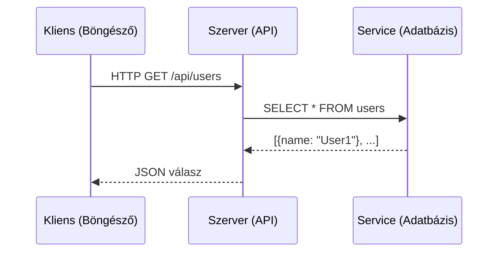

# Service és kliens kapcsolata

**Kategória:** `koncepció` (kliens-szerver architektúra)

---

## Mi az a kliens-szerver architektúra?

A webes fejlesztés alapja: **két fél beszélget egymással**. Az egyik kér (**kliens**), a másik válaszol (**szerver / service**).

**Kliens** = aki kérést küld:
- Böngésző (Chrome, Firefox) - a felhasználó gépe
- Mobil app
- Egy másik szerver (igen, egy szerver is lehet kliens!)
- CLI eszköz (`curl`, `wget`, `wrangler`)

**Szerver / Service** = aki a kérést fogadja és válaszol:
- API szerver ([[backend/hono|Hono]], [[backend/express|Express]])
- Adatbázis szerver ([[database/supabase|Supabase]], D1)
- Fájl szerver (R2, S3)
- Bármilyen process ami porton figyel

### Az analógia

```text
Étterem:
├── Kliens   = a vendég aki rendel
├── Szerver  = a pincér aki felveszi a rendelést
└── Service  = a konyha ami elkészíti az ételt

Web:
├── Kliens   = a böngésző ami fetch('/api/users')-t hív
├── Szerver  = a Hono / Express app ami a kérést fogadja
└── Service  = az adatbázis / külső API ami az adatot szolgáltatja
```

---

## Hogyan kommunikálnak?



### Kommunikációs protokollok

| Protokoll | Mire való | Példa |
|---|---|---|
| **HTTP/HTTPS** | Alap web kérések (request - response) | `fetch('/api/data')` |
| **WebSocket** | Kétirányú, állandó kapcsolat | Chat, live dashboard |
| **gRPC** | Gyors szerver-szerver kommunikáció | Microservice-ek között |

---

## Frontend vs Backend - a kliens-szerver a gyakorlatban

```text
Kliens oldal (frontend)          Szerver oldal (backend)
┌──────────────────────┐         ┌──────────────────────┐
│ React / Preact       │  HTTP   │ Hono / Express       │
│ Next.js (kliens rész)│ ────>   │ Next.js (API routes) │
│ Böngésző JS          │         │ Cloudflare Workers   │
│                      │  <───── │                      │
│ UI megjelenítése     │  JSON   │ Üzleti logika + DB   │
└──────────────────────┘         └──────────────────────┘
```

| Szempont | Kliens (frontend) | Szerver (backend) |
|---|---|---|
| **Hol fut** | Felhasználó böngészőjében | Szerveren ([[cloud/cloudflare|Cloudflare]], [[cloud/vercel|Vercel]], VPS) |
| **Nyelv** | JavaScript / TypeScript | JS/TS, Python, Go, bármi |
| **Biztonság** | Bárki látja a kódot (DevTools) | Rejtett, biztonságos |
| **Adat hozzáférés** | Csak API-n keresztül | Közvetlen DB hozzáférés |
| **Titkos kulcsok** | **SOHA** ne tedd ide | Ide valók (env változók) |

> [!warning] Gyakori hiba
> **API kulcsokat, jelszavakat, adatbázis URL-eket SOHA ne tedd a kliens oldali kódba.** A böngésző DevTools-ban bárki megnézheti. Ezek a szerver oldalra valók - env változókba (`process.env.API_KEY`).

---

## Service fogalom bővebben

A "service" szó két kontextusban fordul elő:

### 1. Service mint backend alkalmazás

Egy futó program ami kéréseket fogad - "fut és figyel":

| Példa | Parancs | Mit csinál |
|---|---|---|
| Hono API szerver | `npx wrangler dev` | Elindul, porton figyel, kéréseket fogad |
| PostgreSQL adatbázis | `docker run postgres` | Fut, porton figyel, SQL query-ket fogad |

### 2. Service mint microservice

Nagyobb rendszereknél a backend **több kis service-re** bomlik, mindegyik egy-egy felelősséggel:

```text
API Gateway (fő belépési pont)
├── User Service    -> felhasználó kezelés
├── Invoice Service -> számla kezelés
├── Email Service   -> email küldés
└── File Service    -> fájl tárolás (R2)
```

**Hogyan beszélnek egymással a service-ek?**
- [[cloud/cloudflare|Cloudflare]] Workers-ön: **Service Bindings** - a Workers-ek közvetlenül hívják egymást, hálózati hívás nélkül (ingyenes, gyors)
- Docker Compose-ban: több konténer, belső hálózaton beszélnek (service name-mel érik el egymást)
- [[cloud/railway|Railway]]-en: Private networking (`.railway.internal` cím)

---

## Mikor fontos érteni a kliens-szerver megkülönböztetést?

- **API tervezésnél:** a kliens csak azt az adatot kapja amit szabad - szűrd és validáld szerver oldalon
- **Auth-nál:** a kliens küld tokent, a szerver ellenőrzi - [[backend/jwt|JWT]], [[backend/clerk|Clerk]]
- **Hibakeresésnél:** "kliens hiba" (4xx) = a kérés rossz; "szerver hiba" (5xx) = a backend hibás
- **CORS-nál:** ha a kliens (`frontend.com`) más domainről hívja a szervert (`api.com`), kell CORS beállítás a [[backend/hono|Hono]]-ban / [[backend/express|Express]]-ben
- **Cloudflare Workers-nél:** a Worker a szerver (backend), a Pages a kliens (frontend)

---

## AI-natív fejlesztés

A kliens-szerver architektúra megértése kritikus, ha AI-val fejlesztesz - az AI-nak tudnia kell, hogy szerver vagy kliens oldali kódot generáljon. Ha nem jelzed, előfordulhat hogy API kulcsot tesz a frontend-be, vagy szerver-only kódot generál a böngészőbe.

> [!tip] Hogyan használd AI-val
> - *"Hibakeresésnél mindig add meg melyik oldalon van a probléma: kliens oldal (böngésző console, 4xx) vagy szerver oldal (API log, 5xx). Ha CORS hiba, add meg mindkét URL-t (frontend origin + API endpoint)"*
> - *"Ez szerver oldali kód (Hono Worker) - használj env változókat az API kulcsokhoz, ne hardcode-old"*
> - *"A fetch hívás kliens oldalon lesz (React komponens) - ne importálj szerver-only modult"*
