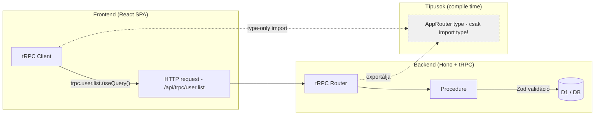

# tRPC

**Kategória:** `API` (type-safe RPC framework)
**URL:** https://trpc.io
**Ár:** Ingyenes, open source

---

## Mi ez?

A **tRPC** (TypeScript Remote Procedure Call) egy olyan könyvtár, amivel **end-to-end típusbiztos API-kat** építesz - frontend és backend között, kódgenerálás és séma duplikálás nélkül. A szerver definiálja a procedure-öket (query/mutation), a kliens automatikusan tudja a típusokat.

> [!tldr]
> **API-t építesz, de nem kell REST endpoint-okat kézzel definiálnod.** Írsz egy függvényt a szerveren, és a frontend azonnal autocomplete-tel hívja - a [[foundations/typescript-vs-python|TypeScript]] compiler garantálja, hogy a típusok egyeznek.

### A probléma amit megold

Hagyományos REST-nél a frontend és backend "nem tud egymásról":

```text
Frontend:  fetch('/api/users', { method: 'POST', body: JSON.stringify({ name: 'User' }) })
                                                         ^
                                              Ez string - semmi garancia hogy a backend
                                              mit vár, vagy mit ad vissza
```

tRPC-vel:

```text
Frontend:  trpc.user.create.mutate({ name: 'User' })
                                      ^
                          TypeScript hiba ha rossz típus!
                          Autocomplete mutatja a mezőket!
                          Return type is ismert!
```

---

## Mikor használd / Mikor NE

**Mikor jó a tRPC:**
- **TypeScript frontend + TypeScript backend** - a type sharing csak TS-TS működik
- **Monorepo** - kliens és szerver egy repoban, a típusok importálhatóak
- **Belső API-k** - a kliens és szerver te kontrollálod (nem publikus API)
- **[[backend/hono|Hono]] / Express / Next.js backend** - adaptere van mindegyikhez
- **Gyors fejlesztés** - nem kell OpenAPI/Swagger sémát karbantartani

**Mikor NE használd:**
- **Publikus API kell** - ahol külső fejlesztők hívják (REST/GraphQL jobb, dokumentálható)
- **Nem TypeScript frontend** - mobil app (Swift/Kotlin), Python kliens - REST kell
- **Egyszerű 2-3 endpoint** - overhead túl nagy a haszonhoz képest

---

## tRPC vs REST vs GraphQL

| Szempont | REST | [[backend/graphql|GraphQL]] | **tRPC** |
|---|---|---|---|
| **Típusbiztonság** | Nincs (kézi típusok) | Schema-ból generált | Automatikus (TS) |
| **Tanulási görbe** | Alacsony | Magas | Közepes |
| **Kódgenerálás kell?** | Igen (OpenAPI-TS) | Igen (codegen) | **Nem** |
| **Over/Under-fetching** | Gyakori probléma | Megoldja | Procedure-szintű |
| **Publikus API** | Ideális | Jó | Nem ajánlott |
| **Bundle size** | fetch (0kb) | Apollo ~30KB | @trpc/client ~8KB |
| **Monorepo előny** | Nincs | Nincs | **Maximális** |

> [!tip] Ökölszabály
> **Publikus API = REST** (vagy GraphQL ha komplex)
> **Belső API, TS monorepo = tRPC** (típusbiztos, gyors fejlesztés)

---

## Architektúra - hogyan működik?



**A lényeg:** A frontend **csak a típust** importálja a backendből (`import type { AppRouter }`). Futásidőben nincs szerver kód a kliensben - csak a TypeScript compiler használja a típusinformációt.

---

## tRPC v11 - mi újdonság?

A v11 a jelenlegi stabil főverzió (2025+). Főbb változások a v10-hez képest:

- **Egyszerűsített init** - `initTRPC.create()` lett a standard
- **Middleware chaining** - `.use()` láncolható procedure-okon
- **Jobb error handling** - `TRPCError` típusok, custom error formatter
- **SSE support** - Server-Sent Events subscription-ökhöz (WebSocket alternatíva)
- **Fetch adapter** - natívan működik [[cloud/cloudflare|Cloudflare]] Workers-ön, nem kell Express

---

## Core fogalmak

### 1. Router

A router csoportosítja a procedure-öket - mint egy Hono route fájl, de típusbiztos:

```typescript
import { initTRPC } from '@trpc/server'
import { z } from 'zod'

const t = initTRPC.context<Context>().create()

export const appRouter = t.router({
  user: t.router({
    list: t.procedure.query(({ ctx }) => {
      return ctx.db.select().from(users).all()
    }),
    create: t.procedure
      .input(z.object({ name: z.string().min(2), email: z.string().email() }))
      .mutation(({ ctx, input }) => {
        return ctx.db.insert(users).values(input)
      }),
  }),
})

// Ez a típus megy a frontendre
export type AppRouter = typeof appRouter
```

### 2. Procedure (query / mutation)

- **query** = adat olvasás (GET-szerű)
- **mutation** = adat módosítás (POST/PUT/DELETE-szerű)

```typescript
// Query - adat lekérés
t.procedure.query(({ ctx }) => { ... })

// Mutation - adat módosítás
t.procedure.mutation(({ ctx, input }) => { ... })

// Input validáció Zod-dal
t.procedure
  .input(z.object({ id: z.string().uuid() }))
  .query(({ input }) => {
    // input.id típusa: string - garantált!
  })
```

### 3. Context

A context az, ami minden procedure-nek elérhető - tipikusan DB kapcsolat, auth info:

```typescript
// context.ts
export async function createContext(req: Request, env: Bindings) {
  const db = drizzle(env.DB, { schema })
  const user = await getAuthUser(req, env) // JWT-ből vagy session-ből
  return { db, user, env }
}

export type Context = Awaited<ReturnType<typeof createContext>>
```

### 4. Middleware

Procedure-szintű middleware - auth ellenőrzés, logging, stb.:

```typescript
const isAuthed = t.middleware(({ ctx, next }) => {
  if (!ctx.user) throw new TRPCError({ code: 'UNAUTHORIZED' })
  return next({ ctx: { ...ctx, user: ctx.user } }) // user garantáltan nem null
})

const protectedProcedure = t.procedure.use(isAuthed)

// Használat
const appRouter = t.router({
  secret: protectedProcedure.query(({ ctx }) => {
    // ctx.user itt garantáltan létezik!
    return `Hello ${ctx.user.email}`
  }),
})
```

---

## Setup - Hono + tRPC v11 + Cloudflare Workers

### 1. Csomagok telepítése

```bash
# Szerver oldal
pnpm add @trpc/server zod

# Kliens oldal (frontend)
pnpm add @trpc/client @trpc/react-query @tanstack/react-query
```

### 2-5. Setup lépések

A teljes setup 4 rétegből áll:

| Lépés | Fájl | Lényeg |
|-------|------|--------|
| **tRPC init** | `src/trpc/init.ts` | `initTRPC.context<Context>().create()` - exportáld a `router`, `publicProcedure`, `protectedProcedure`-t |
| **Router definíció** | `src/trpc/routers/user.ts` | Procedure-ök `.query()` és `.mutation()` + [[backend/zod|Zod]] `.input()` validáció |
| **Hono mount** | `src/index.ts` | `fetchRequestHandler()` a `/api/trpc/*` path-on |
| **React kliens** | `lib/trpc.ts` | `createTRPCClient<AppRouter>()` - **csak `import type`!** |

A kliens oldalon így hívod:

```tsx
const user = await trpc.user.me.query()           // autocomplete + típusbiztos
await trpc.user.update.mutate({ vezeteknev: 'Kovacs' })  // TS hiba ha rossz mező
```

> [!warning] A legfontosabb szabály
> A frontend **csak `import type { AppRouter }`** legyen - ha `import { appRouter }` lenne, az behúzná a szerver kódot a kliens bundle-be.

---

## tRPC + Hono - melyik mit csinál?

```text
Hono (web framework)              tRPC (type-safe RPC layer)
├── HTTP kezelés                   ├── Procedure definíciók
├── Middleware (CORS, logging)     ├── Input validáció (Zod)
├── Static file serving            ├── Context (DB, auth user)
├── Auth routes (/api/auth/*)      ├── Router hierarchia
├── Health check                   └── End-to-end típusbiztonság
├── Webhook endpoints
└── tRPC mount point (/api/trpc/*)
```

> [!tip] Lényeg
> A [[backend/hono|Hono]] a "webszerver" ami HTTP-t kezel. A tRPC a "típusbiztos réteg" ami a Hono-n belül él. A Hono-nak vannak saját route-jai is (auth, health) amik nem tRPC-sek - és ez így jó.

---

## Buktatók

- **`import type` fontos** - a frontend CSAK `import type { AppRouter }` legyen, ne `import { appRouter }`. Utóbbi behúzná a szerver kódot a kliens bundle-be
- **Nem REST** - nincsenek HTTP method-ok (GET/POST/PUT/DELETE) és path-ok, minden RPC hívás. Ha REST API kell (pl. webhook-okhoz, külső integrációhoz), az maradjon sima Hono route
- **Bundle size** - `@trpc/client` ~8KB, `@tanstack/react-query` ~30KB. Ha a frontend nagyon méretkritikus, fontold meg a vanilla `trpc.client` használatát React Query nélkül
- **Error handling** - `TRPCError` code-okat használj (`UNAUTHORIZED`, `NOT_FOUND`, `BAD_REQUEST`), ne sima `throw new Error`-t. A kliens oldalon a `.error` objektumból kiolvashatod
- **Batch link** - az `httpBatchLink` több kérést egy HTTP hívásba csomagol (jó), de ha egy fail-el, mind fail-el (figyelj rá)

---

## Hasznos linkek

- **Docs:** https://trpc.io/docs
- **GitHub:** https://github.com/trpc/trpc
- **Zod:** https://zod.dev
- **tRPC + React Query:** https://trpc.io/docs/client/react
- **Fetch adapter (CF Workers):** https://trpc.io/docs/server/adapters/fetch

---

## AI-natív fejlesztés

A tRPC az egyik legjobban generálható backend pattern AI-val - a procedure-ök ismétlődő struktúrája (input Zod schema + query/mutation + context) tökéletes AI-generálásra. Claude Code-dal egy CRUD router percek alatt elkészül, teljes típusbiztonságal.

> [!tip] Hogyan használd AI-val
> - *"Generálj tRPC router-t: user CRUD (list, getById, create, update, delete) - Zod input validációval, Drizzle query-kkel, protectedProcedure-rel"*
> - *"A tRPC router Hono-n fut Cloudflare Workers-ön - fetchRequestHandler adapter kell, és a context-ben legyen a D1 DB binding"*
> - *"Adj hozzá tRPC middleware-t ami logolja a procedure hívásokat: procedure név, input, execution time"*
