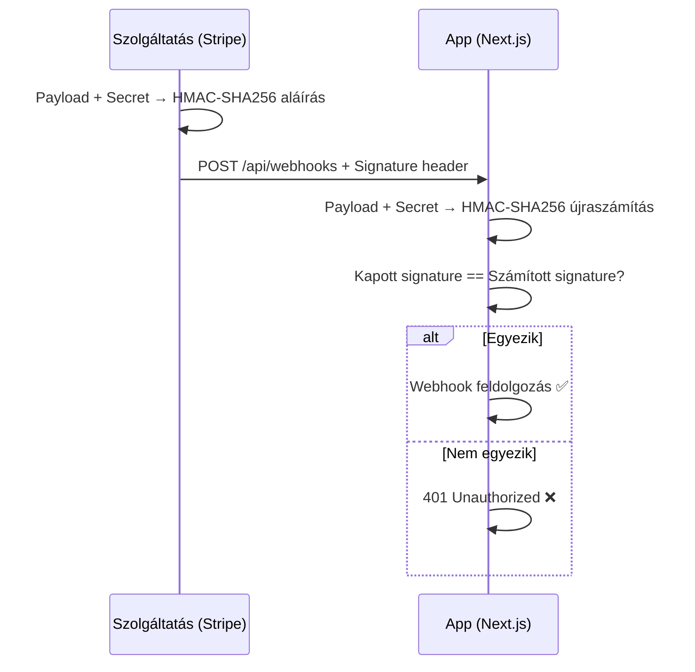

---
tags:
  - auth
  - security
  - backend
datum: 2026-03-06
szint: "🧱 Scout"
kapcsolodo:
  - "[[backend/clerk|Clerk]]"
  - "[[database/supabase|Supabase]]"
  - "[[backend/jwt|JWT]]"
  - "[[backend/oauth-2-0|OAuth 2.0]]"
  - "[[frontend/nextjs|Next.js]]"
  - "[[_moc/moc-auth|MOC - Auth]]"
---

# Webhook Verification

## Összefoglaló

Amikor egy külső szolgáltatás (Stripe, GitHub, Clerk) webhook-ot küld az alkalmazásodnak, **ellenőrizned kell**, hogy az üzenet tényleg tőlük jött — nem pedig egy támadótól, aki hamis adatokat próbál injektálni.

## Miért kritikus?

Webhook nélküli világ:

```
App → API → "Mi történt?" (polling — pazarlás)
```

Webhook-kal:

```
Szolgáltatás → App: "Valami történt!" (push — hatékony)
```

**DE:** Ha nem ellenőrzöd a küldőt, bárki küldhet hamis webhook-ot:

```
Támadó → App: "A felhasználó fizetett!" (hamis!)
```

## Hogyan működik a webhook signing?



## Implementáció szolgáltatásonként

### Stripe

```typescript
// app/api/webhooks/stripe/route.ts
import Stripe from 'stripe'

const stripe = new Stripe(process.env.STRIPE_SECRET_KEY!)
const webhookSecret = process.env.STRIPE_WEBHOOK_SECRET!

export async function POST(req: Request) {
  const body = await req.text() // RAW body kell, nem JSON!
  const sig = req.headers.get('stripe-signature')!

  let event: Stripe.Event
  try {
    event = stripe.webhooks.constructEvent(body, sig, webhookSecret)
  } catch (err) {
    console.error('Webhook signature verification failed')
    return new Response('Invalid signature', { status: 401 })
  }

  switch (event.type) {
    case 'checkout.session.completed':
      // Fizetés sikeres
      break
    case 'customer.subscription.deleted':
      // Előfizetés lemondva
      break
  }

  return new Response('OK', { status: 200 })
}
```

### Clerk (Svix)

A [[backend/clerk|Clerk]] a **Svix** könyvtárat használja webhook aláíráshoz:

```typescript
// app/api/webhooks/clerk/route.ts
import { Webhook } from 'svix'
import { WebhookEvent } from '@clerk/nextjs/server'

export async function POST(req: Request) {
  const SIGNING_SECRET = process.env.CLERK_WEBHOOK_SECRET!
  const wh = new Webhook(SIGNING_SECRET)

  const body = await req.text()
  const headers = {
    'svix-id': req.headers.get('svix-id')!,
    'svix-timestamp': req.headers.get('svix-timestamp')!,
    'svix-signature': req.headers.get('svix-signature')!,
  }

  let event: WebhookEvent
  try {
    event = wh.verify(body, headers) as WebhookEvent
  } catch (err) {
    return new Response('Invalid signature', { status: 401 })
  }

  if (event.type === 'user.created') {
    // Új felhasználó szinkronizálás DB-be
    const { id, email_addresses } = event.data
  }

  return new Response('OK', { status: 200 })
}
```

> [!tip] Raw body fontos!
> A signature verification a **nyers request body**-n alapul. Ha a framework parse-olja a JSON-t mielőtt ellenőriznéd, a signature nem fog egyezni. [[frontend/nextjs|Next.js]] App Router-ben `req.text()` használj `req.json()` helyett.

### GitHub

```typescript
import crypto from 'crypto'

function verifyGitHubWebhook(payload: string, signature: string): boolean {
  const hmac = crypto.createHmac('sha256', process.env.GITHUB_WEBHOOK_SECRET!)
  const digest = 'sha256=' + hmac.update(payload).digest('hex')
  return crypto.timingSafeEqual(Buffer.from(digest), Buffer.from(signature))
}
```

> [!warning] Timing-safe comparison
> Mindig `crypto.timingSafeEqual()`-t használj, nem `===`-t. A sima string összehasonlítás időzítés-alapú támadásnak kitett (timing attack).

## Kapcsolódó

- [[backend/clerk|Clerk]] — Svix-alapú webhook signing
- [[backend/jwt|JWT]] — hasonló aláírás koncepció, token szinten
- [[backend/oauth-2-0|OAuth 2.0]] — az auth flow másik oldala: token megszerzése
- [[frontend/nextjs|Next.js]] — App Router API route-ok ahol a webhook endpoint-ok élnek
- [[database/supabase|Supabase]] — Database webhooks (pg_net extension)
