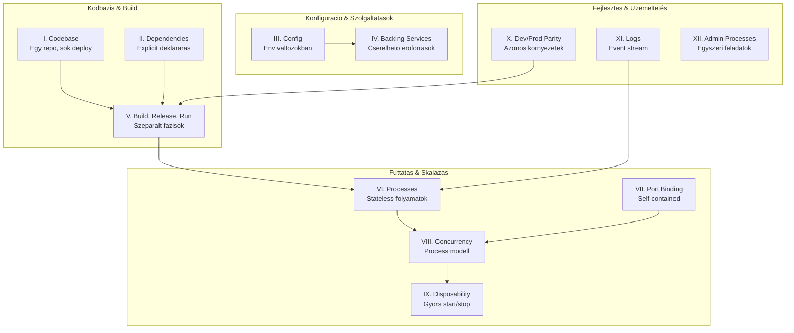

---
tags:
  - devops
  - architektura
  - cloud-native
datum: 2026-03-06
szint: "🏗️ Builder"
kapcsolodo:
  - "[[cloud/docker-alapok|Docker alapok]]"
  - "[[cloud/docker-compose|Docker Compose]]"
  - "[[cloud/railway|Railway]]"
  - "[[cloud/vercel|Vercel]]"
  - "[[database/supabase|Supabase]]"
  - "[[foundations/git-es-github|Git és GitHub]]"
  - "[[foundations/szoftverfejlesztes-alapjai|Szoftverfejlesztes alapjai]]"
  - "[[_moc/moc-deployment|MOC - Deployment]]"
---

# 12 Faktoros alkalmazás építes

A **12-Factor App** egy modszertan modern, cloud-native alkalmazások építésehez. Eredetileg a Heroku csapata irta le, de ma már minden PaaS/konténer-alapu deployment-re vonatkozik -- legyen az [[cloud/railway|Railway]], [[cloud/vercel|Vercel]] vagy saját [[cloud/docker-alapok|Docker]] setup.

A lényeg: olyan alkalmazást építs, ami **portabilis**, **skálázható**, és **konnyen deploy-olhato** bármilyen cloud környezetbe.

## Miért fontos ez?

Ha [[frontend/nextjs|Next.js]]-sel, [[database/supabase|Supabase]]-zel, [[cloud/docker-alapok|Docker]]-rel dolgozol, akkor már most is használsz 12-factor elveket -- csak lehet, hogy nem tudatosan. Ha ismered az elveket:
- Nem ragadsz be egy platformba (vendor lock-in)
- A deploy-ok kiszamithatoak lesznek
- A csapatmunka egyszerűbb lesz
- Könnyebb skálázni, ha no a forgalom

## A 12 faktor attekintese



## I. Codebase -- Egy kódbázis, sok deploy

**Mi ez?** Egy alkalmazásnak egy [[foundations/git-es-github|Git]] repoja van. Ebbol az egy repobol jon letre minden deploy (staging, production, preview).

**Miért fontos?** Ha több repo van ugyanahhoz az apphoz, az nem egy app -- az egy distributed system. Ha egy repoban több app van, az monorepo (ami lehet OK, de akkor is app-onkent kell kezelni).

**Gyakorlati példa:**
```
my-app/                    # Egy repo
├── src/
├── Dockerfile
├── package.json
└── .env.example

# Deploy-ok:
# - production: main branch → Railway
# - staging: develop branch → Railway preview
# - preview: PR-enkent → Vercel preview
```

> [!tip] Next.js + Vercel
> A [[cloud/vercel|Vercel]] automatikusan minden PR-hez csinál preview deploy-t ugyanabbol a repobol. Ez pont a 12-factor I. elvet követi.

## II. Dependencies -- Explicit deklararas és izolalas

**Mi ez?** Minden dependency explicit modon deklaralva van (pl. `package.json`, `requirements.txt`). Az app soha nem épít "rendszerszintu" csomagokra, amik "majd ott lesznek".

**Miért fontos?** Ha valaki clone-olja a repot, `npm install` utan mindennek működnie kell. Nincs "nálam működik" probléma.

**Gyakorlati példa:**
```json
// package.json - EXPLICIT dependency-k
{
  "dependencies": {
    "next": "^14.0.0",
    "@supabase/supabase-js": "^2.39.0",
    "drizzle-orm": "^0.29.0"
  },
  "devDependencies": {
    "typescript": "^5.3.0"
  }
}
```

```dockerfile
# Dockerfile - rendszerszintu dependency-k is explicit
FROM node:20-alpine
# Ha kell nativ csomag, IDE is deklaraljuk:
RUN apk add --no-cache libc6-compat
WORKDIR /app
COPY package.json package-lock.json ./
RUN npm ci
```

> [!warning] Anti-pattern
> Ne feltetelezd, hogy a szerveren lesz `ffmpeg`, `imagemagick`, vagy bármi mas. Ha kell, tedd a `Dockerfile`-ba vagy a `package.json`-be.

## III. Config -- Konfigurácio environment változókban

**Mi ez?** Minden, ami környezetenkent valtozik (DB connection string, API kulcsok, feature flagek) environment valtozóban van, NEM a kódban.

**Miért fontos?** Ugyanaz a kod fut dev-ben, staging-en és production-ben. Csak a config valtozik.

**Gyakorlati példa:**
```bash
# .env.local (development)
DATABASE_URL=postgresql://localhost:5432/myapp_dev
NEXT_PUBLIC_SUPABASE_URL=http://localhost:54321
SUPABASE_SERVICE_ROLE_KEY=eyJhbGci...local

# Railway production-ben ezek a Dashboard-on vannak beallitva
# Vercel-en a Project Settings > Environment Variables alatt
```

```typescript
// Helyes: env-bol olvasunk
const supabase = createClient(
  process.env.NEXT_PUBLIC_SUPABASE_URL!,
  process.env.NEXT_PUBLIC_SUPABASE_ANON_KEY!
)

// HELYTELEN: hardcoded URL
const supabase = createClient(
  "https://xyz.supabase.co",  // NE CSINALD!
  "eyJhbGci..."               // NE CSINALD!
)
```

> [!tip] Litmus teszt
> Ha a kódbázisdat most open source-olnad, kiszivargognak titkok? Ha igen, nem követed a III. faktort.

## IV. Backing Services -- Csatolhato erőforrások

**Mi ez?** Backing service minden, amit az app hálózaton keresztul használ: adatbázis ([[database/supabase|Supabase]]), cache (Redis), email (SendGrid), file storage (S3). Ezeket **cserelhetonek** kell kezelni.

**Miért fontos?** Ha a [[database/supabase|Supabase]] DB-d meghal, at kell tudnod allni egy másikra ENV változo cserevel -- kodmodositas nelkul.

**Gyakorlati példa:**
```bash
# Supabase-rol atallas self-hosted PostgreSQL-re:
# Regi:
DATABASE_URL=postgresql://db.xyz.supabase.co:5432/postgres
# Uj:
DATABASE_URL=postgresql://myserver:5432/postgres
# A kodban SEMMI nem valtozik!
```

```yaml
# docker-compose.yml - backing service-ek
services:
  app:
    build: .
    environment:
      - DATABASE_URL=postgresql://db:5432/myapp
      - REDIS_URL=redis://cache:6379
  db:
    image: postgres:16
  cache:
    image: redis:7-alpine
```

## V. Build, Release, Run -- Szigoruan szeparalt fazisok

**Mi ez?** Harom kulonaallo fazis:
1. **Build** -- kod + dependency-k -> futtatható artifact (Docker image, Next.js build)
2. **Release** -- build artifact + config (env vars) = release
3. **Run** -- a release futtatasa

**Miért fontos?** Nem szabad production-ben `git pull && npm run build`-ot csinálni. A build egyszer tortenik, és az artifact megy minden környezetbe.

**Gyakorlati példa:**
```dockerfile
# Build fazis
FROM node:20-alpine AS builder
WORKDIR /app
COPY . .
RUN npm ci && npm run build

# Run fazis - csak a build output kell
FROM node:20-alpine AS runner
WORKDIR /app
COPY --from=builder /app/.next/standalone ./
COPY --from=builder /app/public ./public
CMD ["node", "server.js"]
```

> [!info] Railway / Vercel
> Mind a [[cloud/railway|Railway]], mind a [[cloud/vercel|Vercel]] automatikusan szetvalasztja a build és run fazist. A [[cloud/railway|Railway]] Nixpacks-et, a [[cloud/vercel|Vercel]] saját builder-t használ.

## VI. Processes -- Stateless folyamatok

**Mi ez?** Az alkalmazás egy vagy több **stateless** (állapotmentes) process-kent fut. Minden tartos adat backing service-ben van (DB, Redis, S3).

**Miért fontos?** Ha az app process meghal és ujraindul, semmi nem veszik el. Ha ket instance fut, mindketto ugyanazt az adatot látja.

**Gyakorlati példa:**
```typescript
// HELYES: session adatok DB-ben / Redis-ben
// A Supabase Auth ezt automatikusan kezeli

// HELYTELEN: in-memory session store
const sessions = new Map() // Ez ELVESZ restart-kor!

// HELYTELEN: fajlba iras a szerveren
fs.writeFileSync('/tmp/upload.jpg', file) // Ez ELVESZ restart-kor!
// HELYES: Supabase Storage-ba vagy S3-ba tolteni
```

> [!warning] Next.js ISR gotcha
> A Next.js ISR (Incremental Static Regeneration) cache alapbol fájlrendszerre ir. Több instance eseten ez problémas -- ilyenkor Redis cache adapter kell, vagy egyetlen instance.

## VII. Port Binding -- Self-contained szolgáltatas

**Mi ez?** Az alkalmazás saját maga bind-ol egy portra és figyel rajta. Nem kell külső webszerver (Apache, nginx) az app ele.

**Gyakorlati példa:**
```javascript
// Next.js automatikusan bind-ol a 3000-es portra
// Railway / Docker eseten a PORT env var-t hasznald:
const port = process.env.PORT || 3000
```

```dockerfile
# Dockerfile
EXPOSE 3000
CMD ["node", "server.js"]
# A Railway automatikusan beallitja a PORT-ot
```

## VIII. Concurrency -- Skálázas process modellel

**Mi ez?** Skálázas ugy tortenik, hogy **több process-t** indítasz, nem ugy, hogy egy process-nek adsz több RAM-ot/CPU-t.

**Gyakorlati példa:**
```yaml
# Railway-n: tobb instance (horizontal scaling)
# docker-compose-ban:
services:
  web:
    build: .
    deploy:
      replicas: 3  # 3 peldany fut
```

> [!tip] Vercel és serverless
> A [[cloud/vercel|Vercel]] serverless function-okkel automatikusan horizontalisan skáláz. Minden request kulon function instance-ban fut -- ez a VIII. faktor tokeletes megvalósítasa.

## IX. Disposability -- Gyors indulas, kimeletes leallas

**Mi ez?** A process-eknek gyorsan kell indulniuk és gracefully kell leallniuk (SIGTERM kezeles). Bármikor eldobhatok és ujraindithatók.

**Gyakorlati példa:**
```typescript
// Graceful shutdown kezeles
process.on('SIGTERM', async () => {
  console.log('SIGTERM received, shutting down gracefully...')
  // Befejezzuk a folyamatban levo request-eket
  server.close()
  // DB connection lezarasa
  await db.end()
  process.exit(0)
})
```

```dockerfile
# Dockerfile - gyors startup
FROM node:20-alpine  # Alpine = kisebb image = gyorsabb pull
# Multi-stage build = kisebb final image
```

## X. Dev/Prod Parity -- Azonos dev és prod környezet

**Mi ez?** Minimalizald a különbségeket development, staging és production kozott. Ugyanaz a DB engine, ugyanaz az OS, ugyanazok a tool-ok.

**Miért fontos?** "Nálam működik" szindroma elkerulese.

**Gyakorlati példa:**
```yaml
# docker-compose.yml - dev kornyezet UGYANAZT a DB-t hasznalja
services:
  db:
    image: postgres:16   # Ugyanaz, mint production-ben
    # NE hasznalj SQLite-ot dev-ben, ha prod-ban Postgres van!

  app:
    build: .
    volumes:
      - .:/app           # Hot reload dev-ben
    environment:
      - DATABASE_URL=postgresql://db:5432/myapp
```

> [!tip] Supabase CLI
> A `supabase start` parancs lokálisan indít egy teljes [[database/supabase|Supabase]] stack-et (Postgres, Auth, Storage, Edge Functions). Ez tokeletes dev/prod parity a Supabase-hez.

## XI. Logs -- Event stream-kent kezeles

**Mi ez?** Az app NEM foglalkozik log fájlokkal, rotálassal, tárolással. Egyszerűen stdout/stderr-re ir, és a platform (Railway, Docker, Vercel) kezeli.

**Gyakorlati példa:**
```typescript
// HELYES: stdout-ra iras
console.log('User signed up', { userId, email })
console.error('Payment failed', { orderId, error })

// HELYTELEN: fajlba iras
fs.appendFileSync('/var/log/app.log', message) // NE!

// Strukturalt logging (ajanlott production-ben)
import pino from 'pino'
const logger = pino({ level: 'info' })
logger.info({ userId, action: 'signup' }, 'User signed up')
```

> [!info] Platform log kezeles
> - [[cloud/railway|Railway]]: Dashboard > Deployments > Logs (automatikusan gyujti a stdout-ot)
> - [[cloud/vercel|Vercel]]: Vercel Log Drains (kuldheted Datadog-ba, Axiom-ba)
> - [[cloud/docker-alapok|Docker]]: `docker logs <container>` / `docker compose logs`

## XII. Admin Processes -- Egyszeri feladatok kulon futtatasa

**Mi ez?** Adminisztrativ feladatok (DB migration, script futtatas, REPL) ugyanabban a környezetben futnak, mint az app, de **egyszeri process-kent**.

**Gyakorlati példa:**
```bash
# Migration futtatas - ugyanaz a kod, ugyanaz a config
npx drizzle-kit migrate  # vagy: npx prisma migrate deploy

# Railway-n:
railway run npx drizzle-kit migrate

# Docker-ben:
docker compose exec app npx drizzle-kit migrate

# Seed script:
docker compose exec app node scripts/seed.ts
```

> [!warning] Ne futtasd az app startup-jaban
> A migration-oket NE az app indítasakor futtasd (pl. `CMD npm run migrate && npm start`). Futtasd kulon, a deploy pipeline reszeként.

## Összefoglaló táblazat

| # | Faktor | Lényeg | Eszkoz/Példa |
|---|--------|--------|--------------|
| I | Codebase | Egy repo, sok deploy | [[foundations/git-es-github|Git és GitHub]], monorepo |
| II | Dependencies | Explicit deklararas | `package.json`, `Dockerfile` |
| III | Config | Env változókban | `.env`, [[cloud/railway|Railway]] vars |
| IV | Backing Services | Cserelheto erőforrások | [[database/supabase|Supabase]], Redis, S3 |
| V | Build, Release, Run | Szeparalt fazisok | [[cloud/docker-alapok|Docker]] multi-stage, CI/CD |
| VI | Processes | Stateless | Ne tarold memoriaban az állapotot |
| VII | Port Binding | Self-contained | `PORT` env var |
| VIII | Concurrency | Horizontalis skálázas | Replicas, serverless |
| IX | Disposability | Gyors start/stop | SIGTERM, Alpine image |
| X | Dev/Prod Parity | Azonos környezetek | [[cloud/docker-compose|Docker Compose]], Supabase CLI |
| XI | Logs | Stdout stream | `console.log`, pino |
| XII | Admin Processes | Egyszeri task-ok | `railway run`, `docker exec` |

## Mikor használd / Mikor NE

### Mikor használd
- **Cloud deploy** (Railway, Vercel, AWS, GCP) -- a 12-factor erre lett kitalalva
- **Konténerizalt app** -- Docker termeszetesen tamogatja ezeket az elveket
- **Csapatmunka** -- ha többen dolgoztok egy projekten
- **Skálázando alkalmazás** -- ha a forgalom nohet
- **Microservice-ek** -- mindegyik service kulon 12-factor app

### Mikor NE eröltesd
- **Egyszeri script** -- egy seed script-nek nem kell 12-factor-nak lennie
- **Desktop alkalmazás** -- nem web service, mas szabalyok vonatkoznak ra
- **Prototipus / hackathon** -- először működjon, utána refaktoralj
- **Stateful alkalmazás** (pl. game server) -- a VI. faktor (stateless) nem mindig alkalmazhato, de a többi 11 igen

> [!tip] Pragmatikus megkozelites
> Nem kell mind a 12 faktort egyszerre bevezetni. Kezdd a legfontosabbakkal:
> 1. **III. Config** -- env változók használata (azonnal megvalósítható)
> 2. **II. Dependencies** -- explicit deklararas (valószinuleg már csinálod)
> 3. **V. Build, Release, Run** -- Docker multi-stage build
> 4. **X. Dev/Prod Parity** -- Docker Compose a fejleszteshez

## Kapcsolodo jegyzeteim

- [[cloud/docker-alapok|Docker alapok]] -- konténerizacio alapjai
- [[cloud/docker-compose|Docker Compose]] -- multi-service fejlesztoi környezet
- [[cloud/railway|Railway]] -- PaaS deploy
- [[cloud/vercel|Vercel]] -- frontend/fullstack deploy
- [[database/supabase|Supabase]] -- backing service (DB, Auth, Storage)
- [[foundations/git-es-github|Git és GitHub]] -- verziókezeles, I. faktor
- Env változók Next.js-ben -- III. faktor Next.js-ben
- [[foundations/szoftverfejlesztes-alapjai|Szoftverfejlesztes alapjai]] -- a teljes fejlesztesi workflow ami ezekre az elvekre epul
- [[_moc/moc-deployment|MOC - Deployment]]
