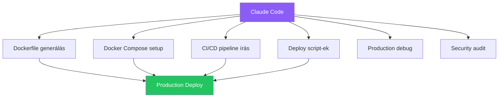

---
tags:
  - ai
  - deployment
  - devops
  - automation
datum: 2026-03-06
szint: "🏗️ Builder"
kapcsolodo:
  - "[[toolbox/ai-first-fejlesztoi-workflow|AI-first fejlesztői workflow]]"
  - "[[toolbox/claude-code-projekt-setup|Claude Code projekt setup]]"
  - "[[cloud/ci-cd-pipelines|CI/CD Pipelines]]"
  - "[[cloud/docker-alapok|Docker alapok]]"
  - "[[cloud/docker-compose|Docker Compose]]"
  - "[[cloud/deployment-checklist|Deployment checklist]]"
  - "[[_moc/moc-deployment|MOC - Deployment]]"
---

# AI-assisted Deployment

## Összefoglaló

Claude Code nemcsak kódot ír -- deploy scriptek, Dockerfile-ok, [[cloud/ci-cd-pipelines|CI/CD pipeline]]-ok és infrastruktúra konfigurációk generálására is használhatod. Ez a jegyzet bemutatja hogyan automatizáld a deployment-et AI segítségével, az [[toolbox/ai-first-fejlesztoi-workflow|AI-first fejlesztői workflow]] elveit követve.

## Mire használd Claude Code-ot deploy-nál?



## 1. Dockerfile generálás

Ahelyett hogy kézzel írnál Dockerfile-t, add meg Claude Code-nak a kontextust:

```
Prompt: "Írj production-ready Dockerfile-t ehhez a Next.js projekthez.
Használj multi-stage build-et, non-root user-t, és optimalizáld a layer cache-t."
```

**Claude Code kimenete:**

```dockerfile
# === Dependencies ===
FROM node:20-alpine AS deps
WORKDIR /app
COPY package.json package-lock.json ./
RUN npm ci --omit=dev

# === Build ===
FROM node:20-alpine AS builder
WORKDIR /app
COPY --from=deps /app/node_modules ./node_modules
COPY . .
RUN npm run build

# === Production ===
FROM node:20-alpine AS runner
WORKDIR /app

# Non-root user (security)
RUN addgroup --system --gid 1001 nodejs
RUN adduser --system --uid 1001 nextjs

COPY --from=builder /app/public ./public
COPY --from=builder --chown=nextjs:nodejs /app/.next/standalone ./
COPY --from=builder --chown=nextjs:nodejs /app/.next/static ./.next/static

USER nextjs
EXPOSE 3000
ENV PORT=3000 NODE_ENV=production

CMD ["node", "server.js"]
```

> [!tip] Mindig reviewzd az AI-generált Dockerfile-t
> Ellenőrizd: van-e `.dockerignore`? A `node_modules` és `.env` nem kerül bele az image-be? A portok helyesek? A [[cloud/deployment-checklist|Deployment checklist]] segít ebben.

## 2. Docker Compose infrastruktúra

Komplex [[cloud/docker-compose|Docker Compose]] stack-et is generáltathatsz:

```
Prompt: "Írj docker-compose.yml-t a következő stack-hez:
- Next.js app (port 3000)
- PostgreSQL 16 adatbázis
- Redis cache
- Traefik reverse proxy automatikus SSL-lel
- Minden service legyen a proxy hálózaton"
```

**Claude Code kimenete:**

```yaml
services:
  traefik:
    image: traefik:v3.0
    ports:
      - "80:80"
      - "443:443"
    volumes:
      - /var/run/docker.sock:/var/run/docker.sock:ro
      - ./traefik.yml:/traefik.yml:ro
      - ./acme.json:/acme.json
    networks:
      - proxy

  app:
    build: .
    environment:
      - DATABASE_URL=postgresql://postgres:${DB_PASSWORD}@db:5432/myapp
      - REDIS_URL=redis://cache:6379
    depends_on:
      db:
        condition: service_healthy
    labels:
      - "traefik.enable=true"
      - "traefik.http.routers.app.rule=Host(`myapp.com`)"
      - "traefik.http.routers.app.tls.certresolver=letsencrypt"
    networks:
      - proxy
      - internal

  db:
    image: postgres:16-alpine
    environment:
      - POSTGRES_PASSWORD=${DB_PASSWORD}
      - POSTGRES_DB=myapp
    volumes:
      - postgres_data:/var/lib/postgresql/data
    healthcheck:
      test: ["CMD-SHELL", "pg_isready -U postgres"]
      interval: 5s
      timeout: 5s
      retries: 5
    networks:
      - internal

  cache:
    image: redis:7-alpine
    networks:
      - internal

volumes:
  postgres_data:

networks:
  proxy:
    external: true
  internal:
```

## 3. CI/CD pipeline generálás

```
Prompt: "Írj GitHub Actions CI/CD pipeline-t:
- Push to main → build + test + deploy Railway-re
- PR → lint + type check + test (deploy nem kell)
- Cache-elj npm dependency-ket"
```

**Claude Code kimenete:**

```yaml
# .github/workflows/ci-cd.yml
name: CI/CD

on:
  push:
    branches: [main]
  pull_request:
    branches: [main]

jobs:
  quality:
    runs-on: ubuntu-latest
    steps:
      - uses: actions/checkout@v4
      - uses: actions/setup-node@v4
        with:
          node-version: 20
          cache: 'npm'

      - run: npm ci
      - run: npm run lint
      - run: npx tsc --noEmit
      - run: npm test

  deploy:
    needs: quality
    if: github.ref == 'refs/heads/main' && github.event_name == 'push'
    runs-on: ubuntu-latest
    steps:
      - uses: actions/checkout@v4

      - name: Deploy to Railway
        uses: bervProject/railway-deploy@main
        with:
          railway_token: ${{ secrets.RAILWAY_TOKEN }}
          service: my-app
```

## 4. Deploy scriptek automatizálása

### Egyszerű VPS deploy script

```
Prompt: "Írj deploy scriptet ami:
1. Lokálisan buildeli a Docker image-et
2. Push-olja a GitHub Container Registry-be
3. SSH-val a szerveren pull-olja és újraindítja"
```

```bash
#!/bin/bash
# deploy.sh — automatizált VPS deploy
set -euo pipefail

APP_NAME="myapp"
REGISTRY="ghcr.io/myorg/$APP_NAME"
SERVER="myserver"  # ~/.ssh/config-ban definiálva
VERSION=$(git rev-parse --short HEAD)

echo "=== Build: $REGISTRY:$VERSION ==="
docker build -t "$REGISTRY:$VERSION" -t "$REGISTRY:latest" .

echo "=== Push ==="
docker push "$REGISTRY:$VERSION"
docker push "$REGISTRY:latest"

echo "=== Deploy to $SERVER ==="
ssh "$SERVER" << EOF
    docker pull $REGISTRY:latest
    cd /opt/$APP_NAME
    docker compose down
    docker compose up -d
    echo "Deploy kész: $VERSION"
EOF

echo "=== Health check ==="
sleep 5
if curl -sf "https://myapp.com/health" > /dev/null; then
    echo "App healthy!"
else
    echo "HIBA: App nem válaszol!"
    exit 1
fi
```

## 5. Production debugging

Ha valami elromlik, Claude Code segít diagnosztizálni:

```
Prompt: "Ez a hibaüzenet jön a Railway logból:
[paste log output]
Mi okozhatja és hogyan javítsam?"
```

```
Prompt: "A Docker container folyamatosan restart-ol.
docker logs output: [paste]
docker inspect: [paste]
Mi a probléma?"
```

```
Prompt: "Az app 502-t ad Nginx mögött.
nginx error.log: [paste]
Mi a gond?"
```

## Claude Code deploy workflow

### CLAUDE.md kiegészítés deploy-hoz

A [[toolbox/claude-code-projekt-setup|Claude Code projekt setup]] CLAUDE.md fájljába add hozzá a deploy kontextust:

```markdown
## Deploy
- Platform: Railway (backend) + Vercel (frontend)
- CI/CD: GitHub Actions (.github/workflows/ci.yml)
- Docker: multi-stage build, node:20-alpine base
- Env változók: Railway Dashboard-on, SOHA nem a kódban
- Deploy flow: git push main → CI tests → auto-deploy
```

### Hasznos promptok

| Feladat | Prompt |
|---------|--------|
| Dockerfile | "Írj production Dockerfile-t, multi-stage, non-root user" |
| Docker Compose | "Docker Compose stack: app + DB + Redis + Traefik" |
| CI/CD | "GitHub Actions: test on PR, deploy on main push" |
| Deploy script | "Bash deploy script: build, push registry, SSH deploy" |
| Debug | "Railway log hiba: [paste]. Mi a probléma?" |
| Security | "Van security vulnerability ebben a Docker setup-ban?" |
| Rollback | "Rollback script az előző Docker image-re" |

> [!warning] Ne bízz vakon az AI-generált infra konfigban
> Mindig nézd át:
> - **Secrets** nem kerültek-e a kódba
> - **Portok** helyesek-e
> - **Volume-ok** megfelelőek-e (adat ne vesszen el)
> - **Hálózat** biztonságos-e (nem publikus ami nem kell)
> Használd a [[cloud/deployment-checklist|Deployment checklist]]-et minden deploy előtt.

## Mikor használd / Mikor NE

**Használd:**
- Dockerfile, Docker Compose generálás
- CI/CD pipeline írás / módosítás
- Deploy script automatizálás
- Production hiba diagnosztizálás
- Nginx / Traefik konfig generálás

**NE használd (kockázatos):**
- Titkos kulcsok kezelése -- soha ne adj secret-et Claude Code-nak
- Éles adatbázis migration -- mindig reviewzd és teszteld staging-en
- Firewall szabályok -- egy rossz szabály kizárhat a szerverről

## Kapcsolódó

- [[toolbox/ai-first-fejlesztoi-workflow|AI-first fejlesztői workflow]] — hogyan delegálj AI-nak hatékonyan
- [[toolbox/claude-code-projekt-setup|Claude Code projekt setup]] — CLAUDE.md és projekt konfiguráció
- [[cloud/ci-cd-pipelines|CI/CD Pipelines]] — automatikus build és deploy pipeline-ok
- [[cloud/docker-alapok|Docker alapok]] — konténerizáció alapjai
- [[cloud/docker-compose|Docker Compose]] — multi-service setup
- [[cloud/deployment-checklist|Deployment checklist]] — deploy előtti ellenőrző lista
