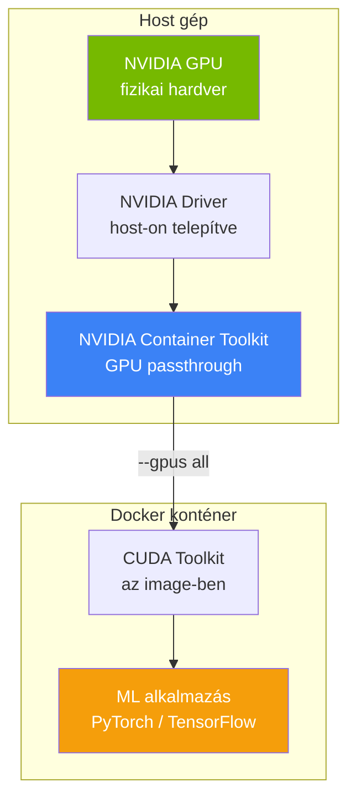

---
tags:
  - docker
  - ml
  - devops
datum: 2026-03-06
szint: "🏗️ Builder"
kapcsolodo:
  - "[[cloud/docker-alapok|Docker alapok]]"
  - "[[cloud/docker-compose|Docker Compose]]"
  - "[[foundations/machine-learning-alapok|Machine Learning alapok]]"
  - "[[toolbox/dev-containers|Dev Containers]]"
  - "[[_moc/moc-docker|MOC - Docker]]"
---

# AI fejlesztői környezet Dockerben

## Összefoglaló

Ha [[foundations/machine-learning-alapok|Machine Learning]] modelleket fejlesztesz vagy futtatsz, a környezet felállítása az egyik legnagyobb kihívás: CUDA driverek, Python verziók, PyTorch/TensorFlow verziók -- ezek mind össze kell hogy passzoljanak. A Docker ezt megoldja: **egy image-ben benne van minden**, és bárhol ugyanúgy fut. GPU passthrough-val a konténer közvetlenül használja a host GPU-ját.

## Miért Docker ML-hez?

```
Natív telepítés:
  Python 3.11 + CUDA 12.2 + cuDNN 8.9 + PyTorch 2.3 + numpy + ...
  → 2 óra setup, "nálam működik" probléma, verzió conflict-ok

Docker:
  docker run --gpus all pytorch/pytorch:2.3.0-cuda12.1-cudnn8-runtime python train.py
  → 1 parancs, mindenhol ugyanaz
```

## Architektúra



**A lényeg:** a GPU driver a host gépen van, a CUDA toolkit és az ML framework az image-ben. A NVIDIA Container Toolkit köti össze a kettőt.

## GPU passthrough setup

### 1. NVIDIA Container Toolkit telepítése (host-on)

```bash
# Ubuntu / Debian
curl -fsSL https://nvidia.github.io/libnvidia-container/gpgkey | \
  sudo gpg --dearmor -o /usr/share/keyrings/nvidia-container-toolkit-keyring.gpg

curl -s -L https://nvidia.github.io/libnvidia-container/stable/deb/nvidia-container-toolkit.list | \
  sed 's#deb https://#deb [signed-by=/usr/share/keyrings/nvidia-container-toolkit-keyring.gpg] https://#g' | \
  sudo tee /etc/apt/sources.list.d/nvidia-container-toolkit.list

sudo apt-get update
sudo apt-get install -y nvidia-container-toolkit
sudo nvidia-ctk runtime configure --runtime=docker
sudo systemctl restart docker
```

### 2. GPU tesztelése konténerben

```bash
# Működik-e a GPU passthrough?
docker run --rm --gpus all nvidia/cuda:12.2.0-base-ubuntu22.04 nvidia-smi

# Elvárt output: GPU info, CUDA verzió, memória
```

### 3. PyTorch konténer GPU-val

```bash
docker run --gpus all -it \
  -v $(pwd):/workspace \
  pytorch/pytorch:2.3.0-cuda12.1-cudnn8-runtime \
  python -c "import torch; print(f'GPU: {torch.cuda.is_available()}, Device: {torch.cuda.get_device_name(0)}')"
```

## ML fejlesztői környezet Docker Compose-szal

```yaml
# docker-compose.yml
services:
  ml:
    build: .
    volumes:
      - .:/workspace
      - models:/models        # Betanított modellek perzisztens tárolása
      - datasets:/datasets    # Dataset-ek ne töltsék le újra
    deploy:
      resources:
        reservations:
          devices:
            - driver: nvidia
              count: all       # Összes GPU, vagy "1" ha specifikus
              capabilities: [gpu]
    environment:
      - NVIDIA_VISIBLE_DEVICES=all
    ports:
      - "8888:8888"           # Jupyter
      - "6006:6006"           # TensorBoard
      - "8000:8000"           # Model serving

volumes:
  models:
  datasets:
```

```dockerfile
# Dockerfile
FROM pytorch/pytorch:2.3.0-cuda12.1-cudnn8-runtime

WORKDIR /workspace

# Rendszer dependency-k
RUN apt-get update && apt-get install -y --no-install-recommends \
    git curl && \
    rm -rf /var/lib/apt/lists/*

# Python dependency-k
COPY requirements.txt .
RUN pip install --no-cache-dir -r requirements.txt

# Non-root user (biztonsági best practice)
RUN useradd -m -u 1000 mluser
USER mluser
```

> [!tip] Volume a modelleknek és dataset-eknek
> ML modell fájlok (`.pt`, `.onnx`) és dataset-ek gigabyte méretűek lehetnek. Docker volume-ba tedd, ne az image-be -- így nem kell minden build-nél újra letölteni.

## Model serving konténerizálva

Amikor a betanított modellt production-ben szeretnéd futtatni (inference), a legegyszerűbb megoldás egy REST API konténerbe csomagolva:

### FastAPI + PyTorch példa

```python
# serve.py
from fastapi import FastAPI, UploadFile
import torch
from PIL import Image
from torchvision import transforms

app = FastAPI()
model = torch.jit.load("/models/model_scripted.pt")

transform = transforms.Compose([
    transforms.Resize((224, 224)),
    transforms.ToTensor(),
])

@app.post("/predict")
async def predict(file: UploadFile):
    image = Image.open(file.file).convert("RGB")
    tensor = transform(image).unsqueeze(0)

    with torch.no_grad():
        output = model(tensor)
        prediction = torch.argmax(output, dim=1).item()

    return {"prediction": prediction, "confidence": float(output.max())}

@app.get("/health")
async def health():
    return {"status": "ok", "gpu": torch.cuda.is_available()}
```

```dockerfile
# Dockerfile.serve
FROM pytorch/pytorch:2.3.0-cuda12.1-cudnn8-runtime

WORKDIR /app
COPY requirements-serve.txt .
RUN pip install --no-cache-dir -r requirements-serve.txt

COPY serve.py .

RUN useradd -m -u 1000 appuser
USER appuser

EXPOSE 8000
CMD ["uvicorn", "serve:app", "--host", "0.0.0.0", "--port", "8000"]
```

```yaml
# docker-compose.yml
services:
  model-api:
    build:
      context: .
      dockerfile: Dockerfile.serve
    deploy:
      resources:
        reservations:
          devices:
            - driver: nvidia
              count: 1
              capabilities: [gpu]
    volumes:
      - models:/models:ro      # Read-only: a modellt csak olvassa
    ports:
      - "8000:8000"
    restart: unless-stopped
    healthcheck:
      test: ["CMD", "curl", "-f", "http://localhost:8000/health"]
      interval: 30s
      timeout: 5s
      retries: 3

volumes:
  models:
```

## CPU-only fallback

Nem minden szerveren van GPU. A kódod kezelje mindkét esetet:

```python
device = torch.device("cuda" if torch.cuda.is_available() else "cpu")
model = model.to(device)
tensor = tensor.to(device)
```

```yaml
# docker-compose.yml -- CPU-only verzió (nincs deploy.resources.reservations)
services:
  model-api:
    build: .
    ports:
      - "8000:8000"
    # Nem kell GPU szekció -- automatikusan CPU-n fut
```

## Mikor használd / Mikor NE

**Használd:**
- ML modelleket fejlesztesz vagy futtatsz GPU-val
- Reprodukálható training környezet kell (CUDA + driver verziók pinelve)
- Model serving-et konténerben akarod deployolni
- Csapatban dolgozol és mindenkinél ugyanaz az ML stack kell

**NE használd:**
- Egyszerű script-eket futtatsz, ami nem igényel GPU-t
- Csak inference kell, és van managed megoldás (AWS SageMaker, GCP Vertex AI)
- A modell elég kicsi hogy CPU-n is gyorsan fut -- felesleges a GPU setup overhead

> [!warning] GPU szerver költség
> GPU-s szerver (pl. NVIDIA A100) drága: havi $1000+ cloud-ban. Fejlesztéshez és kisebb inference-hez egy NVIDIA T4 vagy RTX 4060 is elég, és lényegesen olcsóbb. Lokális gépen a saját GPU-d ingyenes, de a training hosszabb lehet.

## Kapcsolódó

- [[cloud/docker-alapok|Docker alapok]] -- konténerek és image-ek alapjai
- [[cloud/docker-compose|Docker Compose]] -- multi-service ML stack kezelése
- [[foundations/machine-learning-alapok|Machine Learning alapok]] -- ML fogalmak, training, inference
- [[toolbox/dev-containers|Dev Containers]] -- fejlesztői környezet konténerben
- [[_moc/moc-docker|MOC - Docker]]
