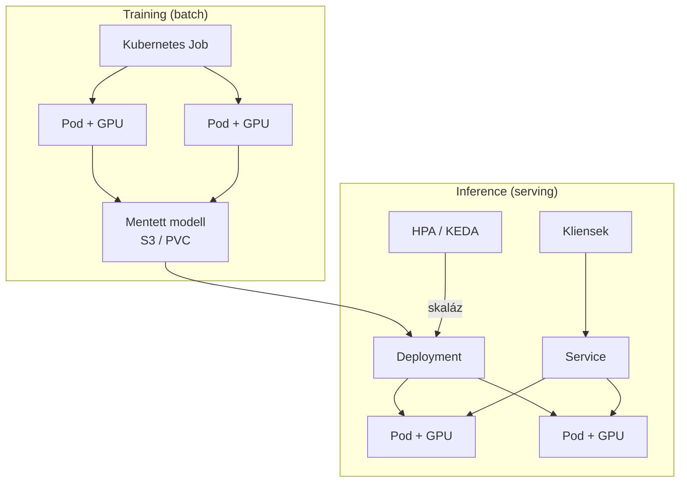

---
tags:
  - kubernetes
  - ml
  - gpu
  - devops
datum: 2026-03-06
szint: "🏗️ Builder"
kapcsolodo:
  - "[[cloud/kubernetes-bevezeto|Kubernetes bevezeto]]"
  - "[[foundations/machine-learning-alapok|Machine Learning alapok]]"
  - "[[cloud/helm|Helm]]"
  - "[[cloud/kubernetes-networking|Kubernetes Networking]]"
  - "[[cloud/kubernetes-production-deployment|Kubernetes Production Deployment]]"
  - "[[database/vector-adatbazisok|Vector adatbázisok]]"
  - "[[_moc/moc-kubernetes|MOC - Kubernetes]]"
---

# AI Workload Orchestration

## Összefoglaló

A [[foundations/machine-learning-alapok|Machine Learning alapok]]-ban latott modelleket (training és inference) Kubernetes-en is futtathatod. A K8s jó erre, mert automatikusan kezeli a GPU erőforrásokat, skáláz a terheles szerint, és a model serving-et production-ready modon oldja meg. De az ML workload-ok máshogy viselkednek mint a hagyomanyos web alkalmazasok -- mas erőforrásigeny, mas skálázasi minta, mas szűk keresztmetszet.

---

## Miért Kubernetes ML-hez?

| Szempont | Hagyomanyos (dedikalt GPU szerver) | Kubernetes |
|----------|----------------------------------|------------|
| **GPU kihasznaltsag** | Gyakran 20-30% (idle) | Tobbszoros workload osztozik |
| **Skálázas** | Kezzel | HPA / KEDA automatikusan |
| **Model verziokezeles** | Manuális | Rolling update, canary |
| **Koltseg** | Fix (fizeted ha nem is használod) | Skalázhato (0-ra is leskálázhatsz) |
| **Multi-tenancy** | Nehez | Namespace + quota |

---

## GPU Pod-ok Kubernetes-en

### NVIDIA Device Plugin

Ahhoz hogy a K8s felismerje és kezelje a GPU-kat, telepitened kell az NVIDIA device plugin-t:

```bash
# NVIDIA Device Plugin (DaemonSet)
kubectl apply -f https://raw.githubusercontent.com/NVIDIA/k8s-device-plugin/v0.17.0/deployments/static/nvidia-device-plugin.yml

# Ellenorzes -- latja-e a GPU-kat
kubectl describe node gpu-node-1 | grep nvidia.com/gpu
# Capacity:  nvidia.com/gpu: 2
# Allocatable: nvidia.com/gpu: 2
```

### GPU igenlese Pod-ban

```yaml
apiVersion: v1
kind: Pod
metadata:
  name: gpu-training-job
spec:
  restartPolicy: Never
  containers:
    - name: trainer
      image: myregistry/model-trainer:v1.0
      resources:
        limits:
          nvidia.com/gpu: 1          # 1 GPU-t ker
          memory: 16Gi
          cpu: "4"
        requests:
          nvidia.com/gpu: 1
          memory: 8Gi
          cpu: "2"
      volumeMounts:
        - name: training-data
          mountPath: /data
        - name: model-output
          mountPath: /models
  volumes:
    - name: training-data
      persistentVolumeClaim:
        claimName: training-data-pvc
    - name: model-output
      persistentVolumeClaim:
        claimName: model-output-pvc
```

> [!warning] GPU-k nem oszthatók meg
> Alapbol egy GPU-t egyetlen Pod kap meg egeszben. Ha tobb kisebb workload-ot akarsz egy GPU-n futtatni, kell **GPU time-slicing** (NVIDIA) vagy **Multi-Instance GPU (MIG)** -- de ezek bonyolítják a setupot.

---

## Training vs Inference -- eltero K8s minták



| | **Training** | **Inference** |
|---|---|---|
| **K8s erőforrás** | Job / CronJob | Deployment + Service |
| **Jellege** | Batch -- elindul, lefut, kész | Allandoan fut, kereseket fogad |
| **GPU igeny** | Magas (1-8 GPU) | Alacsonyabb (1 GPU eleg) |
| **Skálázas** | Nem kell (fix idejű) | Forgalomfuggo (HPA) |
| **Idotartam** | Orak-napok | Folyamatos |

---

## Training Job-ok

### Egyszeri training

```yaml
apiVersion: batch/v1
kind: Job
metadata:
  name: model-training-v3
  namespace: ml-jobs
spec:
  backoffLimit: 3                   # Max 3x probalkozas hiba eseten
  activeDeadlineSeconds: 86400      # Max 24 ora
  template:
    spec:
      restartPolicy: Never
      containers:
        - name: trainer
          image: myregistry/trainer:v3.0
          command: ["python", "train.py"]
          args:
            - "--epochs=50"
            - "--batch-size=32"
            - "--model-output=/models/v3"
          resources:
            limits:
              nvidia.com/gpu: 2
              memory: 32Gi
            requests:
              nvidia.com/gpu: 2
              memory: 16Gi
          env:
            - name: WANDB_API_KEY
              valueFrom:
                secretKeyRef:
                  name: ml-secrets
                  key: wandb-api-key
          volumeMounts:
            - name: data
              mountPath: /data
              readOnly: true
            - name: models
              mountPath: /models
      volumes:
        - name: data
          persistentVolumeClaim:
            claimName: training-dataset
        - name: models
          persistentVolumeClaim:
            claimName: model-storage
```

### Utemezett ujratanitas

```yaml
apiVersion: batch/v1
kind: CronJob
metadata:
  name: weekly-retrain
  namespace: ml-jobs
spec:
  schedule: "0 2 * * 0"             # Vasarnap hajnali 2-kor
  jobTemplate:
    spec:
      template:
        spec:
          restartPolicy: Never
          containers:
            - name: trainer
              image: myregistry/trainer:v3.0
              command: ["python", "retrain.py"]
              resources:
                limits:
                  nvidia.com/gpu: 1
                  memory: 16Gi
```

---

## Model Serving

### Közvetlen Deployment

Egyszerű inference server (pl. FastAPI + PyTorch):

```yaml
apiVersion: apps/v1
kind: Deployment
metadata:
  name: model-server
  namespace: ml-serving
spec:
  replicas: 2
  selector:
    matchLabels:
      app: model-server
  template:
    metadata:
      labels:
        app: model-server
    spec:
      containers:
        - name: server
          image: myregistry/model-server:v2.1
          ports:
            - containerPort: 8080
          resources:
            requests:
              nvidia.com/gpu: 1
              memory: 4Gi
              cpu: "2"
            limits:
              nvidia.com/gpu: 1
              memory: 8Gi
              cpu: "4"
          readinessProbe:
            httpGet:
              path: /health
              port: 8080
            initialDelaySeconds: 30      # Modell betöltés ideje
            periodSeconds: 10
          livenessProbe:
            httpGet:
              path: /health
              port: 8080
            initialDelaySeconds: 60
            periodSeconds: 30
          env:
            - name: MODEL_PATH
              value: "/models/v2.1/model.pt"
          volumeMounts:
            - name: models
              mountPath: /models
              readOnly: true
      volumes:
        - name: models
          persistentVolumeClaim:
            claimName: model-storage
---
apiVersion: v1
kind: Service
metadata:
  name: model-server
  namespace: ml-serving
spec:
  selector:
    app: model-server
  ports:
    - port: 80
      targetPort: 8080
```

### KServe / Triton -- dedikalt model serving platform

Ha tobb modellt kell kiszolgálni, erdemes dedikalt model serving platform-ot használni:

```yaml
# KServe InferenceService
apiVersion: serving.kserve.io/v1beta1
kind: InferenceService
metadata:
  name: image-classifier
  namespace: ml-serving
spec:
  predictor:
    model:
      modelFormat:
        name: pytorch
      storageUri: "s3://models/image-classifier/v2"
      resources:
        limits:
          nvidia.com/gpu: 1
          memory: 8Gi
        requests:
          nvidia.com/gpu: 1
          memory: 4Gi
```

A KServe automatikusan kezeli:
- **Canary deployment** -- uj modell verzio fokozatos bevezetese
- **Scale-to-zero** -- ha nincs forgalom, leallitja a Pod-okat (koltsegmegtagaritas)
- **A/B testing** -- ket modell verzio összehasonlitasa élesben
- **Batching** -- tobb request összegyűjtese egyetlen GPU inference-be

---

## Skálázasi strategiak ML-hez

### GPU-aware HPA

A standard HPA CPU/memory alapu, de ML-hez **GPU kihasznaltsag** vagy **request queue merete** kell:

```yaml
# KEDA -- event-driven autoscaler
apiVersion: keda.sh/v1alpha1
kind: ScaledObject
metadata:
  name: model-server-scaler
  namespace: ml-serving
spec:
  scaleTargetRef:
    name: model-server
  minReplicaCount: 1
  maxReplicaCount: 10
  triggers:
    - type: prometheus
      metadata:
        serverAddress: http://prometheus.monitoring:9090
        metricName: inference_queue_size
        query: sum(inference_queue_pending_requests{service="model-server"})
        threshold: "10"             # 10 varakozo request felett skaláz
```

### Scale-to-zero

GPU Pod-ok dragak -- ha nincs forgalom, erdemes 0-ra skalazni:

```yaml
# KEDA scale-to-zero
spec:
  minReplicaCount: 0               # 0-ra is lemehet!
  cooldownPeriod: 300              # 5 perc inaktivitas utan leáll
  triggers:
    - type: prometheus
      metadata:
        query: sum(rate(http_requests_total{service="model-server"}[5m]))
        threshold: "1"             # Ha nincs request, leáll
```

> [!tip] Cold start
> Scale-to-zero eseten az első request lassu lesz (modell betöltés). Ha ez nem elfogadhato, allitsd `minReplicaCount: 1`-re, vagy használj **modell cache-t** (a modell elore betoltve all a memoriaban).

---

## Node management GPU-khoz

### Node label-ek és taint-ek

A GPU node-okat el kell valasztani a tobbi node-tol, hogy ne keruljenek rajuk sima workload-ok:

```bash
# Label a GPU node-okra
kubectl label node gpu-node-1 hardware=gpu

# Taint -- csak GPU workload futhat rajta
kubectl taint node gpu-node-1 nvidia.com/gpu=present:NoSchedule
```

```yaml
# A GPU Pod-ban toleration kell
spec:
  tolerations:
    - key: nvidia.com/gpu
      operator: Equal
      value: present
      effect: NoSchedule
  nodeSelector:
    hardware: gpu
```

### Cluster Autoscaler + GPU node pool

Managed Kubernetes-ben (GKE, EKS) kulon **GPU node pool**-t erdemes letrehozni ami automatikusan skaláz:

```bash
# GKE GPU node pool
gcloud container node-pools create gpu-pool \
  --cluster production-cluster \
  --accelerator type=nvidia-tesla-t4,count=1 \
  --machine-type n1-standard-8 \
  --num-nodes 0 \
  --enable-autoscaling --min-nodes 0 --max-nodes 5 \
  --node-taints nvidia.com/gpu=present:NoSchedule
```

---

## Resource Quota ML namespace-hez

Ne engedj korlatlan GPU foglalast -- allits be quota-t:

```yaml
apiVersion: v1
kind: ResourceQuota
metadata:
  name: ml-gpu-quota
  namespace: ml-jobs
spec:
  hard:
    requests.nvidia.com/gpu: "4"    # Max 4 GPU ebben a namespace-ben
    requests.memory: 128Gi
    requests.cpu: "32"
    persistentvolumeclaims: "10"
```

---

## Gyakorlati pipeline

```
1. Fejleszto push-ol → CI/CD build-eli a training image-et
2. K8s Job elindul → training a GPU Pod-ban
3. Modell mentese → S3 / PVC
4. Model server Deployment frissitese (uj image tag)
5. Rolling update → uj modell verzio fokozatosan atveszi a forgalmat
6. KEDA figyeli a kereseket → skaláz fel/le
7. Prometheus + Grafana → inference latency, GPU utilization monitoring
```

---

## Költség optimalizalas

| Strategia | Megtagaritas | Kompromisszum |
|-----------|-------------|---------------|
| **Scale-to-zero** | ~60-80% | Cold start latency |
| **Spot/preemptible GPU** | ~60-70% | Bármikor megszakitható (training-hez jó) |
| **GPU time-slicing** | ~30-50% | Több workload osztozik, kevesebb VRAM |
| **Kisebb modell** (quantization) | ~40-60% | Kicsit kevesbe pontos |
| **CPU inference** | ~90% | 10-100x lassabb (batch-hez elfogadhato) |

> [!info] Spot instance-ok training-hez
> A training Job-ok tolerate-olhatjak a megszakitast ha **checkpoint**-okat mentesz rendszeresen. Ha a spot instance leáll, a Job ujraindul es a legutolso checkpoint-tól folytatja.

---

## Kapcsolodo

- [[cloud/kubernetes-bevezeto|Kubernetes bevezeto]] -- K8s alapfogalmak
- [[foundations/machine-learning-alapok|Machine Learning alapok]] -- ML koncepcio (training, inference)
- [[cloud/helm|Helm]] -- ML stack telepitese chart-okkal (KServe, Prometheus)
- [[cloud/kubernetes-networking|Kubernetes Networking]] -- Service-ek a model server elereshez
- [[cloud/kubernetes-production-deployment|Kubernetes Production Deployment]] -- éles cluster üzemeltetes
- [[database/vector-adatbazisok|Vector adatbázisok]] -- embedding tárolás, RAG pipeline-ok
- [[cloud/cluster|Cluster]] -- HPC/GPU cluster koncepcio
- [[_moc/moc-kubernetes|MOC - Kubernetes]]
