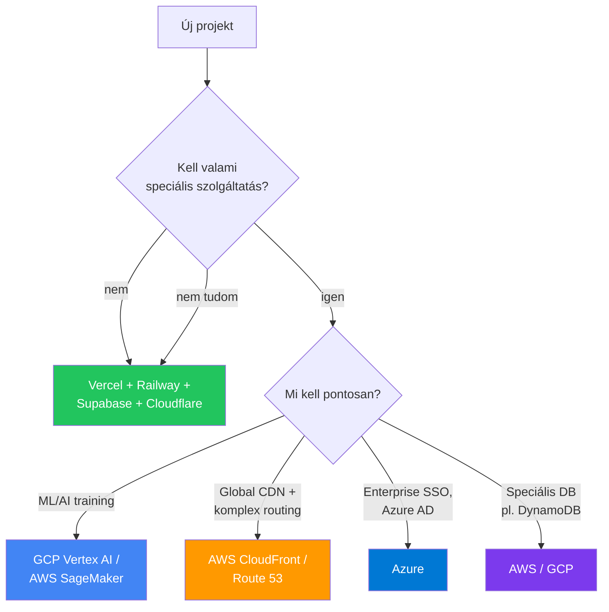

---
tags:
  - cloud
  - hosting
  - deployment
datum: 2026-03-06
szint: "🧱 Scout"
kapcsolodo:
  - "[[cloud/vercel|Vercel]]"
  - "[[cloud/railway|Railway]]"
  - "[[cloud/cloudflare|Cloudflare]]"
  - "[[cloud/hostinger|Hostinger]]"
  - "[[cloud/docker-alapok|Docker alapok]]"
  - "[[cloud/cost-estimation|Cost estimation]]"
  - "[[_moc/moc-deployment|MOC - Deployment]]"
---

# Felhő szolgáltatók alapjai (AWS / GCP / Azure)

## Összefoglaló

Az **AWS** (Amazon Web Services), **GCP** (Google Cloud Platform) és **Azure** (Microsoft) a három nagy felhő szolgáltató. Rengeteg szolgáltatást kínálnak, de SMB projekteknél ritkán van rájuk szükség -- a [[cloud/vercel|Vercel]], [[cloud/railway|Railway]] és [[cloud/cloudflare|Cloudflare]] a legtöbb esetben egyszerűbb és olcsóbb. Ez a jegyzet segít eldönteni, mikor érdemes váltani.

## Mikor elég a managed platform?



## A három nagy összehasonlítása

| Szempont | AWS | GCP | Azure |
|----------|-----|-----|-------|
| **Piaci részesedés** | ~31% (legnagyobb) | ~11% | ~25% |
| **Erőssége** | Legtöbb szolgáltatás, legnagyobb ökoszisztéma | ML/AI, BigQuery, Kubernetes (GKE) | Microsoft integráció, Enterprise |
| **Pricing modell** | Pay-as-you-go, komplex | Pay-as-you-go, egyszerűbb | Pay-as-you-go, EA kedvezmények |
| **Free tier** | 12 hónap + always free | 90 nap $300 kredit + always free | 12 hónap + always free |
| **Tanulási görbe** | Meredek | Közepes | Közepes |
| **SMB-nek ajánlott?** | Ritkán | ML/AI projektekhez | Ha már Azure AD van |

## Leggyakoribb szolgáltatások (amit érdemes ismerni)

### Compute (szerver futtatás)

| Managed platform | AWS megfelelő | GCP megfelelő | Mire jó |
|-----------------|---------------|----------------|---------|
| [[cloud/railway|Railway]] | EC2, ECS, Lambda | Cloud Run, GCE | App futtatás |
| [[cloud/vercel|Vercel]] Functions | Lambda | Cloud Functions | Serverless |
| [[cloud/hostinger|Hostinger]] VPS | EC2 | Compute Engine | Saját szerver |

### Storage (tárolás)

| Managed platform | AWS | GCP | Mire jó |
|-----------------|-----|-----|---------|
| Supabase Storage | S3 | Cloud Storage | Fájlok (képek, PDF) |
| Cloudflare R2 | S3 (de egress díjjal!) | Cloud Storage | Object storage |

### Database

| Managed platform | AWS | GCP | Mire jó |
|-----------------|-----|-----|---------|
| Supabase | RDS (PostgreSQL) | Cloud SQL | Relációs DB |
| — | DynamoDB | Firestore | NoSQL |
| Cloudflare D1 | — | — | Edge SQLite |

> [!tip] Fontos különbség: egress díj
> Az AWS és GCP **felszámítja az adatforgalmat** (egress fee) -- ha adatot küldesz ki a felhőből, fizetsz érte. A [[cloud/cloudflare|Cloudflare]] R2-nek **nincs egress díja**, ezért fájl hosting-ra gyakran olcsóbb.

## Mikor érdemes váltani (Vercel/Railway-ről)?

### Érdemes váltani ha:

- **ML/AI model training** kell (GPU instance-ok) → GCP Vertex AI vagy AWS SageMaker
- **Compliance** követelmény van (HIPAA, SOC2, GDPR specifikus régió) → AWS/GCP/Azure régiók
- **Enterprise integráció** kell (Active Directory, SSO) → Azure
- **Komplex microservice architektúra** → AWS ECS/EKS vagy GCP Cloud Run
- **Nagyon nagy skálázás** (100k+ concurrent user) → saját infra a felhőben

### NE válts ha:

- Csak azért mert "profibb" -- a [[cloud/vercel|Vercel]] + [[cloud/railway|Railway]] stack megoldja a legtöbb SMB projektet
- Nincs dedikált DevOps ember -- a big cloud sokkal több karbantartást igényel
- A költség a motiváció -- a big cloud gyakran **drágább** kis projekteknél
- Nem érted a networking alapjait -- előbb tanuld meg a [[cloud/docker-alapok|Docker]]-t és a [[cloud/deployment-checklist|Deployment checklist]]-et

## AWS — ha mégis kell

### Leggyakoribb szolgáltatások

```bash
# AWS CLI telepítés
brew install awscli
aws configure  # Access Key + Secret Key megadása

# S3 bucket létrehozás
aws s3 mb s3://my-project-files

# Fájl feltöltés
aws s3 cp ./build s3://my-project-files/ --recursive

# Lambda function deploy (Serverless Framework)
npx serverless deploy
```

### Tipikus SMB use case: statikus site S3 + CloudFront

```
S3 bucket (HTML/CSS/JS) → CloudFront CDN → Custom domain + SSL
Költség: ~$1-5/hó (kis forgalommal)
```

## GCP — ha ML/AI kell

```bash
# gcloud CLI telepítés
brew install google-cloud-sdk
gcloud init

# Cloud Run deploy (Docker image-ből)
gcloud run deploy my-api \
  --image gcr.io/my-project/my-api:latest \
  --platform managed \
  --region europe-west1 \
  --allow-unauthenticated
```

> [!info] GCP Cloud Run
> A Cloud Run a GCP legegyszerűbb szolgáltatása -- [[cloud/docker-alapok|Docker]] image-et adsz neki, és automatikusan skáláz (akár 0-ra is). A [[cloud/railway|Railway]]-hez hasonlít, de GCP ökoszisztémában.

## Költség összehasonlítás (SMB szemszögből)

| Stack | Havi költség | Komplexitás |
|-------|-------------|-------------|
| Vercel + Supabase + Cloudflare | $5-25/hó | Alacsony |
| Railway + Supabase | $10-30/hó | Alacsony |
| AWS (EC2 + RDS + S3) | $50-200/hó | Magas |
| GCP (Cloud Run + Cloud SQL) | $30-100/hó | Közepes |

> [!warning] Big cloud költség meglepetés
> Az AWS/GCP számlák könnyen elszállhatnak. Mindig állíts be **billing alert**-et (pl. $50/hó felett értesítés), és rendszeresen ellenőrizd a dashboardot. Egy elfelejtett EC2 instance hónapokig futhat.

## Mikor használd / Mikor NE

**Használd:**
- Specifikus szolgáltatás kell ami máshol nincs (ML, speciális DB, compliance)
- Enterprise környezet (Azure AD, AWS Organizations)
- Nagy csapat, dedikált DevOps erőforrás
- Globális skálázás követelmény

**NE használd:**
- MVP / első verzió -- kezdd [[cloud/saas-mvp-deployment|managed platformokkal]]
- Kis csapat, nincs DevOps tapasztalat
- Ha a Vercel + Railway + Supabase megoldja

## Kapcsolódó

- [[cloud/vercel|Vercel]] — egyszerűbb frontend hosting, nem kell AWS
- [[cloud/railway|Railway]] — egyszerűbb backend hosting, nem kell EC2
- [[cloud/cloudflare|Cloudflare]] — edge platform, sok AWS szolgáltatás olcsóbb alternatívája
- [[cloud/hostinger|Hostinger]] — VPS, ha saját szerver kell de nem big cloud
- [[cloud/docker-alapok|Docker alapok]] — konténerizáció ami mindenhol alap
- [[cloud/cost-estimation|Cost estimation]] — részletes költségbecslés platformonként
