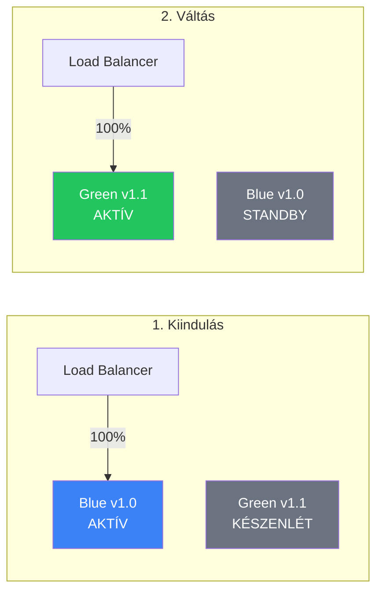
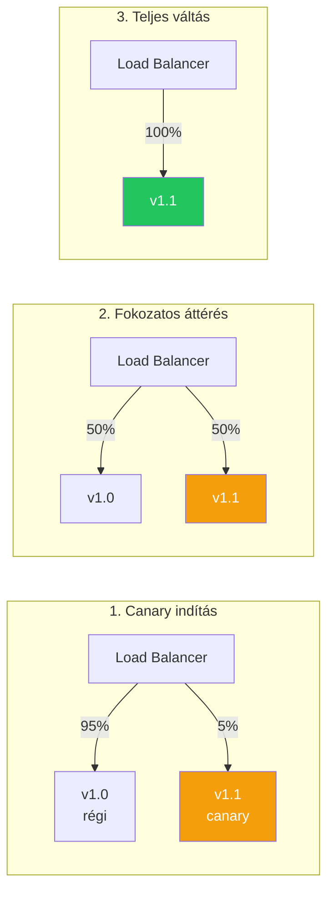

---
tags:
  - deployment
  - devops
  - strategy
datum: 2026-03-06
szint: "🏗️ Builder"
kapcsolodo:
  - "[[cloud/ci-cd-pipelines|CI/CD Pipelines]]"
  - "[[cloud/docker-alapok|Docker alapok]]"
  - "[[cloud/nginx|Nginx]]"
  - "[[cloud/traefik|Traefik]]"
  - "[[cloud/kubernetes-bevezeto|Kubernetes bevezető]]"
  - "[[cloud/vercel|Vercel]]"
  - "[[cloud/railway|Railway]]"
  - "[[_moc/moc-deployment|MOC - Deployment]]"
---

# Blue-Green és Canary Deployment

## Összefoglaló

A **blue-green deployment** és a **canary deployment** zero-downtime deploy stratégiák -- az új verzió úgy kerül production-be, hogy a felhasználók nem tapasztalnak leállást. A managed platformok ([[cloud/vercel|Vercel]], [[cloud/railway|Railway]]) ezt automatikusan csinálják, de ha saját infrastruktúrát üzemeltetsz, neked kell megoldanod.

## Miért kell zero-downtime deploy?

Ha egyszerűen leállítod a régi verziót és elindítod az újat:

```
15:00:00 — régi verzió leáll
15:00:05 — build fut...
15:00:30 — új verzió elindul
→ 30 másodperc downtime, a userek hibát kapnak
```

Zero-downtime deploy-jal:

```
15:00:00 — új verzió elindul a régi mellett
15:00:05 — health check OK
15:00:06 — forgalom átirányítva az új verzióra
15:00:07 — régi verzió leáll
→ 0 másodperc downtime
```

## Stratégiák

### Blue-Green Deployment



**Hogyan működik:**
1. Két azonos környezeted van: **Blue** (éles) és **Green** (standby)
2. Az új verziót a Green-re deploy-olod
3. Teszteled a Green-t (health check, smoke test)
4. A load balancer-t átváltod Blue-ról Green-re
5. Ha baj van → visszaváltod Blue-ra (instant rollback)

**Előny:** Azonnali rollback, tiszta váltás
**Hátrány:** Dupla erőforrás kell (két teljes környezet)

### Canary Deployment



**Hogyan működik:**
1. Az új verziót **kis forgalommal** indítod (5-10%)
2. Figyeled a metrikákat (error rate, latency)
3. Ha minden OK → fokozatosan növeled a forgalmat
4. Ha hiba van → a canary-t leállítod, 100% visszamegy a régire

**Előny:** Kisebb kockázat, valós forgalommal tesztelsz
**Hátrány:** Bonyolultabb setup, két verzió fut egyszerre

### Rolling Deployment

A harmadik gyakori stratégia: az instance-okat **egyenként** cseréled le.

| Stratégia | Rollback | Erőforrás igény | Komplexitás | Kockázat |
|-----------|----------|-----------------|-------------|----------|
| Blue-Green | Azonnali | 2x | Alacsony | Alacsony |
| Canary | Gyors | 1.1x | Közepes | Legalacsonyabb |
| Rolling | Lassú | 1x | Alacsony | Közepes |

## Managed platformokon (automatikus)

A [[cloud/vercel|Vercel]] és [[cloud/railway|Railway]] automatikusan zero-downtime deploy-t csinálnak -- nem kell konfigurálnod:

| Platform | Stratégia | Hogyan |
|----------|-----------|--------|
| [[cloud/vercel|Vercel]] | Atomic deploy | Új build kész → forgalom atomikusan átvált |
| [[cloud/railway|Railway]] | Rolling | Új container elindul → health check → régi leáll |
| Kubernetes | Konfiguálható | Blue-green, canary, rolling -- mind támogatott |

> [!tip] Ha Vercel-t vagy Railway-t használsz
> Nem kell ezzel foglalkoznod -- a platform megoldja. Ez a jegyzet akkor fontos, ha **saját VPS-en** vagy **Kubernetes**-ben deploy-olsz.

## Saját VPS-en: Blue-Green Docker-rel

### Setup [[cloud/docker-compose|Docker Compose]]-zal

```yaml
# docker-compose.yml
services:
  blue:
    image: myapp:1.0
    container_name: app-blue
    ports:
      - "3001:3000"
    restart: unless-stopped

  green:
    image: myapp:1.1
    container_name: app-green
    ports:
      - "3002:3000"
    restart: unless-stopped
```

### [[cloud/nginx|Nginx]] upstream váltás

```nginx
# /etc/nginx/conf.d/upstream.conf
upstream app {
    # Aktív verzió — ezt váltogatjuk
    server localhost:3001;  # blue
    # server localhost:3002;  # green (kommentben amíg nem aktív)
}

server {
    listen 80;
    server_name myapp.com;

    location / {
        proxy_pass http://app;
        proxy_set_header Host $host;
        proxy_set_header X-Real-IP $remote_addr;
    }
}
```

### Deploy script

```bash
#!/bin/bash
# deploy.sh — Blue-Green deploy script

CURRENT=$(docker inspect --format='{{.Config.Image}}' app-blue 2>/dev/null)
NEW_IMAGE="myapp:$1"  # pl. deploy.sh 1.2

echo "Jelenlegi verzió: $CURRENT"
echo "Új verzió: $NEW_IMAGE"

# 1. Green indítása az új verzióval
docker compose up -d green

# 2. Health check
echo "Health check..."
for i in {1..10}; do
    if curl -s http://localhost:3002/health | grep -q "ok"; then
        echo "Green healthy!"
        break
    fi
    sleep 2
done

# 3. Nginx átváltás green-re
sed -i 's/server localhost:3001/# server localhost:3001/' /etc/nginx/conf.d/upstream.conf
sed -i 's/# server localhost:3002/server localhost:3002/' /etc/nginx/conf.d/upstream.conf
nginx -s reload

echo "Forgalom átváltva green-re."

# 4. Blue leállítás (opcionális — megtarthatod rollback-hez)
# docker compose stop blue
```

> [!warning] Health check kötelező
> Soha ne válts forgalmat health check nélkül. A `/health` endpoint legyen egyszerű: DB connection check + 200 OK. Ha a health check nem megy át, ne váltsd a forgalmat.

## Kubernetes-ben

Ha [[cloud/kubernetes-bevezeto|Kubernetes]]-t használsz, a deployment stratégia a manifest-ben konfigurálható:

```yaml
apiVersion: apps/v1
kind: Deployment
metadata:
  name: myapp
spec:
  replicas: 3
  strategy:
    type: RollingUpdate
    rollingUpdate:
      maxSurge: 1        # max 1 extra pod a frissítés alatt
      maxUnavailable: 0   # 0 = zero-downtime
  template:
    spec:
      containers:
        - name: myapp
          image: myapp:1.1
          readinessProbe:
            httpGet:
              path: /health
              port: 3000
            initialDelaySeconds: 5
            periodSeconds: 5
```

## Mikor használd / Mikor NE

**Használd:**
- Saját VPS-en deploy-olsz és a downtime nem elfogadható
- Kubernetes clustert üzemeltetsz
- Gyakran deploy-olsz (naponta többször)
- [[cloud/ci-cd-pipelines|CI/CD pipeline]]-ba akarod integrálni

**NE használd:**
- [[cloud/vercel|Vercel]] / [[cloud/railway|Railway]] -- automatikusan megoldják
- Fejlesztői / staging környezet -- ott nem baj ha pár másodpercre leáll
- Nagyon egyszerű app, kevés felhasználó -- overkill

## Kapcsolódó

- [[cloud/ci-cd-pipelines|CI/CD Pipelines]] — automatizált deploy pipeline ami triggereli a blue-green váltást
- [[cloud/docker-alapok|Docker alapok]] — konténerek amikkel a blue/green environment-eket futtatod
- [[cloud/nginx|Nginx]] — reverse proxy ami a forgalmat irányítja
- [[cloud/traefik|Traefik]] — Docker-native reverse proxy, label-ekkel konfigurálható
- [[cloud/kubernetes-bevezeto|Kubernetes bevezető]] — beépített rolling update és canary támogatás
- [[cloud/deployment-checklist|Deployment checklist]] — deploy előtti ellenőrző lista
