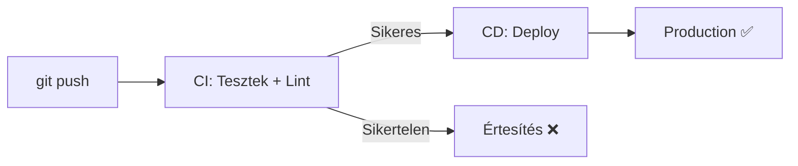

---
tags:
  - devops
  - deployment
  - github
datum: 2026-03-06
szint: "🧱 Scout"
kapcsolodo:
  - "[[foundations/git-es-github|Git és GitHub]]"
  - "[[cloud/vercel|Vercel]]"
  - "[[cloud/railway|Railway]]"
  - "[[cloud/docker-alapok|Docker alapok]]"
  - "[[_moc/moc-deployment|MOC - Deployment]]"
---

# CI/CD Pipelines

## Összefoglaló

A **CI/CD** (Continuous Integration / Continuous Deployment) automatizálja a kódod tesztelését és deploy-ját. Minden `git push` után automatikusan lefutnak a tesztek, és ha minden zöld, az app deploy-olódik. A teljes workflow [[foundations/git-es-github|Git és GitHub]]-on alapul.

## Miért kell?



**CI nélkül:** "Nálam működik" → push → production hiba → pánik
**CI-vel:** Push → automatikus teszt → hiba kiszűrve → nincs pánik

## GitHub Actions alapok

A GitHub Actions a legegyszerűbb CI/CD megoldás GitHub repo-khoz. Workflow fájlok: `.github/workflows/*.yml`

### Alap CI pipeline

```yaml
# .github/workflows/ci.yml
name: CI

on:
  push:
    branches: [main]
  pull_request:
    branches: [main]

jobs:
  test:
    runs-on: ubuntu-latest
    steps:
      - uses: actions/checkout@v4

      - name: Setup Node.js
        uses: actions/setup-node@v4
        with:
          node-version: 20
          cache: 'npm'

      - name: Install dependencies
        run: npm ci

      - name: Lint
        run: npm run lint

      - name: Type check
        run: npx tsc --noEmit

      - name: Test
        run: npm test
```

### CI + CD (Vercel automatikus)

Ha [[cloud/vercel|Vercel]]-t használsz, a CD automatikus — minden push-ra deploy-ol. A CI pipeline csak a teszteket futtatja:

```yaml
# A Vercel CSAK akkor deploy-ol, ha a CI pipeline sikeres
name: CI
on: [push, pull_request]
jobs:
  quality:
    runs-on: ubuntu-latest
    steps:
      - uses: actions/checkout@v4
      - uses: actions/setup-node@v4
        with: { node-version: 20, cache: 'npm' }
      - run: npm ci
      - run: npm run lint
      - run: npm test
      - run: npm run build  # Build ellenőrzés
```

### [[cloud/docker-alapok|Docker]] build + push

```yaml
name: Docker Build & Push

on:
  push:
    branches: [main]

jobs:
  build:
    runs-on: ubuntu-latest
    steps:
      - uses: actions/checkout@v4

      - name: Login to GitHub Container Registry
        uses: docker/login-action@v3
        with:
          registry: ghcr.io
          username: ${{ github.actor }}
          password: ${{ secrets.GITHUB_TOKEN }}

      - name: Build and push
        uses: docker/build-push-action@v5
        with:
          push: true
          tags: ghcr.io/${{ github.repository }}:latest
```

## Best Practices

- **Gyors feedback** — a CI pipeline legyen gyors (< 5 perc)
- **Cache használat** — `actions/cache` vagy `actions/setup-node` cache opció
- **Secrets kezelés** — API kulcsok a GitHub Secrets-ben, soha nem a kódban (lásd [[cloud/12-faktoros-alkalmazas-epites|12 Faktoros alkalmazás építés]] III. faktor)
- **Branch protection** — `main` branch-re csak sikeres CI után merge-ölhetsz

> [!warning] Ne futtass mindent CI-ben
> Drága műveletek (E2E tesztek, nagy build-ek) csak `main` branch-re vagy PR-ekre fussanak, ne minden commit-ra.

## Kapcsolódó

- [[foundations/git-es-github|Git és GitHub]] — verziókezelés alapjai
- [[cloud/vercel|Vercel]] — automatikus CD Next.js-hez
- [[cloud/railway|Railway]] — Docker-alapú CD
- [[cloud/docker-alapok|Docker alapok]] — konténer image build a CI-ben
