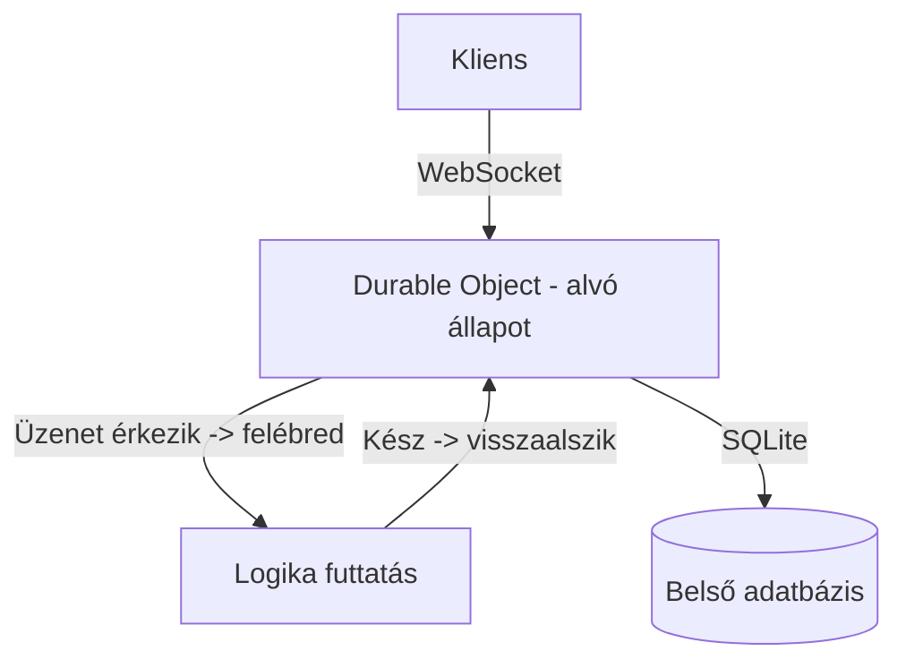
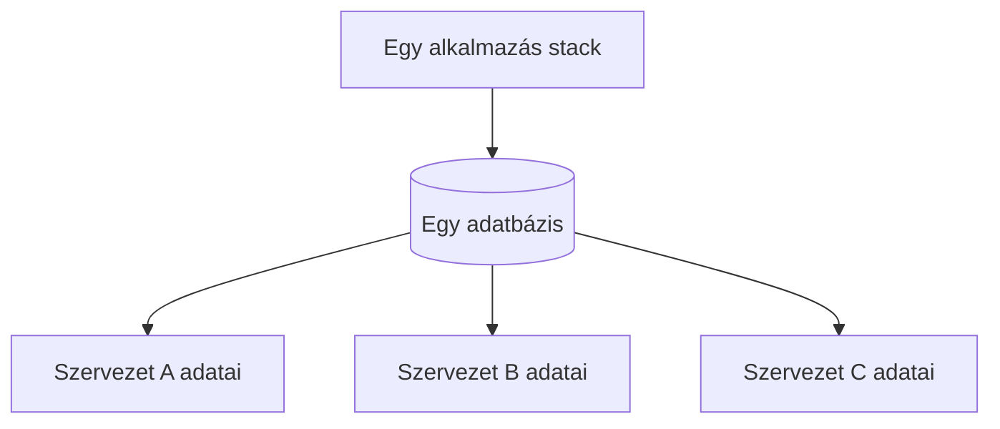

---
tags:
  - cloudflare
  - monorepo
  - architektura
datum: 2026-03-26
szint: "🏗️ Builder"
kapcsolodo:
  - "[[cloud/cloudflare|Cloudflare]]"
  - "[[cloud/docker-alapok|Docker]]"
  - "[[cloud/12-faktoros-alkalmazas-epites|12-faktor]]"
  - "[[cloud/devops|DevOps]]"
  - "[[cloud/multi-app-monorepo-architektura|Multi-app Monorepo architektúra]]"
---

# Cloudflare Monorepo Mappastruktúra

## Összefoglaló

Ez a jegyzet a [[toolbox/monorepo-management|Monorepo]] komponens-architektúrát mutatja be (hogyan épül fel egy professzionális projekt mappastruktúrája, milyen scriptek kellenek), majd a [[cloud/cloudflare|Cloudflare]] ökoszisztéma haladó szolgáltatásait tárgyalja: Durable Objects, Containers, Workflows. Kitér a Zod validációra, adatbázis-szintű tárolt eljárásokra és a tenant izolációra is.

---

## Monorepo - rétegeken keresztül

Egy monorepo-ban a **rétegeken keresztül kell végigvinni** egy-egy feature-t. A komponensek (components) = az egyes alkalmazások. Mindegyiknek van saját `package.json`-ja, ami leírja, hogyan kell buildelni, indítani és tesztelni.

```
monorepo/
├── apps/
│   ├── frontend/
│   │   └── package.json
│   └── api/
│       └── package.json
├── packages/
│   └── shared/
└── package.json          # Root workspace
```

Kell egy **külön API komponens** is, ami kommunikál a backend-del - nem elég csak a frontend-et monorepo-ba rakni.

### package.json scriptek - minden komponensben

| Script      | Mit csinál                        | Miért fontos                                   |
| ----------- | --------------------------------- | ---------------------------------------------- |
| `typecheck` | TypeScript típusellenőrzés        | Kiszűri a típusproblémákat build előtt         |
| `lint`      | Best practice ellenőrzés (ESLint) | Jó programozási gyakorlatoknak való megfelelés |
| `lint:fix`  | Automatikus javítás               | Amennyit lehet, kijavít magától                |
| `test`      | Tesztek futtatása                 | Ideálisan az **egész stack-et** végig teszteli |
| `build`     | Produkciós build                  | Optimalizált, minified output                  |
| `start`     | Alkalmazás indítása               | Dev vagy prod mode                             |

> [!tip] E2E tesztelés az egész stack-re
> A teszt nem csak az adott komponenst, hanem ideálisan az **egész stack-et** végig tudja tesztelni - pl. Playwright e2e teszteléssel. Ez azért fontos, mert egy monorepo-ban a komponensek függnek egymástól, és egy frontend változás eltörheti az API-t.

---

### Cloudflare haladó szolgáltatások

#### Durable Objects (DO)

A **Durable Objects** a Cloudflare egyik legérdekesebb szolgáltatása - egyfajta "állapotfüggő Worker":

| Tulajdonság       | Leírás                                                          |
| ----------------- | --------------------------------------------------------------- |
| **Belső SQLite**  | Saját belső adatbázis, nem kell külső DB                        |
| **RPC protokoll** | Binárisan képes függvényt hívni - **sokkal gyorsabb** mint HTTP |
| **WebSocket**     | Képes WebSocket-et kezelni anélkül, hogy végig futna a Worker   |
| **Scale to zero** | Ha nincs forgalom, nem fut, nem fizetsz                         |

> [!info] Hibernation API
> A DO-nak van egy **Hibernation API**-ja: lehet rá küldeni üzenetet mint egy WebSocket-re, és **csak akkor kel fel, amikor szükséges**. Tökéletes real-time funkciókhoz ahol a kapcsolat állandó, de a forgalom ritkás.



#### Cloudflare Workflows

A **CF Workflow** lehetővé teszi, hogy különböző **lépéseket (step-eket)** definiálj **retry logikával**:

- Minden step-nek megadható a retry policy
- Ha egy step megbukik, automatikusan újrapróbálja
- A `wrangler.jsonc`-ben kell definiálni a workflow-kat

> [!tip] Hasonlóság az n8n-nel
> Hasonló koncepció mint az n8n workflow-k, de a Cloudflare ökoszisztémán **belül** fut - nem kell külső VPS. Egyszerűbb feladatokra (pl. retry-os email küldés, webhook feldolgozás) elegendő lehet CF Workflow az n8n helyett.

#### Cloudflare Containers

- Standard **[[cloud/docker-alapok|Docker]] image** - ugyanúgy bindolni kell mint a többi Cloudflare szolgáltatást
- **NEM arra való**, hogy pl. PostgreSQL-t indíts benne
- Inkább arra, hogy **saját custom service-eket** definiálj konténerben, amik a Workers ökoszisztémán belül futnak

#### Workers + Konténerek

A Workers mögé **konténereket is lehet rakni** - a `wrangler.jsonc`-ben van konfigurálva:
- Lokálban tesztelhető (`wrangler dev`)
- De **prodban át kell írni** a linket amire hivatkozik

---

### Zod sémák - API validáció

Ha jön egy API hívás és pl. az `id`-ban `number` helyett `string` érkezik, a **Zod séma** elkapja - legalább nem áll fejre az app:

```typescript
import { z } from "zod";

const requestSchema = z.object({
  id: z.number(),
  name: z.string(),
});

// safeParse: nem dob hibát, hanem result objektumot ad vissza
const result = requestSchema.safeParse(input);
if (!result.success) {
  return Response.json({ error: result.error }, { status: 400 });
}
```

> [!warning] Miért kell sémavalidáció?
> Zod nélkül egy rossz típusú input futásidejű hibát okozhat. A **sémának való megfelelés** biztosítja, hogy az app gracefully kezeli a hibás bemenetet, ahelyett hogy crashelne. Különösen fontos publikus API-knál, ahol bármi jöhet a klienstől.

---

### Adatbázis szintű tanulságok

#### Tárolt eljárások (Stored Procedures)

Az adatbázison belüli **tárolt eljárásokkal** komplex logikát lehet a DB szintre vinni:

| Adatbázis | Stored Procedures támogatás |
|-----------|---------------------------|
| PostgreSQL | Teljes (PL/pgSQL) |
| Oracle | Teljes (PL/SQL) |
| MySQL | Korlátozott, de tudja |
| SQLite | **Nem támogatja** |

#### R2 - Custom metaadatok

A [[cloud/cloudflare-r2|Cloudflare R2]] lehetővé teszi **custom metaadatok** hozzáadását a fájlokhoz, amelyek alapján **keresni is lehet**. Hasznos pl. dokumentumok rendszerezéséhez - `applicationId`, `documentType` metaadatokkal.

#### Tenant izoláció

A **tenant izoláció** adatbázisszinten oldható meg:



**Előnye:** nem kell külön dev/uat/prod környezetet fenntartani minden tenantnak - egy stack elég az összesre.

---

### Log dúsítás (Log Enrichment)

A Cloudflare-en az **összes service logja egy helyen** jelenik meg. A service-ek logjait lehet kérni, hogy **olvasható, feldúsított output** legyen. Fontos, hogy az aktuális dátum legyen a `compatibility_date` az `apps/api/wrangler.jsonc`-ben.

---

## Fő tanulságok

- A monorepo **komponens-alapú**: minden app saját `package.json`-nal és script-ekkel (typecheck, lint, test)
- A **Durable Objects** a Cloudflare legizgalmasabb szolgáltatása: saját SQLite, RPC, WebSocket, scale to zero + Hibernation API
- A **Zod sémavalidáció** az API rétegben megvédi az alkalmazást - az app sose omoljon össze egy rossz request miatt
- **Cloudflare Containers** nem DB-re való, hanem custom service-ekre
- **CF Workflow** = retry logikás step-ek a Cloudflare-en belül, hasonló mint az n8n, de natív
- **Tenant izoláció** DB-szinten -> nem kell minden ügyfélnek külön stack
- A **Hibernation API** lehetővé teszi, hogy WebSocket-es kapcsolatok költségmentesen "aludjanak"

---

## AI-natív fejlesztés

A Cloudflare monorepo setup és a haladó szolgáltatások (DO, Workflows, Containers) konfigurációja komplex, de pattern-alapú - Claude Code jól ismeri a wrangler.jsonc szintaxist és a Workers binding mintákat. Különösen hasznos, ha Durable Objects-et vagy Workflow step-eket kell definiálni.

> [!tip] Hogyan használd AI-val
> - *"Készíts Cloudflare Workers projektet monorepo struktúrával: apps/frontend, apps/api külön package.json-nal, packages/shared a közös típusokhoz"*
> - *"Használj Durable Objects-et real-time funkcióhoz WebSocket-tel és Hibernation API-val"*
> - *"Adj hozzá Zod validációt az API réteghez, ahol a séma a shared package-ben él"*

## Kapcsolódó

- [[cloud/docker-alapok|Docker]] - konténerizáció alapjai (Cloudflare Containers kontextus)
- [[cloud/12-faktoros-alkalmazas-epites|12-faktor]] - cloud-native alkalmazás elvek
- [[cloud/devops|DevOps]] - a teljes fejlesztési-deployment pipeline
- [[cloud/multi-app-monorepo-architektura|Multi-app Monorepo architektúra]] - Az apps/ + packages/ minta általánosan
