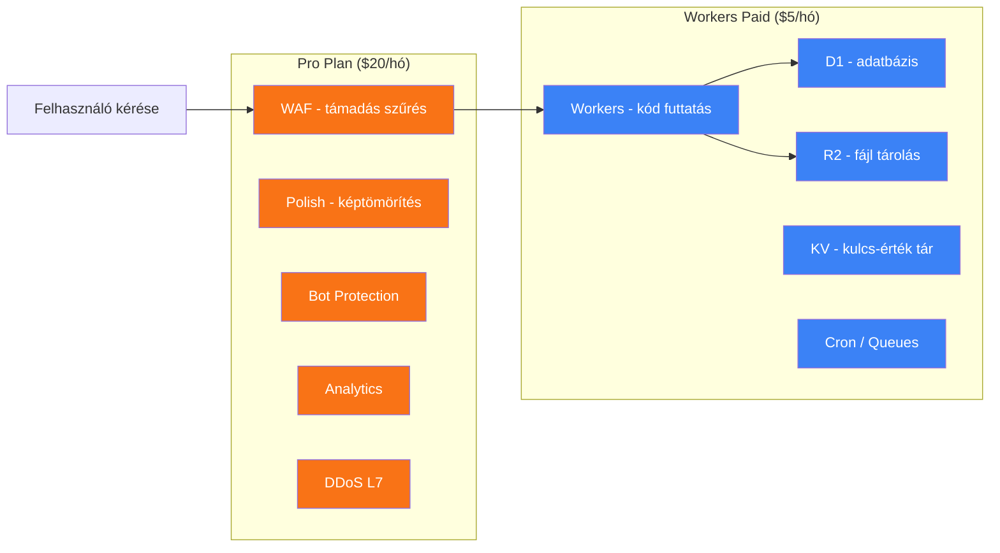
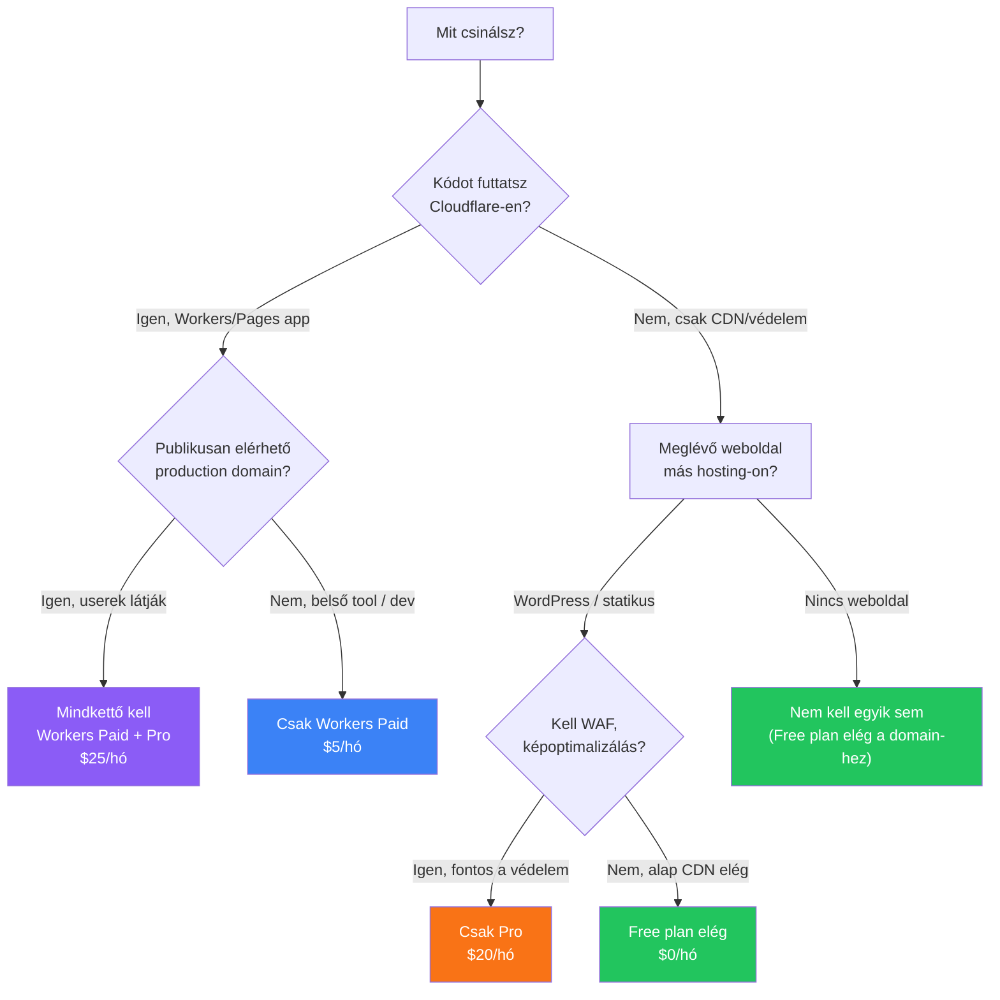

---
tags:
  - cloudflare
  - hosting
  - arazas
datum: 2026-04-08
szint: "🧱 Brick"
kapcsolodo:
  - "[[cloud/cloudflare|Cloudflare]]"
  - "[[cloud/cloudflare-r2|Cloudflare R2]]"
  - "[[cloud/cloudflare-kv|Cloudflare KV]]"
  - "[[cloud/cloudflare-pages|Cloudflare Pages]]"
  - "[[backend/edge-function|Edge function]]"
---

# Cloudflare Pro vs Workers Paid

Két teljesen különböző termék, amiket sokan összekevernek mert hasonló árkategória ($5 vs $20/hó). Az egyik a **domain-ed védelmét** adja, a másik a **kódod futtatását**.

---

## Alapvető különbség

| | **Cloudflare Pro** ($20/hó) | **Workers Paid** ($5/hó) |
|---|---|---|
| **Mi ez?** | Domain-level security és performance | Serverless compute platform |
| **Mire vonatkozik?** | Egy domain-re (pl. example.hu) | Az egész account-ra |
| **Mit kapsz?** | WAF, képoptimalizálás, analytics, DDoS, bot protection | Workers, D1, R2, KV, Pages Functions, DO, Cron |
| **Kinek kell?** | Akinek **meglévő weboldala** van amit védeni/gyorsítani akar | Akinek **appot kell futtatnia** az edge-en |
| **Analógia** | Biztonsági őr + klíma az irodában | Maga az iroda ahol dolgozol |

> [!important] Egymástól függetlenek
> A Pro plan NEM tartalmazza a Workers Paid-et, és fordítva. Külön-külön vásárolhatók, és más dashboard szekción belül élnek.

---

## Cloudflare Pro ($20/hó) — mit ad a Free fölé?

A Free plan is ad alapvető védelmet, de a Pro jelentős upgrade:

| Feature | Free | Pro ($20/hó) |
|---|---|---|
| **WAF szabályok** | 5 custom rule, alap managed ruleset | 20 custom rule + OWASP Core Ruleset + Leaked Credentials Check |
| **Bot protection** | Alap | Fejlettebb bot score, JS challenge |
| **Képoptimalizálás** | Nincs | Polish (lossy/lossless), WebP konverzió, Mirage (lazy load) |
| **Analytics** | 24 órás | 72 órás + Cache Analytics |
| **Mobiloptimalizálás** | Nincs | Rocket Loader (JS async betöltés) |
| **Page Rules** | 3 | 20 |
| **DDoS** | Alap L3/L4 | Ugyanaz + fejlettebb L7 szabályok |
| **Email routing** | Igen | Igen + DMARC Management |

### Gyakorlatban mikor érzed a különbséget?

- **WAF**: Ha e-commerce vagy publikus app → a Pro WAF managed ruleset-je blokkol SQL injection-t, XSS-t automatikusan. Free-n ezt kézzel kell rule-ölni (és csak 5-öt adhatsz meg)
- **Képoptimalizálás**: Ha sok képed van (portfólió, webshop, blog) → a Polish automatikusan tömörít és WebP-re konvertál. Free-n nincs ilyen, magadnak kell megoldani
- **Bot protection**: Ha kontaktformot, login-t, komment szekciót üzemeltetsz → a Pro jobb bot score-ral szűri a spam-et

---

## Workers Paid ($5/hó) — mit ad a Free fölé?

| Feature | Free | Workers Paid ($5/hó) |
|---|---|---|
| **Worker requests** | 100K/nap (!) | 10M/hó |
| **CPU time / request** | 10 ms | 30 s |
| **D1 storage** | 5 GB | 5 GB (de nagyobb limit kérhető) |
| **D1 reads/writes** | 5M reads, 100K writes/nap | 25 milliárd reads, 50M writes/hó |
| **KV reads** | 100K/nap | 10M/hó |
| **R2 storage** | 10 GB | 10 GB + $0.015/GB fölötte |
| **Durable Objects** | Csak SQLite backend | SQLite + KV backend |
| **Cron Triggers** | 5 trigger | 5 trigger (de hosszabb CPU idő) |
| **Queues** | Korlátozott | 1M üzenet/hó |

### Gyakorlatban mikor érzed a különbséget?

- **Request limit**: Free-n 100K/nap → havi ~3M. Ha kis belső tool-od van 5 userrel, ez elég. De bármi komolyabb → kell a Paid
- **CPU time**: Free-n 10 ms/request — ez CRUD-ra elég, de bármi bonyolultabb számítás (aggregáció, PDF feldolgozás, crypto) → timeout
- **D1 writes**: Free-n 100K/nap → ha bulk import-ot csinálsz, gyorsan elfogyhat

---

## Döntési mátrix — mikor melyik kell?

### Webapp fejlesztés (saját projekt, SaaS)

| Szcenárió | Pro kell? | Workers Paid kell? |
|---|---|---|
| **Hono API + React SPA** | Nem feltétlenül | **Igen** — ez a compute platform |
| **Next.js on CF Workers** | Nem feltétlenül | **Igen** — kell a compute |
| **Statikus landing page (Pages)** | Nem | Nem (Free elég) |
| **API + D1 adatbázis + R2 fájlok** | Nem feltétlenül | **Igen** |

> [!tip] Webapp-nál a Workers Paid a fő szükséglet
> A Pro plan nem ad semmit ami a kódod futtatásához kell. A Workers Paid viszont minden compute-ot, storage-ot, és DB-t tartalmaz. Ha **csak app-ot építesz**, a Workers Paid elég — a Pro opcionális ráadás.

### Weblap készítés ügyfeleknek

| Szcenárió | Pro kell? | Workers Paid kell? |
|---|---|---|
| **WordPress / statikus site + védelem** | **Igen** — WAF, képoptimalizálás | Nem |
| **Céges weboldal + kontakt form** | **Igen** — bot protection, WAF | Nem (Free Workers-ből kijön a form handler) |
| **E-commerce / webshop** | **Igen** — WAF, bot protection kötelező | Attól függ hol fut a backend |
| **Portfólió / galéria sok képpel** | **Igen** — Polish képoptimalizálás | Nem |
| **Marketing landing page** | Nem (Free CDN elég) | Nem |

> [!tip] A Pro a fő érték
> A Pro plan-t mint szolgáltatást adod el: "a weboldalad védve van, gyorsabb, képek optimalizálva". Ez **érthető érték** amit hajlandóak fizetni. A Workers Paid-et nem érdekli őket.

### Mindkettő együtt — mikor?

Ha **fullstack app-ot építesz** [[cloud/cloudflare|Cloudflare]]-en:

| Szcenárió | Stack | Össz. költség |
|---|---|---|
| **Céges belső tool + publikus domain** | Workers Paid (app) + Pro (domain védelem) | $25/hó |
| **Webshop custom backend-del** | Workers Paid (API + DB) + Pro (WAF + képek) | $25/hó |
| **SaaS + marketing oldal** | Workers Paid (app) + Pro (marketing domain-re) | $25/hó |

---

## Összehasonlító grafikon — mit véd / mit futtat

A kérés először a **Pro rétegen** megy át (védelmi szűrés), aztán a **Workers réteg** futtatja a kódot.

---

## Döntési fa

---

## Gyakori félreértések

**"A Pro plan-ben benne van a Workers Paid"**
→ Nem. Teljesen külön termékek. A Pro-val 0 Worker-t kapsz a Free fölé.

**"Ha Workers Paid-em van, nem kell Pro"**
→ Attól függ. Ha production domain-ed van amit userek látogatnak, a Pro WAF-ja és képoptimalizálása valós értéket ad. Ha belső tool → tényleg nem kell.

**"$5/hó-ért mindent megkapok"**
→ Compute-ot igen. Védelmet (WAF, bot protection, Polish) nem — az a Pro réteg.

**"A Business plan ($200/hó) kell a komolyabb projektekhez"**
→ A legtöbb kis-közepes projekthez **Pro + Workers Paid ($25/hó)** bőven elég. Business-re csak akkor van szükség ha 100%-os SLA, custom WAF ruleset-ek, vagy Cloudflare Images (nem Polish) kell.

---

## Kapcsolódó

- [[cloud/cloudflare|Cloudflare]] — a teljes platform áttekintése, Workers ökoszisztéma, setup
- [[cloud/cloudflare-r2|Cloudflare R2]] — fájl tárolás részletesen
- [[cloud/cloudflare-kv|Cloudflare KV]] — kulcs-érték tár
- [[cloud/cloudflare-pages|Cloudflare Pages]] — statikus site hosting
- [[backend/edge-function|Edge function]] — miért jó az edge computing
