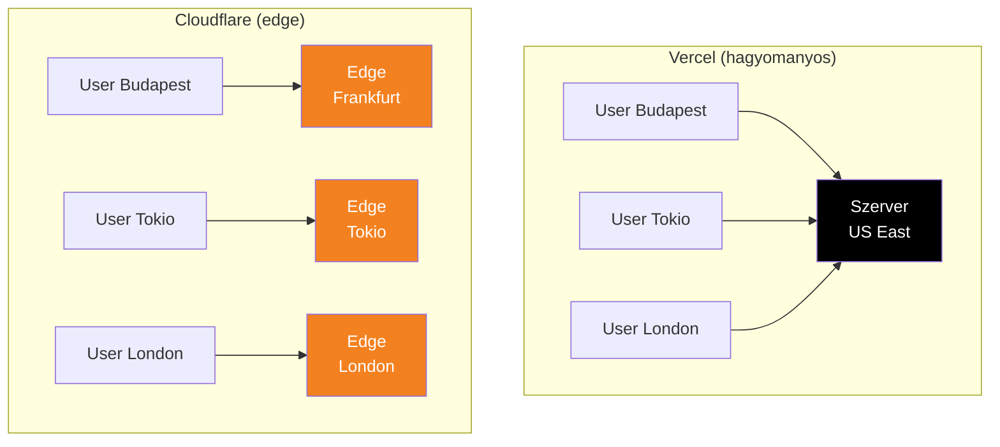
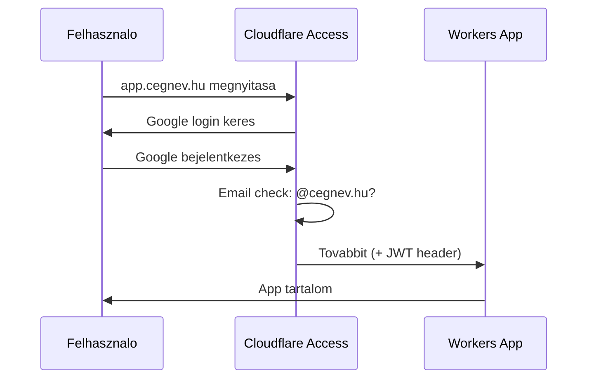

---
tags:
  - hosting
  - edge
  - cloudflare
datum: 2026-03-03
szint: "🏗️ Builder"
kapcsolodo:
  - "[[cloud/vercel|Vercel]]"
  - "[[backend/hono|Hono]]"
  - "[[database/drizzle|Drizzle]]"
  - "[[cloud/railway|Railway]]"
  - "[[database/supabase|Supabase]]"
  - "[[cloud/nextjs-on-cloudflare-workers|Next.js on Cloudflare Workers]]"
  - "[[_moc/moc-deployment|MOC - Deployment]]"
---

# Cloudflare

**Kategoria:** `hosting` (edge platform)
**URL:** https://www.cloudflare.com
**Ar/Terv:** Workers Paid: $5/ho (10M request, 5GB DB, R2 storage)

---

## Mi ez es mire jo?

A **Cloudflare** egy **edge computing platform** -- az appod nem egy szerveren fut, hanem a vilag 300+ adatkozpontjaban egyszerre, a felhasznalohoz legkozelebb.

**Egyszeru analogia:**

A [[cloud/vercel|Vercel]] olyan, mint egy etterem: egy helyrol szolgalsz ki mindenkit.
A Cloudflare olyan, mint egy **franchise halozat**: minden varosban van egy konyha, es mindig a legkozelebbi szolgal ki.



> [!tldr] Egy mondatban
> A Cloudflare egy platform ahol a kodod a felhasznalohoz legkozelebbi szerveren fut, es a $5/ho plan szinte barmilyen kis-kozepes apphoz eleg.

---

## Cloudflare szolgaltatasok attekintese

A Cloudflare nem egy eszkoz, hanem egy **okoszisztema**. A $5/ho plan ezeket mind tartalmazza:

| Szolgaltatas | Mi ez | Analogia |
|---|---|---|
| **Workers** | Kod futtatasa az edge-en | Mint a [[cloud/vercel|Vercel]] Serverless Functions, de gyorsabb |
| **Pages** | Statikus weboldal hosting | Mint a Vercel, de frontend-re optimalizalva |
| **D1** | SQLite adatbazis a felhoben | Mint a [[database/supabase|Supabase]] PostgreSQL, de egyszerubb es olcsobb |
| **R2** | Fajl tarolas (kepek, PDF-ek) | Mint az AWS S3, de **nincs egress fee** |
| **KV** | Kulcs-ertek tar | Mint a [[database/redis|Redis]], de serverless |
| **Queues** | Uzenet sor (aszinkron feldolgozas) | Mint az AWS SQS |
| **Durable Objects** | Allapotmegorzo mini-szerverek | Nincs hasonlo mashol -- egyedi CF koncepcio |
| **Cron Triggers** | Utemezett feladatok | Mint a cron job, de serverless |

---

## Cloudflare vs Vercel vs Railway

| Szempont | **Cloudflare** | [[cloud/vercel|Vercel]] | [[cloud/railway|Railway]] |
|----------|-----------|--------|---------|
| **Ar** | $5/ho | $20/ho (Pro) | Pay-as-you-go (~$5-20/ho) |
| **Frontend** | Pages (statikus) | Next.js nativ (SSR) | Docker (barmi) |
| **Backend** | Workers (edge) | Serverless Functions | Docker kontener |
| **Adatbazis** | D1 (SQLite) | Nincs (kulso kell) | PostgreSQL, MySQL |
| **File storage** | R2 (S3-kompatibilis) | Nincs | Volume mount |
| **Cron jobs** | Cron Triggers (15 perc CPU) | Vercel Cron (60s limit) | Nativ cron |
| **Cold start** | ~0ms (V8 isolate) | 100-500ms | Nincs (always-on) |
| **Mire jo** | API-k, edge logika, belso toolok | Next.js fullstack appok | Barmilyen backend |
| **Mire NEM jo** | Nehez szamitasok, Node.js-only lib-ek | Hosszu futasi ideju processek | Ha olcso hosting kell |

> [!tip] Mikor melyiket valaszd?
> **Cloudflare ($5/ho):** Belso tool, API, kis SaaS → [[backend/hono|Hono]] + React + D1
> **Vercel ($0-20/ho):** Marketing oldal, [[frontend/nextjs|Next.js]] fullstack app → Next.js + Supabase
> **Railway ($5-20/ho):** Ha Docker kell, sajat Postgres, hosszu futasu job-ok

---

## $5/ho plan -- mit kapsz?

| Eroforras | Mennyit kapsz | Mennyit hasznalsz (belso tool) | Eleg? |
|---|---|---|---|
| **Requests** | 10M/ho | ~10-50K/ho | Boven |
| **CPU ido** | 30M ms/ho | ~100K ms/ho | Boven |
| **D1 storage** | 5 GB | < 1 GB (evekig) | Boven |
| **D1 reads** | 25 milliard/ho | ~100K/ho | Boven |
| **D1 writes** | 50M/ho | ~10K/ho | Boven |
| **R2 storage** | $0.015/GB/ho | ~1-5 GB (PDF-ek) | ~$0.07/ho |
| **Cron Triggers** | 15 perc CPU/trigger | < 1 perc | Boven |

> [!success] Osszköltseg egy belso toolra
> **$5/ho fix + ~$0.10 R2** = osszesen **~$5.10/ho**
> Osszehasonlitasul: Vercel Pro = $20/ho + Supabase Pro = $25/ho = **$45/ho**

---

## Cloudflare Access -- belso appok vedelme

A belso appok legfontosabb kerdese: **ki ferhet hozza?** A Cloudflare Access (Zero Trust) megoldja ezt **kod irasa nelkul**.

**Hogyan mukodik:**
1. A Workers app ele teszel egy Access policy-t a Cloudflare dashboardon
2. Aki megnyitja az app URL-jet, Cloudflare bejelentkeztet (Google, GitHub, stb.)
3. Csak az engedelyezett email/domain felhasznalok fernek hozza
4. **Nem kell auth kodot irnod** -- nincs [[backend/clerk|Clerk]], nincs Auth.js, nincs [[backend/jwt|JWT]] kezeles

| Szempont | Cloudflare Access | [[backend/clerk|Clerk]] / Auth.js |
|---|---|---|
| **Koltseg** | Ingyenes (≤ 50 user) | Clerk: $25/ho (Pro) |
| **Beallitas** | Dashboard: 5 perc | Kod: orak |
| **Kod szukseges?** | Nem | Igen (middleware, session, stb.) |
| **SSO** | Google Workspace, Azure AD, GitHub | Provider-fuggo |
| **Mire jo** | Belso tool hozzaferes-vedelem | Publikus app user kezeles |

> [!tip] < 10 fos csapatnak tokeletes
> A Free plan 50 user-t tamogat. Egy belso tool-nal (5-10 ember) **soha nem kell fizetni az auth-ert**.
> Google Workspace-szel integralva: "csak @cegnev.hu email-ek ferjenek hozza" = 2 kattintas.



---

## Ceges belso appok -- use case-ek

A Cloudflare Workers **legjobban belso tooloknal es kis SaaS appknal teljesit**. Alabb konkret use case-ek:

### Pozitiv use case-ek (ezekre tokeletes)

#### 1. Szamlakezelö / invoice dashboard

```
Hono API + D1 (szamlak) + R2 (PDF-ek) + Access (Google login)
Koltseg: $5/ho | Vercel+Supabase alternativa: $45/ho
```

#### 2. CRM / ugyfelkezelo

```
Hono API + D1 (ugyfelek, interakciok) + Access (csapat login)
Koltseg: $5/ho
```

#### 3. Projekt dashboard / reporting

```
Hono API + D1 (projektek, feladatok) + Cron (status check)
Koltseg: $5/ho
```

#### 4. Webhook processor / integracio hub

```
Workers (webhook fogadas) + Queues (feldolgozas) + D1 (log)
Koltseg: $5/ho
```

#### 5. Fajlkezelo / document management

```
Hono API + R2 (fajlok) + D1 (metadata) + Access
Koltseg: $5/ho + ~$0.015/GB storage
```

#### 6. API gateway / belso microservice hub

```
Workers (routing) + Service Bindings (inter-worker hivas)
Koltseg: $5/ho
```

---

## Mikor NE hasznald a Cloudflare-t -- negativ peldak

> [!danger] Fontos
> A Cloudflare Workers **nem mindenre jo**. Ezekben az esetekben **rosszabb valasztas** mint az alternativak.

### 1. Nehez szamitasok (CPU-intenziv feladatok)
**Problema:** Workers-on **30 mp CPU time limit** van, es **128 MB memoria**.

### 2. PostgreSQL-t igenylo appok
**Problema:** A D1 SQLite alapu → **egy writer egyszerre**, max 10GB.
**Alternativa:** [[database/supabase|Supabase]] (PostgreSQL) vagy Neon

### 3. WebSocket-heavy appok (real-time)
**Alternativa:** VPS (Node.js + Socket.io), [[database/supabase|Supabase]] Realtime

### 4. Node.js-specifikus library-k
**Problema:** Workers V8 isolate-ban fut, **nem Node.js-ben**. Sok npm csomag nem mukodik.

### 5. Self-hosting / on-premise kovetelmeny
**Alternativa:** VPS (Hetzner) + [[cloud/docker-alapok|Docker]]

### 6. Long-running background processek
**Alternativa:** VPS vagy [[cloud/railway|Railway]]

---

## Setup -- lepesrol lepesre

### 1. Regisztracio
- https://dash.cloudflare.com → Sign up
- Workers & Pages → Overview → Workers Paid plan ($5/ho)

### 2. CLI (Wrangler) telepites

```bash
npm install -g wrangler
wrangler login
```

### 3. Projekt letrehozas

```bash
# Hono API Worker
npm create hono@latest my-api
# Runtime: cloudflare-workers

# D1 adatbazis
wrangler d1 create my-db

# R2 bucket
wrangler r2 bucket create my-files
```

### 4. Deploy

```bash
cd my-api && wrangler deploy
```

---

## D1 -- az adatbazis

A **D1** egy **SQLite adatbazis a felhoben**.

**[[database/drizzle|Drizzle]] + D1** integracio:

```typescript
import { drizzle } from 'drizzle-orm/d1'
import * as schema from './schema'

// Cloudflare Worker-ben a DB a "binding"-eken keresztul elerheto
const db = drizzle(env.DB, { schema })

const invoices = await db.select().from(schema.invoices)
```

---

## Best Practices

### Biztonsag

- **Secrets:** `wrangler secret put API_KEY` -- titkos kulcsokat soha ne a kodba tedd
- A D1, R2, KV **nem publikusan elerheto** -- csak a Worker-eden belulrol ered el
- Workers automatikusan HTTPS -- nincs HTTP opcio

### Koltsegoptimalizalas

- A $5/ho plan szinte minden belso toolra **boven eleg**
- R2 **egress ingyenes** -- ha sok PDF-et toltesz le, nem fizetsz extra savszelessegert
- Cron Trigger-ek a plan-ban vannak, nem kell kulon fizetni

---

## Hasznos parancsok / kodreszletek

```bash
# Wrangler CLI
wrangler login                    # bejelentkezes
wrangler dev                      # lokalis dev szerver
wrangler deploy                   # production deploy
wrangler tail                     # eles logok (real-time)

# D1 adatbazis
wrangler d1 create mydb           # DB letrehozas
wrangler d1 execute mydb --command "SELECT * FROM invoices"
wrangler d1 migrations apply mydb # migration futtatas

# R2 storage
wrangler r2 bucket create mybucket
wrangler r2 object put mybucket/file.pdf --file=./file.pdf

# Secrets
wrangler secret put API_KEY       # titkos kulcs beallitas
wrangler secret list              # meglevo titkos kulcsok listaja
```

---

## Hasznos linkek

- **Dashboard:** https://dash.cloudflare.com
- **Workers docs:** https://developers.cloudflare.com/workers/
- **D1 docs:** https://developers.cloudflare.com/d1/
- **R2 docs:** https://developers.cloudflare.com/r2/
- **Pages docs:** https://developers.cloudflare.com/pages/
- **Wrangler CLI:** https://developers.cloudflare.com/workers/wrangler/
- **Pricing:** https://developers.cloudflare.com/workers/platform/pricing/
- **Discord:** https://discord.cloudflare.com

---

## Kapcsolodo anyagok

- [[cloud/nextjs-on-cloudflare-workers|Next.js on Cloudflare Workers]] -- fullstack Next.js futtatasa CF Workers-on (OpenNext adapter)
- ViNext -- Next.js reimplementacio Vite-on, kiserleti, 4.4x gyorsabb build
- [[cloud/vercel|Vercel]] -- alternativ hosting (Next.js-re jobb, de dragabb)
- [[backend/hono|Hono]] -- Cloudflare-nativ API framework
- [[backend/express|Express]] -- regi Node.js framework (nem fut CF-en)
- Edge function -- miert jo az edge computing
- [[database/drizzle|Drizzle]] -- ORM ami D1-gyel is mukodik
- [[cloud/railway|Railway]] -- alternativ hosting (Docker, PostgreSQL)
- [[database/supabase|Supabase]] -- alternativ adatbazis platform
- Vercel + Supabase → Cloudflare migracio -- valos projekt retrospektiv a migraciorol
- [[_moc/moc-deployment|MOC - Deployment]] -- deployment strategiak
