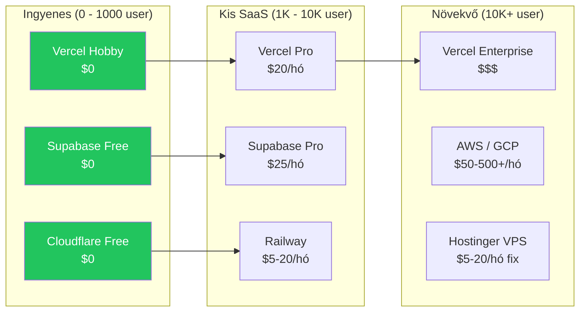
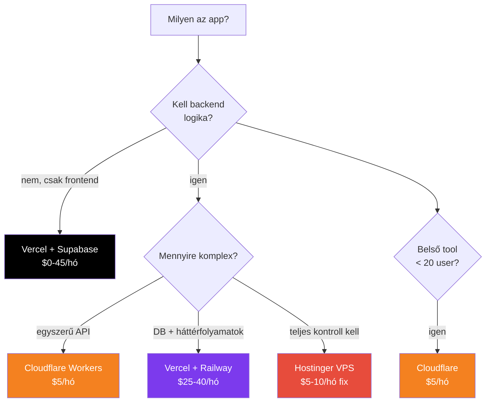

---
tags:
  - hosting
  - deployment
  - business
datum: 2026-03-06
szint: "🧱 Brick"
kapcsolodo:
  - "[[cloud/vercel|Vercel]]"
  - "[[cloud/railway|Railway]]"
  - "[[cloud/cloudflare|Cloudflare]]"
  - "[[cloud/hostinger|Hostinger]]"
  - "[[database/supabase|Supabase]]"
  - "[[cloud/saas-mvp-deployment|SaaS MVP Deployment]]"
  - "[[cloud/aws-gcp-basics|Felhő szolgáltatók alapjai]]"
  - "[[_moc/moc-deployment|MOC - Deployment]]"
---

# Hosting költségbecslés

## Összefoglaló

Mikor melyik platform éri meg SMB szemszögből? Ez a jegyzet összehasonlítja a hosting költségeket különböző skálán, és segít eldönteni melyik stack a leggazdaságosabb a projekted méretéhez. A [[cloud/saas-mvp-deployment|SaaS MVP Deployment]] jegyzet a leggyorsabb utat mutatja -- ez a jegyzet a **költség** oldalát részletezi.

## Költség összehasonlítás: platformonként



## Részletes költségtáblázat

### Frontend hosting

| Platform | Free tier | Pro | Mire figyelj |
|----------|-----------|-----|-------------|
| [[cloud/vercel|Vercel]] | $0 (100GB BW, 6k perc/hó build) | $20/hó/csapattag | Bandwidth overage: $40/100GB |
| [[cloud/cloudflare|Cloudflare]] Pages | $0 (500 build/hó) | $5/hó (Workers Paid) | Nagyon bőkezű free tier |
| Netlify | $0 (100GB BW, 300 perc build) | $19/hó | Hasonló a Vercelhez |

### Backend hosting

| Platform | Minimum | Tipikus SMB | Mire figyelj |
|----------|---------|-------------|-------------|
| [[cloud/railway|Railway]] | $5/hó kredit | $5-20/hó | Usage-based: CPU + RAM + disk + network |
| [[cloud/hostinger|Hostinger]] VPS | ~$5/hó (KVM 1) | $5-10/hó | Fix ár, de te üzemelteted |
| Fly.io | $0 (3 shared VM) | $5-15/hó | Hasonló Railway-hez |
| Render | $0 (spin down) | $7-25/hó | Free tier alszik 15 perc inaktivitás után |

### Adatbázis

| Platform | Free tier | Pro | Limit amire figyelj |
|----------|-----------|-----|---------------------|
| [[database/supabase|Supabase]] | $0 (500MB DB, 1GB storage) | $25/hó | 500MB DB gyorsan megtelik képekkel |
| Neon (PostgreSQL) | $0 (512MB, auto-suspend) | $19/hó | Free tier elalszik inaktivitás után |
| PlanetScale (MySQL) | Megszűnt free tier | $39/hó | Drága, de jó skálázás |
| Railway PostgreSQL | $5/hó kredit része | ~$3-7/hó | Usage-based pricing |

### Domain és DNS

| Szolgáltatás | Költség |
|-------------|---------|
| Domain (.com) | ~$10-13/év |
| [[cloud/cloudflare|Cloudflare]] DNS | Ingyenes |
| SSL tanúsítvány | Ingyenes (Let's Encrypt / platform automatikus) |

## Tipikus stack költségek (havi)

### 1. MVP / Prototípus (0-100 user)

```
Vercel Hobby          $0
Supabase Free         $0
Cloudflare Free       $0
Domain                $1/hó (~$10/év)
─────────────────────────
Összesen:             ~$1/hó
```

> [!tip] MVP-nél ne optimalizálj költségre
> Az első 100-1000 felhasználóig a free tier-ek bőven elegendőek. Építsd meg először -- a költség optimalizálás a növekedéssel jön.

### 2. Kis SaaS (100-5000 user)

```
Vercel Pro            $20/hó
Supabase Pro          $25/hó
Cloudflare Workers    $5/hó
Railway (API)         $10/hó
Domain                $1/hó
Sentry (error track)  $0 (free tier)
UptimeRobot           $0 (free)
─────────────────────────
Összesen:             ~$61/hó
```

### 3. Belső tool / Dashboard (5-20 user)

```
Cloudflare Workers    $5/hó  (Hono API + D1 + R2)
Cloudflare Access     $0     (auth, < 50 user free)
Domain                $1/hó
─────────────────────────
Összesen:             ~$6/hó
```

> [!info] Belső toolokra a [[cloud/cloudflare|Cloudflare]] a legolcsóbb
> Ha nem kell PostgreSQL és nem publikus az app, a Workers + D1 + Access stack mindent megold $5/hó-ért. Összehasonlításul: [[cloud/vercel|Vercel]] Pro + [[database/supabase|Supabase]] Pro = $45/hó.

### 4. Self-hosted stack (VPS)

```
Hostinger VPS (KVM 2) $8/hó   (2 vCPU, 8GB RAM)
Domain                $1/hó
Cloudflare DNS        $0
─────────────────────────
Összesen:             ~$9/hó
```

De: több karbantartási munka (SSH, Docker, backup, security).

### 5. Nagy SaaS (10k+ user)

```
Vercel Pro            $20/hó + bandwidth overage
Supabase Pro          $25/hó + compute overage
Railway               $20-50/hó
Sentry Pro            $26/hó
Betterstack           $24/hó
─────────────────────────
Összesen:             ~$120-170/hó
```

## Mikor melyik platformot válaszd?



## Rejtett költségek amikre figyelj

| Rejtett költség | Platform | Hogyan kerüld el |
|----------------|----------|-----------------|
| **Bandwidth overage** | Vercel, Netlify | Képek optimalizálás, CDN cache |
| **Function invocations** | Vercel, AWS Lambda | Szükségtelen API hívások csökkentése |
| **Database compute** | Supabase, Neon | Connection pooling, query optimalizálás |
| **Egress fee** | AWS, GCP | Cloudflare R2 (nincs egress), cache |
| **Csapattag díj** | Vercel Pro ($20/fő) | Egy admin account, deploy token-nel |
| **Log megőrzés** | Vercel (1 óra Hobby) | Log drain ingyenes service-be |

> [!warning] AWS/GCP költség csapda
> A nagy felhő szolgáltatóknál a számlák **kiszámíthatatlanok** lehetnek. Egy elfelejtett EC2 instance, egy túl nagy S3 bucket, vagy egy rosszul konfigurált Lambda = $100+ meglepetés. Mindig állíts be **billing alert**-et. Lásd: [[cloud/aws-gcp-basics|Felhő szolgáltatók alapjai]].

## Költség optimalizálási tippek

1. **Kezdd free tier-rel** -- ne fizess amíg nem kell
2. **Képek optimalizálása** -- `next/image`, WebP, lazy loading → kevesebb bandwidth
3. **API hívások csökkentése** -- cache, `stale-while-revalidate`, debounce
4. **Egy platform** -- ne szórd szét sok helyre, nehezebb követni a költségeket
5. **Éves fizetés** -- a legtöbb platform 20-30% kedvezményt ad éves tervre
6. **Monitoring** -- tudd mire megy a pénz, mielőtt optimalizálsz

## Mikor használd / Mikor NE

**Számold ki előre:**
- Ügyfélnek számlázod a hosting-ot → tudnod kell mennyibe kerül
- SaaS unit economics → hosting a COGS része
- Több platform közül választasz → össze kell hasonlítani

**NE optimalizálj túl korán:**
- MVP fázisban -- a fejlesztői időd drágább mint a hosting
- Ha a free tier elég -- ne válts fizetősre "pro" legyen
- Ha nincs mérési alap -- előbb mérd meg, aztán optimalizálj

## Kapcsolódó

- [[cloud/saas-mvp-deployment|SaaS MVP Deployment]] — leggyorsabb út az ötlettől a production-ig
- [[cloud/vercel|Vercel]] — frontend hosting árazás
- [[cloud/railway|Railway]] — backend hosting árazás
- [[cloud/cloudflare|Cloudflare]] — $5/hó edge platform
- [[cloud/hostinger|Hostinger]] — fix árú VPS hosting
- [[database/supabase|Supabase]] — managed backend árazás
- [[cloud/aws-gcp-basics|Felhő szolgáltatók alapjai]] — mikor érdemes big cloud-ra váltani
