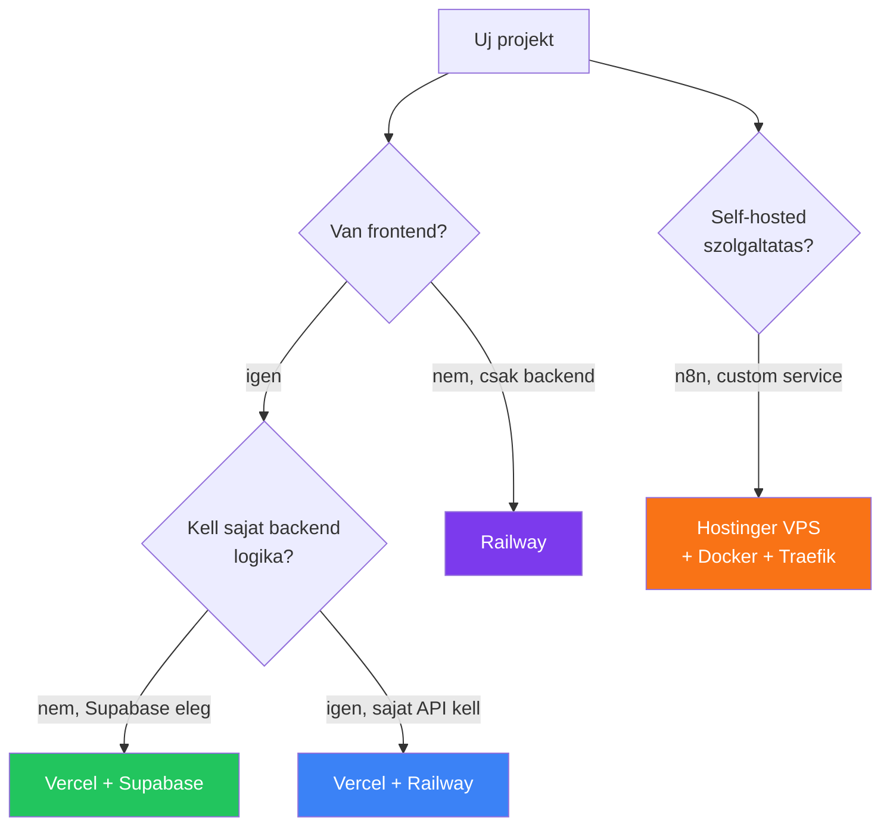

---
tags:
  - deployment
  - devops
  - checklist
datum: 2026-03-06
szint: "🧱 Brick"
kapcsolodo:
  - "[[_moc/moc-deployment|MOC - Deployment]]"
  - "[[cloud/12-faktoros-alkalmazas-epites|12 Faktoros alkalmazas epites]]"
  - "[[cloud/docker-alapok|Docker alapok]]"
  - "[[cloud/docker-compose|Docker Compose]]"
---

# Belso deployment checklist

> [!info] Kinek szol?
> Ez egy belso checklist a csapatnak. Claude Code-dal dolgozunk -- de deploy elott vegig kell menni ezeken a lepeseken, mert a legtobb production bug es security issue megelözheto.

---

## Univerzalis checklist (MINDEN deploy elott)

Ezek stack-fuggetlenek -- **mindig** vegig kell rajtuk menni.

### Kod minoseg

- [ ] **Claude Code `/review`** -- futtasd le a repon, nezd at a javaslatokat
- [ ] **Nincs hardcoded secret** a kodban (API key, jelszo, token) -- minden `.env`-ben van
- [ ] **`.env.example` fajl** naprakesz -- minden env valtozo benne van leirassal
- [ ] **`.gitignore`** tartalmazza: `.env`, `.env.local`, `node_modules/`, `.next/`, `dist/`
- [ ] **Nincs `console.log`** production kodban (debug logok kitakaritva)
- [ ] **Error handling** -- API hivasok `try/catch`-ben, user-facing hibaüzenetek ertelmesek

### Security

- [ ] **Aikido** -- GitHub repo csatlakoztatva, scan lefutott, CRITICAL/HIGH NINCS
- [ ] **Dependency audit** -- `bun audit` vagy `npm audit`, nincs ismert CVE
- [ ] **API rate limiting** -- minden publikus endpoint-on van (kulonosen auth, form submit)
- [ ] **CORS** -- csak a sajat domain-ek engedelyezve, nem `*`
- [ ] **Input validacio** -- user input MINDIG validalva server-side (Zod, vagy SQL parameterezés)
- [ ] **Auth ellenorzes** -- vedett route-ok tenyleg vedettek (nem csak frontend-en)
- [ ] **HTTP headers** -- `X-Frame-Options`, `Content-Security-Policy`, `Strict-Transport-Security`

> [!warning] Fontos
> Ha nem vagy biztos egy security kerdesben, kerdezd meg Claude Code-ot: *"Van security vulnerability ebben a kodban?"* -- megtalálja a legtobbet.

### Git es verziokezeles

- [ ] **Minden commitolva** -- `git status` tiszta
- [ ] **Feature branch**-rol merge-oltel main-be (nem kozvetlenul main-re push)
- [ ] **PR review** megtortent (akar Claude Code `/review`, akar kollega)
- [ ] **Nincs merge conflict** -- clean merge

### Teszteles

- [ ] **Lokalisan mukodik** -- `npm / bun run build` hiba nelkul lefut
- [ ] **Alap user flow tesztelve** -- regisztracio/login, fo funkciok, form submit
- [ ] **Mobile nezet** ellenorizve (responsive)
- [ ] **404 es error page-ek** -- mukodnek, nem ures feher kepernyo

---

## Stack-specifikus checklistek

### [[database/supabase|Supabase]] + [[cloud/vercel|Vercel]] (Next.js app)

Ez a leggyakoribb stack: [[frontend/nextjs|Next.js]] frontend [[cloud/vercel|Vercel]]-en, [[database/supabase|Supabase]] backend (DB + Auth + Storage).

#### Supabase

- [ ] **RLS (Row Level Security)** -- MINDEN tablan BE van kapcsolva, policy-k tesztelve
- [ ] **Supabase Advisors** lefuttatva -- Dashboard → Advisors → Security + Performance
- [ ] **Database migration-ok** rendben -- `supabase db push` vagy migration fajlok
- [ ] **Anon key** csak publikus muveletekhez van hasznalva (RLS vedi!)
- [ ] **Service role key** SOHA nincs kliens oldalon -- csak server-side / Edge Function
- [ ] **Auth provider-ek** konfigurálva -- redirect URL-ek production domain-re allitva
- [ ] **Storage bucket policy-k** -- publikus/privat bucket-ek megfeleloen beallitva
- [ ] **Edge Function-ok** deployolva -- `supabase functions deploy`

> [!tip] Supabase security one-liner
> Claude Code-ban: *"Futtasd le a Supabase advisors-t es mondd meg mi a baj"* -- az MCP tool megcsinalja.

#### Vercel

- [ ] **Environment variables** -- Vercel Dashboard → Settings → Env Variables feltoltve
  - `NEXT_PUBLIC_SUPABASE_URL`
  - `NEXT_PUBLIC_SUPABASE_ANON_KEY`
  - `SUPABASE_SERVICE_ROLE_KEY` (nem `NEXT_PUBLIC_`!)
  - Egyeb API key-ek
- [ ] **Domain** beallitva -- custom domain + SSL automatikus
- [ ] **Preview deployment** tesztelve -- Vercel PR preview-n atnezve
- [ ] **Build log** -- nincs warning ami production-ban problema lehet
- [ ] **Serverless function timeout** -- ha kell, novelve (alapbol 10s Hobby-n)
- [ ] **Analytics** bekapcsolva -- Vercel Analytics vagy PostHog

---

### [[cloud/railway|Railway]] (backend / API / service)

Amikor sajat backend kell: API szerver, hatterfolyamatok, worker-ek, vagy sajat DB.

- [ ] **Dockerfile** vagy **Nixpacks** -- Railway felismeri a buildkonfigot
- [ ] **Health check endpoint** -- `GET /health` → 200 OK (Railway ezt figyeli)
- [ ] **Environment variables** -- Railway Dashboard-on beallitva
- [ ] **Start command** helyes -- `bun run start` vagy `node dist/index.js`
- [ ] **Port** -- az app a `PORT` env változobol olvassa (Railway dinamikusan adja)
- [ ] **Persistent storage** -- ha kell, volume csatolva (pl. SQLite, fajlok)
- [ ] **Auto-deploy** -- GitHub repo csatlakoztatva, main branch deploy automatikus
- [ ] **Resource limits** -- nem fut el a memoria/CPU (Railway Dashboard → Metrics)
- [ ] **Database backup** -- ha Railway DB-t hasznalsz, backup konfigurálva
- [ ] **Restart policy** -- automatikus ujrainditas crash eseten

> [!tip] Railway + Docker
> Ha `Dockerfile` van a repoban, Railway automatikusan azt hasznalja. Ha nincs, Nixpacks probalja kitalalni -- de mindig jobb ha van explicit Dockerfile. Lasd [[cloud/docker-alapok|Docker alapok]].

---

### Hetzner / [[cloud/hostinger|Hostinger]] VPS (sajat szerver)

Amikor teljes kontroll kell: n8n, self-hosted szolgaltatasok, vagy egyedi setup.

#### Szerver setup

- [ ] **SSH kulcs** beallitva -- jelszavas login KIKAPCSOLVA
- [ ] **Firewall (UFW)** -- csak a szukseges portok nyitva (22, 80, 443)
- [ ] **Fail2ban** telepitve -- brute force vedelem SSH-ra
- [ ] **Automatikus frissitesek** -- `unattended-upgrades` bekapcsolva
- [ ] **Non-root user** -- az app nem root-kent fut

#### App deploy

- [ ] **Docker** -- az app kontenerben fut, nem kozvetlenul a szerveren
- [ ] **[[cloud/docker-compose|Docker Compose]]** -- `docker-compose.yml` definialja a service-eket
- [ ] **Reverse proxy** -- [[cloud/nginx|Nginx]] vagy [[cloud/traefik|Traefik]] a kontener elott (SSL terminalas)
- [ ] **SSL tanusitvany** -- Let's Encrypt (Certbot) vagy [[cloud/traefik|Traefik]] automatikus
- [ ] **Domain DNS** -- A record a szerver IP-re mutat
- [ ] **Logok** -- `docker logs` elerheto, nem telik meg a disk
- [ ] **Monitoring** -- Grafana + Prometheus vagy legalabb uptime check (UptimeRobot)
- [ ] **Backup** -- adatbazis volume rendszeres mentese (cron + rsync/rclone)

#### Ha n8n fut rajta

- [ ] **n8n** Docker kontenerben fut, volume-mal a flow-knak
- [ ] **Webhook URL** -- publikusan elerheto (Traefik/Nginx mogott, SSL-lel)
- [ ] **n8n credentials** -- ne legyen plaintext, n8n sajat encryption-t hasznal
- [ ] **Execution data takaritas** -- regi execution-ok torlese (memoria!)
- [ ] **Tailscale** -- ha a szerver nem publikus, Tailscale VPN-en keresztul erheto el

---

## Deploy utani ellenorzes (MINDEN stack)

- [ ] **Eles URL betolt** -- nem 500, nem 404, nem ures
- [ ] **Login/auth mukodik** -- production-ben is, nem csak lokalisan
- [ ] **Fo user flow** vegigmegy -- az amit az ugyfel hasznalni fog
- [ ] **Mobile-on is mukodik** -- telefonrol tesztelve
- [ ] **HTTPS** -- zold lakat, nincs mixed content warning
- [ ] **Aikido** scan ujra -- deploy utan is lefuttatni
- [ ] **Error monitoring** -- bekapcsolva (Vercel/Railway logok, vagy Sentry)
- [ ] **Ugyfelnek kommunikalva** -- URL, belepesi adatok, barmilyen instrukció

---

## Gyors dontesi fa: melyik stack-et hasznald?

## Claude Code tippek deploy-hoz

Ezeket a promptokat hasznald Claude Code-ban deploy korul:

| Mikor | Prompt |
|-------|--------|
| Kod review | `/review` vagy *"nezd at a kodot security szempontbol"* |
| Env check | *"van hardcoded secret vagy API key a kodban?"* |
| Build hiba | *"miert nem buildel? itt a hibaüzenet: [paste]"* |
| Supabase RLS | *"ellenorizd hogy minden tablan van-e RLS policy"* |
| Docker help | *"irj Dockerfile-t ehhez a Next.js projekthez"* |
| SSL setup | *"hogyan allitsak be Let's Encrypt-et Traefik-kel?"* |

## Kapcsolodo

- [[_moc/moc-deployment|MOC - Deployment]]
- Aikido
- [[cloud/12-faktoros-alkalmazas-epites|12 Faktoros alkalmazas epites]]
- [[cloud/docker-alapok|Docker alapok]]
- [[cloud/docker-compose|Docker Compose]]
- Env valtozok Next.js-ben
- Tailscale
