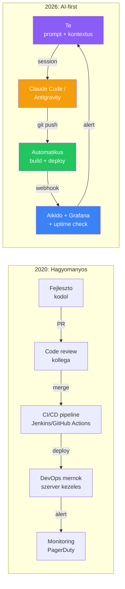
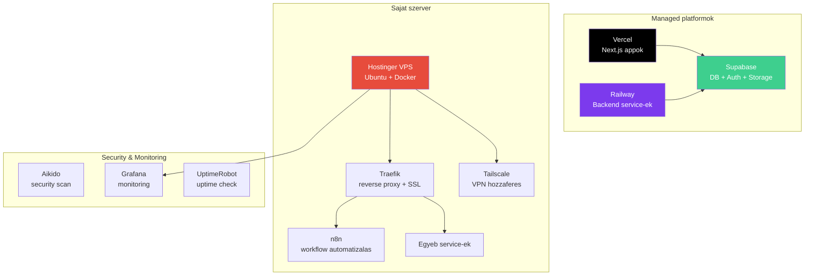
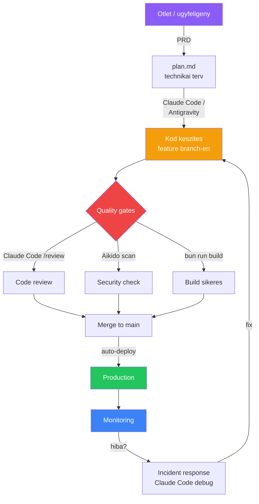

---
tags:
  - devops
  - deployment
datum: 2026-03-06
szint: "🏗️ Builder"
kapcsolodo:
  - "[[cloud/docker-alapok|Docker alapok]]"
  - "[[cloud/docker-compose|Docker Compose]]"
  - "[[cloud/kubernetes-bevezeto|Kubernetes bevezeto]]"
  - "[[cloud/railway|Railway]]"
  - "[[cloud/vercel|Vercel]]"
  - "[[cloud/deployment-checklist|Deployment checklist]]"
  - "[[cloud/hostinger|Hostinger]]"
  - "[[cloud/12-faktoros-alkalmazas-epites|12 Faktoros alkalmazás építes]]"
  - "[[foundations/linux|Linux]]"
  - "[[foundations/szoftverfejlesztes-alapjai|Szoftverfejlesztes alapjai]]"
---

# DevOps

A **DevOps** a fejlesztes (Development) és az üzemeltetés (Operations) összekapcsolasa. 2026-ban ez a ket szerepkor teljesen osszeolvadt -- kulonosen kis csapatoknal ahol AI agentek irjak a kódot. Aki Claude Code-dal fejleszt, az egyben "DevOps" is: buildel, deployol, monitoroz.

> [!tldr] DevOps 2026-ban, egy mondatban
> Nem kell DevOps mernoknek lenned -- de tudnod kell hogyan jut el a kod a usertol a production-ig, és mi tortenik ha valami elromlik. Az AI megirja a kódot, de a **pipeline a te felelösseged**.

---

## A DevOps evolucioja: hagyomanyos → AI-first



| Szempont            | Hagyomanyos DevOps             | AI-first DevOps (2026)                           |
| ------------------- | ------------------------------ | ------------------------------------------------ |
| **Ki kódol**        | Fejleszto                      | Claude Code / Antigravity                        |
| **Ki reviewol**     | Kollega                        | AI (`/review`) + Aikido                          |
| **CI/CD**           | Jenkins, komplex YAML          | Vercel auto-deploy, Railway auto-build           |
| **Infrastruktura**  | Terraform, Ansible, Puppet     | Docker Compose + managed platformok              |
| **Monitoring**      | Dedikalt SRE csapat            | Grafana + UptimeRobot + alertek                  |
| **Szükséges tudas** | Mely Linux, hálózat, scripting | Pipeline ertese, prompt engineering, hibakereses |
| **Csapat meret**    | 5-10 fos dev + 2-3 ops         | 1-3 fos csapat AI toolokkal                      |

---

## Mi a DevOps egy AI-first csapatban?

Non-technical emberek AI agentek segitsegevel fejlesztenek. A "DevOps" feladatok nem tuntek el -- csak **mashogy csinálják**:

### 1. Build & Deploy pipeline

**Regen:** Jenkins YAML-okat irtal, multi-stage pipeline-t konfigoltal.
**Most:** A platform csinálja.

| Stack | Hogyan deployolsz | Automatikus? |
|-------|-------------------|-------------|
| [[cloud/vercel|Vercel]] + [[frontend/nextjs|Next.js]] | `git push main` → Vercel auto-build | Igen |
| [[cloud/railway|Railway]] | `git push` → Railway auto-detect + build | Igen |
| [[cloud/hostinger|Hostinger]] VPS | SSH + `docker compose up -d` | Nem (kezi) |
| [[database/supabase|Supabase]] Edge Functions | `supabase functions deploy` | Felautomata |

> [!tip] A managed platformok (Vercel, Railway) a DevOps 80%-at megoldjak
> Nem kell CI/CD-t konfigurálnod -- push = deploy. Ezert használjuk ezeket SMB projekteknél.

A VPS az egyetlen ahol tényleg "DevOps" munkat kell vegezni: SSH, tuzfal, Docker, SSL. Részletek: [[foundations/linux|Linux]], [[cloud/docker-alapok|Docker alapok]].

### 2. Code review & Quality gates

**Regen:** Senior fejleszto nezett ra a kodra.
**Most:** AI + automatizalt toolok:

```bash
# Claude Code-ban:
/review                           # AI code review az egesz repora

# Automatizalt:
# Aikido -- GitHub-ra kotve, minden push-nal fut
# bun audit -- dependency vulnerability check
```

A teljes checklist: [[cloud/deployment-checklist|Deployment checklist]]

### 3. Security

Az AI kod security review nelkul veszelyes -- az LLM nem gondol OWASP-ra magatol.

**Security pipeline ami minden projektnel kell:**

1. **Aikido** -- GitHub-ra kotve, automatikus scan minden push-nal
2. **Claude Code `/review`** -- kezi trigger, security fokusszal is kerheto
3. **Dependency audit** -- `bun audit` (ismert CVE-k a csomagokban)
4. **Supabase Advisors** -- RLS policy-k, security config ellenőrzes
5. **Rate limiting** -- minden publikus API endpoint-on

> [!warning] Az AI-generalt kod legnagyobb kockazata
> Claude Code jol kódol, de **nem gondol a security-re proaktivan** -- te kered ra. Mindig futtass Aikido-t és kerdezd még: *"Van security vulnerability ebben a kódban?"*

### 4. Monitoring & Observability

Deploy utan tudnod kell mi tortenik. A minimum:

| Mit figyelsz | Eszkoz | Hogyan |
|-------------|--------|--------|
| **App elérheto-e** | UptimeRobot (ingyenes) | Ping check 5 percenkent, email alert |
| **Szerver metrics** | Grafana + Prometheus | CPU, RAM, disk a VPS-en |
| **App hibak** | Vercel/Railway logok | Dashboard-on nezed, vagy Sentry |
| **Security** | Aikido | Folyamatos scanning, email alert |
| **Workflow-ok** | n8n execution history | Sikertelen futasok figyelese |

### 5. Infrastruktura menedzsment

**Nem Terraform-rol van szo** -- hanem arról hogy tudd hol mi fut és hogyan.

A tipikus infra:



---

## Claude Code mint DevOps tool

A Claude Code nem csak kódot ir -- DevOps feladatokra is használhatod:

### Dockerfile generalas

```bash
# Claude Code session-ben:
"Irj egy production-ready Dockerfile-t ehhez a Next.js projekthez,
multi-stage build-del, non-root user-rel"
```

### Docker Compose debug

```bash
"A docker compose up -d utan a web service nem indul el,
itt a docker compose logs output: [paste]"
```

### Szerver konfigurálas

```bash
# Lokalisan generaltarod, SSH-val felrakod:
"Generalj egy Traefik config-ot ami SSL-t kezel Let's Encrypt-tel,
es reverse proxy-zza az n8n-t a 5678-as porton"
```

### Security audit

```bash
/review                          # Altalanos code review
"Van SQL injection vagy XSS vulnerability ebben a kodban?"
"Ellenorizd hogy minden Supabase tablan van-e RLS policy"
```

### Incident response

```bash
# Ha valami elromlik production-ben:
"Ez a hibauzenet jon a Vercel logbol: [paste]. Mi okozhatja?"
"A Railway service restart-ol folyamatosan, itt a log: [paste]"
```

---

## A modern DevOps pipeline



**A lényeg:** a pipeline nagy resze automatizalt. A feladatod:
1. **Definiálalizalni** mit kell építeni (PRD, plan.md)
2. **Orchestralni** az AI agent munkajat (CLAUDE.md, kontextus)
3. **Vegigmenni** a quality gate-eken ([[cloud/deployment-checklist|Deployment checklist]])
4. **Figyelni** a production-t (monitoring, alertek)
5. **Reagalni** ha valami elromlik (incident → Claude Code debug)

---

## Milyen DevOps tudas kell 2026-ban?

Nem kell mindenhez ertened -- de ezek a "must know" teruletek:

| Terulet | Minimum tudas | Kapcsolodo |
|---------|--------------|------------|
| **[[foundations/git-es-github|Git és GitHub]]** | Branch, merge, PR, `.gitignore` | [[foundations/git-es-github|Git és GitHub]] |
| **[[cloud/docker-alapok|Docker]]** | Dockerfile, image, container, volume | [[cloud/docker-alapok|Docker alapok]] |
| **[[cloud/docker-compose|Docker Compose]]** | Multi-service setup, `docker compose up/down` | [[cloud/docker-compose|Docker Compose]] |
| **[[foundations/linux|Linux]]** | SSH, alap parancsok, fájlrendszer, UFW | [[foundations/linux|Linux]] |
| **DNS & SSL** | Domain beállítás, HTTPS, Let's Encrypt | -- |
| **Env változók** | `.env`, `NEXT_PUBLIC_`, platform env config | Env változók Next.js-ben |
| **Networking** | Port, IP, firewall, reverse proxy alapok | [[foundations/halozatok-es-ip-cimek|Hálózatok és IP cimek]] |

**Amit NEM kell tudnod** (2026-ban, kis csapatnal):
- Terraform / Infrastructure as Code (managed platformok megoldjak)
- Kubernetes production cluster kezeles (Railway/Vercel helyettesiti)
- Komplex CI/CD pipeline iras (auto-deploy platformok)
- Load balancing konfigurálas (CDN / platform szintén megvan)

---

## Kapcsolodo vault note-ok

- [[cloud/docker-alapok|Docker alapok]] -- konténerizacio alapjai
- [[cloud/docker-compose|Docker Compose]] -- több service orchestralasa lokálisan
- [[cloud/kubernetes-bevezeto|Kubernetes bevezeto]] -- konténerek skálázasa klaszterben
- [[cloud/railway|Railway]] -- egyszerűsitett deploy platform
- [[cloud/vercel|Vercel]] -- frontend deploy és CDN
- Grafana -- monitoring és dashboard-ok
- Tailscale -- biztonságos hálózat szerverek kozott
- [[cloud/deployment-checklist|Deployment checklist]] -- deploy elotti ellenőrzo lista
- [[foundations/linux|Linux]] -- a szerver OS amit mindez alatt futtatunk
- [[cloud/hostinger|Hostinger]] -- VPS hosting ahol a Docker konténerek futnak
- Aikido -- security scanning platform
- [[cloud/12-faktoros-alkalmazas-epites|12 Faktoros alkalmazás építes]] -- cloud-native alkalmazás elvek
- [[foundations/szoftverfejlesztes-alapjai|Szoftverfejlesztes alapjai]] -- a teljes fejlesztesi workflow
- n8n workflow automatizacio -- workflow automatizacio a VPS-en
