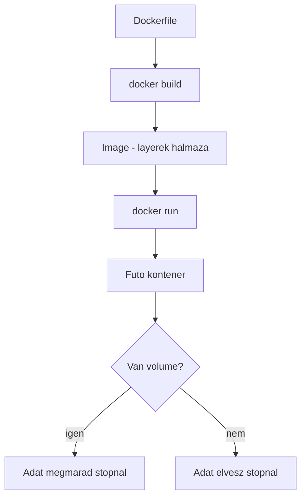

---
tags:
  - docker
  - devops
datum: 2026-02-08
szint: "🌱 Newcomer"
kapcsolodo:
  - "[[cloud/docker-compose|Docker Compose]]"
  - "[[cloud/kubernetes-bevezeto|Kubernetes bevezeto]]"
  - "[[foundations/halozatok-es-ip-cimek|Hálózatok és IP cimek]]"
  - "[[_moc/moc-docker|MOC - Docker]]"
  - "[[_moc/moc-deployment|MOC - Deployment]]"
---

# Docker alapok

## Összefoglaló

A Docker lehetővé teszi, hogy alkalmazásokat izolált konténerekben futtass. Minden konténer tartalmazza az appot és az összes függőséget, így bárhol ugyanúgy fut -- legyen az a saját géped, egy szerver, vagy a felhő.

## Jegyzetek

### Mi az a Docker és miért kell?

- Megoldja a "nálam működik" problémat -- a konténer mindenhol ugyanúgy fut
- Könnyű, gyors, nem egy teljes virtuális gep (VM) -- csak az app és ami kell hozzá
- Fejleszteshez, teszteléshez és deployhoz is ugyanaz az environment

## Build flow



### Dockerfile -- az uzembehelyezesi leiras

A `Dockerfile` egy lépésenkenti recept ami megmondja hogyan epuljon fel a konténer.

```dockerfile
FROM node:20-alpine       # Alap image (mibol indulunk ki)
WORKDIR /app              # Munkakonyvtar a kontenerben
COPY package*.json ./     # Fajlok bemasolasa
RUN npm install           # Parancs futtatasa build kozben
COPY . .                  # A tobbi fajl bemasolasa
EXPOSE 3000               # Melyik portot hasznalja
CMD ["npm", "start"]      # Mit futtasson indulaskor
```

**UFS (Union File System):** A Dockerfile egymas utani retegeket (layer) hoz letre. Minden `RUN`, `COPY`, `ADD` parancs egy új reteg. Ha egy reteg nem valtozik, Docker cache-bol használja -- ezert gyorsabb a rebuild.

> [!tip] Cache-barat sorrend a Dockerfile-ban
> Mindig a **ritkan változó dolgok jonnek elore** (pl. `COPY package.json` + `RUN npm install`), és a **surun változó kod utoljara** (`COPY . .`). Ha forditva csinálod, minden kodvaltozasnal ujra telepíti az összes csomagot.

### Docker image kezeles

| Parancs | Mit csinál |
|---------|------------|
| `docker build -t appnev .` | Image építese a Dockerfile-bol |
| `docker tag nginx nginx:v1.0` | Image megjelolese nevvel és verzióval |
| `docker images` | Helyi image-ek listazasa |

### Konténer futtatasa

| Parancs | Mit csinál |
|---------|------------|
| `docker run image-nev` | Konténer indítasa |
| `docker run -d image-nev` | Háttérben futtatas (detached) |
| `docker run -p 3000:3000 image-nev` | Port kivezetese (host:konténer) |
| `docker ps` | Futo konténerek listazasa |
| `docker stop kontener-id` | Konténer leallitasa |

### Volumeok -- adat megosztas

```bash
docker run -v /host-home/dir:/container/home/dir image-nev
```

A `-v` (volume) osszekoti a saját géped egy könyvtárat a konténer egy könyvtáraval. Így:
- A konténer a saját könyvtáradba ment adatot
- Ha a konténer meghal, az adat megmarad
- Fejleszteskor a kódod változásait is látja a konténer

### Registry -- image-ek tárolása és megosztasa

A registry egy kozponti hely ahova feltoltod az image-eket és ahonnan masok (vagy a szerver) lehuzzak.

| Registry | Mire jó |
|----------|---------|
| Docker Hub | Publikus registry, alapértelmezett |
| GitHub Container Registry | [[foundations/git-es-github|Git és GitHub]]-hoz kotott, privat is lehet |
| GitLab Container Registry | GitLab projektekhez |
| Saját/ceges registry | Pl. saját hosted registry |

```bash
docker login registry-url                       # Bejelentkezes
docker push registry-url/image:tag             # Feltoltes
docker pull registry-url/image:tag             # Lehuzas
```

### Hasznos hibakereso parancsok

```bash
# Ki hasznalja a portot?
lsof -i :3000

# Keresd meg a futo process-t:
ps aux | grep "next"

# Old meg egyszerre az osszeset:
pkill -f "next dev"
```

## Fo tanulsagok
- A Dockerfile retegekbol all -- a sorrend szamit a cache hatékonysaga miatt
- Volume nelkul a konténer adatai elvesznek ha a konténer megall
- A registry olyan mint a GitHub, csak image-eknek -- push/pull logika
- Mindig adj verziót a tag-nek (`app:1.0`), ne csak `latest`-et használj

## Kapcsolodo anyagok
- [[cloud/docker-compose|Docker Compose]]
- [[cloud/kubernetes-bevezeto|Kubernetes bevezeto]]
- [[foundations/halozatok-es-ip-cimek|Hálózatok és IP cimek]]
- Tailscale
- [[_moc/moc-docker|MOC - Docker]]
- [[_moc/moc-deployment|MOC - Deployment]]
- [Container Patterns (GitHub)](https://github.com/luebken/container-patterns/tree/master)
- [Bash set flags magyarazat](https://gist.github.com/mohanpedala/585292a6bf844c4b9c94635a1038ced3)
- [ByteByteGo YouTube](https://www.youtube.com/@ByteByteGo)

## Takaritas és karbantartas

### Minden futo container leallitasa

```bash
docker stop $(docker ps -q)
```

### Minden container törlése (volume MARAD)

```bash
docker rm $(docker ps -aq)
```

Vagy ha [[cloud/docker-compose|Docker Compose]] projekten belul akarod:

```bash
# Leallit + torol, de volume-ok maradnak
docker compose down
```

> [!warning] Figyelem
> A `docker compose down` alapbol NEM torli a volume-okat. Csak a `--volumes` / `-v` flag törölne -- azt ne használd, hacsak nem szandekos.

### Hasznos takarito parancsok (volume-okhoz nem nyulnak)

- `docker system prune` -- torli a leallitott containereket, nem használt networkokat, dangling image-eket
- `docker image prune -a` -- torli az összes nem használt image-et (helyet szabadit)
- `docker volume ls` -- megnézheted milyen volume-jaid vannak
