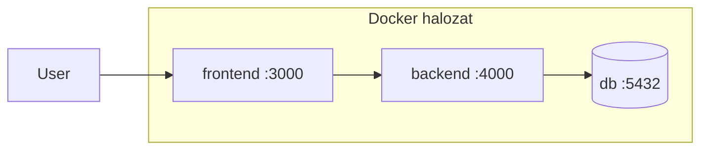

---
tags:
  - docker
  - devops
datum: 2026-02-08
szint: "🧱 Brick"
kapcsolodo:
  - "[[cloud/docker-alapok|Docker alapok]]"
  - "[[cloud/kubernetes-bevezeto|Kubernetes bevezeto]]"
  - "[[database/sql-adatbazisok|SQL adatbazisok]]"
  - "[[cloud/railway|Railway]]"
  - "[[_moc/moc-docker|MOC - Docker]]"
---

# Docker Compose

## Osszefoglalo

A Docker Compose lehetove teszi, hogy tobb kontenert (microservice-eket) egyetlen fajlban (`docker-compose.yml`) definialj es egy paranccsal indits el. Nem kell egyesevel `docker run`-t irogatni -- a Compose leirja az egesz rendszert.

## Jegyzetek

### Mikor kell Docker Compose?

Amikor az app nem egyetlen kontenerbol all, hanem tobbol:
- **Frontend** (Next.js, React)
- **Backend** (API szerver)
- **Adatbazis** ([[database/sql-adatbazisok|PostgreSQL]], Redis)
- **Egyeb** (queue, cache, proxy)

Ezeket mind kulon kontenerkent futtatod, de ossze kell kotni oket. Erre valo a Compose.

### Hogyan mukodik?

1. Irsz egy `docker-compose.yml` fajlt
2. `docker compose up` -- elindul az egesz rendszer
3. Minden service kulon kontenerkent indul, de kozos halozaton vannak
4. **Bootstrap:** az egyes microservice-ek kulonbozo folyamatkent indulnak el es inicializaljak magukat



### Alap docker-compose.yml

```yaml
services:
  frontend:
    build: ./frontend
    ports:
      - "3000:3000"
    depends_on:
      - backend

  backend:
    build: ./backend
    ports:
      - "4000:4000"
    environment:
      - DATABASE_URL=postgres://user:pass@db:5432/mydb
    depends_on:
      - db

  db:
    image: postgres:16
    volumes:
      - db-data:/var/lib/postgresql/data
    environment:
      - POSTGRES_USER=user
      - POSTGRES_PASSWORD=pass
      - POSTGRES_DB=mydb

volumes:
  db-data:
```

### Fontos elemek

| Elem | Mire jo |
|------|---------|
| `services` | Az egyes kontenerek (microservice-ek) definicioja |
| `build` | Melyik Dockerfile-bol epitse az image-et |
| `image` | Kesz image hasznalata (pl. `postgres:16`) |
| `ports` | Port kivezetes (host:kontener) |
| `volumes` | Adat megorzese kontener ujrainditas utan |
| `environment` | Kornyezeti valtozok |
| `depends_on` | Melyik service-nek kell elobb elindulnia |

### Parancsok

| Parancs | Mit csinal |
|---------|------------|
| `docker compose up` | Minden service elinditasa |
| `docker compose up -d` | Hatterben inditas |
| `docker compose up --build` | Ujraepiti az image-eket es indit |
| `docker compose down` | Minden leallitasa es eltakaritás |
| `docker compose ps` | Futo service-ek listazasa |
| `docker compose logs -f` | Logok kovetese valos idoben |
| `docker compose logs backend` | Csak egy service logjait mutatja |

### depends_on vs healthcheck

> [!warning] depends_on nem eleg!
> A `depends_on` csak azt garantalja hogy a kontener **elindul**, de NEM azt hogy **kesz** fogadni kereseket. Ha az adatbazisnak kell 5 masodperc az inicializalasra, a backend hiaba indul utana -- lehet hogy a DB meg nem all keszen.

Megoldas: **healthcheck**

```yaml
db:
  image: postgres:16
  healthcheck:
    test: ["CMD-SHELL", "pg_isready -U user"]
    interval: 5s
    timeout: 5s
    retries: 5

backend:
  depends_on:
    db:
      condition: service_healthy
```

## Fo tanulsagok
- A Compose egy "terv" az egesz rendszerhez -- egy fajl, egy parancs
- Minden service sajat kontener, de kozos halozaton beszelnek egymassal
- A service neve = hostname a belso halozaton (pl. `db` → `postgres://db:5432`)
- `depends_on` nem eleg -- healthcheck kell ha a sorrend szamit
- Volume kell az adatbazishoz, kulonben minden `down`-nal torlodik az adat

## Kapcsolodo anyagok
- [[cloud/docker-alapok|Docker alapok]]
- [[cloud/kubernetes-bevezeto|Kubernetes bevezeto]]
- [[foundations/halozatok-es-ip-cimek|Halozatok es IP cimek]]
- [[database/sql-adatbazisok|SQL adatbazisok]]
- Env valtozok Next.js-ben
- Tailscale
- [[cloud/railway|Railway]]
- [[_moc/moc-docker|MOC - Docker]]
