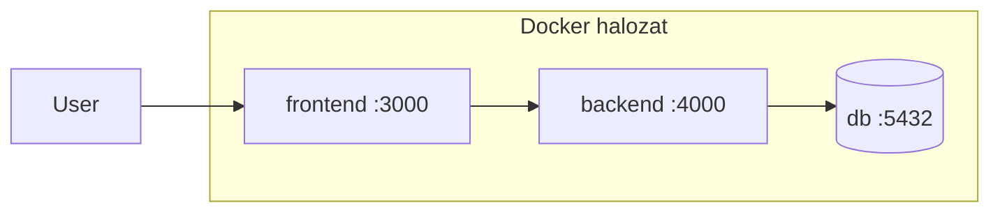

---
tags:
  - docker
  - devops
datum: 2026-02-08
szint: "🧱 Scout"
kapcsolodo:
  - "[[cloud/docker-alapok|Docker alapok]]"
  - "[[cloud/kubernetes-bevezeto|Kubernetes bevezeto]]"
  - "[[database/sql-adatbazisok|SQL adatbázisok]]"
  - "[[cloud/railway|Railway]]"
  - "[[_moc/moc-docker|MOC - Docker]]"
---

# Docker Compose

## Összefoglaló

A Docker Compose lehetővé teszi, hogy több konténert (microservice-eket) egyetlen fájlban (`docker-compose.yml`) definiálalj és egy paranccsal indíts el. Nem kell egyesevel `docker run`-t irogatni -- a Compose leirja az egész rendszert.

## Jegyzetek

### Mikor kell Docker Compose?

Amikor az app nem egyetlen konténerbol all, hanem többol:
- **Frontend** (Next.js, React)
- **Backend** (API szerver)
- **Adatbázis** ([[database/sql-adatbazisok|PostgreSQL]], Redis)
- **Egyéb** (queue, cache, proxy)

Ezeket mind kulon konténerkent futtatod, de ossze kell kotni oket. Erre valo a Compose.

### Hogyan működik?

1. Irsz egy `docker-compose.yml` fájlt
2. `docker compose up` -- elindul az egész rendszer
3. Minden service kulon konténerkent indul, de kozos hálózaton vannak
4. **Bootstrap:** az egyes microservice-ek különböző folyamatkent indulnak el és inicializaljak magukat



### Alap docker-compose.yml

```yaml
services:
  frontend:
    build: ./frontend
    ports:
      - "3000:3000"
    depends_on:
      - backend

  backend:
    build: ./backend
    ports:
      - "4000:4000"
    environment:
      - DATABASE_URL=postgres://user:pass@db:5432/mydb
    depends_on:
      - db

  db:
    image: postgres:16
    volumes:
      - db-data:/var/lib/postgresql/data
    environment:
      - POSTGRES_USER=user
      - POSTGRES_PASSWORD=pass
      - POSTGRES_DB=mydb

volumes:
  db-data:
```

### Fontos elemek

| Elem | Mire jó |
|------|---------|
| `services` | Az egyes konténerek (microservice-ek) definiálcioja |
| `build` | Melyik Dockerfile-bol építse az image-et |
| `image` | Kesz image használata (pl. `postgres:16`) |
| `ports` | Port kivezetes (host:konténer) |
| `volumes` | Adat megorzese konténer ujrainditas utan |
| `environment` | Környezeti változók |
| `depends_on` | Melyik service-nek kell elobb elindulnia |

### Parancsok

| Parancs | Mit csinál |
|---------|------------|
| `docker compose up` | Minden service elinditasa |
| `docker compose up -d` | Háttérben indítas |
| `docker compose up --build` | Ujraepiti az image-eket és indít |
| `docker compose down` | Minden leallitasa és eltakaritás |
| `docker compose ps` | Futo service-ek listazasa |
| `docker compose logs -f` | Logok követese valós idoben |
| `docker compose logs backend` | Csak egy service logjait mutatja |

### depends_on vs healthcheck

> [!warning] depends_on nem eleg!
> A `depends_on` csak azt garantalja hogy a konténer **elindul**, de NEM azt hogy **kesz** fogadni kereseket. Ha az adatbázisnak kell 5 masodperc az inicializalasra, a backend hiaba indul utána -- lehet hogy a DB még nem all keszen.

Megoldás: **healthcheck**

```yaml
db:
  image: postgres:16
  healthcheck:
    test: ["CMD-SHELL", "pg_isready -U user"]
    interval: 5s
    timeout: 5s
    retries: 5

backend:
  depends_on:
    db:
      condition: service_healthy
```

## Fo tanulsagok
- A Compose egy "terv" az egész rendszerhez -- egy fájl, egy parancs
- Minden service saját konténer, de kozos hálózaton beszelnek egymassal
- A service neve = hostname a belső hálózaton (pl. `db` → `postgres://db:5432`)
- `depends_on` nem eleg -- healthcheck kell ha a sorrend szamit
- Volume kell az adatbázishoz, különben minden `down`-nal törlödik az adat

## Kapcsolodo anyagok
- [[cloud/docker-alapok|Docker alapok]]
- [[cloud/kubernetes-bevezeto|Kubernetes bevezeto]]
- [[foundations/halozatok-es-ip-cimek|Hálózatok és IP cimek]]
- [[database/sql-adatbazisok|SQL adatbázisok]]
- Env változók Next.js-ben
- Tailscale
- [[cloud/railway|Railway]]
- [[_moc/moc-docker|MOC - Docker]]
