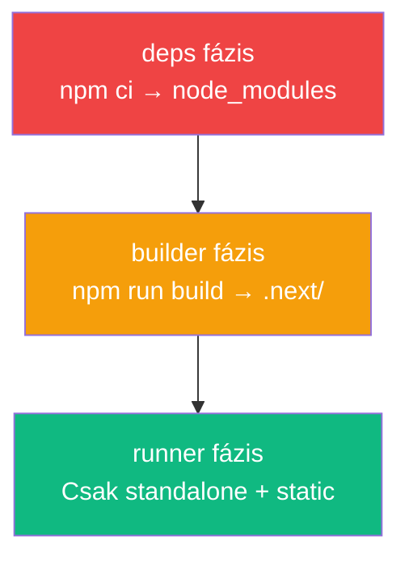

---
tags:
  - docker
  - devops
datum: 2026-03-06
szint: "🧱 Scout"
kapcsolodo:
  - "[[cloud/docker-alapok|Docker alapok]]"
  - "[[cloud/docker-compose|Docker Compose]]"
  - "[[cloud/deployment-checklist|Deployment checklist]]"
  - "[[_moc/moc-docker|MOC - Docker]]"
---

# Docker Multi-stage Builds

## Összefoglaló

A **multi-stage build** lehetővé teszi, hogy egyetlen Dockerfile-ban több build fázist definiálj, és a végső image-be **csak azt másold, ami a futtatáshoz kell**. Eredmény: kisebb, biztonságosabb production image-ek.

## Miért kell?

```
Egyszerű build: 1.2 GB image (node_modules + devDependencies + build tools)
Multi-stage:    150 MB image (csak a futtatható app + production deps)
```

## Példa: [[frontend/nextjs|Next.js]] alkalmazás

```dockerfile
# === 1. FÁZIS: Dependencies ===
FROM node:20-alpine AS deps
WORKDIR /app
COPY package.json package-lock.json ./
RUN npm ci

# === 2. FÁZIS: Build ===
FROM node:20-alpine AS builder
WORKDIR /app
COPY --from=deps /app/node_modules ./node_modules
COPY . .
RUN npm run build

# === 3. FÁZIS: Production ===
FROM node:20-alpine AS runner
WORKDIR /app
ENV NODE_ENV=production

# Biztonsági: nem root user
RUN addgroup --system --gid 1001 nodejs
RUN adduser --system --uid 1001 nextjs

# Csak a szükséges fájlok másolása
COPY --from=builder /app/public ./public
COPY --from=builder --chown=nextjs:nodejs /app/.next/standalone ./
COPY --from=builder --chown=nextjs:nodejs /app/.next/static ./.next/static

USER nextjs
EXPOSE 3000
CMD ["node", "server.js"]
```

> [!tip] `output: 'standalone'` szükséges
> A Next.js standalone output-ot engedélyezd a `next.config.js`-ben:
> ```js
> module.exports = { output: 'standalone' }
> ```
> Ez létrehozza a `.next/standalone` mappát, ami tartalmazza a szükséges node_modules részt is.

## A fázisok logikája



- **deps** — Külön fázis a dependency-knek (Docker cache kihasználása)
- **builder** — Build futtatás a teljes forráskóddal
- **runner** — Minimális production image, csak a futtatható output

## Kapcsolódó

- [[cloud/docker-alapok|Docker alapok]] — Docker alapfogalmak
- [[cloud/docker-compose|Docker Compose]] — multi-container setup
- [[cloud/deployment-checklist|Deployment checklist]] — deploy előtti ellenőrzőlista
