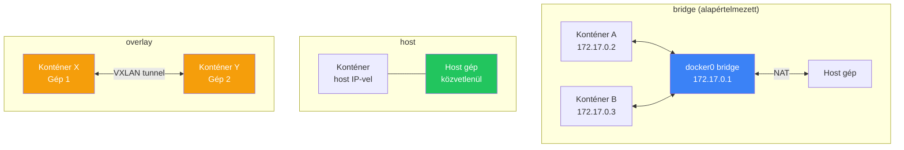

---
tags:
  - docker
  - networking
  - devops
datum: 2026-03-06
szint: "🏗️ Builder"
kapcsolodo:
  - "[[cloud/docker-alapok|Docker alapok]]"
  - "[[cloud/docker-compose|Docker Compose]]"
  - "[[foundations/halozatok-es-ip-cimek|Hálózatok és IP cimek]]"
  - "[[cloud/traefik|Traefik]]"
  - "[[_moc/moc-docker|MOC - Docker]]"
---

# Docker Networking

## Összefoglaló

A Docker konténerek izolált hálózati környezetben futnak. Ahhoz, hogy egymással vagy a külvilággal kommunikáljanak, **network driver-eket** kell értened. Ez a jegyzet a [[cloud/docker-alapok|Docker alapok]] hálózati részét mélyíti el -- bridge, host, overlay és macvlan hálózatok részletesen.

## A három fő network driver



## Bridge network

Ez az **alapértelmezett**. Minden konténer kap egy privát [[foundations/halozatok-es-ip-cimek|IP címet]] (172.17.0.x tartományban), és a host gépen egy virtuális bridge-en (`docker0`) keresztül kommunikálnak.

### Default bridge vs User-defined bridge

```bash
# Default bridge -- NEM ajánlott production-re
docker run -d --name web nginx
docker run -d --name api myapp

# A két konténer NEM éri el egymást név alapján!
# Csak IP-vel: docker exec web ping 172.17.0.3

# User-defined bridge -- MINDIG ezt használd
docker network create mynet
docker run -d --name web --network mynet nginx
docker run -d --name api --network mynet myapp

# Most már NÉV alapján elérik egymást:
docker exec web ping api  # ✓ működik!
```

> [!warning] Default bridge-en nincs DNS feloldás
> A default bridge-en a konténerek **csak IP-vel** érik el egymást, név alapján nem. User-defined bridge-en van beépített DNS -- a konténer neve = hostname. Ezért a [[cloud/docker-compose|Docker Compose]] mindig user-defined bridge-et hoz létre.

### Miért jobb a user-defined bridge?

| Tulajdonság | Default bridge | User-defined bridge |
|---|---|---|
| DNS feloldás | Nincs (csak `--link`, deprecated) | Automatikus (konténer név = hostname) |
| Izoláció | Minden konténer látja egymást | Csak az azonos network-ön lévők |
| Dinamikus csatlakozás | Nem | `docker network connect/disconnect` |
| Compose használat | Nem jellemző | Automatikusan létrehozza |

### Bridge network parancsok

```bash
# Network létrehozása
docker network create --driver bridge mynet

# Network-ök listázása
docker network ls

# Network részletei (csatlakozott konténerek, IP-k)
docker network inspect mynet

# Konténer csatlakoztatása létező network-höz
docker network connect mynet existing-container

# Konténer leválasztása
docker network disconnect mynet existing-container
```

## Host network

A konténer a host gép hálózatát használja közvetlenül -- **nincs network izoláció**. A konténer közvetlenül bind-ol a host portjaira.

```bash
docker run -d --network host nginx
# Az nginx közvetlenül a host 80-as portján érhető el
# Nem kell -p flag!
```

**Mikor használd:**
- Maximális hálózati teljesítmény kell (nincs NAT overhead)
- A konténernek a host összes hálózati interfészét kell látnia
- Hálózati monitoring / debugging tool-ok

**Mikor NE:**
- Production alkalmazások -- nincs port izoláció, biztonsági kockázat
- Több konténer ugyanazon a porton -- port conflict lesz
- macOS / Windows Docker Desktop -- a host network ott egyébként sem a valódi host, hanem a Docker VM

> [!info] Linux-only teljes támogatás
> A `--network host` csak Linuxon működik a várt módon. macOS-en és Windows-on a Docker egy virtuális gépben fut, ezért a "host" valójában a VM, nem a te géped.

## Overlay network

Az overlay lehetővé teszi, hogy **több gépen futó konténerek** egyetlen hálózaton kommunikáljanak. Docker Swarm vagy Kubernetes használja.

```bash
# Overlay network létrehozása (Swarm kell hozzá)
docker network create --driver overlay --attachable my-overlay

# Service-ek automatikusan látják egymást a Swarm-ban
docker service create --name api --network my-overlay myapp
docker service create --name db --network my-overlay postgres:16
# Az "api" konténer eléri a "db"-t hostname alapján, még ha más gépen futnak is
```

**Mikor kell:**
- Docker Swarm cluster-ben több node-on futó service-ek kommunikációjához
- A konténerek úgy látják egymást, mintha egy gépen lennének

## Macvlan network

A konténer saját MAC címet és IP-t kap a fizikai hálózaton -- úgy jelenik meg, mint egy önálló gép a LAN-on.

```bash
docker network create -d macvlan \
  --subnet=192.168.1.0/24 \
  --gateway=192.168.1.1 \
  -o parent=eth0 \
  my-macvlan

docker run -d --network my-macvlan --ip 192.168.1.100 nginx
# A 192.168.1.100 közvetlenül elérhető a LAN-ról
```

**Mikor kell:** IoT, legacy rendszerek integrációja, ahol a konténernek "valódi" IP kell a hálózaton. A legtöbb fejlesztő soha nem fogja használni.

## Docker Compose és hálózatok

A [[cloud/docker-compose|Docker Compose]] automatikusan létrehoz egy user-defined bridge network-öt a projekt nevével:

```yaml
# docker-compose.yml
services:
  web:
    image: nginx
    ports:
      - "80:80"
  api:
    build: ./api
    # A "web" konténer eléri: http://api:4000
  db:
    image: postgres:16
    # Az "api" konténer eléri: postgresql://db:5432
```

A service nevek automatikusan hostname-ek lesznek a Compose network-ön belül.

### Több network elkülönítésre

```yaml
services:
  frontend:
    networks:
      - frontend-net

  backend:
    networks:
      - frontend-net  # frontend eléri
      - backend-net   # db is eléri

  db:
    networks:
      - backend-net   # CSAK a backend éri el, frontend NEM

networks:
  frontend-net:
  backend-net:
```

> [!tip] Biztonsági best practice
> Szeparáld a network-öket: a frontend ne lássa közvetlenül az adatbázist. A backend legyen a közvetítő. Ez csökkenti a támadási felületet.

### Külső network (pl. [[cloud/traefik|Traefik]])

Ha a reverse proxy külön `docker-compose.yml`-ben fut:

```yaml
# App docker-compose.yml
services:
  app:
    networks:
      - proxy       # Traefik eléri
      - internal    # belső kommunikáció
  db:
    networks:
      - internal    # CSAK belső

networks:
  proxy:
    external: true  # A Traefik hozta létre
  internal:         # Csak ezen a stack-en belül
```

## Hibaelhárítás

```bash
# Milyen network-ökön van egy konténer?
docker inspect backend | jq '.[0].NetworkSettings.Networks'

# Tud-e pingolni egy konténer egy másikat?
docker exec backend ping db

# DNS feloldás tesztelése konténeren belül
docker exec backend nslookup db

# Port elérhetőség tesztelése
docker exec backend nc -zv db 5432

# Összes Docker network listázása
docker network ls

# Network részletei (csatlakozott konténerek, subnet)
docker network inspect bridge
```

## Kapcsolódó

- [[cloud/docker-alapok|Docker alapok]] -- konténerek, image-ek, portok alapjai
- [[cloud/docker-compose|Docker Compose]] -- automatikus network management
- [[foundations/halozatok-es-ip-cimek|Hálózatok és IP cimek]] -- IP, port, DNS alapfogalmak
- [[cloud/traefik|Traefik]] -- reverse proxy ami Docker network-ökön kommunikál
- [[_moc/moc-docker|MOC - Docker]]
