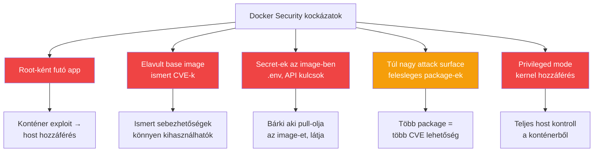

---
tags:
  - docker
  - security
  - devops
datum: 2026-03-06
szint: "🏗️ Builder"
kapcsolodo:
  - "[[cloud/docker-alapok|Docker alapok]]"
  - "[[cloud/docker-multi-stage-builds|Docker Multi-stage Builds]]"
  - "[[cloud/deployment-checklist|Deployment checklist]]"
  - "[[toolbox/aikido|Aikido]]"
  - "[[_moc/moc-docker|MOC - Docker]]"
---

# Docker Security

## Összefoglaló

A Docker konténerek alapból jobban izolálnak mint a bare metal alkalmazások, de **nem automatikusan biztonságosak**. Ha root-ként futtatod az appot, nem frissíted a base image-et, és a `.env` fájl benne van az image-ben -- az olyan mintha nyitva hagynád az ajtót. Ez a jegyzet a legfontosabb Docker security best practice-eket gyűjti össze.

## A legnagyobb kockázatok



## 1. Non-root user

A legnagyobb hiba: a konténerben root-ként fut az alkalmazás. Ha egy támadó exploit-olja az appot, root jogokat kap a konténerben -- és onnan könnyebb kitörni a host-ra.

```dockerfile
# ROSSZ -- root-ként fut
FROM node:20-alpine
WORKDIR /app
COPY . .
RUN npm ci
CMD ["node", "server.js"]
# A process root-ként indul!

# JÓ -- saját user
FROM node:20-alpine
WORKDIR /app
COPY . .
RUN npm ci

# Nem-root user létrehozása
RUN addgroup --system --gid 1001 appgroup
RUN adduser --system --uid 1001 appuser

# Fájlok tulajdonosváltása
RUN chown -R appuser:appgroup /app

USER appuser
CMD ["node", "server.js"]
```

```bash
# Ellenőrzés: ki futtatja a process-t?
docker exec myapp whoami
# appuser  ← helyes
# root     ← javítani kell!
```

> [!tip] Node.js image beépített user
> A `node:20-alpine` image-ben van egy beépített `node` user (UID 1000). Használhatod ezt is:
> ```dockerfile
> USER node
> ```

## 2. Image scanning

Az image-eidben lévő csomagoknak lehetnek ismert sebezhetőségei (CVE). Rendszeres scanning kell.

```bash
# Docker Scout (beépített a Docker Desktop-ba)
docker scout cves myapp:1.0

# Trivy (népszerű open-source scanner)
trivy image myapp:1.0

# Snyk
snyk container test myapp:1.0
```

Az [[toolbox/aikido|Aikido]] is végez container scanning-et -- ha GitHub-ra push-olod az image-et, automatikusan vizsgálja.

### CI/CD-ben automatikusan

```yaml
# .github/workflows/security.yml
jobs:
  scan:
    runs-on: ubuntu-latest
    steps:
      - uses: actions/checkout@v4

      - name: Build image
        run: docker build -t myapp:test .

      - name: Run Trivy scan
        uses: aquasecurity/trivy-action@master
        with:
          image-ref: myapp:test
          severity: CRITICAL,HIGH
          exit-code: 1  # Fail ha CRITICAL/HIGH van
```

## 3. Minimal base image

Minél kevesebb package van az image-ben, annál kevesebb a potenciális sebezhetőség.

| Base image | Méret | Package-ek | Mikor |
|---|---|---|---|
| `node:20` | ~350MB | Teljes Debian + build tools | Fejlesztés, ha natív build kell |
| `node:20-slim` | ~80MB | Minimális Debian | Amikor slim elég |
| `node:20-alpine` | ~50MB | Alpine Linux, minimális | Production -- **ajánlott** |
| `gcr.io/distroless/nodejs` | ~30MB | Semmi shell, semmi tool | Maximális biztonság |

```dockerfile
# Production: Alpine
FROM node:20-alpine AS runner
# Nincs bash, nincs curl, nincs semmi felesleges

# Maximális biztonság: Distroless
FROM gcr.io/distroless/nodejs20-debian12
COPY --from=builder /app .
CMD ["server.js"]
# Nincs shell -- nem tudsz exec-elni a konténerbe
```

> [!warning] Distroless trade-off
> Distroless image-ben nincs shell (`sh`, `bash`), nincs `curl`, nincs semmi debug tool. Ha baj van, nem tudsz `docker exec` -cel bemászni. Csak akkor használd, ha megéri a biztonság a kényelmetlenség árán.

## 4. Secret-ek kezelése

**SOHA ne rakj secret-et a Docker image-be.** Az image rétegeit bárki kiolvashatja aki hozzáfér az image-hez.

```dockerfile
# ROSSZ -- secret bekerül a rétegbe
COPY .env .
# Még ha később törlöd, a korábbi layer-ben ott marad!

# ROSSZ -- ENV-ben hardcoded
ENV API_KEY=sk-1234567890

# JÓ -- futáskor adjuk meg
# docker run -e API_KEY=sk-1234567890 myapp
# vagy docker-compose.yml environment szekcióban
```

### `.dockerignore` -- ez kötelező

```
# .dockerignore
.env
.env.local
.env.production
.git
node_modules
.next
*.md
docker-compose*.yml
```

> [!tip] Docker build secrets (build-time)
> Ha a build folyamat során kell secret (pl. privát npm registry token):
> ```dockerfile
> # Dockerfile
> RUN --mount=type=secret,id=npm_token \
>     NPM_TOKEN=$(cat /run/secrets/npm_token) npm ci
> ```
> ```bash
> docker build --secret id=npm_token,src=.npmrc .
> ```
> A secret nem kerül bele egyetlen layer-be sem.

## 5. Read-only filesystem

Az app konténernek általában nem kell fájlrendszerre írnia. Read-only filesystem-mel csökkented a kockázatot:

```bash
docker run --read-only --tmpfs /tmp myapp:1.0
# Az app nem tud fájlokat létrehozni/módosítani
# Kivéve /tmp (tmpfs = memória-alapú, nem perzisztens)
```

```yaml
# docker-compose.yml
services:
  app:
    image: myapp:1.0
    read_only: true
    tmpfs:
      - /tmp
```

## 6. Ne használj privileged mode-ot

```bash
# SOHA ne csináld (hacsak nem tudod pontosan miért)
docker run --privileged myapp
# Ez a konténernek TELJES hozzáférést ad a host kernelhez!

# Ha specifikus capability kell, add hozzá egyenként:
docker run --cap-add NET_ADMIN myapp
```

## 7. Image frissítés és pinning

```dockerfile
# ROSSZ -- a "latest" bármi lehet
FROM node:latest

# JÓ -- konkrét verzió
FROM node:20-alpine

# MÉG JOBB -- digest-tel pinelve (pontosan ez az image)
FROM node:20-alpine@sha256:abc123...
```

**Rendszeres frissítés:**
- Hetente rebuild-eld az image-eidet hogy a base image frissítéseit megkapd
- Automatizáld Dependabot-tal vagy Renovate-tel

## Security checklist (a [[cloud/deployment-checklist|Deployment checklist]] Docker része)

- [ ] Non-root user a Dockerfile-ban (`USER appuser`)
- [ ] Alpine vagy distroless base image
- [ ] `.dockerignore` tartalmazza a `.env` fájlokat és a `.git`-et
- [ ] Nincs hardcoded secret a Dockerfile-ban vagy az image rétegekben
- [ ] Image scanning futott (Trivy, Docker Scout, vagy [[toolbox/aikido|Aikido]])
- [ ] Konkrét image verzió tag (nem `latest`)
- [ ] `--privileged` flag NINCS használva
- [ ] [[cloud/docker-multi-stage-builds|Multi-stage build]] -- a build tool-ok nem kerülnek a production image-be
- [ ] Read-only filesystem ahol lehetséges

## Kapcsolódó

- [[cloud/docker-alapok|Docker alapok]] -- konténer és image alapfogalmak
- [[cloud/docker-multi-stage-builds|Docker Multi-stage Builds]] -- kisebb, biztonságosabb image-ek
- [[cloud/deployment-checklist|Deployment checklist]] -- deploy előtti biztonsági ellenőrzőlista
- [[toolbox/aikido|Aikido]] -- automatikus container scanning
- [[_moc/moc-docker|MOC - Docker]]
