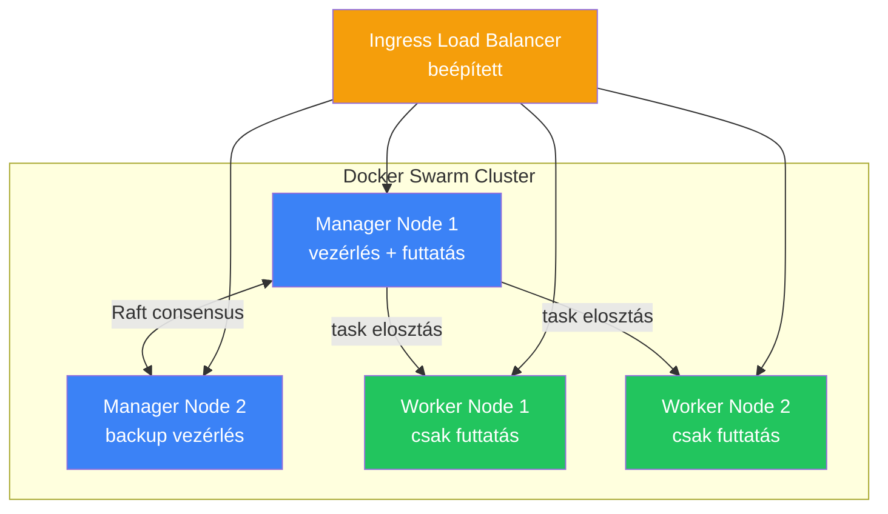

---
tags:
  - docker
  - devops
  - orchestration
datum: 2026-03-06
szint: "🏗️ Builder"
kapcsolodo:
  - "[[cloud/docker-alapok|Docker alapok]]"
  - "[[cloud/docker-compose|Docker Compose]]"
  - "[[cloud/kubernetes-bevezeto|Kubernetes bevezeto]]"
  - "[[cloud/cluster|Cluster]]"
  - "[[_moc/moc-docker|MOC - Docker]]"
---

# Docker Swarm

## Összefoglaló

A **Docker Swarm** a Docker beépített orchestration megoldása. Ha a [[cloud/docker-compose|Docker Compose]] már nem elég, mert **több szerveren** akarsz konténereket futtatni, automatikus újraindítással és load balancing-gel -- de a [[cloud/kubernetes-bevezeto|Kubernetes]] túl komplex -- a Swarm a középút.

## Miért létezik?

A Docker Compose egyetlen gépen működik. Ha az a gép meghal, meghal az app is. A Swarm több gépet (node-ot) fog össze egy [[cloud/cluster|cluster]]-be, és automatikusan elosztja rajtuk a konténereket.

```
Docker Compose:  1 gép  → ha meghal, meghal az app
Docker Swarm:    3+ gép → ha meghal egy, a többi átveszi
Kubernetes:      10+ gép → enterprise-grade orchestration
```

## Architektúra



**Manager node** -- vezérli a cluster-t, dönt hova kerüljenek a konténerek. Futtathat task-okat is.
**Worker node** -- csak futtatja a kiosztott konténereket.
**Ingress** -- beépített load balancer, bármelyik node-on fogadhatja a kérést és a megfelelő konténerhez irányítja.

## Swarm indítása

### 1. Cluster inicializálása (manager node-on)

```bash
# Az első gépet manager-ré tesszük
docker swarm init --advertise-addr 192.168.1.10

# Ez kiírja a join token-t a worker-eknek:
# docker swarm join --token SWMTKN-1-xxx 192.168.1.10:2377
```

### 2. Worker node-ok csatlakoztatása

```bash
# A többi gépen:
docker swarm join --token SWMTKN-1-xxx 192.168.1.10:2377
```

### 3. Node-ok ellenőrzése

```bash
docker node ls
# ID          HOSTNAME     STATUS    AVAILABILITY   MANAGER STATUS
# abc123      manager-1    Ready     Active         Leader
# def456      worker-1     Ready     Active
# ghi789      worker-2     Ready     Active
```

## Service-ek kezelése

A Swarm-ban nem `docker run`-nal indítasz konténereket, hanem **service**-eket definiálsz:

```bash
# Service létrehozása 3 replikával
docker service create \
  --name backend \
  --replicas 3 \
  --publish 4000:4000 \
  myapp/backend:1.0

# Service-ek listázása
docker service ls

# Replika szám módosítása
docker service scale backend=5

# Rolling update (zero-downtime)
docker service update --image myapp/backend:1.1 backend
```

## Docker Compose fájl Swarm-ban (Stack)

A Swarm képes [[cloud/docker-compose|Docker Compose]] fájlokat használni, de `docker stack deploy` paranccsal:

```yaml
# docker-compose.yml (Swarm-kompatibilis)
services:
  frontend:
    image: myapp/frontend:1.0
    ports:
      - "3000:3000"
    deploy:
      replicas: 2
      restart_policy:
        condition: on-failure
      update_config:
        parallelism: 1
        delay: 10s

  backend:
    image: myapp/backend:1.0
    ports:
      - "4000:4000"
    deploy:
      replicas: 3
      resources:
        limits:
          cpus: "0.5"
          memory: 512M

  db:
    image: postgres:16
    volumes:
      - db-data:/var/lib/postgresql/data
    deploy:
      placement:
        constraints:
          - node.role == manager  # DB csak manager-en fut

volumes:
  db-data:
```

```bash
# Stack deploy
docker stack deploy -c docker-compose.yml myapp

# Stack állapot
docker stack services myapp

# Stack eltávolítása
docker stack rm myapp
```

> [!tip] A `deploy` kulcs
> A `deploy` szekció (replicas, resources, placement) **csak Swarm módban** működik. Sima `docker compose up` figyelmen kívül hagyja.

## Swarm vs Kubernetes -- mikor melyik?

| Szempont | Docker Swarm | Kubernetes |
|---|---|---|
| **Telepítés** | `docker swarm init` -- 1 parancs | Komplex setup (kubeadm, managed service) |
| **Tanulási görbe** | Alacsony (ha ismered a Docker-t) | Magas |
| **Skálázás** | Kézi (`docker service scale`) | Automatikus (HPA) |
| **Ökoszisztéma** | Korlátozott | Hatalmas (Helm, Istio, ArgoCD) |
| **Monitoring** | Alap | Prometheus, Grafana, stb. |
| **Mikor jó** | Kis-közepes production, 3-10 node | Nagy rendszerek, 10+ node |
| **Karbantartás** | Minimális | Dedikált DevOps tudás kell |

## Mikor használd / Mikor NE

**Használd:**
- 2-5 szervered van és az app nem állhat le
- Docker Compose-ból nőttél ki, de Kubernetes túl komplex
- Egyszerű rolling update és load balancing kell
- Kis csapat, nincs dedikált DevOps szakértő

**NE használd:**
- Egyetlen szerveren fut minden -- [[cloud/docker-compose|Docker Compose]] elég
- Nagy, komplex rendszert építesz -- [[cloud/kubernetes-bevezeto|Kubernetes]] jobb választás
- Managed platformot használsz ([[cloud/railway|Railway]], [[cloud/vercel|Vercel]]) -- ott nincs rá szükség
- Auto-scaling kell forgalom alapján -- Kubernetes HPA ezt jobban tudja

> [!warning] Swarm jövője
> A Docker Swarm aktív fejlesztése lelassult a Kubernetes dominanciája miatt. Új projekteknél érdemes mérlegelni: ha a Swarm-ot kinövöd, Kubernetes-re kell migrálni. Ha eleve az a cél, érdemes egyből K8s-sel indulni.

## Hasznos parancsok

| Parancs | Mit csinál |
|---|---|
| `docker swarm init` | Cluster indítása |
| `docker node ls` | Node-ok listázása |
| `docker service ls` | Service-ek listázása |
| `docker service logs -f backend` | Service logok követése |
| `docker service scale backend=5` | Replika szám módosítása |
| `docker stack deploy -c file.yml app` | Stack deploy |
| `docker swarm leave --force` | Kilépés a cluster-ből |

## Kapcsolódó

- [[cloud/docker-alapok|Docker alapok]] -- a konténer alapok amikre a Swarm épül
- [[cloud/docker-compose|Docker Compose]] -- egyetlen gépen futó orchestration, a Swarm előszobája
- [[cloud/kubernetes-bevezeto|Kubernetes bevezeto]] -- a Swarm "nagy testvére"
- [[cloud/cluster|Cluster]] -- a cluster koncepció általában
- [[_moc/moc-docker|MOC - Docker]]
