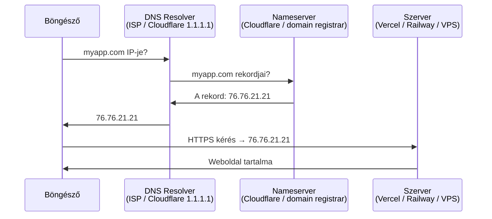

---
tags:
  - dns
  - hosting
  - deployment
datum: 2026-03-06
szint: "🧱 Scout"
kapcsolodo:
  - "[[cloud/cloudflare|Cloudflare]]"
  - "[[cloud/vercel|Vercel]]"
  - "[[cloud/nginx|Nginx]]"
  - "[[cloud/traefik|Traefik]]"
  - "[[cloud/hostinger|Hostinger]]"
  - "[[foundations/halozatok-es-ip-cimek|Hálózatok és IP címek]]"
  - "[[_moc/moc-deployment|MOC - Deployment]]"
---

# Domain és DNS kezelés

## Összefoglaló

A **DNS** (Domain Name System) fordítja le az ember-olvasható domain neveket (pl. `myapp.com`) IP címekre (pl. `76.76.21.21`). Custom domain beállítás, SSL tanúsítványok és DNS rekordok -- ezeket kell értened ahhoz, hogy az appod ne csak `*.vercel.app` címen legyen elérhető, hanem a saját domainden.

## Hogyan működik a DNS?



## DNS rekord típusok

| Rekord | Mire jó | Példa |
|--------|---------|-------|
| **A** | Domain → IPv4 cím | `myapp.com → 76.76.21.21` |
| **AAAA** | Domain → IPv6 cím | `myapp.com → 2606:4700::1` |
| **CNAME** | Domain → másik domain (alias) | `www.myapp.com → myapp.com` |
| **MX** | Email szerver megadása | `myapp.com → mail.google.com` |
| **TXT** | Szöveges adat (verifikáció, SPF, DKIM) | `v=spf1 include:_spf.google.com` |
| **NS** | Nameserver megadása | `myapp.com → ns1.cloudflare.com` |

> [!tip] A vs CNAME -- mikor melyik?
> **A rekord:** Ha az IP cím fix (VPS, dedikált szerver). A root domain (`myapp.com`) csak A rekorddal működik (RFC szabvány).
> **CNAME:** Ha a cél egy másik domain ami mögött az IP változhat (Vercel, Railway). A `www` subdomain CNAME-mel mutat a root-ra. A root domain-re CNAME-et technikailag nem szabadna tenni, de a [[cloud/cloudflare|Cloudflare]] CNAME flattening-gel megoldja.

## Domain vásárlás

### Hol vásárolj domain-t?

| Registrar | Ár (.com) | Miért jó |
|-----------|-----------|----------|
| **Cloudflare Registrar** | ~$10/év (at cost) | Nincs markup, DNS automatikus |
| Namecheap | ~$10-13/év | Egyszerű UI, WHOIS privacy ingyenes |
| Google Domains → Squarespace | ~$12/év | Google integráció |

> [!tip] Cloudflare Registrar
> A [[cloud/cloudflare|Cloudflare]] at-cost áron adja a domain-eket (nincs profit rá). Ha már Cloudflare DNS-t használsz, a registrar is legyen ott -- egy helyen van minden.

## Custom domain beállítás platformonként

### [[cloud/vercel|Vercel]]

1. Vercel Dashboard → Project → Settings → Domains
2. Add domain: `myapp.com`
3. Vercel megadja a DNS beállítást:

```
Típus:  A
Név:    @  (root domain)
Érték:  76.76.21.21

Típus:  CNAME
Név:    www
Érték:  cname.vercel-dns.com
```

4. A DNS szolgáltatód (pl. Cloudflare) dashboardján add hozzá ezeket
5. SSL tanúsítvány automatikusan generálódik

### [[cloud/railway|Railway]]

1. Railway Dashboard → Service → Settings → Custom Domain
2. Add domain: `api.myapp.com`
3. Railway ad egy CNAME target-et:

```
Típus:  CNAME
Név:    api
Érték:  <hash>.railway.app
```

### [[cloud/hostinger|Hostinger]] VPS

VPS-nél az A rekordot a szerver IP-jére állítod:

```
Típus:  A
Név:    @
Érték:  <VPS IP cím>

Típus:  A
Név:    www
Érték:  <VPS IP cím>
```

Az SSL tanúsítványt manuálisan kell beállítani (Let's Encrypt -- lásd lentebb).

## SSL tanúsítványok (HTTPS)

Az SSL/TLS tanúsítvány biztosítja a titkosított kapcsolatot (HTTPS). 2026-ban **kötelező** -- a böngészők figyelmeztetnek a HTTP oldalakra.

### Automatikus SSL (managed platformok)

| Platform | SSL kezelés |
|----------|-------------|
| [[cloud/vercel|Vercel]] | Automatikus (Let's Encrypt) |
| [[cloud/railway|Railway]] | Automatikus |
| [[cloud/cloudflare|Cloudflare]] | Automatikus (Universal SSL) |

### Manuális SSL (VPS)

[[cloud/nginx|Nginx]] + Let's Encrypt (Certbot):

```bash
# Certbot telepítés (Ubuntu)
sudo apt install certbot python3-certbot-nginx

# Tanúsítvány igénylés + Nginx auto-konfig
sudo certbot --nginx -d myapp.com -d www.myapp.com

# Automatikus megújítás tesztelése
sudo certbot renew --dry-run
```

[[cloud/traefik|Traefik]] (Docker-ben):

```yaml
# A Traefik automatikusan kezeli -- label-ekkel:
labels:
  - "traefik.http.routers.myapp.tls.certresolver=letsencrypt"
```

> [!warning] SSL megújítás
> A Let's Encrypt tanúsítványok **90 napig** érvényesek. A Certbot automatikusan megújítja (cron/systemd timer), de ellenőrizd hogy a timer fut: `sudo systemctl status certbot.timer`. Ha lejár, az oldal HTTPS hibát dob.

## Cloudflare DNS beállítás (ajánlott)

A [[cloud/cloudflare|Cloudflare]] DNS-t ajánljuk minden projekthez -- ingyenes, gyors, és extra funkciókat ad:

### Nameserver átállítás

1. Cloudflare Dashboard → Add Site → `myapp.com`
2. Cloudflare ad két nameserver-t:
```
ns1.cloudflare.com
ns2.cloudflare.com
```
3. A domain registrar-nál (ahol vetted a domain-t) cseréld le a nameserver-eket ezekre
4. Várj 24-48 órát a propagálásra (általában gyorsabb)

### DNS rekordok hozzáadása

```
Cloudflare Dashboard → DNS → Records → Add record

Típus:  A
Név:    @
Tartalom: 76.76.21.21  (Vercel IP)
Proxy:  DNS only (szürke felhő) — Vercel-nél kötelező!

Típus:  CNAME
Név:    www
Tartalom: cname.vercel-dns.com
Proxy:  DNS only
```

> [!warning] Cloudflare Proxy (narancssárga felhő) vs DNS only (szürke)
> A **Proxy** (narancssárga felhő) a forgalmat Cloudflare-en keresztül tereli -- CDN, DDoS védelem, de a Vercel és Railway **nem működik jól** proxy-val. Használj **DNS only**-t (szürke felhő) managed platformokhoz. VPS-nél a proxy bekapcsolható.

## Subdomain kezelés

```
myapp.com          → Vercel (frontend)
api.myapp.com      → Railway (backend API)
admin.myapp.com    → VPS (admin panel)
grafana.myapp.com  → VPS (monitoring)
```

Minden subdomain külön DNS rekord:

```
A       @       76.76.21.21         (Vercel)
CNAME   api     <hash>.railway.app   (Railway)
A       admin   <VPS IP>             (VPS)
A       grafana <VPS IP>             (VPS)
```

## Hibaelhárítás

### DNS propagálás ellenőrzése

```bash
# DNS rekord lekérdezés
dig myapp.com A
dig www.myapp.com CNAME
nslookup myapp.com

# Online tool
# https://www.whatsmydns.net — globális DNS propagálás check
```

### Gyakori hibák

| Hiba | Ok | Megoldás |
|------|------|---------|
| `DNS_PROBE_FINISHED_NXDOMAIN` | Domain nem létezik / nameserver nem állítva | Ellenőrizd a nameserver beállítást |
| `ERR_SSL_VERSION_OR_CIPHER_MISMATCH` | SSL tanúsítvány hiba | Certbot újrafuttatás, Cloudflare SSL mode check |
| Domain működik de `www` nem | Hiányzik a `www` CNAME rekord | Adj hozzá CNAME rekordot |
| "Too many redirects" | Cloudflare SSL + Vercel HTTPS redirect hurok | Cloudflare SSL → Full (strict) |

## Mikor használd / Mikor NE

**Használd (custom domain):**
- Production app -- a felhasználók saját domain-en érjék el
- Professzionális megjelenés kell
- Email is kell a domain-ről (MX rekordok)

**NE foglalkozz vele:**
- Fejlesztés / staging -- a `*.vercel.app` vagy `*.railway.app` elég
- Belső tool -- [[cloud/cloudflare|Cloudflare]] Access-szel védett app-nak nem kell feltétlenül szép domain

## Kapcsolódó

- [[cloud/cloudflare|Cloudflare]] — DNS szolgáltató + CDN + DDoS védelem
- [[cloud/vercel|Vercel]] — custom domain beállítás frontend-hez
- [[cloud/railway|Railway]] — custom domain beállítás backend-hez
- [[cloud/nginx|Nginx]] — reverse proxy + SSL termination VPS-en
- [[cloud/traefik|Traefik]] — Docker-native reverse proxy automatikus SSL-lel
- [[cloud/hostinger|Hostinger]] — VPS ahol manuális SSL beállítás kell
- [[foundations/halozatok-es-ip-cimek|Hálózatok és IP címek]] — IP címek és portok alapjai
