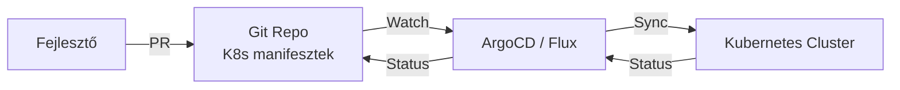

---
tags:
  - devops
  - kubernetes
  - deployment
datum: 2026-03-06
szint: "🏗️ Builder"
kapcsolodo:
  - "[[cloud/kubernetes-bevezeto|Kubernetes bevezető]]"
  - "[[foundations/git-es-github|Git és GitHub]]"
  - "[[cloud/docker-alapok|Docker alapok]]"
  - "[[cloud/ci-cd-pipelines|CI/CD Pipelines]]"
  - "[[_moc/moc-kubernetes|MOC - Kubernetes]]"
  - "[[_moc/moc-deployment|MOC - Deployment]]"
---

# GitOps

## Összefoglaló

A **GitOps** egy deployment stratégia, ahol a [[foundations/git-es-github|Git]] repo az "egyetlen igazság forrása" (single source of truth) az infrastruktúra és alkalmazás konfigurációhoz. Minden változtatás PR-en keresztül történik, és egy **GitOps operator** (ArgoCD, Flux) automatikusan szinkronizálja a cluster állapotát a repo-val.

## Hogyan működik?



**A hagyományos [[cloud/ci-cd-pipelines|CI/CD]]-vel szemben:** nem a CI pipeline push-ol a cluster-re, hanem a cluster **pull-olja** a konfigurációt a Git-ből. Ez biztonságosabb, mert a CI-nek nem kell cluster hozzáférés.

## ArgoCD — a legnépszerűbb GitOps tool

### Telepítés

```bash
kubectl create namespace argocd
kubectl apply -n argocd -f https://raw.githubusercontent.com/argoproj/argo-cd/stable/manifests/install.yaml

# Admin jelszó lekérése
kubectl -n argocd get secret argocd-initial-admin-secret -o jsonpath="{.data.password}" | base64 -d
```

### Application definiálása

```yaml
# argocd-app.yaml
apiVersion: argoproj.io/v1alpha1
kind: Application
metadata:
  name: my-app
  namespace: argocd
spec:
  project: default
  source:
    repoURL: https://github.com/BILDR-HUB/my-app-k8s
    targetRevision: main
    path: k8s/
  destination:
    server: https://kubernetes.default.svc
    namespace: production
  syncPolicy:
    automated:
      prune: true      # Törli amit eltávolítottál a repo-ból
      selfHeal: true    # Visszaállítja ha valaki kézzel módosít
```

## Mikor használd / Mikor NE

**Használd:**
- Kubernetes cluster-t üzemeltetsz
- Több környezet (staging, production) van
- Audit trail kell minden változtatáshoz
- Csapatban dolgozol

**NE használd:**
- Egyszerű [[cloud/vercel|Vercel]] / [[cloud/railway|Railway]] deploy (ott felesleges)
- Egyetlen alkalmazás, egyetlen szerver
- Ha még tanulsz Kubernetes-t (túl komplex a kezdéshez)

## Kapcsolódó

- [[cloud/kubernetes-bevezeto|Kubernetes bevezető]] — az alapok amikre GitOps épül
- [[foundations/git-es-github|Git és GitHub]] — verziókezelés ami a "single source of truth"
- [[cloud/docker-alapok|Docker alapok]] — konténer image-ek amikre a K8s manifesztek hivatkoznak
- [[cloud/ci-cd-pipelines|CI/CD Pipelines]] — a hagyományos push-alapú deploy modell, amit a GitOps felválthat
