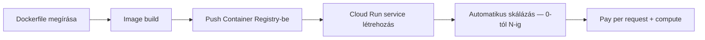
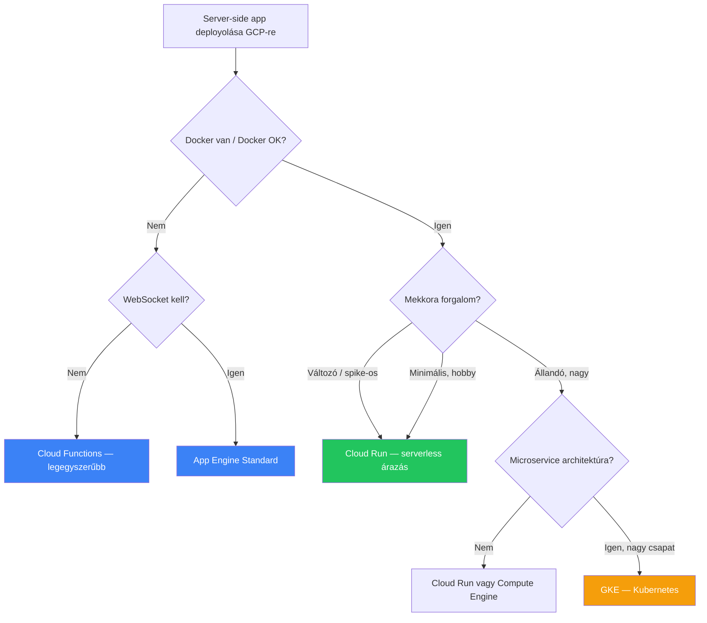

---
tags:
  - hosting
  - gcp
  - cloud
datum: 2026-03-28
szint: "🧱 Brick"
kapcsolodo:
  - "[[cloud/cloudflare|Cloudflare]]"
  - "[[cloud/kubernetes-bevezeto|Kubernetes]]"
  - "[[cloud/docker-alapok|Docker]]"
  - "[[cloud/docker-compose|Docker Compose]]"
  - "[[cloud/railway|Railway]]"
  - "[[cloud/hetzner|Hetzner]]"
---

# Google Cloud hosting - 7 deployment stratégia

> [!tldr] Egy mondatban
> A GCP 7 különböző módot kínál server-side app hosztolására — a saját hardvertől a serverless-ig. A legtöbb projekthez a **Cloud Run** az ideális: Docker-alapú, serverless árazás, de teljes runtime kontroll.

---

## A 7 opció áttekintése

| # | Opció | Típus | Skálázás | Docker kell? | WebSocket | Cold start |
|---|---|---|---|---|---|---|
| 1 | **Saját hardver** | Fizikai szerver | Manuális (több gép) | Nem | Igen | Nincs |
| 2 | **Compute Engine** | IaaS (VM) | Manuális / managed groups | Nem (de ajánlott) | Igen | Nincs |
| 3 | **App Engine Standard** | PaaS (sandboxed) | Automatikus | Nem | Igen | Lehet |
| 4 | **App Engine Flexible** | PaaS (Docker) | Automatikus | Igen | Igen | Nincs |
| 5 | **GKE (Kubernetes)** | Orchestration | Automatikus (komplex) | Igen | Igen | Nincs |
| 6 | **Cloud Functions** | FaaS (serverless) | Automatikus | Nem | **Nem** | Igen |
| 7 | **Cloud Run** | Serverless container | Automatikus | Igen | Igen | Konfigolható |

---

## Részletes összehasonlítás

### 1. Saját hardver (self-hosting)

Régi iskola — saját PC, szerver rack, vagy akár Raspberry Pi.

**Előnyök:**
- Teljes kontroll, nincs vendor lock-in
- Nincs havi cloud díj (egyszer megveszed)

**Hátrányok:**
- Áram, hűtés, internet, fizikai biztonság mind a te gondod
- Statikus IP kell az ISP-től
- Ha az áram/net elmegy → az app is leáll
- Skálázás = több gépet veszel, lehetőleg világszerte

**Mikor használd:** Gyakorlatilag soha, hacsak nem hobby projekt vagy nagyon specifikus compliance követelmény.

---

### 2. Compute Engine (VM)

Virtuális gép a felhőben — gyakorlatilag egy távoli számítógép amit óradíjban fizetsz.

**Előnyök:**
- Teljes kontroll az OS felett
- Bármilyen szoftvert telepíthetsz
- 1 ingyenes micro VM / hó (f1-micro, us régió)

**Hátrányok:**
- Mindent neked kell beállítani: Node.js telepítés, tűzfal, SSL, Nginx, static IP, DNS
- Nem skálázódik automatikusan (hacsak nem instance group + load balancer)
- Ops overhead magas — frissítések, security patch-ek

**Árazás:** ~$5-30/hó (géptípustól függ), 1 micro VM ingyenes

**Mikor használd:** Ha teljes kontroll kell, speciális szoftvert futtatsz, vagy meglévő VM-alapú infrastruktúrád van. A [[cloud/hetzner|Hetzner]] olcsóbb alternatíva ugyanerre.

---

### 3. App Engine Standard

Google menedzseli a VM-eket — te csak kódot deployolsz, minden más automatikus.

**Előnyök:**
- Nagyon egyszerű deploy: `gcloud app deploy`
- Automatikus skálázás, SSL, task queue-k, cron
- Persistent szerver → **WebSocket-ek működnek**
- Ingyenes szint elérhető

**Hátrányok:**
- **Nincs runtime kontroll** — csak az általuk támogatott Node.js verzió megy (pl. Node 14, nem a legújabb)
- Ahogy skálázódik, **drágává válhat** — a serverless opciók olcsóbbak lehetnek
- Vendor lock-in (App Engine specifikus konfig)

**Árazás:** Ingyenes szint van (28 instance-óra/nap), utána ~$0.05-0.08/instance-óra

**Mikor használd:** Gyors MVP ahol nem kell custom runtime, és kell WebSocket + cron + task queue out of the box.

---

### 4. App Engine Flexible

Mint a Standard, de [[cloud/docker-alapok|Docker]]-rel — teljes kontroll a runtime felett.

**Előnyök:**
- Bármilyen Node.js verzió, bármilyen rendszer dependency
- Google kezeli a Docker image-eket és konténereket
- Automatikus skálázás

**Hátrányok:**
- **Nincs ingyenes szint** — minimum 1 VM mindig fut (~$40/hó)
- Lassabb deploy mint a Standard (Docker build)
- Drágább mint a Cloud Run

**Árazás:** ~$40+/hó (minimum 1 VM kell)

**Mikor használd:** Ritkán — a Cloud Run szinte minden esetben jobb választás. Csak ha legacy App Engine projektből migrálsz és custom runtime kell.

---

### 5. GKE ([[cloud/kubernetes-bevezeto|Kubernetes]])

Konténer orchestráció — automatikus skálázás, load balancing, self-healing, több gépen.

**Előnyök:**
- A legnagyobb kontroll a skálázás felett
- Kiszámítható framework nagy rendszerekhez
- Ipari standard (Robinhood, Pokemon Go)

**Hátrányok:**
- **Nagyon komplex** — dedikált DevOps tudás kell
- **Drága** — a cluster management fee + a node-ok ára
- A legtöbb projekthez **totális overkill**

**Árazás:** Autopilot: ~$70+/hó, Standard: ~$73/hó (cluster fee) + node-ok ára

**Mikor használd:** Nagy csapat, extrém forgalom, microservice architektúra. Ahogy a [[cloud/kubernetes-bevezeto|Kubernetes]] note-ban is áll: *"a legtöbb projekthez túlzás"*.

---

### 6. Cloud Functions (serverless)

Kódot deployolsz, nem szervert — Google kezeli az egész infrastruktúrát.

**Előnyök:**
- Legegyszerűbb deployment — akár copy-paste a UI-ba
- **Pay-per-invocation** — csak akkor fizetsz ha hívják
- Event-driven triggerek (DB változás, file upload, Pub/Sub)
- Háttérjob-okra kiváló

**Hátrányok:**
- **Nincs WebSocket** — rövid életű connection-ök, nem tartja nyitva
- **Cold start** — az első hívás lassabb lehet (100ms-2s)
- **Nincs runtime kontroll** — predefinied Node.js verzió
- Max futási idő: 9 perc (2nd gen)

**Árazás:** 2M hívás/hó ingyenes, utána ~$0.40/M hívás + compute idő

**Mikor használd:** Event-driven háttérfeladatok, webhook feldolgozás, egyszerű API-k ahol nem kell WebSocket és a cold start nem probléma.

---

### 7. Cloud Run (serverless container) — RÉSZLETES

> [!success] A legjobb kompromisszum a legtöbb projekthez
> Cloud Run = Cloud Functions előnyei (serverless, pay-as-you-go) + Docker szabadsága (bármilyen runtime).

**Mi ez?** Dockerizált appot deployolsz, Google automatikusan skáláz és csak a tényleges használatért fizetsz. Gyakorlatilag a Cloud Functions és a Compute Engine közötti sweet spot.

**Hogyan működik:**

#### Cloud Run előnyei

- **Bármilyen runtime** — Docker-ben bármi fut: Node.js bleeding edge, Python, Go, bármi
- **Automatikus skálázás** — 0-ra is le tud skálázni (nem fizetsz ha nincs forgalom)
- **Pay-as-you-go** — CPU és memória másodpercalapon számlázva
- **WebSocket támogatás** — a Cloud Functions-szel ellentétben itt működik
- **Cold start csökkenthető** — `min-instances` beállítással tarthatod melegen (de drágább)
- **Managed SSL, custom domain** — automatikus HTTPS
- **Cloud IAM integráció** — autentikáció a Google ökoszisztémán belül
- **Revision-based deploy** — rollback egy kattintással
- **Concurrency** — egy instance több request-et kezel egyszerre (alapból 80)

#### Cloud Run hátrányai

- **Cold start létezik** — ha 0-ra skálázol, az első kérés lassabb (~1-5s)
- **Max timeout: 60 perc** — hosszú batch job-okra nem ideális
- **Éphemeral filesystem** — nincs persistent disk, minden restart-nál törlődik
- **Bonyolultabb mint Cloud Functions** — Docker tudás kell
- **Költség nehezen jósolható** — forgalomfüggő, nem fix havi díj
- **Nincs állandó process** — request-driven, nem always-on (hacsak nem `min-instances > 0`)

#### Cloud Run árazás

| Erőforrás | Ingyenes szint | Utána |
|---|---|---|
| **CPU** | 180.000 vCPU-másodperc/hó | $0.00002400/vCPU-s |
| **Memória** | 360.000 GiB-másodperc/hó | $0.00000250/GiB-s |
| **Requests** | 2M/hó | $0.40/M |
| **Hálózat (egress)** | 1 GB/hó | $0.12/GB (NA/EU) |

> [!tip] Mit jelent ez a gyakorlatban?
> Egy kis-közepes API (napi ~1000 request, átlag 200ms válaszidő, 256MB RAM):
> - **Havi ~$1-5** ha 0-ra skálázol idle-ben
> - **Havi ~$15-30** ha `min-instances=1` (nincs cold start)
> - **Havi ~$50-100+** ha folyamatos közepes forgalom van
>
> Összehasonlításul: Compute Engine fix VM ~$25/hó, [[cloud/railway|Railway]] ~$5-20/hó, [[cloud/cloudflare|Cloudflare]] Workers $5/hó fix.

#### Mikor válaszd a Cloud Run-t

- **Custom runtime kell** (specifikus Node.js verzió, system dependency-k)
- **Serverless árazás kell** de Docker rugalmassággal
- **WebSocket-ek kellenek** (chat, real-time) — Cloud Functions-ben nem megy
- **Már van Dockerfile-od** — egyszerű deployment
- **GCP ökoszisztémát használod** — Cloud SQL, Pub/Sub, Secret Manager integráció
- **Változó forgalom** — sok idle idő, néha spike-ok → 0-ra skálázás spórol

#### Mikor NE válaszd a Cloud Run-t

- **Fix, kiszámítható költség kell** → [[cloud/cloudflare|Cloudflare]] Workers ($5/hó fix) vagy [[cloud/hetzner|Hetzner]] VPS
- **Always-on process kell** (queue consumer, WebSocket szerver) → VPS vagy [[cloud/railway|Railway]]
- **Egyszerű webhook/event handler** → Cloud Functions egyszerűbb erre
- **Edge computing kell** (globális alacsony latency) → [[cloud/cloudflare|Cloudflare]] Workers
- **Nincs Docker tapasztalat** → App Engine Standard egyszerűbb
- **Komplex microservice orchestráció** → [[cloud/kubernetes-bevezeto|GKE/Kubernetes]]

---

## Összesített döntési mátrix

| Szempont | Compute Engine | App Engine Std | App Engine Flex | GKE | Cloud Functions | **Cloud Run** |
|---|---|---|---|---|---|---|
| **Komplexitás** | Magas | Alacsony | Közepes | Nagyon magas | Nagyon alacsony | Közepes |
| **Költség (kis app)** | ~$5-25/hó | Ingyenes-$10 | ~$40+/hó | ~$70+/hó | ~$0-5/hó | ~$0-15/hó |
| **Költség (közepes)** | ~$25-100/hó | ~$20-80/hó | ~$60-200/hó | ~$100-500/hó | ~$5-30/hó | ~$15-80/hó |
| **Runtime kontroll** | Teljes | Nincs | Teljes (Docker) | Teljes (Docker) | Nincs | Teljes (Docker) |
| **Skálázás** | Manuális | Auto | Auto | Auto (komplex) | Auto | Auto |
| **Cold start** | Nincs | Lehet | Nincs | Nincs | Igen | Konfigolható |
| **WebSocket** | Igen | Igen | Igen | Igen | **Nem** | Igen |
| **Min. DevOps tudás** | Sok | Kevés | Közepes | Nagyon sok | Minimális | Közepes |

---

## Döntési fa

---

## Cloud Run vs a világ

A GCP-n kívüli alternatívák összehasonlítása:

| | **Cloud Run** | [[cloud/cloudflare|Cloudflare]] Workers | [[cloud/railway|Railway]] | [[cloud/hetzner|Hetzner]] VPS |
|---|---|---|---|---|
| **Típus** | Serverless container | Serverless edge | PaaS (Docker) | IaaS (VM) |
| **Havi költség** | $0-80 (forgalomfüggő) | $5 fix | $5-20 | 4-8 EUR fix |
| **Runtime** | Docker (bármi) | V8 isolate (korlátozott) | Docker (bármi) | Bármi |
| **Cold start** | Igen (csökkenthető) | ~0ms | Nincs | Nincs |
| **Skálázás** | Auto (0-N) | Auto (edge) | Manuális / auto | Manuális |
| **DB** | Cloud SQL (külön) | D1 (SQLite) | PostgreSQL (beépített) | Bármi (self-hosted) |
| **Ops overhead** | Alacsony | Nulla | Alacsony | Közepes |
| **Vendor lock-in** | Közepes (GCP) | Közepes (CF) | Alacsony | Nincs |
| **Legerősebb pont** | Docker + serverless | Olcsó + gyors | Egyszerű Docker PaaS | Olcsó + kontroll |

---

## Kapcsolódó

- [[cloud/cloudflare|Cloudflare]] — edge serverless alternatíva, $5/hó fix árazás
- [[cloud/kubernetes-bevezeto|Kubernetes]] — GKE alapjai, mikor kell és mikor nem
- [[cloud/docker-alapok|Docker]] — konténerizáció, ami a Cloud Run alapja
- [[cloud/docker-compose|Docker Compose]] — lokális multi-container fejlesztés
- [[cloud/railway|Railway]] — egyszerűbb Docker PaaS alternatíva
- [[cloud/hetzner|Hetzner]] — olcsó VPS, self-hosting
