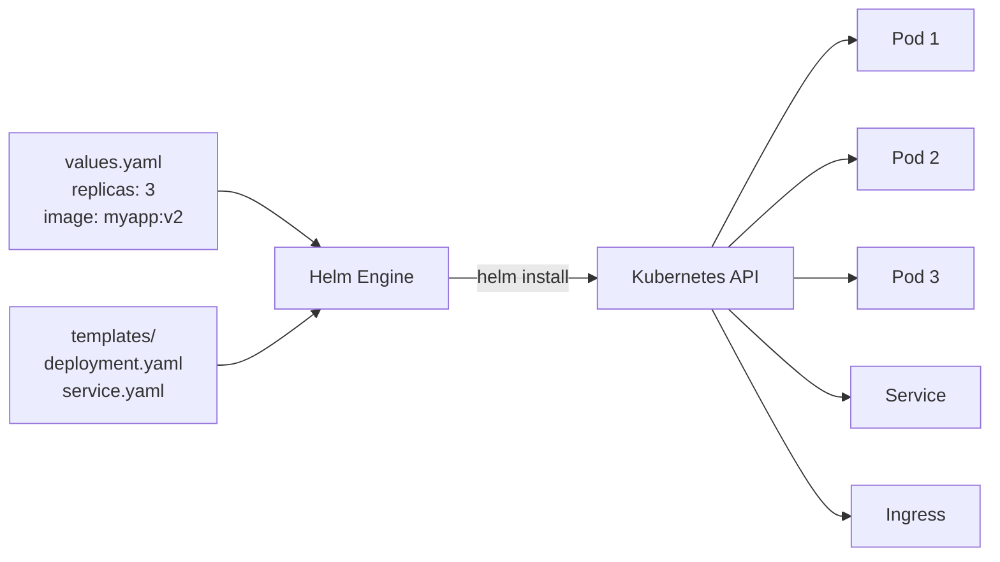

---
tags:
  - kubernetes
  - devops
  - package-manager
datum: 2026-03-06
szint: "🏗️ Builder"
kapcsolodo:
  - "[[cloud/kubernetes-bevezeto|Kubernetes bevezeto]]"
  - "[[cloud/kubernetes-disztribuciok|Kubernetes disztribuciok]]"
  - "[[cloud/gitops|GitOps]]"
  - "[[_moc/moc-kubernetes|MOC - Kubernetes]]"
---

# Helm

## Összefoglaló

A **Helm** a Kubernetes "csomagkezeloje" -- ugyanaz a szerepe mint az `npm`-nek a Node.js-ben vagy az `apt`-nak Linuxban. Ahelyett hogy 10-20 YAML manifesztet irnal kezzel minden alkalmazashoz, a Helm **chart**-okba csomagolja oket: egy chart = egy telepitheto alkalmazas az összes Kubernetes erőforrásával egyutt.

## Miért kell?

A [[cloud/kubernetes-bevezeto|Kubernetes bevezeto]]-ban latott YAML-ok (Deployment, Service) egyszerűek voltak. De egy valódi alkalmazashoz kell:
- Deployment
- Service
- Ingress
- ConfigMap
- Secret
- PersistentVolumeClaim
- ServiceAccount
- NetworkPolicy
- ...és még sok más

Ezeket kezzel irni, karbantartani és környezetenkent (dev/staging/prod) testreszabni hamar kezelhetetlen lesz.

```
YAML kezzel:                        Helm chart-tal:
├── deployment.yaml                 helm install myapp ./myapp-chart \
├── service.yaml                      --set replicas=3 \
├── ingress.yaml                      --set image.tag=v2.0 \
├── configmap.yaml                    --values prod-values.yaml
├── secret.yaml
├── pvc.yaml
└── ...mind kézzel szerkesztve      # Egy parancs, az összes YAML generálódik
```

---

## Alapfogalmak

| Fogalom | Mi ez | Hasonlat |
|---------|-------|----------|
| **Chart** | Egy csomag ami Kubernetes YAML template-eket tartalmaz | npm package |
| **Release** | Egy chart telepitett példanya a cluster-ben | Egy `npm install` futtatása |
| **Repository** | Chart-ok tárhelye (mint a registry) | npm registry |
| **Values** | Konfiguracios értékek amik a template-eket kitoltik | `.env` fájl |
| **Template** | Go template szintaxissal parameterezheto YAML | Sablonfájl |

---

## Hogyan működik?



A Helm a **template-eket** osszeolvasztja a **values**-zal, és a kapott YAML-okat elküldi a Kubernetes API-nak.

---

## Telepítes

```bash
# macOS
brew install helm

# Linux
curl https://raw.githubusercontent.com/helm/helm/main/scripts/get-helm-3 | bash

# Ellenorzes
helm version
```

---

## Alapveto parancsok

| Parancs | Mit csinál |
|---------|------------|
| `helm repo add bitnami https://charts.bitnami.com/bitnami` | Repository hozzáadasa |
| `helm repo update` | Repo lista frissitese |
| `helm search repo nginx` | Chart kereses |
| `helm install myapp bitnami/nginx` | Chart telepitese a cluster-be |
| `helm upgrade myapp bitnami/nginx` | Meglevo release frissitese |
| `helm rollback myapp 1` | Visszaallas korábbi verzióra |
| `helm uninstall myapp` | Release eltavolitasa |
| `helm list` | Telepitett release-ek listazasa |
| `helm status myapp` | Release állapota |

---

## Közösségi chart-ok használata

A legtobb ismert szoftverhez letezik kesz Helm chart. Nem kell ujra feltalalni a kereket:

```bash
# Repo hozzaadasa
helm repo add bitnami https://charts.bitnami.com/bitnami
helm repo update

# Nginx telepitese alapertelmezett beallitasokkal
helm install my-nginx bitnami/nginx

# PostgreSQL telepitese egyedi beallitasokkal
helm install my-db bitnami/postgresql \
  --set auth.postgresPassword=titkos123 \
  --set primary.persistence.size=10Gi \
  --namespace database --create-namespace
```

### Beallitasok felulirasa

Harom modja van:

```bash
# 1. Parancssorbol --set flaggel
helm install myapp bitnami/nginx --set replicaCount=3

# 2. Values fájlbol
helm install myapp bitnami/nginx -f my-values.yaml

# 3. Mindketto (a --set felulirja a fájlt)
helm install myapp bitnami/nginx -f my-values.yaml --set replicaCount=5
```

```yaml
# my-values.yaml
replicaCount: 3
image:
  tag: "1.25-alpine"
service:
  type: ClusterIP
ingress:
  enabled: true
  hostname: myapp.example.com
resources:
  requests:
    cpu: 100m
    memory: 128Mi
  limits:
    cpu: 250m
    memory: 256Mi
```

> [!tip] Milyen values-ok lehetsegesek?
> `helm show values bitnami/nginx` -- kiirja az összes beallithato erteket alapertelmezesekkel. Ez a "dokumentacioja" a chart-nak.

---

## Sajat chart irasa

### Chart struktura

```bash
helm create myapp-chart
```

```
myapp-chart/
├── Chart.yaml          # Chart metaadat (nev, verzio)
├── values.yaml         # Alapertelmezett ertekek
├── templates/          # Kubernetes YAML template-ek
│   ├── deployment.yaml
│   ├── service.yaml
│   ├── ingress.yaml
│   ├── _helpers.tpl    # Kozos template fuggvenyek
│   └── NOTES.txt       # Telepites utani uzenet
└── charts/             # Fuggoseg chart-ok
```

### Chart.yaml

```yaml
apiVersion: v2
name: myapp-chart
description: A sajat alkalmazas Helm chartja
version: 1.0.0        # A chart verzioja
appVersion: "2.1.0"    # Az alkalmazas verzioja
```

### Template példa (deployment.yaml)

```yaml
apiVersion: apps/v1
kind: Deployment
metadata:
  name: {{ .Release.Name }}-app
  labels:
    app: {{ .Release.Name }}
spec:
  replicas: {{ .Values.replicaCount }}
  selector:
    matchLabels:
      app: {{ .Release.Name }}
  template:
    metadata:
      labels:
        app: {{ .Release.Name }}
    spec:
      containers:
        - name: app
          image: "{{ .Values.image.repository }}:{{ .Values.image.tag }}"
          ports:
            - containerPort: {{ .Values.containerPort }}
          resources:
            {{- toYaml .Values.resources | nindent 12 }}
```

### values.yaml

```yaml
replicaCount: 2

image:
  repository: myregistry/myapp
  tag: "latest"

containerPort: 3000

resources:
  requests:
    cpu: 100m
    memory: 128Mi
  limits:
    cpu: 500m
    memory: 512Mi
```

### Teszteles és debug

```bash
# Renderelt YAML megtekintese telepites nelkul
helm template myapp ./myapp-chart -f prod-values.yaml

# Dry-run -- ellenorzi hogy a K8s API elfogadna-e
helm install myapp ./myapp-chart --dry-run

# Lint -- szintaktikai ellenorzes
helm lint ./myapp-chart
```

---

## Környezetenkenti konfiguracio

```
myapp-chart/
├── values.yaml              # Alapertelmezesek
├── values-dev.yaml          # Dev feluliras
├── values-staging.yaml      # Staging feluliras
└── values-prod.yaml         # Production feluliras
```

```yaml
# values-prod.yaml
replicaCount: 5
image:
  tag: "v2.1.0"
resources:
  requests:
    cpu: 500m
    memory: 512Mi
  limits:
    cpu: "1"
    memory: "1Gi"
```

```bash
# Dev deploy
helm upgrade --install myapp ./myapp-chart -f values-dev.yaml -n dev

# Production deploy
helm upgrade --install myapp ./myapp-chart -f values-prod.yaml -n production
```

> [!info] `upgrade --install`
> Ez a leggyakoribb minta: ha még nincs telepitve, telepiti. Ha mar van, frissiti. Igy ugyanaz a parancs jó mindket esetre.

---

## Helm és GitOps

A Helm chart-ok tokeletesen illeszkednek a [[cloud/gitops|GitOps]] megkozeliteshez. Az ArgoCD nativan tamogatja a Helm chart-okat:

```yaml
# ArgoCD Application Helm chart-tal
apiVersion: argoproj.io/v1alpha1
kind: Application
metadata:
  name: myapp
  namespace: argocd
spec:
  source:
    repoURL: https://github.com/myorg/k8s-config
    path: charts/myapp
    helm:
      valueFiles:
        - values-prod.yaml
  destination:
    server: https://kubernetes.default.svc
    namespace: production
```

---

## Mikor használd / Mikor NE

**Használd:**
- Több Kubernetes erőforrast kell egyutt kezelni
- Több kornyezet van (dev/staging/prod) eltero beallitasokkal
- Közösségi szoftvert telepitesz K8s-re (Nginx, PostgreSQL, Redis, Prometheus)
- Csapatban dolgozol és a deployment-nek reprodukalhatonak kell lennie

**NE használd:**
- 1-2 egyszerű YAML eleg (nem kell rarakni a Helm komplexitast)
- [[cloud/docker-compose|Docker Compose]] szinten megoldott a feladat
- Nem használsz Kubernetes-t

> [!warning] Chart verziok
> Mindig rogzitsd a chart verziót (`--version 15.3.2`), mert a `helm upgrade` alapbol a legujabb verziót húzza le. Egy nem vart chart frissites elronthatja a production-t.

---

## Kapcsolodo

- [[cloud/kubernetes-bevezeto|Kubernetes bevezeto]] -- alapfogalmak (Pod, Deployment, Service)
- [[cloud/kubernetes-disztribuciok|Kubernetes disztribuciok]] -- k3s alapbol Helm-mel jon
- [[cloud/gitops|GitOps]] -- ArgoCD + Helm chart-ok kombinacioja
- [[_moc/moc-kubernetes|MOC - Kubernetes]]
