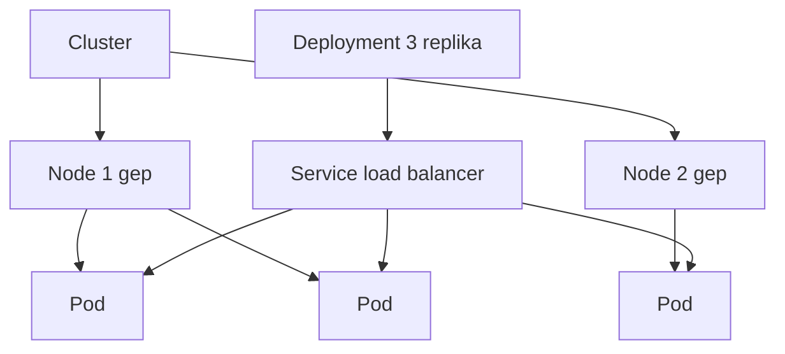

---
tags:
  - kubernetes
  - devops
datum: 2026-02-08
szint: "🏗️ Builder"
kapcsolodo:
  - "[[cloud/docker-alapok|Docker alapok]]"
  - "[[cloud/docker-compose|Docker Compose]]"
  - "[[foundations/halozatok-es-ip-cimek|Hálózatok és IP cimek]]"
  - "[[cloud/railway|Railway]]"
  - "[[_moc/moc-kubernetes|MOC - Kubernetes]]"
---

# Kubernetes bevezeto

## Összefoglaló

A Kubernetes (K8s) konténerek automatikus kezelesere valo: elosztja a terhelest, ujrainditja ami elhal, skáláz felfelé-lefele. A Docker Compose egy gépre jó -- a Kubernetes sok gépre, éles környezetbe.

## Jegyzetek

### Docker Compose vs Kubernetes

| | Docker Compose | Kubernetes |
|--|----------------|------------|
| Mire jó | Egy gep, fejlesztes, kis projektek | Több gep, production, nagy rendszerek |
| Skálázas | Manuális | Automatikus |
| Ha meghal egy konténer | Nem indul ujra magatol | Automatikusan ujraindul |
| Load balancing | Nincs | Beepitett |
| Komplexitas | Alacsony | Magas |
| Mikor kell | Legtobb SMB projekt | Nagy forgalom, magas rendelkezesre allas |

### Alapfogalmak

| Fogalom | Mi ez | Hasonlat |
|---------|-------|----------|
| **Cluster** | A teljes rendszer (több gep egyutt) | Az egész gyar |
| **Node** | Egy gep a clusterben | Egy munkas a gyarban |
| **Pod** | A legkisebb egyseg, 1+ konténer egyutt | Egy munkaallomas |
| **Deployment** | Leirja mit futtass és hany példanyban | Munkautasitas |
| **Service** | Stabil cim a podokhoz (load balancer) | Recepcio ami a megfelelő munkashoz iranyit |
| **Namespace** | Logikai elvalasztas (dev/staging/prod) | Különböző emeletek |

### Hogyan működik nagyvonalakban?

```
Te: "Kerek 3 peldanyt a backend-bol"
    ↓
Kubernetes: "OK, elinditok 3 pod-ot, elosztom a gepekre"
    ↓
Meghal 1 pod → Kubernetes: "Eszrevettem, inditok ujat"
    ↓
Nagy forgalom → Kubernetes: "Tobb pod kell, skalazok 5-re"
```



### Egy egyszerű Deployment YAML

```yaml
apiVersion: apps/v1
kind: Deployment
metadata:
  name: backend
spec:
  replicas: 3                    # 3 peldany fusson
  selector:
    matchLabels:
      app: backend
  template:
    metadata:
      labels:
        app: backend
    spec:
      containers:
        - name: backend
          image: myapp/backend:1.0
          ports:
            - containerPort: 4000
```

### kubectl -- a Kubernetes CLI

| Parancs | Mit csinál |
|---------|------------|
| `kubectl get pods` | Futo pod-ok listazasa |
| `kubectl get services` | Service-ek listazasa |
| `kubectl apply -f deploy.yaml` | Konfigurácio alkalmazása |
| `kubectl logs pod-nev` | Pod logjainak megtekintese |
| `kubectl describe pod pod-nev` | Pod részletes info |

### Mikor NEM kell Kubernetes?

- Kis projektek, keves felhasználó
- Egy szerveren elfer az egész app
- Nincs dedikalt DevOps ember/tudas
- Docker Compose + egy VPS eleg (a legtobb SMB projekthez ez a helyzet)

### Managed Kubernetes szolgáltatasok

Ha megis kell K8s, ne magad uzemeltsd:

| Szolgáltatas | Hol |
|--------------|-----|
| GKE | Google Cloud |
| EKS | AWS |
| AKS | Azure |
| DigitalOcean Kubernetes | DigitalOcean |

## Fo tanulsagok
- Kubernetes = Docker konténerek automatikus menedzselese sok gépen
- A legtobb projekthez tulzas -- Docker Compose eleg
- Ha kell, managed szolgáltatast használj (GKE, EKS), ne magad uzemeltsd
- Érdemes erteni a fogalmakat akkor is ha nem használod, mert mindenhol elojonnek

## Kapcsolodo anyagok
- [[cloud/docker-alapok|Docker alapok]]
- [[cloud/docker-compose|Docker Compose]]
- [[foundations/halozatok-es-ip-cimek|Hálózatok és IP cimek]]
- [[cloud/railway|Railway]]
- Kubernetes gyakorlat OrbStack -- gyakorlati session ahol az itt tanult fogalmak eletre keltek
- [[_moc/moc-kubernetes|MOC - Kubernetes]]
- [ByteByteGo YouTube](https://www.youtube.com/@ByteByteGo)
