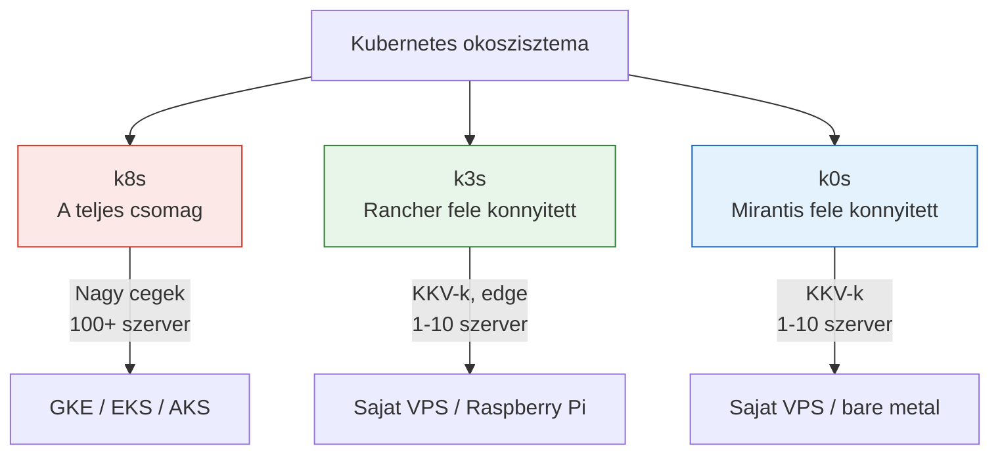

---
tags:
  - kubernetes
  - devops
datum: 2026-03-06
szint: "🏗️ Builder"
kapcsolodo:
  - "[[cloud/kubernetes-bevezeto|Kubernetes bevezeto]]"
  - "[[cloud/docker-compose|Docker Compose]]"
  - "[[cloud/docker-alapok|Docker alapok]]"
  - "[[_moc/moc-kubernetes|MOC - Kubernetes]]"
---

## Mirol van szo?

A [[cloud/kubernetes-bevezeto|Kubernetes bevezeto]]-ban megismereted mi az a Kubernetes es mire jo. A "sima" Kubernetes (k8s) eleg komplex. Ezert leteznek **konnyitett verziok** -- ugyanaz a koncepcio (pod-ok, deployment-ek, service-ek), de kevesebb eroforrassal, egyszerubb setuppal.

Olyan mint az autoknal: a k8s egy kamion (mindenre jo, de kell hozza jogositvany + garazs), a k3s es k0s meg kisautok (ugyanugy elvisznek A-bol B-be, de konnyebben kezelhetok).

---

## A harom fo verzio



---

## Osszehasonlitas

| | **k8s** (Kubernetes) | **k3s** | **k0s** |
|---|---|---|---|
| **Nev eredete** | K-ubernete-s (8 betu a K es S kozott) | K-3-s (konnyu K8s, fele annyi) | K-0-s (zero friction) |
| **Ki csinalja** | CNCF / Google | Rancher (SUSE) | Mirantis |
| **Meret** | ~1 GB+ | ~100 MB (egyetlen binaris) | ~160 MB (egyetlen binaris) |
| **RAM igeny** | 2-4 GB minimum | 512 MB eleg | 1 GB eleg |
| **Telepites** | Komplex (kubeadm, tobb lepes) | Egy parancs | Egy parancs |
| **Mire jo** | Nagy enterprise rendszerek | Edge, IoT, kis szerverek, VPS | Kis-kozepes production |
| **Kompatibilitas** | 100% Kubernetes API | 100% Kubernetes API | 100% Kubernetes API |
| **Beepitett** | Semmi (mindent kulon) | Traefik ingress, SQLite/etcd, Helm | Nincs extra, tiszta |

> [!info] Fontos
> Mind a harom **ugyanazt a Kubernetes API-t** hasznalja. Ami k8s-en megy (kubectl, YAML-ok, Helm chart-ok), az k3s-en es k0s-on is megy. A kulonbseg a telepitesben es az eroforrasigenyben van, nem a hasznalatban.

---

## k8s -- a "full" Kubernetes

Ez a hivatalos, eredeti Kubernetes. Amit a [[cloud/kubernetes-bevezeto|Kubernetes bevezeto]]-ban lattal (pod, deployment, service, namespace) -- az mind ez.

**Mikor hasznald:**
- Managed szolgaltataskent (GKE, EKS, AKS) -- ilyenkor a felho provider uzemelteti
- 100+ node-os cluster
- Dedikalt DevOps csapat van

**Mikor NE:**
- Sajat szerveren, kezzel telepitve -- tul komplex
- 1-3 szervered van -- overkill
- Nincs dedikalt Kubernetes tudas a csapatban

```bash
# Telepites (komplex, tobb lepes):
kubeadm init
kubeadm join ...
# + CNI plugin
# + ingress controller
# + storage driver
# + ...sok minden mas
```

---

## k3s -- a konnyusulyú kedvenc

A Rancher (SUSE) csinalja, azzal a cellal hogy **egy paranccsal telepitheto** legyen egy teljesen mukodo Kubernetes.

**Mikor hasznald:**
- 1-5 VPS-ed van es Kubernetes-t akarsz futtatni
- Raspberry Pi-n vagy edge eszkozokon
- Tanulashoz -- a legegyszerubb modja kiprobalni a K8s-t
- Projekteknél ahol [[cloud/docker-compose|Docker Compose]] mar keves de a full k8s tul sok

**Mikor NE:**
- Ha a Docker Compose meg eleg (a legtobb projekthez az)
- Ha managed k8s elerheto es a budget engedi

```bash
# Telepites -- szo szerint egy parancs:
curl -sfL https://get.k3s.io | sh -

# Kesz! kubectl is jon vele:
k3s kubectl get nodes
```

> [!tip] Miert "k3s"?
> A Kubernetes-ben 8 betu van a K es S kozott → k8s. A k3s "fele annyi" → 3. A poen: fele akkora, fele annyi eroforras.

**Ami beepitve jon (k8s-ben kulon kellene):**
- **Traefik** -- ingress controller (forgalomiranyitas)
- **CoreDNS** -- belso DNS
- **SQLite** -- alap adattarolas (etcd helyett, kis cluster-eknel eleg)
- **Flannel** -- halozati plugin

---

## k0s -- a "zero friction" megkozelites

A Mirantis csinalja. Hasonlo a k3s-hez, de **nem rak be semmit ami nem kell** -- tiszta Kubernetes, semmi extra.

**Mikor hasznald:**
- Ha k3s-nel is tisztabb setupot akarsz (nincs beepitett Traefik, stb.)
- Ha magad akarod kivalasztani az osszes komponenst
- Production-ben, kis-kozepes meretben

**Mikor NE:**
- Ha gyorsan akarsz indulni (a k3s egyszerubb, mert tobb mindent ad alapbol)
- Tanulashoz (k3s jobb erre)

```bash
# Telepites:
curl -sSLf https://get.k0s.sh | sh
k0s install controller --single
k0s start
```

---

## Melyik szcenariohoz melyik?

```
1-2 VPS, par szolgaltatas  →  Docker Compose
3-5 VPS, komplexebb setup  →  k3s (egyszeru, gyors, eleg)
10+ szerver, enterprise     →  k8s managed (GKE/EKS)
```

> [!warning] Fontos
> A [[cloud/kubernetes-bevezeto|Kubernetes bevezeto]]-ban is irva van: a legtobb SMB projekthez a Docker Compose eleg. A k3s/k0s akkor jon kepbe, ha kinovod a Docker Compose-t -- pl. tobb szerverre kell elosztani a terhelest, vagy automatikus ujrainditas/skalazas kell.

---

## Kapcsolodo

- [[cloud/kubernetes-bevezeto|Kubernetes bevezeto]] -- alapfogalmak (pod, deployment, service)
- [[cloud/docker-compose|Docker Compose]] -- az egyszerubb alternativa, ameddig eleg
- [[cloud/docker-alapok|Docker alapok]] -- kontenerek alapjai
- Tailscale -- gepek osszekotese (k3s multi-node-hoz hasznos)
- [[_moc/moc-kubernetes|MOC - Kubernetes]]
