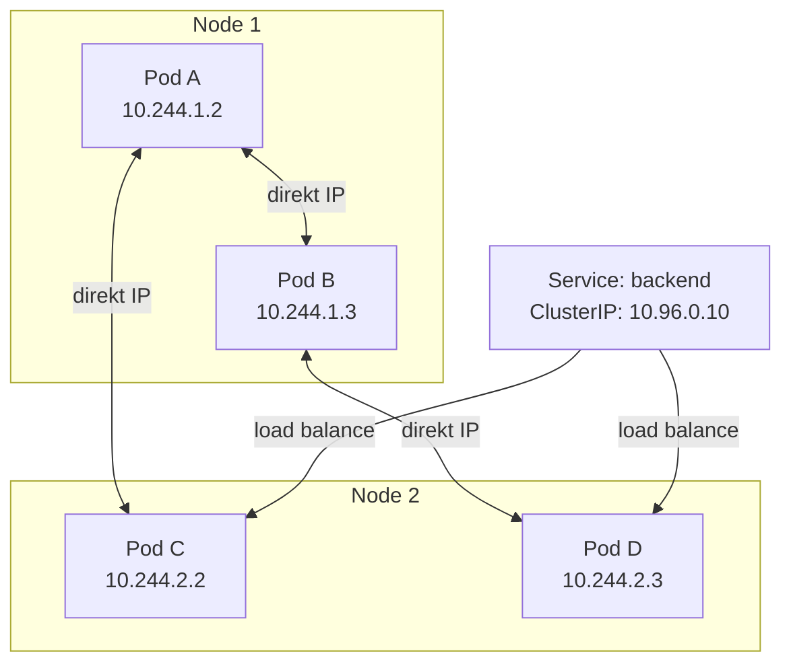

---
tags:
  - kubernetes
  - networking
  - devops
datum: 2026-03-06
szint: "🏗️ Builder"
kapcsolodo:
  - "[[cloud/kubernetes-bevezeto|Kubernetes bevezeto]]"
  - "[[foundations/halozatok-es-ip-cimek|Hálózatok és IP cimek]]"
  - "[[cloud/traefik|Traefik]]"
  - "[[cloud/nginx|Nginx]]"
  - "[[_moc/moc-kubernetes|MOC - Kubernetes]]"
---

# Kubernetes Networking

## Összefoglaló

A [[cloud/kubernetes-bevezeto|Kubernetes bevezeto]]-ban latott Service és load balancing csak a jéghegy csucsai. A K8s networking melyebben: hogyan beszelnek a Pod-ok egymassal, hogyan jut be a külso forgalom a cluster-be, hogyan oldódnak fel a belső DNS nevek, és hogyan korlatozhatod a hálózati forgalmat.

---

## A K8s hálózati modell

A Kubernetes hálózati modellje harom alapszabalyon all:

1. **Minden Pod kap saját IP-t** -- nem kell portokat megosztaniuk
2. **Minden Pod eleri az összes többi Pod-ot** -- cluster-en belül, NAT nelkul
3. **A node-okon futo agent-ek (kubelet) elrik a Pod-okat** -- és forditva

Ez azt jelenti, hogy a Pod-ok ugy beszelgetnek, mintha mind egy lapos hálózaton lennenek -- nem szamit melyik node-on futnak.



> [!info] CNI plugin
> A hálózatot egy **CNI (Container Network Interface)** plugin valósítja meg. A [[cloud/kubernetes-disztribuciok|k3s]] alapbol Flannel-t használ, a full K8s-nel valasztanod kell (Calico, Cilium, Weave). A hálózati modell ugyanaz, a megvalósitas valtozik.

---

## Service tipusok

A Service stabil cimet ad a Pod-oknak (amiknek az IP-je bármikor változhat, mert ujraindulnak, skalazodnak). A [[cloud/kubernetes-bevezeto|Kubernetes bevezeto]]-ban mar latott Service-nek több tipusa van:

### ClusterIP (alapertelmezett)

Csak a cluster-en belulrol erheto el. A legtobb belső service-hez ez kell.

```yaml
apiVersion: v1
kind: Service
metadata:
  name: backend
spec:
  type: ClusterIP          # Alapertelmezett, ki is hagyhatod
  selector:
    app: backend
  ports:
    - port: 80              # Ezen a porton erheto el a Service
      targetPort: 4000      # Erre a Pod portra forwardol
```

```bash
# Cluster-en belul igy erheto el:
curl http://backend.default.svc.cluster.local:80
# Vagy roviden (ugyanazon namespace-ben):
curl http://backend:80
```

### NodePort

A Service megjelenik a node-ok egy portjan (30000-32767). Fejleszteshez, teszteleshez hasznos, production-ben ritkan.

```yaml
apiVersion: v1
kind: Service
metadata:
  name: backend
spec:
  type: NodePort
  selector:
    app: backend
  ports:
    - port: 80
      targetPort: 4000
      nodePort: 31000       # Ezen a porton erheto el kivulrol
```

```bash
# Kivulrol (a node IP-jen):
curl http://192.168.1.100:31000
```

### LoadBalancer

A cloud provider (GKE, EKS, AKS) letrehoz egy külső load balancer-t (pl. AWS ELB) és hozzárendeli a Service-hez. Csak managed Kubernetes-ben működik automatikusan.

```yaml
apiVersion: v1
kind: Service
metadata:
  name: frontend
spec:
  type: LoadBalancer
  selector:
    app: frontend
  ports:
    - port: 80
      targetPort: 3000
```

### ExternalName

DNS alias -- nincs proxy, nincs load balancing. Csak egy CNAME rekordot hoz letre.

```yaml
apiVersion: v1
kind: Service
metadata:
  name: external-db
spec:
  type: ExternalName
  externalName: db.example.com   # Külső szolgáltatásra mutat
```

### Összehasonlitas

| Tipus | Honnan erheto el | Mikor használd |
|-------|-----------------|----------------|
| **ClusterIP** | Csak belulrol | Belső service-ek (DB, cache, backend) |
| **NodePort** | Node IP + port | Fejlesztes, teszteles |
| **LoadBalancer** | Külső IP (cloud) | Production, managed K8s |
| **ExternalName** | DNS alias | Külső szolgáltatás integracio |

---

## Ingress

Az Ingress a HTTP/HTTPS forgalom belepteto pontja a cluster-be. Egy Ingress Controller (pl. Nginx Ingress, [[cloud/traefik|Traefik]]) figyeli az Ingress erőforrásokat és konfigurálja a routing-ot.

### Miért kell?

LoadBalancer Service-ből minden alkalmazashoz külön kellene -- az draga és nem skálázodik. Az Ingress **egy** belépési ponttól oszt szet a forgalmat host vagy path alapján.

```yaml
apiVersion: networking.k8s.io/v1
kind: Ingress
metadata:
  name: app-ingress
  annotations:
    cert-manager.io/cluster-issuer: letsencrypt
spec:
  ingressClassName: nginx
  tls:
    - hosts:
        - myapp.example.com
        - api.myapp.example.com
      secretName: myapp-tls
  rules:
    - host: myapp.example.com
      http:
        paths:
          - path: /
            pathType: Prefix
            backend:
              service:
                name: frontend
                port:
                  number: 80
    - host: api.myapp.example.com
      http:
        paths:
          - path: /
            pathType: Prefix
            backend:
              service:
                name: backend
                port:
                  number: 80
```

### Ingress Controller telepitese

Az Ingress onmagaban nem csinál semmit -- kell hozzá egy **Ingress Controller** ami ertelmezi:

```bash
# Nginx Ingress Controller (Helm-mel)
helm repo add ingress-nginx https://kubernetes.github.io/ingress-nginx
helm install ingress-nginx ingress-nginx/ingress-nginx \
  --namespace ingress --create-namespace
```

> [!tip] k3s-ben Traefik alapbol jon
> Ha [[cloud/kubernetes-disztribuciok|k3s]]-t használsz, a [[cloud/traefik|Traefik]] mar telepitve van mint Ingress Controller. Nem kell kulon felrakni.

---

## DNS a cluster-ben (CoreDNS)

A Kubernetes belső DNS szervere a **CoreDNS**. Minden Service automatikusan kap DNS nevet:

```
<service-nev>.<namespace>.svc.cluster.local
```

### DNS feloldasi példak

```bash
# Ugyanazon namespace-ben eleg a service nev:
curl http://backend:4000

# Masik namespace-bol kell a namespace is:
curl http://backend.production.svc.cluster.local:4000

# Headless Service (clusterIP: None) -- egyenesen a Pod IP-kre oldodik fel:
# Hasznos StatefulSet-eknel (pl. adatbazis replika-k)
```

### Headless Service

Ha nem kell load balancing, hanem a kliensnek kell tudnia az összes Pod IP-t (pl. adatbázis cluster):

```yaml
apiVersion: v1
kind: Service
metadata:
  name: db
spec:
  clusterIP: None           # Headless!
  selector:
    app: postgres
  ports:
    - port: 5432
```

```bash
# DNS feloldas: minden Pod IP-t visszaadja
nslookup db.default.svc.cluster.local
# → 10.244.1.5, 10.244.2.3, 10.244.1.8
```

---

## NetworkPolicy

Alapbol minden Pod eleri az összes többi Pod-ot a cluster-ben. Ez nem biztonsagos -- a **NetworkPolicy** korlatozza a forgalmat (mint egy tuzfal).

### Alapelv: deny-all, aztán engedelyezd amit kell

```yaml
# 1. Minden bejovo forgalom tiltasa a production namespace-ben
apiVersion: networking.k8s.io/v1
kind: NetworkPolicy
metadata:
  name: deny-all-ingress
  namespace: production
spec:
  podSelector: {}            # Minden Pod-ra vonatkozik
  policyTypes:
    - Ingress
  ingress: []                # Semmi nem jöhet be
```

```yaml
# 2. Backend Pod-ok csak a frontend-tol fogadhatnak forgalmat
apiVersion: networking.k8s.io/v1
kind: NetworkPolicy
metadata:
  name: allow-frontend-to-backend
  namespace: production
spec:
  podSelector:
    matchLabels:
      app: backend
  policyTypes:
    - Ingress
  ingress:
    - from:
        - podSelector:
            matchLabels:
              app: frontend
      ports:
        - protocol: TCP
          port: 4000
```

```yaml
# 3. DB csak a backend-tol erheto el
apiVersion: networking.k8s.io/v1
kind: NetworkPolicy
metadata:
  name: allow-backend-to-db
  namespace: production
spec:
  podSelector:
    matchLabels:
      app: postgres
  policyTypes:
    - Ingress
  ingress:
    - from:
        - podSelector:
            matchLabels:
              app: backend
      ports:
        - protocol: TCP
          port: 5432
```

> [!warning] CNI tamogatas szükséges
> A NetworkPolicy csak akkor működik, ha a CNI plugin tamogatja. A **Calico** és **Cilium** igen, a Flannel onmagaban NEM. Ha k3s-t használsz Flannel-lel, telepits Calico-t a NetworkPolicy-khoz.

---

## Gyakorlati tipusok kombinacioja

Egy tipikus production felallas igy nez ki:

```
Internet
    │
    ▼
┌─────────────────────┐
│   Ingress Controller │  (Nginx / Traefik)
│   + TLS termination  │
└─────────┬───────────┘
          │ host-based routing
    ┌─────┴──────┐
    ▼            ▼
 frontend     backend        ← ClusterIP Service-ek
 Service      Service
    │            │
    ▼            ▼
 Pod Pod      Pod Pod Pod    ← Deployment replika-k
                 │
                 ▼
            db Service       ← ClusterIP (NetworkPolicy-val vedve)
                 │
                 ▼
            Pod (StatefulSet)
```

---

## Hasznos debug parancsok

```bash
# Service endpoint-ok (melyik Pod-okra mutat)
kubectl get endpoints backend

# DNS feloldas teszteles Pod-bol
kubectl run -it --rm dns-test --image=busybox -- nslookup backend

# Hálózati kapcsolat teszteles Pod-bol
kubectl run -it --rm net-test --image=busybox -- wget -qO- http://backend:4000/health

# NetworkPolicy-k listazasa
kubectl get networkpolicies -n production

# Ingress állapot
kubectl describe ingress app-ingress
```

---

## Kapcsolodo

- [[cloud/kubernetes-bevezeto|Kubernetes bevezeto]] -- alapfogalmak (Pod, Service, Deployment)
- [[foundations/halozatok-es-ip-cimek|Hálózatok és IP cimek]] -- IP, DNS, port alapok
- [[cloud/traefik|Traefik]] -- Ingress Controller, k3s-ben alapbol jon
- [[cloud/nginx|Nginx]] -- Nginx Ingress Controller alternativa
- [[cloud/kubernetes-disztribuciok|Kubernetes disztribuciok]] -- CNI plugin különbségek
- [[_moc/moc-kubernetes|MOC - Kubernetes]]
