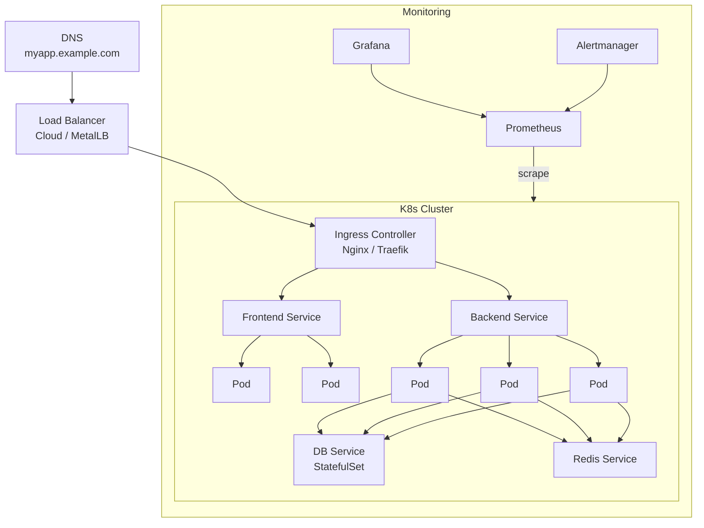

---
tags:
  - kubernetes
  - devops
  - production
datum: 2026-03-06
szint: "🏗️ Builder"
kapcsolodo:
  - "[[cloud/kubernetes-bevezeto|Kubernetes bevezeto]]"
  - "[[cloud/kubernetes-disztribuciok|Kubernetes disztribuciok]]"
  - "[[cloud/helm|Helm]]"
  - "[[cloud/kubernetes-networking|Kubernetes Networking]]"
  - "[[cloud/gitops|GitOps]]"
  - "[[cloud/ci-cd-pipelines|CI/CD Pipelines]]"
  - "[[cloud/12-faktoros-alkalmazas-epites|12 Faktoros alkalmazás építes]]"
  - "[[_moc/moc-kubernetes|MOC - Kubernetes]]"
---

# Kubernetes Production Deployment

## Összefoglaló

Egy Kubernetes cluster futtatasa lokálisan (mint a [[guides/kubernetes-gyakorlat-orbstack|Kubernetes gyakorlat OrbStack]]-ben) és egy éles production cluster üzemeltetese kozott hatalmas a különbség. Ez a jegyzet vegigvezet az éles K8s cluster felállításán: a cluster valasztastól a monitoring-on át a disaster recovery-ig.

---

## Managed vs self-hosted -- a legfontosabb dontes

| | **Managed** (GKE, EKS, AKS) | **Self-hosted** (k3s, k0s VPS-en) |
|---|---|---|
| **Control plane** | A provider kezeli | Te üzemelteted |
| **Frissítesek** | Automatikus/félauto | Te csinalod |
| **Költség** | ~$75-150/ho (cluster fee + node-ok) | Csak a VPS ára (~$5-20/node) |
| **SLA** | 99.9%+ | Rajtad mulik |
| **Mikor használd** | Van budget, kell az SLA | Koltségerzekeny, kevés node |

> [!tip] Általanos szabaly
> Ha teheted, **managed Kubernetes-t** használj. A control plane üzemeltetese nem triviális -- etcd backup, API server HA, certificate rotation. A managed provider ezt mind megoldja helyetted.

---

## Cluster felállitas -- lépésrol lépésre

### 1. Managed cluster (GKE példa)

```bash
# GKE cluster letrehozasa
gcloud container clusters create production-cluster \
  --region europe-west1 \
  --num-nodes 3 \
  --machine-type e2-standard-4 \
  --enable-autoscaling --min-nodes 2 --max-nodes 10 \
  --enable-network-policy \
  --enable-autorepair \
  --enable-autoupgrade

# kubectl konfiguralas
gcloud container clusters get-credentials production-cluster --region europe-west1
```

### 2. Self-hosted cluster ([[cloud/kubernetes-disztribuciok|k3s]] példa)

```bash
# Master node
curl -sfL https://get.k3s.io | sh -s - server \
  --tls-san my-server.example.com \
  --disable traefik         # Sajat Ingress Controller-t teszel fel

# Token lekerese a worker node-okhoz
cat /var/lib/rancher/k3s/server/node-token

# Worker node-ok csatlakoztatasa
curl -sfL https://get.k3s.io | K3S_URL=https://master-ip:6443 \
  K3S_TOKEN=<token> sh -
```

---

## Namespace strategia

Ne mindent a `default` namespace-be rakj. A namespace-ek logikai elvalasztas + RBAC + NetworkPolicy hatarokat adnak.

```yaml
# namespaces.yaml
apiVersion: v1
kind: Namespace
metadata:
  name: production
  labels:
    environment: production
---
apiVersion: v1
kind: Namespace
metadata:
  name: staging
  labels:
    environment: staging
---
apiVersion: v1
kind: Namespace
metadata:
  name: monitoring
---
apiVersion: v1
kind: Namespace
metadata:
  name: ingress
```

```bash
kubectl apply -f namespaces.yaml
```

---

## Production-ready Deployment

A [[cloud/kubernetes-bevezeto|Kubernetes bevezeto]]-ban latott egyszeru Deployment nem eleg production-ben. Kell hozzá: resource limitek, health check-ek, pod disruption budget, és antiaffinity.

```yaml
apiVersion: apps/v1
kind: Deployment
metadata:
  name: backend
  namespace: production
spec:
  replicas: 3
  revisionHistoryLimit: 5           # Rollback lehetoseg
  strategy:
    type: RollingUpdate
    rollingUpdate:
      maxSurge: 1                   # Max +1 pod frissites kozben
      maxUnavailable: 0             # 0 downtime
  selector:
    matchLabels:
      app: backend
  template:
    metadata:
      labels:
        app: backend
        version: v2.1.0
    spec:
      # --- Anti-affinity: ne ugyanarra a node-ra keruljenek ---
      affinity:
        podAntiAffinity:
          preferredDuringSchedulingIgnoredDuringExecution:
            - weight: 100
              podAffinityTerm:
                labelSelector:
                  matchExpressions:
                    - key: app
                      operator: In
                      values: [backend]
                topologyKey: kubernetes.io/hostname

      containers:
        - name: backend
          image: myregistry/backend:v2.1.0
          ports:
            - containerPort: 4000

          # --- Resource limitek ---
          resources:
            requests:              # Minimum garantált
              cpu: 250m
              memory: 256Mi
            limits:                # Maximum megengedett
              cpu: "1"
              memory: 512Mi

          # --- Health check-ek ---
          readinessProbe:          # Mikor fogadhat forgalmat?
            httpGet:
              path: /health
              port: 4000
            initialDelaySeconds: 5
            periodSeconds: 10
          livenessProbe:           # Él-e még?
            httpGet:
              path: /health
              port: 4000
            initialDelaySeconds: 15
            periodSeconds: 20
          startupProbe:            # Elindult-e? (lassu appoknal)
            httpGet:
              path: /health
              port: 4000
            failureThreshold: 30
            periodSeconds: 5

          # --- Env változók ---
          envFrom:
            - secretRef:
                name: backend-secrets
            - configMapRef:
                name: backend-config

      # --- Graceful shutdown ---
      terminationGracePeriodSeconds: 30
```

> [!warning] Resource limitek kötelezok
> Limit nelkul egyetlen pod leeheti az egész node-ot. Mindig allits be `requests`-t (amit a scheduler használ az elosztashoz) és `limits`-t (amihez a node kikenyszeriti).

---

## Architektura áttekintes



---

## Horizontal Pod Autoscaler (HPA)

A [[cloud/kubernetes-bevezeto|Kubernetes bevezeto]]-ban emlitett automatikus skálázas igy néz ki a gyakorlatban:

```yaml
apiVersion: autoscaling/v2
kind: HorizontalPodAutoscaler
metadata:
  name: backend-hpa
  namespace: production
spec:
  scaleTargetRef:
    apiVersion: apps/v1
    kind: Deployment
    name: backend
  minReplicas: 3
  maxReplicas: 20
  metrics:
    - type: Resource
      resource:
        name: cpu
        target:
          type: Utilization
          averageUtilization: 70    # 70% CPU felett skaláz
    - type: Resource
      resource:
        name: memory
        target:
          type: Utilization
          averageUtilization: 80
  behavior:
    scaleUp:
      stabilizationWindowSeconds: 60   # Nem skaláz tul gyorsan
      policies:
        - type: Pods
          value: 2
          periodSeconds: 60            # Max 2 pod/perc
    scaleDown:
      stabilizationWindowSeconds: 300  # 5 perc stabil kell a leskálázáshoz
```

```bash
# Metrics Server kell az HPA-hoz
kubectl apply -f https://github.com/kubernetes-sigs/metrics-server/releases/latest/download/components.yaml

# HPA állapot
kubectl get hpa -n production
```

---

## Secrets kezelese

**Soha ne tarold a Secret-eket Git-ben plaintext-kent!**

### Sealed Secrets (ajanlott)

```bash
# Sealed Secrets Controller telepitese
helm repo add sealed-secrets https://bitnami-labs.github.io/sealed-secrets
helm install sealed-secrets sealed-secrets/sealed-secrets -n kube-system

# Secret titkositasa (csak a cluster tudja visszafejteni)
echo -n 'my-db-password' | kubectl create secret generic db-secret \
  --dry-run=client --from-file=password=/dev/stdin -o yaml | \
  kubeseal --format yaml > sealed-db-secret.yaml

# A sealed-db-secret.yaml mar commitolhato Git-be
kubectl apply -f sealed-db-secret.yaml
```

### External Secrets Operator

Külső secret managerekbol (AWS Secrets Manager, HashiCorp Vault) szinkronizálja a K8s Secret-eket.

---

## Monitoring stack

### Prometheus + Grafana (Helm-mel)

```bash
helm repo add prometheus-community https://prometheus-community.github.io/helm-charts
helm install monitoring prometheus-community/kube-prometheus-stack \
  --namespace monitoring --create-namespace \
  --set grafana.adminPassword=securepassword
```

Ez telepiti:
- **Prometheus** -- metrikak gyujtese
- **Grafana** -- dashboard-ok es vizualizacio
- **Alertmanager** -- értesítesek (Slack, email)
- **Node exporter** -- node szintu metrikak
- **kube-state-metrics** -- K8s erőforrás metrikak

### Alapveto alertek amiket állíts be

| Alert | Mikor szol | Miért fontos |
|-------|-----------|-------------|
| Pod CrashLooping | Pod 3x ujraindul 5 percen belul | Applikációs hiba |
| Node NotReady | Node nem responziv | Infrastruktura probléma |
| PVC 90% full | PersistentVolume majdnem tele | Adat vesztes megelozese |
| HPA max replicas | Minden replica fut | Nincs tobb skálázasi lehetoseg |
| Certificate expiry < 7d | TLS cert hamarosan lejar | HTTPS kiesés megelozese |

---

## Backup és Disaster Recovery

### etcd backup (self-hosted eseten)

```bash
# etcd snapshot mentese
ETCDCTL_API=3 etcdctl snapshot save /backup/etcd-snapshot.db \
  --endpoints=https://127.0.0.1:2379 \
  --cacert=/etc/kubernetes/pki/etcd/ca.crt \
  --cert=/etc/kubernetes/pki/etcd/server.crt \
  --key=/etc/kubernetes/pki/etcd/server.key

# Visszaallas
ETCDCTL_API=3 etcdctl snapshot restore /backup/etcd-snapshot.db
```

### Velero -- cluster szintu backup

```bash
# Velero telepitese
helm repo add vmware-tanzu https://vmware-tanzu.github.io/helm-charts
helm install velero vmware-tanzu/velero \
  --namespace velero --create-namespace \
  --set configuration.backupStorageLocation[0].bucket=my-backup-bucket

# Napi backup utemezese
velero schedule create daily-backup --schedule="0 2 * * *" \
  --include-namespaces production

# Visszaallas
velero restore create --from-backup daily-backup-20260306
```

---

## Production checklist

- [ ] **Resource limits** minden Pod-on beallitva
- [ ] **Liveness/readiness probe** minden containerben
- [ ] **Pod Disruption Budget** a kritikus service-ekhez
- [ ] **Network Policy** -- deny-all + explicit engedelyezes
- [ ] **Secrets** titkositva (Sealed Secrets / External Secrets)
- [ ] **HPA** beallitva a forgalomfuggo service-ekhez
- [ ] **Monitoring** (Prometheus + Grafana) telepitve es alertek konfigurálva
- [ ] **Backup** utemezve (etcd + Velero)
- [ ] **RBAC** -- fejlesztok csak a saját namespace-uket lassak
- [ ] **Image tag** soha ne legyen `latest` -- mindig explicit verzió
- [ ] **TLS** minden külső endpoint-on (cert-manager + Let's Encrypt)
- [ ] [[cloud/gitops|GitOps]] -- minden változtatas Git-en keresztül, nem `kubectl apply`-jal kezzel

> [!warning] `kubectl apply` production-ben
> Éles cluster-en **soha ne futtass kezzel `kubectl apply`-t**. Használj [[cloud/gitops|GitOps]]-t (ArgoCD/Flux), hogy minden változtatas auditalhato legyen és a Git legyen az egyetlen igazság forrása.

---

## Kapcsolodo

- [[cloud/kubernetes-bevezeto|Kubernetes bevezeto]] -- alapfogalmak
- [[cloud/kubernetes-disztribuciok|Kubernetes disztribuciok]] -- melyik disztribuciót valaszd
- [[cloud/helm|Helm]] -- alkalmazasok telepitese chart-okkal
- [[cloud/kubernetes-networking|Kubernetes Networking]] -- Service, Ingress, NetworkPolicy
- [[cloud/gitops|GitOps]] -- deklarativ konfigurációkezelés Git-bol
- [[cloud/ci-cd-pipelines|CI/CD Pipelines]] -- automatizalt build és deploy
- [[cloud/12-faktoros-alkalmazas-epites|12 Faktoros alkalmazás építes]] -- cloud-native alkalmazás elvek
- [[_moc/moc-kubernetes|MOC - Kubernetes]]
