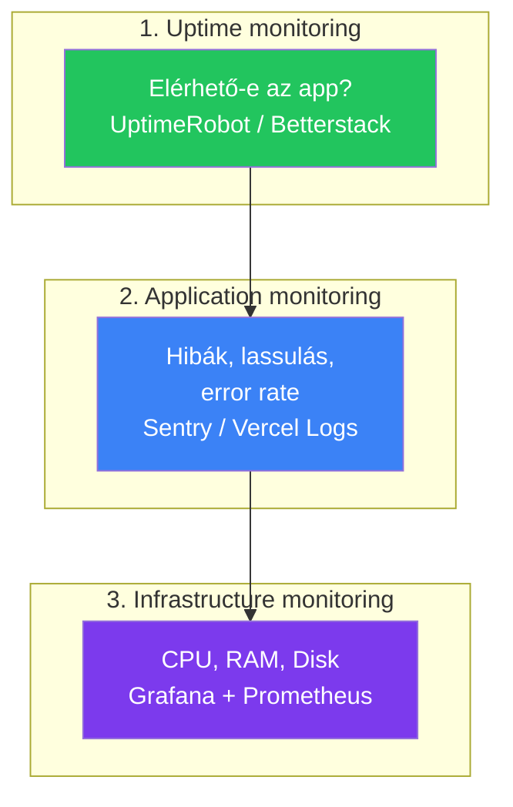

---
tags:
  - devops
  - monitoring
  - logging
datum: 2026-03-06
szint: "🧱 Scout"
kapcsolodo:
  - "[[toolbox/grafana|Grafana]]"
  - "[[cloud/vercel|Vercel]]"
  - "[[cloud/railway|Railway]]"
  - "[[cloud/hostinger|Hostinger]]"
  - "[[cloud/12-faktoros-alkalmazas-epites|12 Faktoros alkalmazás építés]]"
  - "[[cloud/deployment-checklist|Deployment checklist]]"
  - "[[_moc/moc-deployment|MOC - Deployment]]"
---

# Monitoring és Logging

## Összefoglaló

Deploy után a legfontosabb kérdés: **hogyan tudod meg, ha valami elromlik production-ben?** A monitoring figyeli a rendszer állapotát (fut-e, gyors-e, van-e hiba), a logging rögzíti mi történt. A [[cloud/12-faktoros-alkalmazas-epites|12 Faktoros alkalmazás építés]] XI. faktora: a logok event stream-ek, amiket a platform kezel.

## A monitoring három szintje



**Minden projektnél kell:** 1. szint (uptime)
**Legtöbb projektnél kell:** 1. + 2. szint
**VPS-nél kell:** mind a három

## 1. szint: Uptime monitoring

A legegyszerűbb: valami 5 percenként megnyitja az app URL-jét és szól, ha nem válaszol.

### UptimeRobot (ingyenes)

```
1. uptimerobot.com → Sign up
2. Add New Monitor → HTTP(s)
3. URL: https://myapp.com
4. Interval: 5 perc
5. Alert Contact: email / Slack / Telegram
```

**Free tier:** 50 monitor, 5 perces intervallum -- bőven elég.

### Betterstack (modernebb alternatíva)

```
betterstack.com → Uptime monitoring
Ingyenes: 5 monitor, 3 perces intervallum
Előny: szebb UI, statuspage integráció
```

> [!tip] Health check endpoint
> Ne csak a főoldalt figyeld -- csinálj egy `/health` endpointot ami a DB kapcsolatot is ellenőrzi:

```typescript
// app/api/health/route.ts (Next.js)
import { db } from '@/db'

export async function GET() {
  try {
    // DB connection check
    await db.execute('SELECT 1')
    return Response.json({ status: 'ok', timestamp: new Date().toISOString() })
  } catch (error) {
    return Response.json({ status: 'error', message: 'DB connection failed' }, { status: 500 })
  }
}
```

## 2. szint: Application monitoring

### Structured logging (alapkövetelmény)

A `console.log('valami történt')` nem elég production-ben. Structured logging-gal **kereshető, szűrhető** JSON formátumú logokat kapsz.

```typescript
// npm install pino (vagy: pino-pretty dev-hez)
import pino from 'pino'

const logger = pino({
  level: process.env.LOG_LEVEL || 'info',
  // Development-ben szép, olvasható output:
  ...(process.env.NODE_ENV === 'development' && {
    transport: { target: 'pino-pretty' }
  })
})

// Használat:
logger.info({ userId: 'abc123', action: 'signup' }, 'Új felhasználó regisztrált')
logger.error({ orderId: '456', error: err.message }, 'Fizetés sikertelen')
logger.warn({ endpoint: '/api/data', ms: 2500 }, 'Lassú API válasz')
```

**JSON output production-ben:**
```json
{"level":30,"time":1709740800000,"userId":"abc123","action":"signup","msg":"Új felhasználó regisztrált"}
```

> [!warning] Amit NE logolj
> - Jelszavak, API kulcsok, tokenek
> - Teljes request body (lehet benne személyes adat)
> - Felhasználók email címe logban (GDPR!)
> Használj masking-et: `logger.info({ email: '***@***.com' }, '...')`

### Sentry (error tracking)

A Sentry automatikusan elkapja a kezeletlen hibákat és értesít:

```bash
npm install @sentry/nextjs
npx @sentry/wizard@latest -i nextjs
```

```typescript
// sentry.client.config.ts
import * as Sentry from '@sentry/nextjs'

Sentry.init({
  dsn: process.env.NEXT_PUBLIC_SENTRY_DSN,
  tracesSampleRate: 0.1,  // 10% trace sampling (költségoptimalizálás)
  environment: process.env.NODE_ENV,
})
```

**Free tier:** 5k hibák/hó, 10k performance tranzakciók/hó.

### Platform beépített logok

| Platform | Logok elérése | Megőrzés |
|----------|--------------|----------|
| [[cloud/vercel|Vercel]] | Dashboard → Deployments → Logs | 1 óra (Hobby) / 3 nap (Pro) |
| [[cloud/railway|Railway]] | Dashboard → Service → Logs | 7 nap |
| [[cloud/hostinger|Hostinger]] VPS | `docker logs <container>` | Amíg a disk bírja |

> [!info] Vercel log drain
> A Vercel Hobby tier-en a logok csak 1 óráig elérhetőek. Ha ez nem elég, használj **Log Drain**-t: Vercel → Settings → Log Drains → küldés Betterstack-be, Datadog-ba vagy Axiom-ba.

## 3. szint: Infrastructure monitoring

Ha saját VPS-t üzemeltetsz ([[cloud/hostinger|Hostinger]]), a szerver erőforrásait is figyelned kell. Erre a [[toolbox/grafana|Grafana]] + Prometheus stack a legjobb.

### Minimum alertek VPS-en

| Metrika | Küszöb | Miért fontos |
|---------|--------|-------------|
| CPU > 90% (5+ perc) | Kritikus | App túlterhelt vagy végtelen ciklus |
| RAM > 85% | Figyelmeztetés | Hamarosan OOM kill jöhet |
| Disk > 80% | Figyelmeztetés | Logok, Docker image-ek feltöltik |
| App nem válaszol | Kritikus | Leállt a service |
| HTTP 5xx rate > 5% | Kritikus | Server-side hibák |

### Gyors monitoring Docker-rel

Ha nem akarsz teljes Grafana stack-et, egy egyszerű script is segít:

```bash
#!/bin/bash
# monitor.sh — egyszerű szerver monitoring
# Crontab: */5 * * * * /opt/scripts/monitor.sh

DISK_USAGE=$(df / | tail -1 | awk '{print $5}' | tr -d '%')
MEM_USAGE=$(free | grep Mem | awk '{printf "%.0f", $3/$2 * 100}')

if [ "$DISK_USAGE" -gt 80 ]; then
    curl -X POST "https://hooks.slack.com/services/XXX" \
        -d "{\"text\": \"Disk használat: ${DISK_USAGE}%\"}"
fi

if [ "$MEM_USAGE" -gt 85 ]; then
    curl -X POST "https://hooks.slack.com/services/XXX" \
        -d "{\"text\": \"Memória használat: ${MEM_USAGE}%\"}"
fi
```

## Log szintek

| Szint | Mikor használd | Példa |
|-------|---------------|-------|
| `error` | Valami elromlott, beavatkozás kell | DB connection lost, payment failed |
| `warn` | Nem hiba, de figyelni kell | Lassú query (>2s), rate limit közelít |
| `info` | Normál működés, fontos esemény | User regisztrált, deploy kész |
| `debug` | Fejlesztéshez, production-ben kikapcsolva | Request payload, SQL query |

```typescript
// Production-ben: LOG_LEVEL=info (debug kimarad)
// Debug-oláskor: LOG_LEVEL=debug (minden látszik)
```

## Mikor használd / Mikor NE

**Minimum (minden projekt):**
- UptimeRobot uptime check
- Health check endpoint
- Platform beépített logok (Vercel/Railway)

**Ajánlott (production app):**
- Structured logging (pino)
- Sentry error tracking
- Slack/email alertek

**Teljes stack (VPS / komplex app):**
- [[toolbox/grafana|Grafana]] + Prometheus
- Centralizált log gyűjtés (Loki)
- Custom dashboard-ok

**NE csináld:**
- Ne logolj mindent -- a túl sok log ugyanolyan rossz, mint a semennyi
- Ne építs saját monitoring rendszert -- használj meglévő eszközöket
- Ne hagyj `console.log`-ot production-ben -- használj logger library-t

## Kapcsolódó

- [[toolbox/grafana|Grafana]] — dashboard és vizualizáció VPS monitoring-hoz
- [[cloud/12-faktoros-alkalmazas-epites|12 Faktoros alkalmazás építés]] — XI. faktor: logok mint event stream
- [[cloud/deployment-checklist|Deployment checklist]] — monitoring beállítás a deploy checklist része
- [[cloud/vercel|Vercel]] — beépített logok és analytics
- [[cloud/railway|Railway]] — beépített deployment logok
- [[cloud/hostinger|Hostinger]] — VPS ahol saját monitoring kell
- [[cloud/statuspage-es-incident-management|Statuspage és Incident Management]] — ha valami elromlik, hogyan kommunikáld
