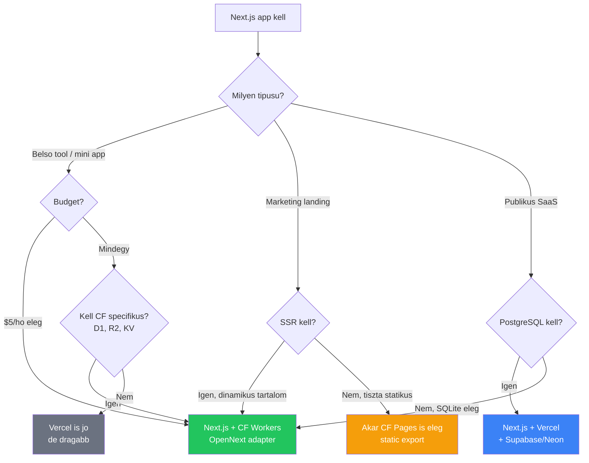

---
tags:
  - cloudflare
  - nextjs
  - deployment
datum: 2026-03-03
szint: "🏗️ Builder"
kapcsolodo:
  - "[[cloud/cloudflare|Cloudflare]]"
  - "[[frontend/nextjs|Next.js]]"
  - "[[cloud/vercel|Vercel]]"
  - "[[backend/hono|Hono]]"
  - "[[_moc/moc-deployment|MOC - Deployment]]"
---

## Miért fontos ez?

A [[cloud/cloudflare|Cloudflare]] note-ban eddig a pattern: **[[backend/hono|Hono]] + React SPA + D1** volt a belső appok stackje, a [[frontend/nextjs|Next.js]] pedig a [[cloud/vercel|Vercel]]-e volt. Az **OpenNext adapter** ezt valtoztatja még -- mostantol **fullstack Next.js kozvetlenul Cloudflare Workers-on fut**, App Router-rel, SSR-rel, RSC-vel, mindennel.

**Egyszerűen:** Ami eddig $20/hó volt Vercel Pro-n, az most $5/hó a Cloudflare-en -- ugyanazzal a Next.js kódbázissal.

> [!tldr] Egy mondatban
> A Next.js teljes stack-je (SSR, SSG, ISR, RSC, Middleware, Server Actions) futtathato Cloudflare Workers-on az OpenNext adapter segitsegevel, Vercel nelkul.

---

## Mire jó -- Claude Code kontextus

### 1. Belső mini appok

Eddig ket választasod volt:
- **[[backend/hono|Hono]] + React SPA + CF Workers** ($5/hó) -- de nincs SSR, nincs App Router, a frontend-et kulon kell deployolni Pages-re
- **[[frontend/nextjs|Next.js]] + [[cloud/vercel|Vercel]]** ($20/hó) -- fullstack, de dragabb

**Most:** Next.js + CF Workers = **fullstack Next.js $5/hó-ert**. Egy codebase, egy deploy, SSR + API routes egyben.

```bash
# Claude Code session-bol:
npm create cloudflare@latest -- my-app --framework=next
cd my-app
npx wrangler deploy
# → Kesz, production-ben van
```

### 2. Landing page-ek

A Vercel Hobby tier ingyenes, de limitalt. A Pro $20/hó. CF Workers-szel:
- **$5/hó** fix, 10M request/hó
- SSG + ISR = gyors landing page, háttérben frissül
- [[cloud/cloudflare|Cloudflare]] CDN 300+ edge location → gyorsabb mint Vercel
- Image Optimization elérheto Cloudflare Images-en keresztul

### 3. Claude Code workflow elonyok

| Szempont | Vercel deploy | CF Workers deploy |
|---|---|---|
| **Scaffold** | `bunx create-next-app` | `npm create cloudflare@latest --framework=next` |
| **Deploy** | `vercel --prod` (vagy git push) | `npx wrangler deploy` |
| **Preview** | Automatikus PR preview | `npm run preview` (lokálisan workerd-ben) |
| **Env vars** | Vercel dashboard | `wrangler secret put KEY` (CLI-bol!) |
| **Logok** | `vercel logs` | `wrangler tail` (real-time) |
| **Lokális runtime** | Node.js (nem production-hu) | `workerd` runtime (production-hu) |

> [!tip] CLI-first workflow
> A `wrangler` mindent tud CLI-bol: deploy, secret management, log tail, D1 query. Claude Code session-bol nem kell dashboardra valtani -- **ez a legnagyobb elony** a Vercel-lel szemben, ahol sok beállítás csak a dashboard-on elérheto.

---

## Hogyan működik -- OpenNext adapter

A Cloudflare nem futtatja nativan a Next.js-t (az a Vercel sajátja). Az **OpenNext** egy nyilt forráskódu adapter, ami a Next.js build outputot atalakitja ugy, hogy az bármelyik platformon (CF Workers, AWS, stb.) futhasson.

```
Next.js app
    ↓ next build
Standard Next.js output
    ↓ opennextjs-cloudflare build
.open-next/
├── worker.js    ← ez fut a CF Workers-on
└── assets/      ← statikus fajlok (CF Assets-en)
```

A `wrangler deploy` automatikusan felismeri a Next.js projektet és legeneralja a szükséges konfiguráciot -- nem kell kezzel beállítani.

---

## Tamogatott Next.js feature-ok

| Feature | Statusz |
|---------|---------|
| App / Pages Router | Tamogatott |
| Route Handlers | Tamogatott |
| React Server Components (RSC) | Tamogatott |
| Static Site Generation (SSG) | Tamogatott |
| Server-Side Rendering (SSR) | Tamogatott |
| Incremental Static Regeneration (ISR) | Tamogatott |
| Server Actions | Tamogatott |
| Response Streaming | Tamogatott |
| Middleware | Tamogatott |
| Image Optimization | Cloudflare Images-en keresztul |
| Partial Prerendering (PPR) | Kísérleti |
| `'use cache'` | Kísérleti |
| Node.js in Middleware (15.2+) | Még nem tamogatott |

> [!warning] Middleware limitacio
> A Next.js 15.2+ bevezette a `nodeMiddleware` opciot, ami Node.js API-kat enged a middleware-ben. Ez CF Workers-on **nem működik**, mert a middleware is V8 isolate-ban fut. Ha komplex middleware kell (pl. DB query middleware-ben), maradj a standard Web API-knal.

---

## Setup -- lépésrol lépésre

### 1. Új projekt (leggyorsabb)

```bash
npm create cloudflare@latest -- my-next-app --framework=next
cd my-next-app
```

Ez automatikusan:
- Létrehozza a Next.js projektet
- Telepíti az OpenNext adaptert
- Konfigurálja a `wrangler.jsonc`-t
- Beállítja a `nodejs_compat` flag-et

### 2. Meglevo Next.js projekt migralasa

```bash
# OpenNext adapter telepitese
npm i @opennextjs/cloudflare@latest

# Wrangler CLI (ha meg nincs)
npm i -D wrangler@latest
```

**`wrangler.jsonc` létrehozasa:**

```jsonc
{
  "$schema": "./node_modules/wrangler/config-schema.json",
  "main": ".open-next/worker.js",
  "name": "my-app",
  "compatibility_date": "2026-03-03",
  "compatibility_flags": ["nodejs_compat"],
  "assets": {
    "directory": ".open-next/assets",
    "binding": "ASSETS"
  }
}
```

**`open-next.config.ts` létrehozasa:**

```typescript
import { defineCloudflareConfig } from "@opennextjs/cloudflare";
export default defineCloudflareConfig();
```

**`package.json` scriptek:**

```json
{
  "scripts": {
    "dev": "next dev",
    "build": "next build",
    "preview": "opennextjs-cloudflare build && opennextjs-cloudflare preview",
    "deploy": "opennextjs-cloudflare build && opennextjs-cloudflare deploy",
    "cf-typegen": "wrangler types --env-interface CloudflareEnv cloudflare-env.d.ts"
  }
}
```

### 3. Deploy

```bash
# Production deploy
npm run deploy
# vagy egyszeruen:
npx wrangler deploy
```

### 4. Lokális tesztelés (workerd runtime-ban)

```bash
# Next.js dev server (Node.js -- gyors hot reload)
npm run dev

# CF Workers preview (workerd runtime -- production-hu)
npm run preview
```

> [!info] Dev vs Preview különbség
> `npm run dev` = Node.js dev server, gyors hot reload-dal. **DE** a kódod production-ben `workerd`-ben fut, ami mas runtime. Ha Node.js-only API-t használsz veletlenul, dev-ben működik, preview-ban nem. **Mindig tesztelj `preview`-val deploy elott!**

---

## Mikor használd -- döntési fa



### Mikor Next.js + CF Workers (ez a note)?

- **Belső tool** ahol fullstack Next.js kell (SSR, App Router, API routes) de Vercel draga
- **Landing page** ami SSR-t vagy ISR-t használ (dinamikus tartalom, SEO)
- **Claude Code workflow** -- mindent CLI-bol akarsz (`wrangler deploy`, `wrangler secret put`)
- **CF binding-okat** akarsz használni (D1, R2, KV) Next.js app-bol

### Mikor NE ezt valaszd?

- **PostgreSQL kell** → Vercel + Supabase/Neon (D1 SQLite-alapu, ahogy a [[cloud/cloudflare|Cloudflare]] note-ban lattuk)
- **Nehez szamitas** → 30s CPU limit, 128MB memoria
- **Node.js-only library-k** → nativ modulok nem futnak (Sharp, Puppeteer, bcrypt)
- **Komplex middleware** → Node.js API-k nem elérhetok middleware-ben

---

## Next.js + CF Workers vs Hono + React SPA

A [[cloud/cloudflare|Cloudflare]] note-ban a **[[backend/hono|Hono]] + React SPA** volt az ajanlott belső tool stack. Mikor melyiket valaszd?

| Szempont | **Next.js + CF Workers** | **[[backend/hono|Hono]] + React SPA** |
|---|---|---|
| **Frontend** | Beepitett (App Router, RSC) | Kulon React SPA (Vite) |
| **Deploy** | Egy deploy (`wrangler deploy`) | Ket deploy (Worker + Pages) |
| **SSR** | Nativ | Nincs (client-side only) |
| **Bundle meret** | Nagyobb (~500KB+) | Kisebb (Hono ~14KB) |
| **Tanulasi gorbe** | Ha Next.js-t ismered → könnyű | Ha Express-t ismered → könnyű |
| **SEO** | SSR/SSG → jó SEO | SPA → rossz SEO |
| **Cold start** | Kicsit lassabb (nagyobb bundle) | Gyorsabb (~0ms) |
| **Mikor valaszd** | Fullstack app, SSR kell, egy codebase | Csak API kell, vagy extrem gyors cold start |

> [!tip] Okolszabaly
> **Ha van frontend** → Next.js + CF Workers (egy codebase, egy deploy).
> **Ha csak API kell** (pl. webhook processor, integracio) → [[backend/hono|Hono]] marad a jobb választas.

---

## Environment változók

A `NEXT_PUBLIC_*` változók **build-time** kerulnek bele a kódba.

CF Workers-on:
- **Build változók** (`NEXT_PUBLIC_*`): CI/CD build settings-ben kell beállítani
- **Runtime változók** (szerver-oldali): `wrangler secret put KEY` vagy `wrangler.jsonc` `[vars]`
- **TypeScript tipusok:** `npm run cf-typegen` → general egy `cloudflare-env.d.ts` fájlt a binding tipusokkal

```bash
# Secret beallitas CLI-bol (Claude Code session-ben!)
wrangler secret put DATABASE_TOKEN
# → interaktiv prompt keri az erteket

# Tipusok generalasa
npm run cf-typegen
```

---

## Hasznos parancsok

```bash
# Uj projekt
npm create cloudflare@latest -- my-app --framework=next

# Lokalis fejlesztes
npm run dev          # Next.js dev server (Node.js)
npm run preview      # CF Workers preview (workerd)

# Deploy
npx wrangler deploy  # automatikus Next.js felismeres
npm run deploy       # ha a package.json scripteket beallitottad

# Secrets & bindings
wrangler secret put API_KEY
wrangler d1 create my-db        # D1 adatbazis
wrangler r2 bucket create files # R2 storage

# Debug
wrangler tail        # eles logok real-time
wrangler d1 execute my-db --command "SELECT * FROM users"

# TypeScript tipusok CF binding-okhoz
npm run cf-typegen
```

---

## Hasznos linkek

- **OpenNext docs:** https://opennext.js.org/cloudflare
- **CF Workers Next.js guide:** https://developers.cloudflare.com/workers/framework-guides/web-apps/nextjs/
- **Wrangler CLI:** https://developers.cloudflare.com/workers/wrangler/
- **C3 CLI:** https://developers.cloudflare.com/pages/get-started/c3/

---

## Kapcsolodo

- ViNext -- kísérleti alternativa: Next.js API ujraimplementalva Vite-on, 4.4x gyorsabb build
- [[cloud/cloudflare|Cloudflare]] -- az alap platform, Workers + D1 + R2 okoszisztema
- [[frontend/nextjs|Next.js]] -- a framework amit CF Workers-re deployolunk
- [[backend/hono|Hono]] -- alternativ API framework CF Workers-re (ha nem kell fullstack Next.js)
- [[cloud/vercel|Vercel]] -- alternativ Next.js hosting (dragabb, de nativabb)
- Env változók Next.js-ben -- env var kezeles, build-time vs runtime
- Bun + Next.js setup -- Next.js dependency stack
- Edge function -- miért jó az edge computing
- [[_moc/moc-deployment|MOC - Deployment]] -- deployment stratégiak attekintese
- Vercel + Supabase → Cloudflare migrácio -- valós migrácio retrospektiv, bottleneck-ek és tanulsagok
