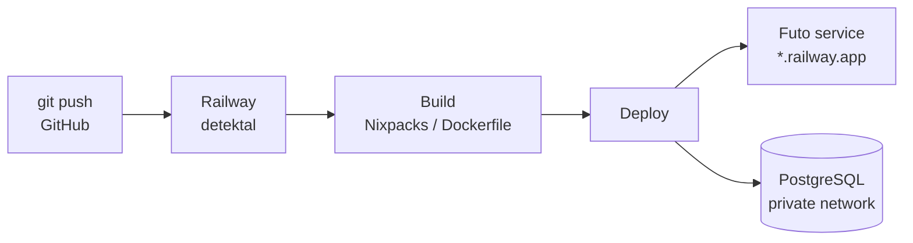

---
tags:
  - hosting
  - deployment
  - backend
datum: 2026-03-06
szint: "🧱 Brick"
kapcsolodo:
  - "[[cloud/vercel|Vercel]]"
  - "[[database/supabase|Supabase]]"
  - "[[cloud/cloudflare|Cloudflare]]"
  - "[[cloud/docker-alapok|Docker alapok]]"
  - "[[cloud/docker-compose|Docker Compose]]"
  - "[[database/sql-adatbazisok|SQL adatbazisok]]"
  - "[[foundations/git-es-github|Git es GitHub]]"
  - "[[cloud/deployment-checklist|Deployment checklist]]"
  - "[[cloud/hostinger|Hostinger]]"
  - "[[_moc/moc-deployment|MOC - Deployment]]"
---

# Railway

**Kategoria:** `hosting` / `adatbazis` / `backend`
**URL:** https://railway.app
**Ar/Terv:** Hobby ($5/ho kredit + hasznalat alapu) / Pro ($20/ho)

---

## Mi ez es mire jo?

A Railway egy **backend es szolgaltatas hosting platform**, ahol barmit futtathatsz ami [[cloud/docker-alapok|Docker]]-ben megy: backend API, adatbazis, queue, cron job, barmi. Nem serverless mint a Vercel -- itt valodi, folyamatosan futo szervereket kapsz.

**Egyszeruen:** Ha a Vercel a frontendnek valo, a Railway a backendnek es mindennek ami mogotte van.

**Mikor hasznald:**
- Backend API ami nem fer bele a Vercel serverless limitbe (>60s futas)
- Sajat PostgreSQL / MySQL / Redis / MongoDB adatbazis kell
- Hosszan futo folyamatok (AI feldolgozas, video konverzio, queue worker)
- Cron jobok (utemezett feladatok)
- Ha Supabase helyett sajat adatbazis szervert akarsz

**Mikor NE hasznald:**
- Egyszeru Next.js frontend → arra [[cloud/vercel|Vercel]] jobb
- Ha nem kell backend es Supabase eleg → felesleges komplexitas
- Ha 0 koltsegvetesed van → az $5/ho minimum megvan

**Alternativak:** Render, Fly.io, DigitalOcean App Platform, Heroku

---

## Deploy flow



---

## Setup -- lepesrol lepesre

### 1. Regisztracio
- railway.app → Sign up GitHub-bal
- Hozz letre egy uj projektet

### 2. Service hozzaadasa

Harom modja van:
1. **GitHub repo** → Railway automatikusan buildeli (mint a Vercel)
2. **[[cloud/docker-alapok|Docker]] image** → Ha sajat Dockerfile-od van
3. **Template** → Kesz sablonok (PostgreSQL, Redis, stb.) egy kattintassal

### 3. Adatbazis hozzaadasa
- Projekt → "Add Service" → [[database/sql-adatbazisok|PostgreSQL / MySQL]] / Redis / MongoDB
- Railway automatikusan generalja a connection string-et
- Ezt environment valtozokent megkapod: `DATABASE_URL`

### 4. Environment valtozok
- Service → Variables ful
- Ide ird be amit az app hasznal
- A Railway belso valtozóira is hivatkozhatsz: `${{Postgres.DATABASE_URL}}`

---

## Best Practices

### Architektura / Struktura

Tipikus Railway projekt felepites:

```
Railway Project
├── API service      ← a backend kodod (GitHub repobol)
├── PostgreSQL       ← adatbazis (Railway template)
├── Redis            ← cache/queue (ha kell)
└── Worker           ← hatterfeladatok (ha kell)
```

- Egy Railway **projekt** = tobb **service** egyutt
- A service-ek belso halozaton beszelnek egymassal (mint [[cloud/docker-compose|Docker Compose]])
- Minden service-nek sajat env valtozói vannak, de megoszthatók

### Biztonsag

- **Ne tedd publikussa az adatbazist** -- csak belso halozaton keresztul erd el
- A `DATABASE_URL`-t **soha ne commitold** GitHubra
- Hasznalj Railway **private networking**-et: a service-ek `*.railway.internal` cimen erik el egymast
- API kulcsokat mindig env valtozoba

### Teljesitmeny

- Railway-en **mindig fut a szervered** (nem serverless) → nincs cold start
- Ha tobb keres jon → scale up: tobb instance, vagy nagyobb gep
- Hasznalj connection pool-t az adatbazishoz (pl. `pgBouncer`)

### Koltsegoptimalizalas

- Hobby plan: $5/ho kredit (ez sok kis projekthez eleg)
- Csak azert fizetsz amit hasznalsz (CPU, RAM, halozat, disk)
- Ha nem kell 24/7 futnia → hasznalj **sleep** funkciot (inaktivitas utan elalszik)
- PostgreSQL + kis API = ~$3-7/ho
- Figyelj a RAM hasznalatra -- ez szokott meglepetes lenni

---

## Gyakori mintak / Hasznalati esetek

### 1. Vercel frontend + Railway backend

```
User → Vercel (Next.js) → Railway (Express API) → Railway (PostgreSQL)
```
Amikor a Vercel API routes nem eleg (timeout, websocket, stb.)

### 2. Teljes backend + adatbazis

```
User → Railway (Next.js VAGY Express) → Railway (PostgreSQL + Redis)
```
Mindent egy helyen, nem kell Vercel.

### 3. Cron job / hatter worker

```
Railway (Worker service) → minden ejjel lefut → feldolgoz valamit
```
Pl. email kuldes, adat szinkronizalas, report generalas.

---

## Buktatok es hibak amiket elkerulj

- **Port beallitas:** Railway a `PORT` env valtozot hasznalja -- az appod ezen a porton kell figyeljen. `app.listen(process.env.PORT || 3000)`
- **Build hiba:** Ha nincs `Dockerfile` es Railway nem ismeri fel a projektet → adj hozza Dockerfile-t vagy `nixpacks.toml`-t
- **Adatbazis torlodik ha torlod a service-t** -- volume nelkul az adat elveszik. Railway PostgreSQL-nel ez alapbol rendben van, de figyelj ra
- **Alvo szolgaltatas lassu ebredese** -- ha sleep-re van allitva, az elso keres 10-30s lehet
- **Koltseg meglepetes** -- figyeld a dashboardon a usage-ot, kulonosen ha sok RAM-ot hasznal az app

---

## Hasznos parancsok / kodreszletek

```bash
# Railway CLI telepites
npm i -g @railway/cli

# Bejelentkezes
railway login

# Projekt linkelese a lokalis mappahoz
railway link

# Lokalis futtatas a Railway env valtozokkal
railway run npm run dev

# Deploy
railway up

# Logok
railway logs
```

---

## Hasznos linkek

- Docs: https://docs.railway.app
- Dashboard: https://railway.app/dashboard
- Kozosseg/Discord: https://discord.gg/railway
- Statusz oldal: https://status.railway.app
- Templates: https://railway.app/templates

---

## Kapcsolodo anyagok
- [[cloud/vercel|Vercel]]
- [[database/supabase|Supabase]]
- [[cloud/cloudflare|Cloudflare]] -- edge alternativa: $5/ho serverless, de Docker/PostgreSQL nincs
- [[cloud/docker-alapok|Docker alapok]]
- [[cloud/docker-compose|Docker Compose]]
- [[database/sql-adatbazisok|SQL adatbazisok]]
- [[foundations/git-es-github|Git es GitHub]]
- [[cloud/deployment-checklist|Deployment checklist]]
- [[cloud/hostinger|Hostinger]]
- [[_moc/moc-deployment|MOC - Deployment]]
